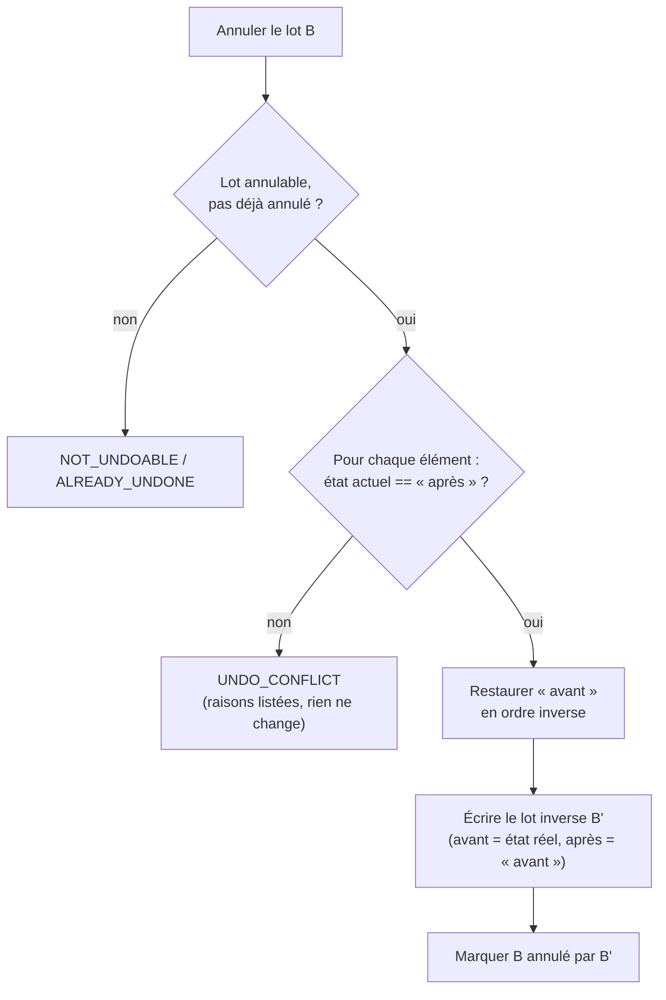

# Annuler par lot — journal avant-après, conflit et lot inverse

> **En 30 secondes** — Chaque éclosion (ou décision de lien) a laissé dans `change_log` un **lot** de lignes « avant / après ». Annuler = **remettre chaque élément dans son état « avant »**, en ordre inverse, dans **une** transaction. Mais seulement si rien n'a bougé depuis (état actuel = « après ») — sinon `UNDO_CONFLICT`, rien ne change. Et l'annulation écrit elle-même un **lot inverse** : annuler l'annulation **rétablit**.



---

## 1. Vue Macro & Utilité (le « Pourquoi »)

> 📘 **Introduction (ajoutée)** — **C'est quoi ?** Un **« Annuler » (undo)** remet l'application dans un état antérieur. Deux grandes familles : garder la **liste des commandes** et savoir les défaire une par une (patron *Command*), ou garder des **instantanés** de l'état (patron *Memento*). **Comment ça marche ici ?** Un mélange : le journal `change_log` stocke, par élément touché, un **instantané partiel** « avant » et « après » (JSON), groupés par **lot** (`batch_id` = une action utilisateur).

- **Problématique** : l'éclosion modifie 5 tables d'un coup (idée, synthèse, tâches du plan, exemple appris, suggestions de liens). La constitution (II) exige qu'elle soit **annulable** — d'un seul geste, pas table par table. Et entre l'éclosion et l'annulation, l'utilisateur a pu **rouvrir** et compléter l'idée : restaurer aveuglément écraserait son travail.
- **Emplacement dans la carte globale** : couche **application** (`HistoryService`) + **infrastructure** (`HistoryRepository` : lire l'état actuel d'un élément, lui appliquer un état cible) ; côté interface : bouton « Annuler » de la notification (10 s) et page **Historique**.
- **Analogie (restauration)** : le **cahier de service**. Chaque envoi de table est noté avec un numéro de bon et, pour chaque plat, « avant : en attente / après : servi ». Pour annuler l'envoi, le chef vérifie d'abord que **rien n'a changé** depuis (le client n'a pas déjà entamé le plat, la table n'a pas recommandé) ; si c'est bon, il reprend **tout le bon** d'un coup et note un **bon d'annulation** — qu'on pourra lui-même annuler si le client se ravise. *Où ça boite* : en cuisine, un plat mangé ne revient pas ; ici tout est données, donc tout est réversible tant qu'il n'y a pas de conflit.

## 2. Le Pont Systémique (sous le capot)

- **Une transaction pour tout** : `repository.transaction(() => …)` = `BEGIN … COMMIT` SQLite ; le contrôle de conflit, les restaurations, l'écriture du lot inverse et le marquage « annulé » réussissent **ensemble** ou pas du tout. better-sqlite3 étant **synchrone**, aucun autre code JavaScript du main ne peut s'intercaler entre le contrôle et l'écriture — pas de fenêtre de course.
- **Contrôle de conflit = concurrence optimiste, à l'envers** : à l'éclosion on comparait la version de base ; à l'annulation on compare l'**état actuel** de chaque élément à l'**« après »** du lot (clés communes seulement). Une idée rouverte a changé d'état/version → conflit.
- **Ordre inverse** : `[...entries].reverse()` — on défait dans l'ordre contraire de celui où on a fait (comme on retire des assiettes empilées : la dernière posée d'abord).
- **Lignes du journal jamais modifiées** sauf la colonne `undone_by_batch` : l'historique reste **append-only** ; la pagination utilise le `rowid` (ordre d'insertion fiable, règle 7).

## 3. Analyse du Code & Logique

```ts
// src/main/application/history/HistoryService.ts — undo(batchId)
return repository.transaction(() => {
  const entries = repository.entries(batchId)                      // ① le lot, dans l'ordre d'écriture
  if (!UNDOABLE.has(entries[0].kind)) throw new AppError('NOT_UNDOABLE', …)
  if (entries.some((e) => e.undoneByBatch !== null)) throw new AppError('ALREADY_UNDONE', …)

  const conflicts = entries
    .filter((e) => !UNCHECKED.has(e.entity))                        // ② dépendances/exemples non comparés
    .filter((e) => !matches(repository.snapshot(e.entity, e.entityId), e.after))
  if (conflicts.length > 0) throw new AppError('UNDO_CONFLICT', …, { conflicts })

  const inverse = [...entries].reverse().map((e) => {              // ③ ordre inverse
    const current = repository.snapshot(e.entity, e.entityId)      //    état RÉEL capturé AVANT
    repository.apply(e.entity, e.entityId, e.before)               //    restauration
    return { kind: 'undo', entity: e.entity, entityId: e.entityId, before: current, after: e.before }
  })
  repository.write(undoBatchId, inverse)                           // ④ le lot inverse → « Rétablir »
  repository.markUndone(batchId, undoBatchId)
})
```

- **Étape 1 — Garde-fous d'entrée** : type de lot annulable (`confirm_synthesis`, `link`, `undo`), pas déjà annulé.
- **Étape 2 — Conflit avant toute écriture** : on lit tout, on compare tout, **puis** seulement on écrit. Les messages sont traduits pour l'utilisateur (« L'idée a changé depuis (réouverte, complétée…) »).
- **Étape 3 — `snapshot` / `apply` par type d'élément** : chaque table sait lire son état significatif (`state`, `version`, `status`, `isCurrent`…) et y revenir. Retirer un plan = `is_current = 0` (conservé, plus « en cours ») — rien n'est détruit.
- **Étape 4 — Lot inverse** : `before` = état **réel** avant restauration (pas l'« après » théorique) → rétablir remet exactement ce qui a été défait.
- **Étape 5 — Nettoyage lié** : une idée qui n'est plus éclose perd les **suggestions** de liens nées de son éclosion.

**Bonnes pratiques mises en évidence** : l'annulation d'une éclosion rend l'aperçu **confirmable tel quel**, sans rappeler l'IA (économie de tokens) ; tests d'intégration dédiés (`tests/integration/history/undo.test.ts`). **Limite assumée** : la réouverture n'est pas encore annulable (elle retire les résultats sans les consigner — JOURNAL).

## 4. Synthèse & Prochaine Étape

**À retenir (3 puces max)**
- Journal **avant/après par lot** + restauration en ordre inverse dans **une** transaction.
- Conflit = état actuel ≠ « après » du lot → refus expliqué, rien ne change.
- L'annulation écrit un **lot inverse** : annuler l'annulation = rétablir.

**Lien avec la suite** : l'interface doit ensuite rafraîchir carte, plongée, aperçus et historique → [[TanStack Query et Zustand ↔ cache de données et état d'interface]].

**Rappel actif**
> **Q :** Pourquoi comparer à l'« après » du lot plutôt qu'à la version d'éclosion ?
> **R :** Parce qu'un lot touche plusieurs éléments de types différents ; chacun doit être exactement dans l'état laissé par le lot, sinon quelqu'un l'a modifié depuis.

> **Q :** Pourquoi capturer l'état réel juste avant de restaurer, pour le lot inverse ?
> **R :** Pour que « Rétablir » ramène exactement l'état défait, même pour des champs que le lot d'origine ne décrivait qu'en partie.

> **Q :** Que se passe-t-il si l'écriture du lot inverse échoue ?
> **R :** ROLLBACK : aucune restauration n'est conservée, l'état reste celui d'avant la tentative.

**Pièges fréquents**
- ⚠️ **Restaurer sans contrôle de conflit** — on écraserait silencieusement le travail fait après l'action.
- ⚠️ **Undo « destructif »** (supprimer les lignes du journal) — on perd la possibilité de rétablir et la traçabilité.

**Connexions**
- [[Éclosion atomique — transaction, version et historique]] — où le lot est écrit.
- [[Glossaire — Transaction ACID]] — la garantie tout-ou-rien.
- [[Glossaire — Idempotence]] — pourquoi `ALREADY_UNDONE` : rejouer l'annulation ne doit rien doubler.


## Évolution du 30/09 — de nouveaux lots, même mécanique
Le journal avant/après s'est élargi sans changer de principe (`HistoryKind` : `seed`, `delete`, `promote` en plus de `confirm_synthesis`, `manual_edit`, `link`, `undo`) :
- **`seed`** — idée née d'une graine : l'annuler **archive** l'idée née ; conflit si elle a poussé depuis.
- **`delete`** — idée supprimée (archivée avec tout son contenu) ou **bloc de la carte** supprimé (note, widget) : entité `canvas_block`, « avant » = présent, « après » = `null` ; restaurer = vider `deleted_at` → [[Glossaire — Suppression douce (soft delete)]].
- **`promote`** — une suggestion devenue idée à part entière : chaque neurone déplacé reprend sa **place** d'avant (module `placement.ts`).
- L'éclosion consigne désormais aussi l'**absorption** des sous-neurones (`neuron_absorb`) et les questions closes : annuler une éclosion les fait revenir.

Suite côté éclosion (« Approfondir ») : bloc du 30/09 de [[Éclosion atomique — transaction, version et historique]].

## Évolution du 04→06/10 — de nouveaux lots, et le disque
- **Lots « par Claude »** (`mcp_write`, spec 007) : chaque appel d'outil d'écriture du pont = un lot marqué, annulable d'un clic.
- **Lots `convert`** (spec 010) et **`plan`** (spec 011) ; ce dernier porte la **garde D6** : une annulation qui déverrouillerait un parent est refusée si des sous-nœuds nés hors du lot existent.
- **Gestionnaires d'entités externes** (spec 012) : un document se restaure **en base ET sur le disque**, sans mettre d'accès fichier dans `HistoryRepository` (le service du document fournit `snapshot` et `apply`). Voir [[Fichiers écrits par l'app — chemin choisi par le main, écriture atomique, corbeille]].
