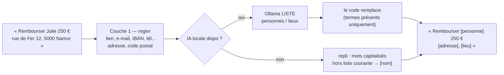

# Anonymisation en deux couches

> **En 30 secondes** — Avant qu'un texte parte chez Claude, il est nettoyé en deux passes. **Couche 1** : des expressions régulières remplacent liens, e-mails, IBAN, téléphones, adresses, codes postaux (et montants si l'option est active). **Couche 2** : l'IA **locale** *liste* les noms de personnes et de lieux ; c'est le **code** qui les remplace. Si la couche 2 est indisponible, un repli masque les mots capitalisés. Si tout échoue : **rien n'est envoyé**.



---

## 1. Vue Macro & Utilité (le « Pourquoi »)

- **Problématique** : les idées contiennent la vraie vie — noms de clients, adresses de mariage, numéros de téléphone. Claude est un service distant ; la constitution (principe IV) impose la **minimisation** : n'envoyer que ce qui est utile au raisonnement. Et une anonymisation ratée ne doit jamais se transformer en envoi du texte brut.
- **Emplacement dans la carte globale** : dans la passerelle (`prepare()`), à la **frontière réseau** sortante — dernière étape avant Internet.
- **Analogie (restauration)** : avant d'envoyer une fiche recette à un consultant extérieur, on **caviarde** au marqueur noir les noms des fournisseurs et les adresses. Couche 1 = le tampon automatique qui repère tout ce qui a un format fixe (numéro de TVA, téléphone). Couche 2 = le commis de confiance, **resté en cuisine** (IA locale), qui souligne les noms propres — mais c'est le chef qui passe le marqueur : le commis n'a pas le droit de réécrire la fiche. *Là où ça boite* : le caviardage papier est définitif ; ici, on garde le texte original en local et seule la copie envoyée est caviardée.

## 2. Le Pont Systémique (sous le capot)

- **CPU seul pour la couche 1** : les expressions régulières (voir [[Glossaire — Expression régulière]]) sont compilées une fois en automates en mémoire, puis appliquées caractère par caractère ; aucun réseau, aucun modèle — donc **déterministe** et testable (50 textes fictifs, 0 fuite : SC-002).
- **GPU local pour la couche 2** : le texte **déjà passé par la couche 1** est envoyé à Ollama sur 127.0.0.1 ; le modèle renvoie un JSON `{ persons: [...], places: [...] }` validé par Zod. La tâche `anonymiser` est **strictement locale** (routage forcé).
- **Pourquoi l'IA ne réécrit pas** : si le modèle réécrivait le texte, il pourrait halluciner, résumer ou laisser passer un nom. En se contentant de **lister**, puis en ne remplaçant que les termes **réellement présents** (`ruled.includes(term)`), l'IA ne peut rien ajouter ni déformer.
- **Unicode** : `\p{L}` (toute lettre, accents compris), `\p{Lu}` (majuscule) ; `\s` couvre aussi les espaces insécables des milliers (« 1 250 € ») — règle 9 du JOURNAL.

## 3. Analyse du Code & Logique

Extrait de `src/main/application/ai/Anonymizer.ts` :

```ts
async anonymize(text: string): Promise<string> {
  // ① Couche 1 : règles déterministes. Le réglage « Masquer les montants » est relu à CHAQUE appel.
  const ruled = applyDeterministicRules(text, { maskAmounts: this.deps.maskAmounts?.() ?? true })
  let detected: SensitiveNames | null
  try { detected = await this.deps.detectSensitive(ruled) }   // ② Couche 2 : Ollama liste
  catch { detected = null }
  if (detected === null) return maskCapitalizedWords(ruled)    // ③ Repli heuristique sans IA
  const present = (term: string): boolean => ruled.includes(term)
  return replaceTerms(ruled, [                                  // ④ Le CODE remplace, du plus long au plus court
    ...detected.persons.filter(present).map((term) => ({ term, placeholder: '[personne]' })),
    ...detected.places.filter(present).map((term) => ({ term, placeholder: '[lieu]' }))
  ])
}
```

- **Étape 1 — Ordre des règles** : liens → e-mails → IBAN → téléphones → montants → adresses → codes postaux. L'ordre évite les chevauchements (un e-mail contient un point qui ressemble à un lien).
- **Étape 2 — Montants** : depuis la constitution 1.1.0, ils partent **exacts par défaut** (utile aux calculs) ; l'option « Masquer les montants » les remplace par une fourchette (`<100 €`, `100-500 €`, …, `>2500 €`). Sûr par défaut : si le réglage est absent, on masque.
- **Étape 3 — Plus long d'abord** : « Citadelle de Namur » est remplacée avant « Namur », sinon on obtiendrait « Citadelle de [lieu] » puis un reste incohérent.
- **Étape 4 — Tout ce qui part est anonymisé** : la revue sécurité (constat F1, gravité élevée) a trouvé que les **exemples** injectés dans le contexte partaient en clair ; désormais les blocs `role: 'examples'` passent aussi par l'anonymiseur (règle 14).

**Bonnes pratiques mises en évidence** : « sur-anonymiser est sans risque, sous-anonymiser ne l'est pas » (commentaire d'en-tête des règles) ; échec = `ANONYMIZATION_FAILED`, **rien n'est envoyé**.

> ⚠️ **Probable (lu, non exécuté)** — les **dates** ne sont volontairement pas anonymisées (utiles au raisonnement) : c'est un risque résiduel documenté dans `SECURITY-REVIEW-001.md`.

## 4. Synthèse & Prochaine Étape

**À retenir (3 puces max)**
- Couche 1 = regex déterministes ; couche 2 = l'IA locale **liste**, le code **remplace**.
- Entrée **et** exemples sont anonymisés avant Claude ; échec → aucun envoi.
- Montants exacts par défaut (constitution 1.1.0), masquables par réglage.

**Lien avec la suite** : un texte anonymisé peut encore contenir des *instructions* piégées → [[Injection de prompt — cadre figé et données balisées]].

**Rappel actif**
> **Q :** Pourquoi ne pas laisser Ollama renvoyer directement le texte anonymisé ?
> **R :** Il pourrait réécrire, résumer ou oublier un nom ; en listant seulement, le code garde le contrôle et ne remplace que des termes réellement présents.

> **Q :** Que fait l'anonymiseur si Ollama est arrêté ?
> **R :** Il applique la couche 1 puis masque en `[nom]` tout mot capitalisé qui n'est ni un mot courant ni un sigle court.

> **Q :** Quel constat de sécurité « élevé » a été corrigé ?
> **R :** F1 : les exemples (issus d'idées réelles) partaient chez Claude sans anonymisation.

**Pièges fréquents**
- ⚠️ **N'anonymiser que l'entrée utilisateur** — profil, exemples, historique partent aussi dans la requête.
- ⚠️ **Compter sur ` ` écrit à la main** — l'outil d'édition l'a transformé en caractère invisible ; `\s` le couvre déjà.

**Connexions**
- [[Passerelle IA hybride — un seul point d'accès à l'IA]] — où l'anonymisation est appelée.
- [[Synthèse vérifiée — contrôles déterministes et provenance]] — comment un montant masqué est restauré au retour.
- [[Import de contexte — paquet vérifié, versionné, réversible]] — les mêmes règles servent à refuser un profil contenant une donnée personnelle.
