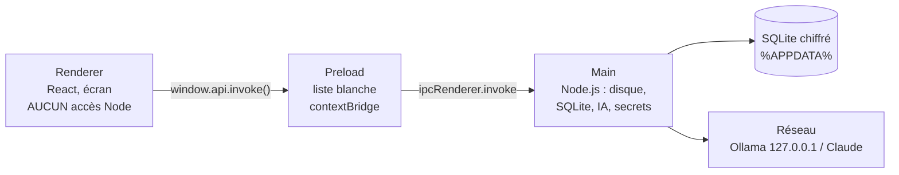
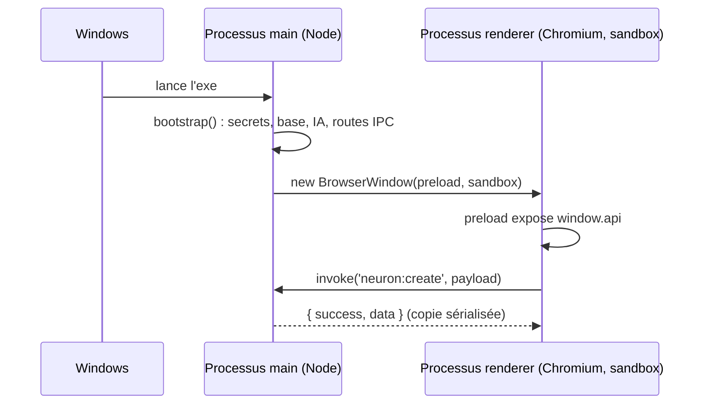

# Architecture Electron — trois processus cloisonnés

> **En 30 secondes** — Electron fabrique une application de bureau avec deux moteurs : **Node.js** (accès disque, réseau, base) et **Chromium** (affichage web). Le projet les sépare en trois zones étanches : le **main** (tout-puissant), le **renderer** (l'écran, sans aucun pouvoir) et le **preload** (le seul guichet entre les deux). Si l'écran est piraté, il ne peut rien toucher.



---

## 1. Vue Macro & Utilité (le « Pourquoi »)

> 📘 **Introduction (ajoutée)** — **C'est quoi ?** Electron est un cadre (*framework*) qui empaquette un navigateur (Chromium) et un environnement JavaScript serveur (Node.js) dans un seul `.exe`. **Comment ça marche ?** Au lancement, un **processus principal** (*main*) démarre ; il ouvre des fenêtres, chacune animée par un **processus de rendu** (*renderer*) séparé, exactement comme un onglet de Chrome. Un petit script, le **preload**, est injecté dans la fenêtre avant la page pour exposer une API contrôlée.

- **Problématique** : une page web qui aurait accès à Node pourrait lire n'importe quel fichier, lancer des commandes, voler la clé API. Or l'interface affiche du texte venu de l'utilisateur **et** de l'IA : une seule faille XSS (*Cross-Site Scripting* — injection de script dans une page) suffirait.
- **Emplacement dans la carte globale** : c'est la **charpente** de l'application — entre le matériel (processus de l'OS) et tout le code métier.
- **Analogie (openspace)** : le PC est un openspace. Le **main** est le bureau de direction fermé à clé (coffre, archives = disque, téléphone vers l'extérieur = réseau). Le **renderer** est l'accueil vitré où passent les visiteurs : il ne possède **aucune clé**. Le **preload** est le guichet avec hygiaphone : on ne peut y déposer que des formulaires d'une liste précise (la liste blanche des canaux). *Là où ça boite* : dans un vrai openspace, l'accueil peut quand même marcher jusqu'au bureau ; ici, le système d'exploitation l'en empêche physiquement (sandbox).

## 2. Le Pont Systémique (sous le capot)

- **Processus OS distincts** : main et renderer sont deux processus Windows séparés, chacun avec **sa propre mémoire** (RAM isolée). Le renderer ne peut pas lire la mémoire du main ; il doit lui **envoyer un message** (IPC — *Inter-Process Communication*, communication entre processus, via un canal géré par Chromium).
- **Sandbox** : le renderer tourne dans un bac à sable de l'OS : pas d'appel système direct au disque ni au réseau brut.
- **contextIsolation** : même le preload et la page ne partagent pas le même « monde » JavaScript (deux tas mémoire — *heaps* — distincts) ; seul ce qui est passé par `contextBridge.exposeInMainWorld` traverse, sous forme de copie.
- **CSP** (voir [[Glossaire — CSP (Content Security Policy)]]) : le moteur de rendu refuse d'exécuter tout script qui ne vient pas des fichiers de l'app.



## 3. Analyse du Code & Logique

Extrait de `src/main/index.ts` :

```ts
const window = new BrowserWindow({
  webPreferences: {
    preload: join(import.meta.dirname, '../preload/index.cjs'), // ① guichet, en CommonJS
    contextIsolation: true,   // ② mondes JS séparés page / preload
    sandbox: true,            // ③ renderer sans accès OS
    nodeIntegration: false,   // ④ pas de require() dans la page
    webSecurity: true
  }
})
// ⑤ aucune nouvelle fenêtre : les liens https s'ouvrent dans le navigateur système
window.webContents.setWindowOpenHandler(({ url }) => {
  if (url.startsWith('https://')) void shell.openExternal(url)
  return { action: 'deny' }
})
// ⑥ toute permission (caméra, micro…) et toute webview refusées
contents.session.setPermissionRequestHandler((_wc, _p, callback) => callback(false))
```

- **Étape 1 — Les quatre verrous** (①–④) : ce sont les réglages exigés mot pour mot par la constitution (principe I).
- **Étape 2 — Le preload en `.cjs`** : en sandbox, le preload ne peut pas charger de module ES ni de dépendance npm (JOURNAL, règles 3 et 4) ; il n'importe que `channels.ts`, un fichier sans dépendance.
- **Étape 3 — La navigation bloquée** (⑤, `will-navigate`) : un lien piégé ne peut pas remplacer l'app par un site externe.
- **Étape 4 — `bootstrap()`** : le main assemble tous les services **avant** d'ouvrir la fenêtre ; c'est la *racine de composition* (voir [[Clean Architecture — domaine, application, infrastructure]]).

**Bonnes pratiques mises en évidence** : **défense en profondeur** — chaque couche se protège même si la précédente a déjà filtré (le preload filtre les canaux, le main les refiltre et vérifie l'expéditeur).

## 4. Synthèse & Prochaine Étape

**À retenir (3 puces max)**
- **Main** = pouvoirs (disque, base, réseau) ; **renderer** = affichage sans pouvoir ; **preload** = guichet minimal.
- Les 4 verrous : `contextIsolation`, `sandbox`, `nodeIntegration: false`, CSP stricte.
- Le renderer ne touche **jamais** directement la base, le disque ni le réseau.

**Lien avec la suite** : comment le renderer parle-t-il au main de façon sûre ? → [[IPC typé — le guichet unique entre interface et moteur]].

**Rappel actif**
> **Q :** Pourquoi le preload est-il compilé en CommonJS (`.cjs`) ?
> **R :** Parce qu'en sandbox il ne peut charger ni module ES ni dépendance npm ; le paquet étant `"type": "module"`, il faut forcer le format CommonJS.

> **Q :** Que se passe-t-il si un script malveillant s'exécute dans le renderer ?
> **R :** Il n'a ni `require`, ni accès disque/réseau ; il ne peut qu'appeler les canaux de la liste blanche, dont chaque charge utile est revalidée par le main.

> **Q :** Où vivent les données de l'utilisateur ?
> **R :** Dans `%APPDATA%/gestionnaire-idees/` (`app.getPath('userData')`), jamais dans le dossier du projet.

**Pièges fréquents**
- ⚠️ **Activer `nodeIntegration` « pour aller plus vite »** — c'est donner les clés du coffre à l'accueil.
- ⚠️ **Importer `zod` dans le preload** — en sandbox, le chargement échoue au démarrage (règle 4 du JOURNAL).

**Connexions**
- [[IPC typé — le guichet unique entre interface et moteur]] — le protocole du guichet.
- [[Stockage local chiffré — SQLite, SQLCipher et DPAPI]] — ce que protège le bureau de direction.
- [[Glossaire — CSP (Content Security Policy)]] — le quatrième verrou.

## Évolution du 29/09 — deux fenêtres, un preload, deux API
La spec 003 ajoute une **deuxième fenêtre** (la capture rapide). Plutôt que deux preloads (un preload en sandbox ne peut rien charger d'autre, et l'option expérimentale `isolatedEntries` d'electron-vite plantait), le **même** preload lit un argument de lancement `--gi-window=capture|main` (passé par `hardenedWebPreferences(window)`) et n'expose que **l'API de sa fenêtre** : `window.captureApi` (canaux `capture:*`) **ou** `window.api`. Le main vérifie en plus la **page émettrice** de chaque canal (défense en profondeur). Même durcissement pour les deux (`contextIsolation`, `sandbox`, `nodeIntegration: false`, navigation bloquée). Cycle de vie des fenêtres (cachées, pré-chargées, instance unique) → [[Coquille de bureau — zone de notification, instance unique et fenêtres cachées]].


## Évolution du 30/09 — une quatrième zone : le cadre des widgets
La spec 004 fait tourner du code **écrit par Claude** dans l'app. Il ne va ni dans le main ni dans le renderer : il vit dans une `<iframe sandbox="allow-scripts">` servie par un **protocole personnalisé** `gi-widget://` (déclaré avant `app.whenReady`, servi par le main depuis la base). `hardening.ts` gagne deux gardes : `will-frame-navigate` (un cadre ne navigue que vers `gi-widget:`) et `setWebRTCIPHandlingPolicy('disable_non_proxied_udp')`. Le cadre n'a **pas** de preload, donc pas de `window.api`. Détail des cinq barrières → [[Bac à sable des widgets — iframe isolée, origine opaque et protocole gi-widget]].
