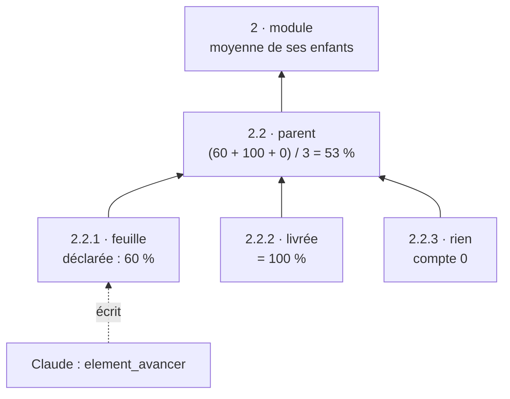

# Avancement vivant — agrégation récursive, outil dédié et consigne au bon endroit

> **En 30 secondes** — Quand Claude travaille sur l'élément « 2.2 » d'une carte (code, tests, commit), il **déclare** son avancement avec l'outil `element_avancer` (statut, %, reste à faire). L'app **calcule** celui des parents : la **moyenne** de leurs sous-éléments, récursivement jusqu'au module. Une barre bleue (verte à 100 %) apparaît au pied de chaque nœud. Feuille = déclarée par l'IA ; parent = calculé par le code.



---

## 1. Vue Macro & Utilité (le « Pourquoi »)

- **Problématique** (retour de mentalyas sur capture) : Claude avait fini une tâche dans l'élément 2.2 — tests verts, commit — mais le nœud restait « en cours ». La carte **mentait par omission**. Recartographier toute la carte pour changer un statut serait lourd (300 éléments, tout ou rien) et n'arrivait de toute façon jamais.
- **Emplacement dans la carte globale** : outil MCP `element_avancer` (`shared/mcp/tools.ts`) → `toolHandler` → `StructureService.advance` (transaction + lot d'Historique « par Claude ») → colonnes `neurons.progress`, `progress_note` (migration 0032) → IPC → renderer : `canvas/progress.ts` (**pur**) → `ElementNode.tsx` (barre + %, reste à faire au survol).
- **Analogie (Satisfactory)** : chaque **machine** affiche sa propre production (la feuille déclare) ; la **barre d'une usine** est la moyenne de ses machines, celle d'un **site** la moyenne de ses usines. Personne ne « déclare » l'usine : elle se lit d'en dessous. *Côté restauration* : chaque chef de partie annonce « poisson : 2 minutes » ; le **passe** en déduit où en est la table. *Où ça boite* : une moyenne simple suppose que tous les enfants pèsent pareil — une petite tâche et un gros chantier comptent autant (choix assumé : simple et lisible).

## 2. Le Pont Systémique (sous le capot)

1. **Claude** (processus `claude -p`) appelle `element_avancer` → le **relais MCP** passe l'appel par le canal nommé → le **main** valide l'entrée (Zod), vérifie que l'élément appartient **au projet de cette conversation** (sinon `NON_MODIFIABLE`), écrit en **une transaction** la nouvelle valeur **et** son instantané avant/après dans l'Historique.
2. Le main émet l'événement de lot → l'interface invalide son cache → relit les éléments par IPC.
3. **Dans le renderer**, `progressOf(elements)` parcourt l'arbre en mémoire vive. Chaque élément est calculé **une fois** grâce à une `Map` de mémo (pas de recalcul d'un sous-arbre partagé), et un `Set` « en cours de visite » coupe une éventuelle boucle `parentId` (donnée corrompue) au lieu de faire exploser la **pile d'appels** (*stack overflow* : chaque appel récursif empile un cadre en mémoire ; une boucle infinie remplit la pile).

Rien n'est stocké pour les parents : leur avancement est une **donnée dérivée**, recalculée à chaque affichage.

## 3. Analyse du Code & Logique

**Bloc 1 — L'agrégation récursive** (`canvas/progress.ts`)

```ts
const of = (element): ElementProgress | null => {
  const known = memo.get(element.id); if (known !== undefined) return known   // ① mémoïsation
  if (visiting.has(element.id)) return null                                   // ② garde de cycle
  visiting.add(element.id)
  let result = null
  if (element.status !== null && DONE.has(element.status)) result = { percent: 100, fromChildren: false } // ③ livrée/faite
  else {
    const kids = children.get(element.id) ?? []
    const values = kids.map(of)                                               // ④ d'abord les enfants (post-ordre)
    if (kids.length > 0 && values.some((v) => v !== null))
      result = { percent: Math.round(values.reduce((s, v) => s + (v?.percent ?? 0), 0) / kids.length), fromChildren: true }
    else if (typeof element.progress === 'number')
      result = { percent: Math.max(0, Math.min(100, element.progress)), fromChildren: false } // ⑤ feuille : valeur bornée
  }
  visiting.delete(element.id); memo.set(element.id, result); return result
}
```
- ① ② Les deux protections classiques d'une récursion sur des données venues de l'extérieur.
- ③ « livrée » **court-circuite** tout : 100 %, même si des sous-tâches n'ont rien déclaré.
- ④ C'est un **parcours en profondeur post-ordre** : on ne peut calculer le parent qu'après ses enfants (l'inverse de la numérotation 1.2.1, qui est préfixe).
- ⑤ Un enfant **sans information compte 0** dans la moyenne (on ne gonfle pas le parent) ; si **aucun** enfant n'a d'info, le parent retombe sur sa propre valeur déclarée, sinon **pas de barre** (absent ≠ 0 %).

**Bloc 2 — Un outil léger pour une donnée vivante** (`StructureService.advance`)

```ts
const done = input.statut === 'livree' || input.statut === 'faite'
const next = {
  status:   input.statut ?? row.status,
  progress: input.avancement ?? (done ? 100 : row.progress),                 // « livree » ⇒ 100 % par défaut
  note:     input.reste === undefined ? (done ? null : row.progressNote)     // terminé : plus rien « à faire »
            : input.reste === '' ? null : input.reste
}
```
Trois champs, tous facultatifs : Claude envoie **seulement ce qui change**. L'élément visé est par défaut **celui de la conversation** (`caller.neuronId`) : impossible de se tromper de cible dans le cas courant.

**Bloc 3 — La consigne au bon endroit** (`conversation/frame.ts` + instructions du pont)

La règle « tiens l'élément à jour à chaque étape franchie, “livree” quand tests verts et commit » est écrite **dans le cadre des conversations d'élément** — là où Claude travaille — et rappelée dans les instructions générales du pont. Une consigne loin du moment d'agir est oubliée ; voir [[Consigne pour un agent outillé — dire ce qui ne change pas, nommer l'outil et l'anti-outil]].

**Bonnes pratiques mises en évidence** : séparer **déclaré** (feuille, par l'IA, annulable) et **calculé** (parents, par le code) ; borner toute valeur venue de l'IA (`0 ≤ % ≤ 100`) ; écrire « par Claude » dans un lot d'Historique (constitution 3.0.0 : écritures directes, marquées, annulables).

## 4. Synthèse & Prochaine Étape

**À retenir (3 puces max)**
- Feuille = **déclarée** par Claude via `element_avancer` ; parent = **moyenne récursive** calculée (enfant sans info = 0, livrée = 100).
- Récursion sûre : **mémo** (chaque nœud une fois) + **garde de cycle** (pas de pile qui déborde).
- Une donnée que l'IA doit tenir à jour mérite **son propre outil léger** et une consigne **là où elle agit**.

**Lien avec la suite** : pourquoi Claude n'utilisait pas les bons outils, et comment l'écrire dans une consigne → [[Consigne pour un agent outillé — dire ce qui ne change pas, nommer l'outil et l'anti-outil]].

**Rappel actif**
> **Q :** Module 2 : trois enfants. 2.1 « livrée », 2.2 a deux sous-éléments (40 % et rien), 2.3 n'a rien. Avancement du module ?
> **R :** 2.2 = (40 + 0) / 2 = 20 %. Module = (100 + 20 + 0) / 3 = 40 %.

> **Q :** Pourquoi le `Set visiting` est-il nécessaire alors que la carte « est un arbre » ?
> **R :** Parce que la donnée vient de la base et de l'IA : un `parentId` circulaire ferait boucler la récursion jusqu'au débordement de pile. La garde rend `null` et la boucle s'arrête.

> **Q :** Pourquoi ne pas stocker l'avancement des parents ?
> **R :** Il se déduit des enfants ; le stocker obligerait à le remettre à jour à chaque changement d'un descendant (et à chaque annulation) — deux vérités à synchroniser.

**Pièges fréquents**
- ⚠️ **Confondre « absent » et « 0 % »** — sans aucune info, pas de barre ; un 0 % affiché ferait croire à un travail pas commencé.
- ⚠️ **Récursion sans mémo** — sur un arbre large, le même sous-arbre peut être recalculé plusieurs fois (ici chaque nœud n'est visité qu'une fois).
- ⚠️ **Moyenne non pondérée** — lisible, mais une grosse tâche à 0 % pèse autant qu'une petite : c'est un indicateur, pas une estimation de délai.

**Connexions**
- [[Glossaire — Parcours en profondeur (DFS)]] — post-ordre : les enfants avant le parent.
- [[Glossaire — Donnée dérivée (calculer plutôt que stocker)]] — l'avancement des parents n'existe pas en base.
- [[Explorateur de code — du module au bloc, appelants et appelés]] — autre agrégation qui **remonte** vers l'ancêtre.
- [[Vue Architecture — règle de dépendance, couches déduites et deux dispositions pures]] — même carte, autre lecture.
