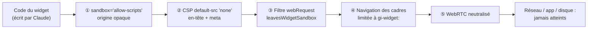
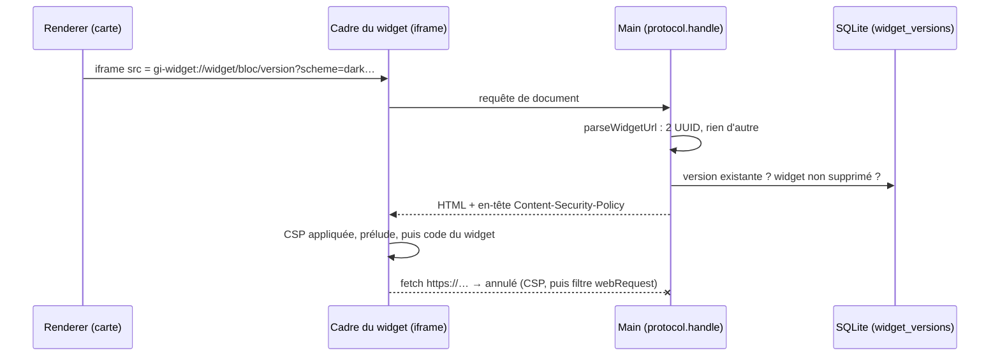

# Bac à sable des widgets — iframe isolée, origine opaque et protocole gi-widget

> **En 30 secondes** — Un widget est du code **écrit par Claude** et exécuté **dans ton app**. On part du principe qu'il peut être hostile (erreur du modèle ou demande piégée). Il tourne donc dans une **iframe** (*inline frame* — une page web emboîtée dans une autre) en **bac à sable** : il peut calculer et dessiner, mais ne peut ni parler au réseau, ni toucher l'app, ni ouvrir une fenêtre. Cinq barrières indépendantes se recouvrent ; **aucune ne dépend de la bonne volonté du modèle**.



---

## 1. Vue Macro & Utilité (le « Pourquoi »)

> 📘 **Introduction (ajoutée)** — **C'est quoi ?** Un *bac à sable* (*sandbox*) est un enclos d'exécution : le code y tourne vraiment, mais tout ce qui sort de l'enclos est refusé par le moteur (ici Chromium), pas par le code lui-même. **Comment ça marche ?** L'attribut HTML `sandbox` sur une `<iframe>` retire **tous** les pouvoirs par défaut ; on ne rend que ceux qu'on nomme. Ici on n'en rend qu'un : `allow-scripts` (exécuter du JavaScript).

- **Problématique** : jusqu'à la spec 003, la constitution interdisait à l'IA de produire du code. La spec 004 crée **une** exception (tâche `widget`, constitution 1.2.0). Or ce code s'exécute sur ta machine, dans une app qui détient la base chiffrée et la clé Claude. Une consigne du type « n'utilise pas `fetch` » dans le prompt ne protège rien : un modèle peut l'ignorer (voir [[Injection de prompt — cadre figé et données balisées]]).
- **Emplacement dans la carte globale** : à cheval sur le **renderer** (la balise `<iframe>` dans `WidgetNode.tsx`) et le **main** (qui sert le document et filtre les requêtes, dossier `src/main/shell/`). C'est une quatrième zone, encore plus pauvre en pouvoirs que le renderer.
- **Analogie (restauration)** : une **cuisine de démonstration derrière une vitre**. Le cuisinier invité (le widget) a un plan de travail et des ustensiles (scripts, styles), mais : pas de porte vers la vraie cuisine (l'app), pas de téléphone (réseau), pas de passe-plat (formulaires, fenêtres). La vitre, la porte condamnée et l'absence de ligne téléphonique sont **trois protections distinctes** : il en faut une seule qui tienne. *Là où ça boite* : le cuisinier peut quand même monopoliser son propre plan de travail (boucle infinie) — il ne bloque alors que **son** cadre, d'où le bouton « Relancer ».

## 2. Le Pont Systémique (sous le capot)

**Qui sert la page ?** Electron permet de déclarer un **protocole personnalisé** : au lieu de `https://…` (réseau) ou `file://…` (disque), l'adresse `gi-widget://widget/<bloc>/<version>` est interceptée par le processus **main**, qui fabrique la réponse en mémoire à partir d'une ligne de la base. Aucun fichier, aucun serveur, aucun port ouvert.



| Couche | Ce qu'elle coupe | Où c'est écrit |
|--------|------------------|----------------|
| ① `sandbox="allow-scripts"` **sans** `allow-same-origin` | `parent`, `top`, stockage (`localStorage`, cookies), `alert`, `window.open`, soumission de formulaire — le cadre reçoit une **origine opaque** ([[Glossaire — Origine web et origine opaque]]) | `WidgetNode.tsx` |
| ② CSP `default-src 'none'` | Toute connexion (`fetch`, WebSocket), toute image/police/feuille de style distante, tout cadre imbriqué | `WidgetDocument.ts` (constante `WIDGET_CSP`), envoyée par `widgetProtocol.ts` |
| ③ Filtre `session.webRequest.onBeforeRequest` | Toute requête émise par un cadre `gi-widget:` vers un **autre** protocole, même si la CSP était contournée | `widgetProtocol.ts` + `leavesWidgetSandbox` (`widgetUrl.ts`) |
| ④ `will-frame-navigate` | Un cadre qui voudrait naviguer ailleurs que vers `gi-widget:` | `hardening.ts` |
| ⑤ WebRTC | `RTCPeerConnection` rendu `undefined` avant le code du widget + politique `disable_non_proxied_udp` (WebRTC ouvre des connexions UDP que la CSP ne voit pas) | prélude de `WidgetDocument.ts`, `hardening.ts` |

**Pourquoi pas `srcdoc` ?** (mettre le HTML directement dans l'attribut de l'iframe). Un cadre `srcdoc` **hérite de la CSP de l'app**, qui interdit les scripts en ligne : le widget ne démarrerait pas, et il faudrait affaiblir la CSP de l'app. Avec un protocole dédié, le widget a **sa** politique, et l'app ne relâche qu'une chose : `frame-src gi-widget:` dans `src/renderer/index.html`.

**Pas de preload dans le cadre** : le guichet `window.api` n'est injecté que dans la page principale (réglage Electron `nodeIntegrationInSubFrames` laissé à faux — plan § Isolation). Le widget n'a donc aucun canal IPC (voir [[Glossaire — IPC (communication entre processus)]]).

## 3. Analyse du Code & Logique

Extraits de `src/main/application/widgets/WidgetDocument.ts`, `widgetUrl.ts` et `src/main/shell/widgetProtocol.ts` :

```ts
// ① La politique : rien par défaut, scripts et styles EN LIGNE seulement, images en data:/blob:
export const WIDGET_CSP = [
  "default-src 'none'", "script-src 'unsafe-inline'", "style-src 'unsafe-inline'",
  'img-src data: blob:', 'font-src data:', 'media-src data: blob:',
  "base-uri 'none'", "form-action 'none'"
].join('; ')                       // aucun connect-src, aucun frame-src → couverts par default-src 'none'

// ② Le widget ne peut pas refermer son propre bloc pour écrire du HTML libre
function neutralize(text: string, tag: 'style' | 'script'): string {
  return text.replace(new RegExp(`</(${tag})`, 'gi'), '<\\/$1')
}

// ③ Une requête sort-elle du bac à sable ? (fonction pure, donc testable sans Electron)
export function leavesWidgetSandbox(from: string, url: string): boolean {
  const prefix = `${WIDGET_SCHEME}:`
  return from.startsWith(prefix) && !url.startsWith(prefix)
}

// ④ Le main sert le document et pose le filtre
session.protocol.handle(WIDGET_SCHEME, (request) => {
  const target = parseWidgetUrl(request.url)            // deux UUID exacts, sinon null
  /* … 404 si version inconnue ou widget supprimé … */
  return new Response(html, { headers: {
    'content-security-policy': WIDGET_CSP,               // CSP en EN-TÊTE…
    'cache-control': 'no-store', 'x-content-type-options': 'nosniff', 'referrer-policy': 'no-referrer'
  } })
})
session.webRequest.onBeforeRequest((details, callback) => {
  callback({ cancel: leavesWidgetSandbox(details.frame?.url ?? details.referrer, details.url) })
})
```

- **Étape 1 — `'unsafe-inline'` ici, interdit ailleurs** : dans l'app, `'unsafe-inline'` sur `script-src` serait une faute (piège du glossaire CSP). Dans le widget c'est voulu : **tout** le document est du code non fiable, il n'y a rien à protéger *à l'intérieur*. La CSP sert ici à empêcher de **sortir**, pas à empêcher une injection.
- **Étape 2 — En-tête ET `<meta>`** : la même politique est écrite deux fois (`buildWidgetDocument` la met aussi en `<meta http-equiv>`, **avant** le HTML du widget). Si l'une manquait, l'autre s'applique ; deux politiques se cumulent (la plus stricte gagne).
- **Étape 3 — Tout ce qui entre dans le document est filtré** : titre débarrassé de `< > & "`, `</style>` et `</script>` neutralisés, couleurs du thème acceptées **seulement** si elles sont hexadécimales (`/^#[0-9a-f]{3,8}$/i`) — le thème arrive par l'URL, donc par le renderer.
- **Étape 4 — Adresse stricte** : `parseWidgetUrl` exige le protocole, l'hôte `widget` et exactement deux UUID ; `gi-widget://widget/../x` est refusé.
- **Étape 5 — Le schéma se déclare avant `app.whenReady`** : `registerWidgetScheme()` (privilège `standard` : URL analysables, origine distincte) est appelé au tout début de `src/main/index.ts`, `installWidgetProtocol` une fois l'app prête — exigence d'Electron.

**Bonnes pratiques mises en évidence** : **défense en profondeur** (chaque couche suppose que la précédente a cédé) ; **logique de sécurité extraite en fonctions pures** (`leavesWidgetSandbox`, `buildWidgetDocument`, `parseWidgetUrl`) pour la tester sans lancer Electron — `tests/unit/widgets/widget-escape.test.ts` construit un widget hostile et vérifie chaque barrière (critère SC-002) ; **le cadre système décrit le bac à sable mais n'est pas la barrière** (commentaire de `WidgetFrame.ts`).

> ⚠️ **Probable (lu, non exécuté)** — Les tests automatisés portent sur le **texte** du document et sur la fonction de filtre, pas sur un vrai Chromium : le blocage réel de `parent`, `alert`, `fetch`… repose sur le test manuel guidé (`specs/004-widgets/quickstart.md` § 4), noté « widgets générés et fonctionnels » dans le journal — le résultat de la section « évasion » n'y est pas détaillé.
>
> ⚠️ **À vérifier** — Le filtre lit `details.frame?.url` et, à défaut, `details.referrer`. Comme le document est servi avec `referrer-policy: no-referrer`, si `frame` était absent pour un type de requête, la source serait vide et la requête **non annulée** par cette couche (les couches ① ② la bloqueraient encore). À confirmer en lançant l'app.

## 4. Synthèse & Prochaine Étape

**À retenir (3 puces max)**
- Code non fiable = **enclos imposé par le moteur**, jamais une consigne dans le prompt.
- `sandbox="allow-scripts"` sans `allow-same-origin` → origine opaque : plus de parent, plus de stockage, plus de fenêtres ; la CSP `default-src 'none'` coupe le réseau.
- Plusieurs couches indépendantes, chacune **testée seule** par une fonction pure.

**Lien avec la suite** : d'où vient le code qu'on enferme, et comment passe-t-il de TypeScript à JavaScript ? → [[Widget généré par Claude — effacement de types, versions par pointeur et échec sans dégât]].

**Rappel actif**
> **Q :** Pourquoi ne jamais ajouter `allow-same-origin` à côté de `allow-scripts` ?
> **R :** Le cadre retrouverait une vraie origine : accès au stockage, et surtout un script capable de retirer lui-même l'attribut `sandbox` de son cadre si l'origine est celle du parent. Les deux ensemble annulent le bac à sable.

> **Q :** La CSP bloque déjà `fetch`. À quoi sert le filtre `webRequest` ?
> **R :** À tenir si la CSP est contournée ou mal écrite un jour : il agit dans le processus main, hors d'atteinte du widget.

> **Q :** Pourquoi servir le widget par `gi-widget://` plutôt que par `srcdoc` ?
> **R :** `srcdoc` hérite de la CSP de l'app (scripts en ligne interdits) ; un protocole dédié donne au widget sa propre politique sans affaiblir celle de l'app.

> **Q :** Que devient un widget qui boucle à l'infini ?
> **R :** Il ne fige que son cadre ; « Relancer » change la `key` React de l'iframe, qui est détruite et recréée.

**Pièges fréquents**
- ⚠️ **Croire que le cadre système protège** — il aide le widget à *fonctionner* dans l'enclos ; la sécurité ne dépend pas du modèle.
- ⚠️ **Afficher le code généré avec `innerHTML`** — l'onglet Code l'affiche dans un `<pre>` comme **texte** ; l'interpréter dans l'app reviendrait à sortir le cuisinier de derrière la vitre.
- ⚠️ **Oublier WebRTC** — il ne passe pas par `connect-src`.

**Connexions**
- [[Architecture Electron — trois processus cloisonnés]] — les trois zones d'origine ; le widget en est une quatrième, sans guichet.
- [[Glossaire — CSP (Content Security Policy)]] — même mécanisme, utilisé dans l'autre sens (empêcher de sortir).
- [[Glossaire — Origine web et origine opaque]] — ce que retire l'absence de `allow-same-origin`.
- [[Du brainstorm au code — spécifications et constitution]] — l'amendement 1.2.0 qui autorise ce code, à cette condition.

## Évolution du 30/09 (soir) — une porte étroite dans la vitre (spec 005)
- Le cadre peut désormais **recevoir** des données (`gi.onInputs`) et **publier** un résultat (`gi.output`) par `postMessage`. Les cinq barrières ne changent pas : `postMessage` n'est pas une connexion réseau, la CSP `default-src 'none'` reste identique.
- Le prélude gagne un objet `window.gi` **figé** (`Object.freeze`, `writable: false`). Comme pour le cadre système : **le prélude n'est pas une barrière**. Les deux décisions sont dans le main — ce qui entre (autorisation par empreinte) → [[Widget branché — autorisation par empreinte et pont postMessage]] ; ce qui sort (bornes) → [[Cadre résultat — sortie bornée, vue figée et rafales regroupées]].
- Nouvelle adresse servie : `gi-widget://result/<bloc>` (`parseResultUrl`), même enveloppe isolée, pour du **code figé de l'app**.

## Évolution du 10/10 — une mémoire et un panneau, toujours derrière la vitre (spec 026)
- Trois nouveaux messages du cadre : `gi:saveState` (état JSON **64 Ko** au plus, revalidé dans le main, gardé d'une version à l'autre), `gi:declareSettings` (réglages **déclarés**, panneau **dessiné par l'app**), et en retour `gi:state` / `gi:settings`. Les cinq barrières ne bougent pas : tout passe encore par `postMessage`, filtré par `event.source`.
- **Plein écran** : le même cadre isolé, à taille réelle (pas de réduction au-delà de 760 px) — l'aperçu sur la carte n'est qu'une mise à l'échelle.
→ [[Réglages déclarés par un widget — le widget décrit, l'app dessine et ramène chaque valeur]]
