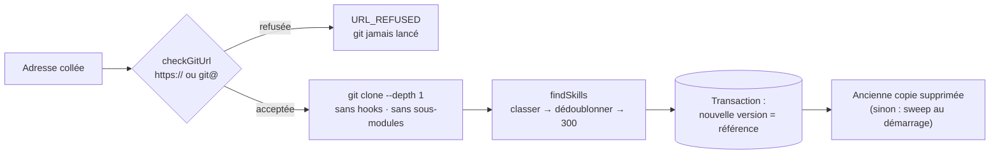

# Bibliothèque de skills — adresse contrôlée, clone sans hooks, copie par version et bascule de référence

> **En 30 secondes** — mentalyas colle l'adresse d'un dépôt de skills. L'app **vérifie l'adresse** avant même de lancer git, clone la **dernière version seulement** sans exécuter quoi que ce soit du dépôt, la range dans `<profil>/skill-library/<hôte>/<auteur>/<dépôt>@<version>`, repère au plus 300 skills (un par nom, au meilleur emplacement) et les montre sur la toile en nœuds « disponible ». « Mettre à jour » clone une **nouvelle** version à côté, fait **basculer la base** dessus, puis supprime l'ancienne si Windows le permet — sinon au prochain démarrage.



---

## 1. Vue Macro & Utilité (le « Pourquoi »)

> 📘 **Introduction (ajoutée)** — **Clone superficiel ?** `git clone --depth 1 --single-branch` ne télécharge que le **dernier commit** d'une branche : pas l'historique. Plus rapide, plus léger — on veut les fichiers, pas leur passé. (À ne pas confondre avec le clone **partiel** `--filter=blob:none` de la reprise de projet, qui garde l'historique mais télécharge les contenus à la demande.) **Hook git ?** Un script placé dans `.git/hooks/` que git **exécute tout seul** à certains moments (après un checkout, avant un commit…). Un dépôt piégé peut aussi désigner un programme dans sa **configuration** (`core.fsmonitor`, filtres). Cloner un dépôt inconnu « normalement », c'est donc potentiellement **lancer son code**.

- **Problématique** (test guidé T032) : la première version de l'import faisait un clone jetable en « quarantaine » borné à 2 000 fichiers. Un vrai dépôt de skills (docs, images, traductions) dépassait la borne → « Dépôt trop gros ». Et une fois le dépôt jeté, impossible de revenir chercher un autre skill. D12 : on **garde** une copie locale, bornée par ce qui fait vraiment risque (**1 Go**, **15 min**), pas par un nombre de fichiers.
- **Emplacement dans la carte globale** : `ImportDialog` / `LibraryPanel` (renderer) → IPC `skills:import|library|libraryInstall|libraryRemove` → `SkillImportService` (application) → `CloneService` (profil `superficiel`) → `git.exe` par chemin absolu ; métadonnées en SQLite (`skill_imports.folder`, `skill_import_candidates`).
- **Analogie (logistique)** : l'entrepôt reçoit une nouvelle version du catalogue. On ne vide pas l'étagère A pour la remplir pendant qu'un préparateur y prend un colis (Windows refuserait, voir §2). On remplit l'**étagère B**, on change **l'étiquette sur le plan** (la base dit : « le catalogue est en B »), et l'étagère A est débarrassée dès qu'elle est libre — au pire à l'ouverture du lendemain.

## 2. Le Pont Systémique (sous le capot)

**Lancer git sans lui laisser exécuter le dépôt** (`CloneService.ts`) — chaque option ferme une porte :

| Argument / variable | Porte fermée |
|---------------------|--------------|
| `-c core.hooksPath=<dossier vide>` | aucun hook du dépôt ne s'exécute |
| `-c core.fsmonitor=false` | aucun programme « surveillant » désigné par la config |
| `-c protocol.allow=never` + `protocol.https.allow=always` (…) **et** `GIT_ALLOW_PROTOCOL` | transports limités **deux fois** (`ext::` exécuterait une commande) |
| `--no-recurse-submodules` | un sous-module ne tire pas un autre dépôt |
| `--` avant l'adresse | l'adresse ne peut pas être lue comme une option |
| `GIT_TERMINAL_PROMPT=0`, variables `GIT_*` héritées filtrées | aucune invite bloquante, aucun réglage parasite de l'environnement |

**Pourquoi ne jamais renommer le dossier ?** Sous Windows, un dossier dont un fichier est **ouvert** (par l'app elle-même, l'antivirus, l'Explorateur) ne peut pas être renommé : le système répond `EPERM`. La première version faisait « clone dans `.tmp` puis renommage » ; même avec 20 essais espacés de 500 ms, le journal a montré `EPERM` persistant — la copie était **lue par l'app**. Correction **de conception**, pas d'attente : on n'a plus besoin de renommer. → [[Glossaire — Verrou de fichier sous Windows (EPERM, EBUSY)]]

## 3. Analyse du Code & Logique

**Bloc 1 — L'adresse est jugée avant git** (`shared/reprise/gitUrl.ts`, fonction pure)
```ts
if (input.startsWith('-')) return refuse('OPTION')                          // « --upload-pack=… » déguisée en adresse
if (input.includes('\\') || input.includes('::')) return refuse('SCHEME')   // ext::sh -c …, chemins Windows
if (/^https:\/\//i.test(input)) return checkHttps(...)                      // forme 1
if (input.startsWith('git@')) return checkScp(...)                          // forme 2
return refuse('SCHEME')                                                      // file://, http://, ssh://, chemin local…
```
Liste **blanche** de deux formes, le reste est refusé. Un identifiant (`https://user:jeton@…`) est retiré de `display` (affichage, journal, base) ; seule `url` le garde, passée **une fois** à git.

**Bloc 2 — Classer, dédoublonner, puis tronquer** (`findSkills`)
```ts
const named = skillDirs.map((relDir) => ({ relDir, name: normalizeName(...), rank: placeRank(relDir) }))
  .sort((a, b) => a.rank - b.rank || (a.relDir < b.relDir ? -1 : 1))   // ① skills/ (0) < reste (1) < docs, ja-JP (2)
const unique = named.filter((s) => !seen.has(s.name) && seen.add(s.name) !== undefined) // ② un skill par nom
for (const { relDir, name } of unique.slice(0, IMPORT_LIMITS.skills)) …                // ③ la borne en DERNIER
```
Bug réel (« pourquoi ces skills sont en japonais ? ») : un dépôt de 1 027 `SKILL.md`, dont 734 copies (`docs/ja-JP/…`, `.kiro/`, `.cursor/`). Trié par ordre **alphabétique**, `.agents/`, `.cursor/`, `docs/` passaient **avant** `skills/` et la coupe à 300 tombait avant d'atteindre les vrais skills. Après correction : 296 skills gardés, 731 copies écartées et **comptées** (`skippedCopies`).

**Bloc 3 — Bascule de référence** (`pipeline`)
```ts
const target = this.libraryPath(running.folder)           // <hôte>/<auteur>/<dépôt>@<version>, sous la racine (vérifié)
await this.deps.clone({ url, profile: 'superficiel', target, signal })   // cloné DIRECTEMENT à sa place définitive
this.deps.repository.transaction(() => {
  this.deps.repository.insertCandidates(rows)
  this.deps.repository.updateImport(id, { status: 'ready', … })          // la nouvelle version devient la référence
  if (previous !== undefined) this.deps.repository.deleteImport(previous.id)
})
if (previous?.folder != null) this.removeCopy(previous.folder)            // au mieux ; échec = simple trace au journal
```
La **vérité** est dans la base (une transaction, donc tout ou rien) ; le disque **suit**. Un échec du clone laisse l'ancienne version intacte et référencée.

**Bloc 4 — Rattraper au démarrage** (`recover` → `sweep`) : tout dossier `<hôte>/<auteur>/<copie>` que la base ne référence plus est supprimé ; une copie **référencée** n'est jamais touchée (comparaison insensible à la casse : Windows). Un import resté « en cours » (app fermée pendant le clone) est marqué échoué.

**Bonnes pratiques mises en évidence** : valider **avant** de lancer un programme ; une borne de sécurité vise **le risque** (octets, durée), pas un indicateur indirect ; trier par pertinence **avant** de tronquer ; la base est la référence, le disque est nettoyé de façon **idempotente**.

> ⚠️ **Probable — à vérifier au prochain passage** : le commentaire d'en-tête de `CloneService.ts` dit encore « dossier temporaire du profil (renommé ensuite par l'appelant) » pour le profil `superficiel` ; depuis le correctif EPERM, l'appelant passe une **cible explicite** et rien n'est renommé. Commentaire périmé, comportement conforme à D12 d'après le code lu.

## 4. Synthèse & Prochaine Étape

**À retenir (3 puces max)**
- Dépôt inconnu = **donnée non fiable** : adresse en liste blanche, clone superficiel sans hooks, sans sous-modules, configuration du dépôt neutralisée par `-c`.
- **Classer → dédoublonner → tronquer**, jamais l'inverse.
- Sous Windows, on ne renomme pas un dossier qui peut être lu : écrire **à côté**, **basculer la référence** en base, supprimer au mieux, **rattraper au démarrage**.

**Lien avec la suite** : la spec 021 « Git et GitHub » (conçue le 07→08/10, pas encore codée) réutilisera le même `CloneService` à deux profils et la même règle « dépôt non de confiance = ni hooks ni programme de sa configuration », écrite dans la constitution 4.4.0 → [[Du brainstorm au code — spécifications et constitution]].

**Rappel actif**
> **Q :** Pourquoi `git clone ext::sh -c "…"` est-il refusé avant même de lancer git, et par quoi encore après ?
> **R :** `checkGitUrl` refuse `::` (forme non autorisée) ; et même si elle passait, `protocol.allow=never` + `GIT_ALLOW_PROTOCOL` n'autorisent que les transports listés.

> **Q :** Mise à jour d'un dépôt pendant que tu lis un de ses skills dans le volet. Décris ce qui se passe sur le disque et en base.
> **R :** Nouvelle copie `…@v2` clonée à côté ; transaction : candidats de v2 insérés, v2 = référence, v1 retirée de la base ; suppression du dossier v1 tentée — refusée (fichier ouvert) → trace `nettoyage` au journal ; au démarrage suivant, `sweep` supprime v1, non référencée.

> **Q :** Un dépôt a `docs/ja-JP/skills/resume/SKILL.md` et `skills/resume/SKILL.md`. Lequel est gardé ?
> **R :** `skills/resume` (rang 0) ; la traduction (rang 2, segment de langue) est écartée et comptée dans `skippedCopies`.

**Pièges fréquents**
- ⚠️ **Réessayer en boucle un `EPERM`** — si le verrou vient de l'app elle-même, attendre ne sert à rien : changer de conception.
- ⚠️ **Tronquer une liste triée par nom de chemin** — l'ordre alphabétique favorise `.dossiers-cachés` et `docs/`.
- ⚠️ **Croire qu'un clone est passif** — hooks, `fsmonitor`, filtres et sous-modules peuvent lancer du code ou tirer d'autres dépôts.

**Connexions**
- [[Glossaire — Traversée de chemin et lien symbolique]] — `libraryPath` garde chaque copie sous la racine ; liens symboliques non suivis au repérage.
- [[Glossaire — Idempotence]] — le nettoyage de démarrage peut tourner deux fois sans dégât.
- [[Mise à jour réversible — worktree, branche, fusion no-ff et git revert]] — autre façon d'écrire « à côté » de ce qui tourne.

## Évolution du 09/10 — le même clone pour tout projet (spec 021 US3, spec 024 US5)
- « Cloner par lien » (volet Dépôt) et « Nouveau brainstorm depuis un lien Git » (accueil) réutilisent **le même `CloneService`** et **le même `checkGitUrl`** (`shared/reprise/gitUrl.ts`) : un seul contrôle d'adresse pour la reprise de projet, les skills et git. Un identifiant dans l'adresse (`https://user:jeton@…`) n'est **jamais** affiché, journalisé ni stocké (`display` sans identifiant).
- Le dossier cloné devient un **dépôt non de confiance** : ses hooks restent coupés et sa configuration locale est **classée** avant toute autre commande. → [[Git piloté par l'app — préfixe sûr, arguments construits, configuration piégée et push gardé]]
