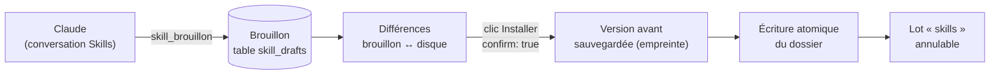

# Brouillon puis installation — trois verrous, versions par empreinte et retour arrière

> **En 30 secondes** — Un **skill** de Claude Code est un dossier (`SKILL.md` + annexes) qui **change le comportement** de Claude à chaque session. La page Skills montre ces skills en arbre ; dans sa conversation, Claude peut en **proposer** de nouveaux ou des versions améliorées, mais seulement sous forme de **brouillon** rangé en base. Rien ne touche le disque avant que mentalyas voie les différences et clique **Installer**. Chaque geste (installer, revenir, supprimer) sauvegarde la version remplacée et s'annule depuis l'Historique.



---

## 1. Vue Macro & Utilité (le « Pourquoi »)

> 📘 **Introduction (ajoutée)** — **C'est quoi un skill ?** Un dossier rangé dans `~/.claude/skills/<nom>/` (personnel), dans `.claude/skills/` d'un projet, ou fourni par un plugin. Son `SKILL.md` commence par un en-tête YAML (`name`, `description`) puis des instructions en Markdown. **Comment ça marche ?** Claude Code lit la description de tous les skills au démarrage ; quand une demande correspond, il charge le reste et **suit ces instructions** comme les siennes. Écrire un skill revient donc à écrire une partie de la consigne système de toutes les futures sessions.

- **Problématique** : mentalyas veut améliorer ses skills **avec** Claude. Mais un skill est une consigne qui s'exécutera **plus tard, partout**, avec les droits de Claude Code. Laisser Claude l'écrire directement, c'est lui laisser réécrire ses propres règles — et, via un script annexe, glisser un exécutable.
- **Emplacement dans la carte globale** : page Skills (renderer) → IPC `skills:*` → `SkillService` (application) → `SkillStore` (infrastructure : disque) + `SkillRepository` (SQLite : brouillons, versions, historique). Claude, lui, passe par le **pont MCP** : outils `skills_lire` et `skill_brouillon` seulement.
- **Analogie (restauration)** : le commis (Claude) peut écrire une recette **sur une fiche volante** et la poser sur le passe. Seul le chef (mentalyas) la relit, la compare à l'ancienne et la range au **classeur** (le disque). L'ancienne fiche n'est jamais jetée : elle part aux archives, on peut la ressortir. *Où ça boite* : en cuisine, le commis pourrait quand même ouvrir le classeur ; ici, il **n'a pas la clé** (voir les trois verrous).

## 2. Le Pont Systémique (sous le capot)

Trois processus, trois verrous **indépendants** (si l'un cède, les deux autres tiennent) :

| Verrou | Où il agit | Ce qu'il retire |
|--------|-----------|-----------------|
| **1. Outils du CLI** | lancement de `claude -p` pour une conversation Skills | aucun outil d'écriture ni de commande (`Write`, `Edit`, `Bash` n'existent pas), **quel que soit le mode de permission** (analyse H1) |
| **2. Pont MCP filtré** | `toolHandler` du main | dans une conversation Skills, seuls `skills_lire` et `skill_brouillon` répondent ; tout autre outil de carte est refusé |
| **3. Canal qui exige un geste** | IPC `skills:install|restore|remove` (Zod) | `confirm: z.literal(true)` : seul un clic de l'interface fournit ce champ ; aucun outil de Claude n'atteint ce canal |

Ensuite, côté disque, une installation suit toujours le même trajet dans le **main** :
1. **Empreinte** (SHA-256) du dossier actuel → comparée à `baseHash`, l'empreinte prise **quand le brouillon est né**. Différente ? Le skill a été modifié à la main entre-temps → `DISK_CHANGED`, mentalyas doit revoir les différences.
2. **Version avant** copiée dans `<profil>/skill-versions/<skill>/<empreinte>/` (une empreinte = un dossier : deux sauvegardes identiques n'en font qu'une).
3. **Écriture atomique du dossier entier** : préparé dans `.tmp-<uuid>` à côté, l'ancien renommé `.old-<uuid>`, le nouveau prend sa place, l'ancien est supprimé. Échec au milieu → l'ancien reprend sa place.
4. **Version après** sauvegardée, puis **lot d'Historique** `skills` (avant / après = deux empreintes). « Annuler » restaure le dossier depuis la version qui porte l'empreinte « avant ».

## 3. Analyse du Code & Logique

**Bloc 1 — Le brouillon ne quitte pas la base** (`SkillService.writeDraft`)
```ts
const scripts = new Set(origin === 'import' ? (importOptions?.scripts ?? []) : []) // ① jamais de script venant de Claude
const annexes = checkAnnexes(input.annexes ?? [], scripts)                         //   un exécutable non autorisé = refus
const fields = {
  allowedScripts: JSON.stringify([...scripts]),  // ② réécrit par Claude → la liste repart vide (analyse H2)
  ...
}
repository.insertDraft({ ..., baseHash: this.deps.store.hash(dir) })              // ③ photo du disque à la naissance
repository.log(batchId, [...], origin === 'claude' ? 'claude' : 'user')           // ④ marqué « par Claude », annulable
```
- ① Constitution 4.3.0 : **jamais d'exécutable depuis un brouillon de Claude**. ② Un skill importé dont mentalyas avait autorisé un script, puis retravaillé par Claude, **perd** cette autorisation : le contenu a changé, l'accord ne vaut plus.

**Bloc 2 — Installer = comparer, sauvegarder, échanger, journaliser** (`install` + `change`)
```ts
if (draft.baseHash === null && current !== null) throw new AppError('NAME_TAKEN', …)   // nouveau skill, nom déjà pris
if (current !== draft.baseHash && !acceptDiskChange) throw new AppError('DISK_CHANGED', …)
this.change(skillId, dir, batchId, () => this.deps.store.write(dir, files))
// change() : saveVersion (avant) → write → saveVersion (après) → log { before: {hash}, after: {hash} }
```
C'est le **verrou optimiste** déjà vu pour l'éclosion (`STALE`) : on ne bloque personne, on **vérifie au moment d'écrire** que la base de départ n'a pas bougé.

**Bloc 3 — Revenir et supprimer réutilisent le même tuyau** : `restore` cherche la dernière version **différente** de l'état actuel ; `remove` (D10, constitution 4.5.0) sauvegarde le dossier **entier** puis le retire. Les deux passent par `change()`, donc par l'Historique. Les skills de **plugins** restent en lecture seule : « Dupliquer » en fait un brouillon personnel (sans ses scripts).

**Bloc 4 — Voir sans exécuter** (US1, `frontMatter.ts`) : l'en-tête YAML est lu par un **analyseur maison** (clé : valeur, listes simples), jamais par une bibliothèque qui évaluerait des balises ; `SKILL.md` borné à 200 Ko ; liens symboliques sortants ignorés. Un en-tête illisible donne un skill « abîmé », pas une erreur.

**Bonnes pratiques mises en évidence** : une garantie (« Claude ne fait que des brouillons ») tient par des **capacités retirées**, pas par un réglage ; même trajet (version → écriture → lot) pour tous les gestes ; l'accord porte sur un **contenu** (empreinte), pas sur un nom.

> ℹ️ Les versions sont bornées : `VERSIONS_KEPT = 10` par skill (`SkillRepository.prune`), les plus anciennes et leurs dossiers sont supprimés après chaque écriture. *(Lu, non exécuté : ⚠️ Probable au sens du protocole, appuyé sur les tests de la spec.)*

## 4. Synthèse & Prochaine Étape

**À retenir (3 puces max)**
- Claude **propose** (brouillon en base), mentalyas **installe** (clic, `confirm: true`) : trois verrous indépendants, CLI + pont + canal.
- Toute écriture = **version avant** (par empreinte) → **échange atomique** du dossier → **lot annulable**.
- `baseHash` détecte qu'un fichier a changé sous nos pieds : on vérifie au moment d'écrire (verrou optimiste).

**Lien avec la suite** : et quand le skill ne vient pas de Claude mais d'un **inconnu sur GitHub** ? → [[Audit d'un contenu importé — règles fixes, IA sans outil et le plus sévère l'emporte]].

**Rappel actif**
> **Q :** mentalyas passe le mode de permission de la conversation sur « Libre ». Claude peut-il écrire dans `~/.claude/skills/` ?
> **R :** Non : l'outil `Write` n'existe pas pour cette conversation (verrou 1), le pont refuse tout autre outil que les deux des skills (verrou 2), et le canal d'installation exige `confirm: true` venu d'un clic (verrou 3).

> **Q :** Tu modifies `SKILL.md` à la main pendant qu'un brouillon de Claude attend. Que se passe-t-il au clic Installer ?
> **R :** L'empreinte du disque ne vaut plus `baseHash` → `DISK_CHANGED` ; l'écran montre les différences, et seule une confirmation explicite (`acceptDiskChange`) écrase ta retouche — qui reste de toute façon sauvegardée comme version « avant ».

> **Q :** Pourquoi sauvegarder les versions dans un dossier nommé par l'empreinte ?
> **R :** Deux états identiques ont la même empreinte : une seule copie ; et l'Historique n'a qu'à retenir deux empreintes (avant / après) pour savoir quoi restaurer.

**Pièges fréquents**
- ⚠️ **Compter sur le mode de permission** — un réglage se change ; un outil absent ne se rajoute pas depuis la conversation.
- ⚠️ **Écrire fichier par fichier** — un plantage au milieu laisse un skill à moitié neuf ; on prépare le dossier complet à côté, puis on échange.
- ⚠️ **Garder une autorisation après modification** — un script autorisé puis réécrit n'est plus le même script.

**Connexions**
- [[Glossaire — Principe du moindre privilège]] — retirer l'outil plutôt qu'interdire.
- [[Éclosion atomique — transaction, version et historique]] — même verrou optimiste (`STALE` ↔ `DISK_CHANGED`).
- [[Widget branché — autorisation par empreinte et pont postMessage]] — consentir à un contenu précis.
- [[Glossaire — Empreinte SHA-256]] — l'identité d'un état de dossier.
