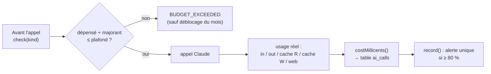

# Budget IA — convertir des tokens en euros

> **En 30 secondes** — Chaque appel Claude est facturé au **token** : entrée, sortie, lecture de cache, **écriture** de cache, et chaque recherche web. Le projet convertit ça en **millicentimes d'euro entiers**, journalise chaque appel, **refuse** l'appel suivant si « dépensé + pire cas » dépasse le plafond (10 €/mois par défaut), et alerte **une fois par mois** à 80 %.



---

## 1. Vue Macro & Utilité (le « Pourquoi »)

- **Problématique** : le Brainstormer pose beaucoup de questions à Claude (une par réponse). Sans garde-fou, une idée complexe ou une boucle de bug peut coûter cher, en silence. Constitution IV : « coût journalisé et plafonné ».
- **Emplacement dans la carte globale** : règle **domaine** (`cost.ts`, pur) + service **application** (`BudgetGuard`) appelé par la passerelle ; données dans la table `ai_calls` (disque).
- **Analogie (restauration)** : le **food cost**. Chaque plat (appel) consomme des ingrédients (tokens) à prix différents : la viande (tokens de **sortie**, 25 $/million) coûte 5× le pain (tokens d'**entrée**, 5 $/million) ; les restes réutilisés (lecture de cache) ne coûtent que 10 % ; mais **mettre en boîte** les restes pour plus tard (écriture de cache) coûte 125 % ! Le gérant vérifie la caisse **avant** de lancer une commande coûteuse (pire cas), pas après. *Là où ça boite* : en cuisine on connaît le poids avant de cuisiner ; ici on ne connaît la sortie réelle qu'après — d'où le **majorant**.

## 2. Le Pont Systémique (sous le capot)

- **D'où viennent les chiffres** : la réponse HTTP de l'API contient un objet `usage` (`input_tokens`, `output_tokens`, `cache_read_input_tokens`, `cache_creation_input_tokens`, `server_tool_use.web_search_requests`) ; `ClaudeProvider` le recopie tel quel.
- **Entiers en millicentimes** : 1 € = 100 000 millicentimes. Un appel à 0,0037 € devient **370**, un entier exact. Les sommes mensuelles se font en SQL (`SUM`) sur des entiers → pas d'erreur d'arrondi cumulée comme avec des flottants.
- **Mois local** : `monthKey(date)` = `AAAA-MM` en heure locale ; le « déblocage » manuel n'est valable que pour ce mois-là.
- **Modèle réellement servi** : avec la bascule serveur (*fallback*), Anthropic peut répondre avec un autre modèle ; on tarife `response.model`, pas le modèle configuré (règle 10).

## 3. Analyse du Code & Logique

Extrait de `src/main/domain/ai/cost.ts` et `BudgetGuard.ts` :

```ts
function pricing(input: number, output: number): ModelPricing {
  return { inputUsdPerMTok: input, outputUsdPerMTok: output,
           cacheReadUsdPerMTok: input * 0.1,     // ① lecture de cache ≈ 10 %
           cacheWriteUsdPerMTok: input * 1.25 }  // ② écriture de cache ≈ 125 % (souvent oubliée !)
}
export function costMillicents(usage: Usage, price: ModelPricing | undefined, usdEurRate: number): number {
  if (price === undefined) return 0                               // ③ IA locale : gratuite
  const usd = (usage.inputTokens * price.inputUsdPerMTok + usage.outputTokens * price.outputUsdPerMTok
             + usage.cacheReadTokens * price.cacheReadUsdPerMTok + usage.cacheWriteTokens * price.cacheWriteUsdPerMTok)
             / 1_000_000 + (usage.webSearches ?? 0) * WEB_SEARCH_USD // ④ 0,01 $ par recherche
  return Math.round(usd * usdEurRate * MILLICENTS_PER_EURO)       // ⑤ entier, en euros
}
// BudgetGuard.check : on compare au PIRE cas (entrée estimée + sortie maximale autorisée)
return { allowed: spent + estimate <= settings.capCents * MILLICENTS_PER_CENT }
```

- **Étape 1 — Fonction pure** : `costMillicents` ne lit ni base ni horloge ; testée par `cost.test.ts` avec des valeurs fixes.
- **Étape 2 — Majorant** : `estimateMaxMillicents` suppose que la sortie atteindra `max_tokens` (ex. 16 000 pour `synthetiser`) ; on bloque avant de risquer de dépasser.
- **Étape 3 — États** : `normal` → `alert` (≥ 80 %) → `blocked` (≥ plafond) ou `unlocked` (déblocage manuel du mois, via une case de confirmation dans Réglages › IA).
- **Étape 4 — Alerte unique** : `alertedMonth` mémorise le mois déjà signalé → un seul événement `ai:budgetAlert` par mois, pas un spam à chaque appel.

**Bonnes pratiques mises en évidence** : l'argent en **entiers** ; la décision coûteuse vérifiée **avant**, le coût réel enregistré **après** ; la limite `max_tokens` par tâche sert aussi de borne de coût.

## 4. Synthèse & Prochaine Étape

**À retenir (3 puces max)**
- Coût = entrée + sortie + lecture cache (10 %) + **écriture cache (125 %)** + recherches web.
- Tout est stocké en **millicentimes entiers** et sommé par mois local.
- Contrôle **avant** l'appel sur le pire cas ; alerte unique à 80 % ; blocage au plafond.

**Lien avec la suite** : où partent tous ces tokens ? Dans la croissance des idées → [[Croissance d'un neurone — arbre, garde-fous et jauge]].

**Rappel actif**
> **Q :** Pourquoi comparer « dépensé + majorant » au plafond, et pas « dépensé » seul ?
> **R :** Parce qu'un seul gros appel (16 000 tokens de sortie) pourrait faire dépasser le plafond ; on bloque le risque avant de le prendre.

> **Q :** Quelle erreur de calcul a été corrigée (règle 10) ?
> **R :** L'oubli des tokens d'écriture en cache (~1,25× l'entrée) et la tarification du modèle configuré au lieu du modèle réellement servi.

> **Q :** Pourquoi Ollama coûte-t-il 0 dans ce calcul ?
> **R :** Aucun tarif n'est défini pour un modèle local (`price === undefined`) : il tourne sur ta machine (le coût est l'électricité, pas l'API).

**Pièges fréquents**
- ⚠️ **Additionner des euros en flottants** — 0,1 + 0,2 ≠ 0,3 en binaire ; utiliser des entiers.
- ⚠️ **Croire que le cache est toujours gratuit** — la **première** écriture coûte plus cher que l'entrée normale.

**Connexions**
- [[Glossaire — Token (IA)]] — l'unité facturée.
- [[Injection de prompt — cadre figé et données balisées]] — l'ordre des blocs qui rend le cache efficace.
- [[Liens entre idées — graphe local de mots-clés]] — une stratégie pour **réduire** les tokens envoyés.


## Évolution du 30/09 — mesurer avant d'optimiser (T069)
Le journal des appels (`ai_calls`) a servi à un **bilan réel** (`scripts/ai-usage.cjs`, lecture seule) : sur deux heures de tests manuels, 107 appels Claude = 4,56 €, dont **64 %** pour la vérification web automatique des suggestions et **32 %** pour les questions suivantes sur le modèle le plus cher (JOURNAL du 29/09). Trois décisions en découlent : vérification web **à la demande** (bouton, plus rien d'automatique), questions/graines/liens sur l'**IA locale**, modèle par défaut moins cher ; les réglages déjà enregistrés sont révisés **une seule fois** (`AiConfigRepository`, révision 2), un choix fait ensuite par l'utilisateur est respecté. Leçon : le plafond protège du pire, mais seule la **répartition par tâche** dit où agir. ⚠️ Gain réel non encore re-mesuré (suivi noté dans le journal).
