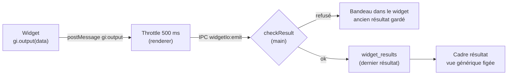

# Cadre résultat — sortie bornée, vue figée et rafales regroupées

> **En 30 secondes** — Un widget appelle `gi.output(données)`. À la **première** émission, un **cadre résultat** apparaît à sa droite, relié à lui, et affiche les données en valeur, liste, tableau ou arbre. Trois gardes : le **main** refuse tout ce qui n'est pas du JSON raisonnable (taille, profondeur, longueurs) ; l'affichage est du **code figé de l'app** qui n'écrit que du **texte** (un résultat contenant `<script>` reste une chaîne) ; et l'interface **regroupe** les rafales (au plus une écriture toutes les 500 ms, la dernière valeur).



---

## 1. Vue Macro & Utilité (le « Pourquoi »)

- **Problématique** : la note précédente ouvrait une porte **vers** le widget. Ici on ouvre une porte **depuis** lui — et c'est l'inverse du danger : ce n'est plus « que peut-il lire ? », c'est « que peut-il nous **envoyer** ? ». Trois menaces concrètes : (1) un objet énorme ou infiniment imbriqué qui fige le main ou remplit le disque ; (2) du HTML piégé qui s'exécuterait s'il était affiché naïvement (XSS — *cross-site scripting*, injection de script dans une page) ; (3) un widget **bavard** qui émet 60 fois par seconde (une animation) et martèle la base.
- **Emplacement dans la carte globale** : cadre (prélude `gi.output`) → renderer (`useWidgetBridge`, `emitThrottle.ts`) → main (`WidgetIoService.emit`, `domain/widgets/resultLimits.ts`) → base (`widget_results`, migration `0015`) → un **nouveau** cadre isolé, servi par `gi-widget://result/<bloc>`.
- **Analogie (Satisfactory)** : le widget est une **machine** au bout d'un **convoyeur**. Avant l'entrepôt, un **contrôleur de pièces** (le main) rejette les objets hors gabarit ; un **répartiteur à débit limité** (le throttle) ne laisse passer qu'un paquet par demi-seconde, en jetant les intermédiaires ; au bout, un **écran d'affichage** du fabricant (vue générique) qui ne sait afficher que des chiffres et du texte — impossible de lui faire exécuter quoi que ce soit. *Là où ça boite* : dans le jeu, les pièces jetées sont perdues pour de bon ; ici c'est voulu, seul **le dernier** résultat compte.

## 2. Le Pont Systémique (sous le capot)

**Quatre passages de frontière, quatre copies.** `gi.output` fait d'abord `JSON.parse(JSON.stringify(data))` dans le cadre : une fonction, une date ou un objet circulaire échouent **ici**, avec un bandeau immédiat. `postMessage` copie ensuite l'objet (clonage structuré) vers la carte ; l'IPC le **sérialise** vers le main ; le main le revérifie **entièrement** et le réécrit en texte JSON dans SQLite. Le cadre résultat le relit par IPC puis le reçoit par `postMessage` — **exactement le même pont** que les entrées d'un widget (`gi.onInputs`).

| Borne (`RESULT_LIMITS`) | Valeur | Ce qu'elle protège |
|-------------------------|--------|--------------------|
| JSON seul (objets simples, listes, textes, nombres **finis**, booléens, `null`) | — | pas de `NaN`/`Infinity`, pas de classe exotique (`isPlainObject` vérifie le prototype) |
| Taille sérialisée | 200 Ko (mesurée en **octets UTF-8**, `TextEncoder`) | disque, mémoire, IPC |
| Profondeur | 8 niveaux | la **pile d'appels** : la vérification est récursive (voir [[Glossaire — Parcours en profondeur (DFS)]]) |
| Nom de clé / texte | 100 / 20 000 caractères | lisibilité, colonnes de tableau |

**Pourquoi mesurer en octets et pas en caractères ?** « é » vaut 1 caractère JavaScript mais **2 octets** en UTF-8 ; un emoji, 2 caractères et 4 octets. Ce qui remplit le disque, ce sont les octets.

**Pourquoi la borne de profondeur arrête aussi une boucle ?** Un objet qui se contient lui-même (`a.self = a`) ferait tourner une récursion naïve jusqu'au dépassement de pile ; ici la descente s'arrête au 8ᵉ niveau et refuse (commentaire de `checkResult`).

**Le cadre retrouvé sans le stocker deux fois** : `widget_results` n'a **pas** de colonne `result_block_id`. Le cadre résultat est un `canvas_blocks` de `kind = 'result'` avec `source_block_id` → son widget. Une seule vérité, lue dans un sens (voir [[Glossaire — Donnée dérivée (calculer plutôt que stocker)]]).

## 3. Analyse du Code & Logique

Extraits de `WidgetIoService.emit`, `shared/widgets/genericResultView.ts` et `renderer/src/widgets/emitThrottle.ts` :

```ts
// ① Main : vérifier, garder, créer le cadre à la première émission — une transaction
emit({ blockId, versionId, data }) {
  if (widget.versionId !== versionId) throw new AppError('INVALID_STATE', '…version qui n’est plus affichée')
  const check = checkResult(data)                                   // bornes : fonction pure du domaine
  if (!check.ok) throw new AppError('VALIDATION', check.reason)     // le précédent résultat reste
  return repository.transaction(() => {
    repository.saveResult(blockId, check.json)
    const existing = blocks.resultBlockOf(blockId)
    if (existing !== undefined) return { resultBlockId: existing.id, created: false }
    return { resultBlockId: blocks.insert({ kind: 'result', x: /* à droite du widget */, sourceBlockId: blockId }).id, created: true }
  })
}

// ② Vue générique : du code FIGÉ, qui n'écrit que du texte
const el = (tag, text, className) => {
  const node = document.createElement(tag)
  if (text !== undefined) node.textContent = text                  // jamais innerHTML
  return node
}

// ③ Renderer : la première part aussitôt, puis au plus une par intervalle — la dernière
push(value) {
  if (timer !== null) { pending = { value }; return }              // rafale : on remplace l'attente
  open(); run(value)
}
```

- **Étape 1 — La version doit être celle affichée** : un résultat qui arrive d'une ancienne version (course entre un rechargement et une émission) est refusé. On ne garde que ce que produit le code **autorisé et visible**.
- **Étape 2 — Refuser = expliquer, sans perdre** : l'erreur `VALIDATION` remonte au renderer, qui envoie `gi:refused` au cadre ; le prélude affiche le motif (« Résultat refusé : plus de 8 niveaux imbriqués. »). Le résultat précédent n'est pas touché.
- **Étape 3 — Création paresseuse du cadre** : pas de cadre tant que rien n'a été émis. Supprimé par l'utilisateur (suppression douce, annulable), il est **recréé** à l'émission suivante — `resultBlockOf` ne voit que les blocs non supprimés.
- **Étape 4 — Code figé ≠ code généré** : la vue générique est écrite par nous, testée dans un vrai DOM (elle vit dans `shared/` pour être importée par les tests de l'interface **et** servie par le main), mais elle tourne **quand même** dans le bac à sable, avec la même CSP. Défense en profondeur : même si une donnée réussissait à se faire interpréter, elle serait enfermée. Au-delà de 1 000 lignes, un compteur « … et N lignes de plus » remplace le rendu.
- **Étape 5 — Le regroupement est côté interface** : la menace est un widget bavard, pas l'interface ; on coupe donc la rafale **avant** l'IPC. Détail : throttle, pas debounce — voir [[Glossaire — Throttle et debounce (regrouper des événements)]].

**Bonnes pratiques mises en évidence** : valider **à la frontière du processus de confiance** même si le cadre a déjà filtré ; **`textContent` par construction** plutôt que « échapper au bon endroit » ; bornes regroupées dans une constante du domaine, testées seules (`tests/unit/widgets/result-limits.test.ts`) ; capacité unique du cadre résultat : `widgetIo:result` refuse tout bloc qui n'est pas un `result`, et un bloc `result` ne peut pas être créé par `canvas:createBlock`.

> ⚠️ **Probable (lu, non exécuté)** — `checkResult` vérifie la taille **après** `JSON.stringify` : un objet très large (mais peu profond) est donc sérialisé entièrement avant d'être refusé. Borne raisonnable en pratique car l'IPC Electron a déjà copié l'objet — à mesurer si un widget émettait des objets de plusieurs Mo.

## 4. Synthèse & Prochaine Étape

**À retenir (3 puces max)**
- Toute sortie de code non fiable est **revérifiée dans le main** : JSON pur, taille en octets, profondeur, longueurs.
- Afficher des données étrangères = **`textContent`**, et même alors, dans le bac à sable.
- Un flux rapide se **régule avant la frontière** : throttle = au plus une par intervalle, la dernière valeur gagne.

**Lien avec la suite** : les widgets savent lire et publier ; reste à les faire **naître au bon moment** — au verrouillage, proposés par Claude → [[Outils proposés au verrouillage — créer dans la transaction, générer hors transaction]].

**Rappel actif**
> **Q :** Un widget émet `{ html: "" }`. Que s'affiche-t-il dans le cadre résultat, et pourquoi rien ne s'exécute ?
> **R :** Une ligne « html » avec le texte littéral : la vue n'écrit que par `textContent`. Et même interprété, le cadre est isolé (pas de `alert`, pas de réseau).

> **Q :** Pourquoi `widget_results` n'a-t-il pas de colonne `result_block_id` ?
> **R :** Le lien existe déjà dans l'autre sens (`canvas_blocks.source_block_id`) ; le stocker deux fois créerait un risque de désaccord entre les deux.

> **Q :** Un widget émet 100 résultats en 1 seconde. Combien d'écritures en base ?
> **R :** Environ 3 : la première immédiatement, puis une à chaque fin d'intervalle de 500 ms, avec la dernière valeur reçue.

**Pièges fréquents**
- ⚠️ **Faire confiance au prélude** — `gi.output` filtre déjà le non-JSON, mais un code hostile peut poster directement : le main revérifie tout.
- ⚠️ **Compter en caractères pour borner un stockage** — les octets UTF-8 comptent, pas `length`.
- ⚠️ **Debounce là où il faut un throttle** — un compteur qui émet sans arrêt ne s'afficherait **jamais** avec un debounce.

**Connexions**
- [[Widget branché — autorisation par empreinte et pont postMessage]] — même pont, sens inverse ; le cadre résultat hérite de l'autorisation de son widget.
- [[Zod ↔ type guards et sortie structurée]] — même idée (valider une donnée étrangère), écrite ici à la main car il faut borner la **profondeur** et les **octets**.
- [[Annuler par lot — journal avant-après, conflit et lot inverse]] — supprimer un cadre résultat est annulable.

## Évolution du 04/10 — le même réflexe pour le chat
Les réponses de Claude dans le chat sont rendues en Markdown (`react-markdown` + `remark-gfm`) **sûr par construction** : `skipHtml` (aucun HTML brut interprété), filtre d'URL (`javascript:` neutralisé), liens ouverts hors de l'app (https seulement), images jamais chargées. Les aperçus des cartes de permission et la visionneuse de fichiers (coloration `highlight.js`, sans `innerHTML`) suivent la même règle que `textContent` ici : **afficher, jamais interpréter**.
