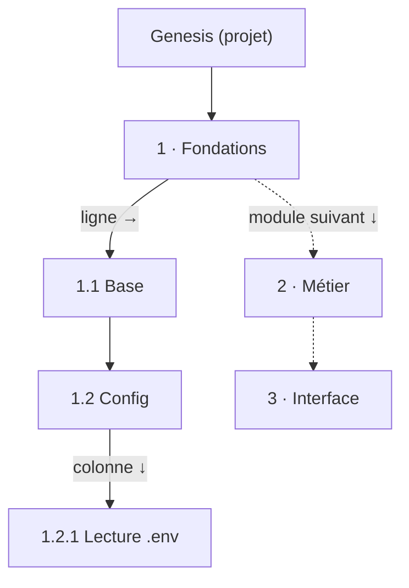

# Carte de structure ordonnée — ordre de progression, tri par dépendances et disposition alternée

> **En 30 secondes** — La carte de structure d'un projet (modules → sous-éléments) ne dit pas seulement **ce qui existe**, elle dit **dans quel ordre l'attaquer**. Entre frères, l'ordre vient de Claude s'il l'a donné, sinon des **dépendances** (ce dont les autres dépendent passe d'abord), sinon de l'ordre du dessin. Chaque élément reçoit un **numéro** (1, 1.2, 1.2.1) et la carte se dessine en **alternance** : niveau impair en ligne, niveau pair en colonne, chaque sous-arbre dans sa boîte, donc **rien ne se chevauche**.



---

## 1. Vue Macro & Utilité (le « Pourquoi »)

- **Problématique** : avant D17, la carte de structure posait les éléments dans l'ordre où Claude les avait dessinés, en grille. Deux défauts : on ne savait pas **par où commencer** à lire ou à coder, et des sous-arbres profonds se **chevauchaient**. Mentalyas voulait lire la carte « comme un chemin ».
- **Emplacement dans la carte globale** : 100 % **renderer**, en **fonctions pures** (`canvas/structureOrder.ts` pour l'ordre et les numéros, `canvas/structureGraph.ts` pour les positions et les liens). Le main ne fait que stocker un **rang** (`ordre`, 1–999, passé par l'outil MCP `structure_dessiner`) et le rétablir à l'annulation d'un lot (Historique).
- **Analogie (cuisine)** : une brigade prépare un menu. Le **chef** peut imposer l'ordre (le rang de Claude). Sinon on suit la **logique des recettes** : le fond de sauce avant la sauce, la sauce avant le dressage (les dépendances). S'il n'y a aucune contrainte, on garde l'**ordre du bon de commande** (le dessin). *Où ça boite* : en cuisine, deux préparations qui s'attendent mutuellement n'existent pas ; dans un code, un **cycle** d'appels est fréquent — l'algorithme doit donc choisir sans bloquer.

## 2. Le Pont Systémique (sous le capot)

| Étape | Où | Ce qui se passe en machine |
|-------|----|----------------------------|
| Lire | IPC → renderer | Éléments (`ElementView`, avec `parentId`, `order`), liens de Claude (`depend_de`, `appelle`…), **appels mesurés** par l'analyse statique |
| Ordonner | `progression()` | Des `Map` en mémoire vive : `byId`, `before` (qui doit précéder qui), `children` ; aucun accès disque ni réseau |
| Numéroter | récursion | Une pile d'appels par niveau (parcours en profondeur) ; une chaîne `"1.2.1"` par élément |
| Placer | `structureGraph()` | Récursion qui **remonte** la taille de chaque sous-arbre ; les coordonnées sont des nombres, React Flow ne fait qu'afficher |

Même entrée → même dessin : la fonction n'a ni hasard ni horloge. La carte ne « saute » pas entre deux rendus, et les tests vérifient des positions exactes sans lancer Electron.

## 3. Analyse du Code & Logique

**Bloc 1 — Remonter une dépendance sur les frères** (`structureOrder.ts`)

```ts
const require = (first: string, then: string): void => {
  const a = chainOf(first)            // ① chaîne d'ancêtres : [module, sous-élément, …, first]
  const b = chainOf(then)
  for (let level = 0; level < Math.min(a.length, b.length); level++) {
    const x = a[level] as string
    const y = b[level] as string
    if (x === y) continue             // ② même ancêtre à ce niveau : descendre
    if (byId.get(x)?.parentId === byId.get(y)?.parentId)
      before.set(y, (before.get(y) ?? new Set()).add(x))   // ③ premiers ancêtres différents ET frères : x avant y
    return
  }
}
```
Un lien entre deux **petits-enfants** de modules différents (« `Order.cs` appelle `Db.cs` ») devient une contrainte entre les **modules** qui les contiennent (« Données avant Métier »). Sens des relations : `a depend_de b`, `a appelle b`… → **b d'abord** ; `a bloque b` → **a d'abord** ; un appel mesuré → l'appelé d'abord.

**Bloc 2 — Trier les frères : trois niveaux de priorité** (`ordered`)

```ts
const numbered = siblings.filter((e) => e.order !== null)
  .sort((a, b) => (a.order ?? 0) - (b.order ?? 0) || byDrawing(a, b))   // ① rang de Claude
const rest = siblings.filter((e) => e.order === null).sort(byDrawing)
while (pending.size > 0) {
  const ready = rest.find((e) => pending.has(e.id) &&
    [...(before.get(e.id) ?? [])].every((first) => !pending.has(first))) // ② tous ses prérequis placés ?
  const next = ready ?? rest.find((e) => pending.has(e.id))              // ③ cycle : le premier dessiné passe
  pending.delete(next.id); result.push(next)
}
return [...numbered, ...result]
```
C'est un **tri topologique stable** : parmi les éléments prêts, on prend toujours le **premier dans l'ordre du dessin** (la variante « on choisit toujours le prêt le plus prioritaire » de [[Glossaire — Tri topologique de Kahn]]). Coût O(n²) par fratrie — négligeable pour quelques dizaines de frères, et plus simple qu'une file de priorité. Le **repli sur cycle** garantit que la boucle se termine toujours : on ne refuse pas la carte, on choisit.

**Bloc 3 — Numéroter : parcours en profondeur préfixe**

`number(parentId, prefix)` donne `prefix.(index+1)` à chaque enfant puis **descend** dans cet enfant avant de passer au frère suivant. Les racines sont les `parentId` absents des éléments (les genesis). Résultat : `1`, `1.1`, `1.1.1`, `1.2`, `2`… — la numérotation d'un sommaire.

**Bloc 4 — Disposer : boîtes englobantes récursives** (`structureGraph.ts`)

```ts
const layout = (element, depth, x, y): { width: number; height: number } => {
  placed.push({ element, depth, x: x + W / 2, y: y + H / 2 })
  if (depth % 2 === 1) {            // niveau impair : enfants EN LIGNE à droite
    let cursor = x + W + SPACING.across
    for (const kid of kids) { const box = layout(kid, depth + 1, cursor, y); cursor += box.width + SPACING.across; height = Math.max(height, box.height) }
  } else {                          // niveau pair : enfants EN COLONNE dessous
    let cursor = y + H + SPACING.down
    for (const kid of kids) { const box = layout(kid, depth + 1, x, cursor); cursor += box.height + SPACING.down; width = Math.max(width, box.width) }
  }
  return { width, height }          // la taille du sous-arbre remonte au parent
}
```
Chaque enfant est posé **après la boîte entière** de son frère précédent (`cursor += box.width`) : c'est ce qui rend le chevauchement **impossible par construction**, sans détection de collision. L'alternance garde la carte compacte dans les deux directions. Les modules descendent sous le genesis, avec un espace en plus entre deux modules (`SPACING.module`).

**Bloc 5 — La hiérarchie se lit comme un chemin**

Au lieu d'une flèche du parent vers **chaque** enfant (un éventail), `chain()` trace parent → **premier** enfant, puis chaque frère → le **suivant**. L'œil suit 1 → 1.1 → 1.2 comme un itinéraire.

**Bonnes pratiques mises en évidence** : séparer **calcul** (pur, testé : `structure-order`, `structure-graph`) et **affichage** ; stocker la **décision humaine ou de Claude** (le rang) et **calculer** le reste (voir [[Glossaire — Donnée dérivée (calculer plutôt que stocker)]]) ; bornes anti-boucle infinie (`guard < 100`) même sur des données censées être un arbre.

> 🐞 **Correctif lié (bug signalé par mentalyas)** : un nœud affichait « 3 fichiers » quand son volet en listait 37. Le nœud comptait les **chemins** donnés par Claude (un dossier en couvre beaucoup), le volet les **fichiers**. Leçon : deux compteurs différents ne doivent pas porter le même mot — le nœud dit maintenant « N chemins », le volet « Fichiers (37) dans N chemins ».

## 4. Synthèse & Prochaine Étape

**À retenir (3 puces max)**
- Ordre entre frères : **rang de Claude**, sinon **dépendances** (tri topologique stable, cycle → ordre du dessin), sinon **dessin** ; une dépendance entre descendants remonte sur leurs ancêtres frères.
- Numéros = **parcours en profondeur préfixe** (1, 1.2, 1.2.1).
- Disposition = **boîtes récursives** alternant ligne / colonne : pas de chevauchement par construction.

**Lien avec la suite** : cette carte du Brainstormer servira de support à l'Analyste interne (spec 019) — ses propositions s'y accrochent en badges → [[Sonde sans contenu — télémétrie minimisée, empreintes HMAC et pseudonymes]].

**Rappel actif**
> **Q :** Dans le module « Métier », `Order.cs` appelle `Db.cs` du module « Données ». Quels éléments la contrainte d'ordre relie-t-elle ?
> **R :** Les deux **modules** : on remonte les chaînes d'ancêtres jusqu'au premier niveau où elles diffèrent ; ces ancêtres sont frères (enfants du genesis) → « Données » avant « Métier ».

> **Q :** A dépend de B et B dépend de A, aucun rang donné. Que fait l'algorithme ?
> **R :** Aucun des deux n'est « prêt » : le repli prend le **premier dessiné**, puis l'autre devient prêt. La boucle termine toujours.

> **Q :** Pourquoi deux sous-arbres ne peuvent-ils jamais se chevaucher ?
> **R :** Parce que la récursion renvoie la **taille complète** de chaque sous-arbre et que le frère suivant est posé après cette boîte.

**Pièges fréquents**
- ⚠️ **Confondre ordre et hiérarchie** — le numéro 1.2 dit « deuxième étape dans le module 1 », pas « enfant de 1.1 ».
- ⚠️ **Rejeter un graphe cyclique** — utile pour un plan à exécuter ([[Plan d'attaque — étapes ordonnées, dépendances sans cycle et verrou]]), inutile pour une carte à lire : ici on choisit un ordre raisonnable.
- ⚠️ **Le même mot pour deux mesures** — « fichiers » vs « chemins » (correctif ci-dessus).

**Connexions**
- [[Glossaire — Tri topologique de Kahn]] — la version stable, avec repli sur cycle.
- [[Glossaire — Parcours en profondeur (DFS)]] — numérotation préfixe.
- [[Explorateur de code — du module au bloc, appelants et appelés]] — même idée de **remonter** un lien sur l'ancêtre visible (agrégation).
- [[Plan d'attaque — étapes ordonnées, dépendances sans cycle et verrou]] — l'autre disposition pure de l'app (`planLayout`).
