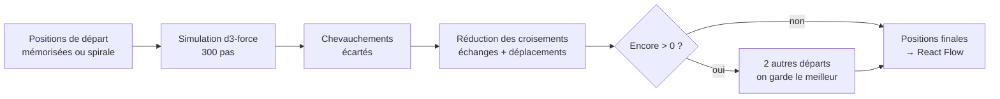

# Carte des idées — simulation de forces et croisements de liens

> **En 30 secondes** — Placer 100 idées et 50 liens « joliment » à la main est impossible. On laisse une **physique simulée** trouver un équilibre : les idées se **repoussent** comme des aimants, les liens les **rapprochent** comme des ressorts, chaque idée est **retenue dans sa zone** (incubateur à gauche, réseau à droite). Puis une deuxième passe, purement géométrique, **échange ou déplace** des idées tant que le nombre de traits qui se croisent diminue.



---

## 1. Vue Macro & Utilité (le « Pourquoi »)

> 📘 **Introduction (ajoutée)** — **C'est quoi ?** Un **graphe** = des points (*nœuds* : les idées) reliés par des traits (*arêtes* : les liens). Le **dessin de graphe** (*graph drawing*) cherche des positions lisibles. **Comment ça marche ?** La méthode la plus répandue est **dirigée par les forces** (*force-directed*) : on traite le dessin comme un système physique et on laisse le calcul converger vers un état de faible « énergie ». `d3-force` est la bibliothèque qui simule cette physique ; **React Flow** (`@xyflow/react`) ne fait que **dessiner** et rendre la toile interactive (zoom, déplacement, clavier).

- **Problématique** : mentalyas veut une carte **organique** et exige que **les liens ne se croisent pas**. Or une simulation physique seule laisse souvent des croisements, et certains réseaux **ne peuvent pas** être dessinés sans croisement (graphe *non planaire*).
- **Emplacement dans la carte globale** : 100 % **interface** (`src/renderer/src/canvas/`), mais en **fonctions pures** : ni React, ni DOM, ni IPC — des nombres en entrée, des positions en sortie.
- **Analogie (Satisfactory)** : tu poses tes machines (idées) ; les **tapis roulants** (liens) tirent les machines reliées l'une vers l'autre ; deux machines ne peuvent pas occuper la même case (collision) ; chaque machine reste dans **son atelier** (zone). Ensuite tu fais le tour de l'usine : « si j'intervertis ces deux assembleurs identiques, est-ce que j'ai moins de tapis qui se croisent ? » — oui → tu gardes, non → tu remets. *Où ça boite* : dans le jeu, on peut superposer des tapis sur deux étages ; ici, un croisement est toujours visible.

## 2. Le Pont Systémique (sous le capot)

- **Un « pas » de simulation (`tick`)** : pour chaque idée, d3 additionne des vitesses : **répulsion** entre toutes les paires (charge −40, approximée par un arbre *Barnes-Hut* pour ne pas calculer n² paires exactes), **ressort** de 120 px par lien, **rappel** doux vers le centre de la zone (force x/y 0,06), **collision** (rayon d'encombrement). Puis il applique un frottement et déplace. 300 pas = 300 boucles CPU sur des tableaux de nombres en RAM — **0,2 s** pour 100 idées (mesuré, JOURNAL).
- **Déterministe** : d3 utilise du hasard pour départager deux idées superposées. Ici il reçoit un **générateur à graine** (`lcg(42)`) : mêmes entrées → mêmes positions, donc tests reproductibles et carte qui ne « saute » pas. Voir [[Glossaire — Générateur pseudo-aléatoire à graine (PRNG)]].
- **Pas de simulation quand tout est connu** : si toutes les idées ont une position mémorisée (`fresh === 0`), 0 pas de physique — la carte reste telle que l'utilisateur l'a laissée.
- **Test géométrique d'intersection** : deux segments [p1 p2] et [p3 p4] se croisent si p3 et p4 sont de **part et d'autre** de la droite (p1 p2) **et** réciproquement. « De quel côté ? » = signe d'un **produit vectoriel** 2D (`orientation`) : une multiplication, une soustraction — aucune trigonométrie.
- **Coût local** : lors d'un échange u ↔ v, seuls les liens qui touchent u ou v peuvent changer. On ne recalcule que ceux-là (`localCost`) au lieu de tout le graphe.

## 3. Analyse du Code & Logique

```ts
// crossings.ts — « de quel côté de la droite AB se trouve C ? » (produit vectoriel)
function orientation(a: Point, b: Point, c: Point): number {
  const value = (b.x - a.x) * (c.y - a.y) - (b.y - a.y) * (c.x - a.x)
  return Math.abs(value) < EPSILON ? 0 : value > 0 ? 1 : -1   // ① gauche, droite ou aligné
}
export function segmentsCross(p1, p2, p3, p4): boolean {
  return orientation(p1, p2, p3) * orientation(p1, p2, p4) < 0   // ② p3 et p4 de part et d'autre
      && orientation(p3, p4, p1) * orientation(p3, p4, p2) < 0   //    ET p1 et p2 aussi
}

// reduceCrossings — amélioration gloutonne (on n'accepte que ce qui améliore)
const before = localCost(graph, u, v)
swap(u, v)                                           // ③ essayer l'échange
if (localCost(graph, u, v) < before) improved = true
else swap(u, v)                                      // ④ pas mieux → on annule
```

- **Étape 1 — Départ** : position mémorisée si elle est encore dans la bonne zone ; sinon **spirale** au centre (angle `2,399963` rad = angle d'or : les points ne s'alignent jamais).
- **Étape 2 — Physique** puis `resolveOverlaps` : passe déterministe qui écarte les paires encore trop proches.
- **Étape 3 — Échanges** entre idées **interchangeables** (même zone, même encombrement — échanger une grosse et une petite créerait un chevauchement).
- **Étape 4 — Déplacements** : une idée encore fautive essaie chaque case libre d'un quadrillage (demi-cellule) et garde la meilleure.
- **Étape 5 — Redémarrages** : si le coût n'est pas nul, jusqu'à 2 autres départs (spirale tournée) ; on garde le **minimum**. Résultat mesuré : 0 croisement sur arbres et groupes, et même sur 50 liens aléatoires entre 40 idées.

**Bonnes pratiques mises en évidence** : algorithme en **fonction pure** (testé sans navigateur, `tests/unit/ui/{layout,crossings}.test.ts`) ; calcul relancé **seulement** quand une idée ou un lien change, jamais au zoom ; « zéro » reconnu comme **parfois impossible** (vérifié avec networkx) → on vise le minimum trouvé, pas une promesse fausse.

> ⚠️ **Probable** — l'optimisation est **gloutonne** (elle n'accepte que des améliorations immédiates) : elle peut s'arrêter dans un **minimum local** (aucun échange simple n'aide, mais un réarrangement complet aiderait). Les redémarrages limitent ce risque sans l'annuler.

## 4. Synthèse & Prochaine Étape

**À retenir (3 puces max)**
- Disposition **dirigée par les forces** : répulsion + ressorts + collision + zone, jusqu'à l'équilibre.
- Hasard **à graine** = résultat reproductible ; pas de physique quand toutes les positions sont connues.
- Croisements : test par **produit vectoriel**, puis recherche locale gloutonne (échanger / déplacer si ça améliore).

**Lien avec la suite** : double-clic sur une idée → on quitte la carte pour une disposition beaucoup plus simple : [[Plongée radiale — couronne sur un arc et affichage optimiste]].

**Rappel actif**
> **Q :** Pourquoi ne pas simplement lancer la simulation plus longtemps pour supprimer les croisements ?
> **R :** La physique minimise une énergie (distances), pas le nombre de croisements ; et un graphe non planaire en aura toujours. Il faut une passe dédiée qui compte les croisements.

> **Q :** Comment sait-on, sans trigonométrie, que deux segments se croisent ?
> **R :** Signe du produit vectoriel : chaque segment doit avoir les deux extrémités de l'autre de part et d'autre de sa droite.

> **Q :** Pourquoi n'échanger que des idées de même encombrement ?
> **R :** Un échange entre tailles différentes pourrait créer un chevauchement ; entre tailles égales, les places restent valides.

**Pièges fréquents**
- ⚠️ **`Math.random()` dans une disposition** — la carte change à chaque rendu et les tests deviennent aléatoires.
- ⚠️ **Nœuds React Flow sans poignées** — les liens deviennent invisibles (bug rencontré : poignées invisibles au centre).

**Connexions**
- [[Liens entre idées — graphe local de mots-clés]] — d'où viennent les liens dessinés.
- [[Glossaire — Générateur pseudo-aléatoire à graine (PRNG)]] — le hasard reproductible.
- [[TanStack Query et Zustand ↔ cache de données et état d'interface]] — quand la carte est recalculée.


## Évolution du 30/09 — une seule carte, une physique pour tout
> ⚠️ **Correction du 30/09** — Cette note décrit deux **zones** (incubateur à gauche, réseau à droite) et une force de rappel « vers le centre de la zone ». Depuis les décisions du 29/09 (FR-029 à FR-035, JOURNAL), **les zones n'existent plus** : toutes les idées partagent un seul espace (`ZoneNode` supprimé). Le principe forces + réduction des croisements reste valable.

- **Taille = niveau de contexte** : 5 paliers (brute → éclose) au lieu d'une zone par état.
- **Un seul moteur physique** (`physics.ts`, `useCanvasPhysics.ts`) pour idées, sous-neurones, textes et blocs : pendant un glisser, les voisins s'écartent en direct ; l'objet lâché est **épinglé** (mémorisé en base, migration `0008`).
- **Limite assumée** : la disposition sans croisement sert de point de départ ; une fois que la physique a déplacé des objets, le zéro croisement n'est plus garanti (arbitrage validé).
- **Nouveaux objets sur la carte** : notes et widgets, créés par clic droit dans le vide (`ToolMenu.tsx`), bornes de taille vérifiées **par le main** (`BLOCK_LIMITS`) → [[Bac à sable des widgets — iframe isolée, origine opaque et protocole gi-widget]]. Une idée « supprimée » est archivée → [[Glossaire — Suppression douce (soft delete)]].

## Évolution du 30/09 (soir) — la prochaine étape devient un objet de la carte
- Chaque idée qui a un document affiche sa **prochaine étape** : étiquette en flèche, reliée par un trait pointillé, déplaçable, **non modifiable**. Le texte n'est **pas stocké** — il est lu dans le document (`nextStepOf`) ; seule sa **place** l'est, et seulement si elle a été glissée (`idea_steps`, migration `0013`) → [[Glossaire — Donnée dérivée (calculer plutôt que stocker)]].
- « Brainstormer cette étape » crée une nouvelle idée de départ par les canaux existants (`neuron:create`, `links:create`). Correctif du soir : le trait vers la nouvelle idée est **dessiné depuis l'étiquette de l'étape** tant qu'elle est affichée (`buildGraph.ts`) ; **affichage seulement** — le lien en base reste entre les deux idées (graines, Historique inchangés).
- L'idée de départ devient un **hexagone** à couleur réservée ; les outils créés à l'éclosion sont placés autour d'elle sans recouvrement par un balayage déterministe (`placeTools`), pas par la simulation de forces → [[Outils proposés au verrouillage — créer dans la transaction, générer hors transaction]].

## Évolution du 06/10 — la place choisie à la main prime
La « physique dominante » repoussait toutes les idées pendant et après un glisser. Nouvelle règle (`physics.ts`, `useCanvasPhysics.ts`) : une idée **déjà posée** est **fixe** ; la simulation ne place que les nouvelles idées et celle que mentalyas **libère**, qui se fige de nouveau au repos. Règle apprise (JOURNAL) : une physique vivante plaît pour explorer et gêne pour ranger. Même philosophie que le plan d'attaque : place **calculée**, geste de l'humain **stocké** — [[Plan d'attaque — étapes ordonnées, dépendances sans cycle et verrou]].
