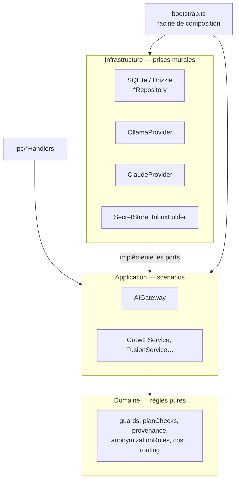

# Clean Architecture — domaine, application, infrastructure

> **En 30 secondes** — `src/main` est rangé en cercles : le **domaine** (règles pures : jauge, anonymisation, coût, tri de Kahn), l'**application** (scénarios : croître, synthétiser, éclore), l'**infrastructure** (SQLite, Ollama, Claude, fichiers). Les cercles intérieurs **ne connaissent pas** les extérieurs : ils parlent à des **interfaces** (ports) branchées au démarrage dans `bootstrap.ts`. Résultat : 305 tests sans réseau.



---

## 1. Vue Macro & Utilité (le « Pourquoi »)

> 📘 **Introduction (ajoutée)** — **C'est quoi ?** La *Clean Architecture* (architecture propre, Robert C. Martin) organise le code en couches concentriques où **les dépendances pointent toujours vers l'intérieur** : le cœur métier ignore la base de données, le framework et le réseau. **Comment ça marche ?** Le cœur déclare ce dont il a besoin sous forme d'**interfaces** (*ports*) ; l'extérieur fournit des **implémentations** (*adaptateurs*) ; une **racine de composition** les assemble au démarrage — c'est l'**injection de dépendances** (on *donne* ses outils à un objet au lieu qu'il les fabrique lui-même).

- **Problématique** : si `GrowthService` créait lui-même un client Claude, chaque test coûterait de l'argent, dépendrait d'Internet et serait non déterministe. Et remplacer Ollama par un autre moteur obligerait à toucher la logique métier.
- **Emplacement dans la carte globale** : l'**organisation interne du processus main**, entre l'IPC (entrée) et le disque/réseau (sortie).
- **Analogie (multiprise)** : le **domaine** est l'appareil (il sait chauffer, compter, trier). Le **port** est la **forme de la fiche** (l'interface `AIProvider` : `isAvailable()`, `complete()`). L'**adaptateur** est la **prise murale** (Ollama, Claude, ou `FakeProvider` pour les tests). `bootstrap.ts` est l'**électricien** qui branche tout au démarrage. L'appareil se moque de savoir si la prise est reliée au nucléaire ou au solaire. *Là où ça boite* : une vraie fiche ne vérifie pas le courant ; ici l'`AIGateway` vérifie tout ce qui revient (schéma Zod).

## 2. Le Pont Systémique (sous le capot)

- **Au démarrage** (`bootstrap()`), le main instancie **une seule fois** chaque objet dans le tas mémoire (*heap*) : `SecretStore`, base, `AIGateway`, services. Les services reçoivent des **références** vers ces objets (pas des copies) : un seul pool de connexions SQLite, un seul sémaphore Ollama.
- **Dépendance circulaire résolue par référence différée** : `NeuronService` a besoin de la passerelle, et la file locale de la passerelle a besoin de `NeuronService` pour rejouer une catégorisation. Solution lue dans le code : `const neuronsRef: { current?: NeuronService } = {}` — une « boîte » remplie juste après.
- **Horloge et hasard injectés** : `now: () => new Date()` est passé en dépendance ; un test peut fixer la date (budget du mois) sans toucher à l'horloge système.

## 3. Analyse du Code & Logique

Le port (application) et son usage — `src/main/application/ai/AIProvider.ts` :

```ts
/** Stratégie par moteur. Seul AIGateway l'utilise. */
export interface AIProvider {
  readonly id: Engine                                  // 'ollama' | 'claude'
  isAvailable(): Promise<ProviderStatus>
  complete<T>(request: CompletionRequest<T>): Promise<CompletionResponse<T>>
  research?(request: ResearchRequest): Promise<ResearchResponse> // optionnel : seul Claude sait chercher
}
```

Un service ne reçoit que des dépendances (extrait de `bootstrap.ts`) :

```ts
const growth = new GrowthService({
  repository: growthRepository,          // adaptateur SQLite
  neurons,                               // autre service
  gateway: ai.gateway,                   // passerelle IA
  emit: (event) => broadcast(event.type, event) // sortie vers l'écran, sous forme de simple fonction
})
```

- **Étape 1 — Le domaine est pur** : `domain/neurons/guards.ts` n'importe rien d'Electron, de Drizzle ni du SDK. Une fonction comme `applyGaugeFloor(level, answered)` se teste en une ligne.
- **Étape 2 — L'application orchestre** : `GrowthService` enchaîne « enregistrer la réponse → annoncer → appeler l'IA → filtrer » sans savoir *comment* on stocke ni *qui* répond.
- **Étape 3 — L'infrastructure implémente** : `OllamaProvider` et `ClaudeProvider` implémentent `AIProvider` ; les `*Repository` encapsulent Drizzle.
- **Étape 4 — Les tests branchent un faux** : `tests/support/FakeProvider.ts` implémente le même port avec des réponses scriptées et enregistre les requêtes reçues — on peut vérifier *ce qui aurait été envoyé à Claude*.

**Bonnes pratiques mises en évidence** : principe VI « pas d'abstraction sans deuxième usage réel » — le port `AIProvider` a **trois** implémentations réelles (Ollama, Claude, Fake), il est donc justifié ; nommage des tests `should_<comportement>_when_<condition>`.

## 4. Synthèse & Prochaine Étape

**À retenir (3 puces max)**
- Les dépendances pointent vers l'intérieur : domaine ← application ← infrastructure.
- Un service **reçoit** ses outils (injection) ; il ne les fabrique pas.
- `bootstrap.ts` est le seul endroit qui connaît toutes les classes concrètes.

**Lien avec la suite** : premier adaptateur d'infrastructure, le stockage → [[Stockage local chiffré — SQLite, SQLCipher et DPAPI]].

**Rappel actif**
> **Q :** Pourquoi `emit` est-il passé comme une simple fonction à `GrowthService` ?
> **R :** Pour que le service ignore Electron (`BrowserWindow`) : en test, on passe une fonction qui enregistre les événements dans un tableau.

> **Q :** Qu'est-ce qu'un « port » ici, concrètement ?
> **R :** Une interface TypeScript déclarée côté application (ex. `AIProvider`, `BudgetGuard`, `Anonymizer`) que l'infrastructure implémente.

> **Q :** Quel avantage direct pour les 305 tests ?
> **R :** Aucun appel réseau réel ni coût : moteurs remplacés par `FakeProvider`, base SQLite de test, horloge fixée.

**Pièges fréquents**
- ⚠️ **Importer un repository dans le domaine** — le domaine deviendrait dépendant de la base : on perd la testabilité pure.
- ⚠️ **Créer une interface pour tout** — sans deuxième implémentation réelle, c'est de la sur-abstraction (YAGNI).

**Connexions**
- [[Passerelle IA hybride — un seul point d'accès à l'IA]] — l'orchestrateur qui utilise le port `AIProvider`.
- [[Drizzle ORM ↔ SQL paramétré et migrations]] — ce que cachent les adaptateurs `*Repository`.

## Évolution du 07/10 (soir) — la règle de dépendance devient un outil de lecture
Cette note décrivait l'architecture **de l'app**. Depuis la spec 017 D20, l'app **vérifie la même règle sur les projets des autres** : chaque architecture connue (Clean, hexagonale, MVVM, MVC, en couches) est réduite à des **couches avec une profondeur** (Clean : présentation et infrastructure = 1, application = 2, domaine = 3), et toute dépendance d'une couche **plus profonde** vers une **moins profonde** est tracée en rouge, « ⚠ sens interdit ». C'est exactement le piège « importer un repository dans le domaine » cité plus haut, rendu **visible**. Détail → [[Vue Architecture — règle de dépendance, couches déduites et deux dispositions pures]]. Au passage, le fichier du catalogue (`src/shared/structure/architecture.ts`) est **partagé** main + interface : une fonction pure n'appartient à aucun processus.
