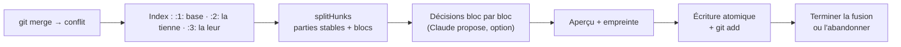

# Conflit de fusion — trois versions lues dans l'index, blocs à décider et aperçu validé

> **En 30 secondes** — Quand deux historiques ont modifié **les mêmes lignes**, git s'arrête et écrit des marqueurs `<<<<<<<` dans le fichier. L'app ne lit **pas** ce fichier abîmé : elle demande à git les **trois versions propres** (base commune, la tienne, la leur), refait elle-même le découpage, et ne te montre que les **blocs qui divergent**. Pour chacun : la tienne, la leur, les deux, la proposition de Claude ou ton texte. Tu valides le fichier **sur l'aperçu que tu as vu**.



---

## 1. Vue Macro & Utilité (le « Pourquoi »)

> 📘 **Introduction (ajoutée)** — **C'est quoi, l'index de git ?** La « zone de préparation » : la liste de ce qui partira au prochain commit, stockée dans `.git/index`. **Pendant un conflit**, l'index garde pour chaque fichier en conflit jusqu'à **trois entrées numérotées** (des *stages*) : `1` = l'ancêtre commun, `2` = ta version (*ours*), `3` = la leur (*theirs*). `git cat-file blob :2:chemin` lit la version 2 telle quelle.

- **Problématique** : le fichier à marqueurs est **ambigu** (un fichier peut contenir `=======` pour de vrai, des marqueurs imbriqués) et **ne garde pas la base** par défaut. Pour expliquer « qui a changé quoi », il faut les trois versions intactes. Et un conflit est un moment où l'on valide vite : il faut empêcher de valider **autre chose** que ce qu'on a lu.
- **Emplacement dans la carte globale** : `SyncService.merge` (fusion confirmée) → conflits → `ConflictService` (application) → `splitHunks` (domaine, pur) → `GitConflictTask` (IA) → `ConflictView.tsx`. Sessions et décisions en base (`GitRepository`), **effacées** à la fin.
- **Analogie (cuisine)** : deux cuisiniers ont modifié la même recette de base. Ce qui n'a changé que chez l'un est pris d'office (le sel ajouté par A, la cuisson raccourcie par B). Seule l'étape modifiée **par les deux** remonte au chef (toi), avec la fiche d'origine, celle de A et celle de B côte à côte. Un commis (Claude) peut proposer une version qui concilie — le chef goûte et tranche.

## 2. Le Pont Systémique (sous le capot)

- **Lecture** : `git ls-files -u -z` liste les entrées en conflit (`<mode> <empreinte> <stage>\t<chemin>`, séparées par l'octet nul). Pour chaque fichier, trois `cat-file blob :N:chemin` bornés à **1 Mo** (`maxOutput`) ; un octet nul dans le contenu → **binaire** → choix du fichier entier (`checkout --ours|--theirs`).
- **Calcul** : `splitHunks` fait **deux diffs ligne à ligne** (base→tienne, base→leur) en mémoire, puis avance trois curseurs en parallèle. Tout reste dans le **tas** (heap) du processus main ; rien n'est écrit tant que tu n'as pas validé.
- **Écriture** : l'aperçu validé est écrit dans un fichier temporaire, puis **renommé** sur le fichier réel (`writeFileSync` + `renameSync`) — l'éditeur ou l'app de dev ne voit jamais un fichier à moitié écrit. Puis `git add -- chemin` dit à git « résolu ».
- **Fin** : `git diff --name-only --diff-filter=U` doit être vide → `git commit` (message par défaut ou le tien par stdin). Sinon « Abandonner » → `git merge --abort`.

## 3. Analyse du Code & Logique

**Bloc 1 — Les trois curseurs** (`domain/git/splitHunks.ts`, pur)
```ts
// Région stable : la même ligne de base, intacte des deux côtés.
while (b < base.length && toOurs[b] === o && toTheirs[b] === t) { stable.push(ours[o]); b++; o++; t++ }
```
`toOurs[b]` = « où est passée la ligne `b` de la base dans ta version » (-1 : modifiée ou supprimée). Tant que la ligne est intacte des deux côtés, elle est **stable**. Dès qu'un côté diverge, on avance jusqu'au prochain point d'accord : si **un seul** côté a changé, on prend son texte d'office (comme git) ; si **les deux**, on crée un bloc `conflict` avec `base`, `ours`, `theirs`. Fichier trop différent pour le détail → **un seul bloc** (honnête plutôt que faux).

**Bloc 2 — Claude propose, dans un cadre balisé** (`GitConflictTask.ts`)
```ts
const TAG = /<\s*\/?\s*(fichier|bloc|base|la_tienne|la_leur|avant|apres|commits)\b[^>]*>/giu
const guard = (text) => text.replace(TAG, (tag) => `<\\${tag.slice(1)}`)   // une balise cachée dans le code est neutralisée
export const GIT_CONFLICT_LIMITS = { chars: 200_000, hunks: 30, commits: 5, context: 15 }
```
Le code d'un collègue est une **donnée** : une balise `</la_leur>` glissée dedans ne ferme rien. Au-delà de 30 blocs ou 200 000 caractères → `null` : on résout à la main. Les auteurs des commits sont **pseudonymisés** (« Auteur A »). Projet « Local uniquement » → rien n'est envoyé. La réponse (Zod `GitConflictOut`) porte `explanation`, `risk`, `confidence: 'sure' | 'check'` ; une proposition qui contient encore des marqueurs est écartée (`hasMarkers`).

**Bloc 3 — Valider ce qu'on a vu** (`resolveFile`)
```ts
if (view.previewHash !== expectedPreviewHash) throw …     // l'aperçu a changé depuis ton clic
if (hasMarkers(view.preview)) throw …                      // un bloc non décidé garde ses marqueurs
writeFileSync(temporary, view.preview, 'utf8'); renameSync(temporary, full)
```
L'interface renvoie l'**empreinte** de l'aperçu affiché ; le main recalcule et compare. Si une décision a changé entre-temps (autre fenêtre, proposition arrivée), la validation est refusée.

**Bloc 4 — Rien ne reste** : à la fin (commit ou abandon), propositions et décisions sont **supprimées** de la base — le code d'un collègue n'a pas à vivre dans ton profil.

**Bonnes pratiques mises en évidence** : lire la **source de vérité** (l'index) plutôt qu'un rendu dérivé (le fichier à marqueurs) ; algorithme **pur** testé à part ; l'IA propose bloc par bloc, l'humain valide fichier par fichier.

## 4. Synthèse & Prochaine Étape

**À retenir (3 puces max)**
- Les trois versions d'un conflit sont dans l'**index** (`:1:`, `:2:`, `:3:`) ; le fichier à marqueurs n'est qu'un affichage.
- Ce qui n'a changé que d'un côté se prend d'office ; seul le **double changement** est une décision.
- Valider = valider **l'aperçu vu** (empreinte comparée), écrit de façon atomique.

**Lien avec la suite** : une fois fusionné, l'historique se lit en frise (US5 : auteurs, « récit de période ») ; et l'état de tout un projet se lit dans ses fichiers → [[Vue Workflow — l'état lu dans les fichiers, parseur ligne à ligne et clés stables]].

**Rappel actif**
> **Q :** Ta version change la ligne 10, la leur supprime la ligne 30. Combien de blocs à décider ?
> **R :** Zéro : chaque changement ne vient que d'un côté, il est pris d'office. Un bloc n'apparaît que si les deux côtés touchent la même région.

> **Q :** Pourquoi comparer `previewHash` avant d'écrire, alors que l'interface vient d'envoyer ses décisions ?
> **R :** Entre l'affichage et le clic, une proposition de Claude ou une autre fenêtre a pu changer une décision : on n'écrit que ce que tu as **vu**.

> **Q :** Un fichier en conflit contient un octet nul. Que propose l'app ?
> **R :** Binaire (ou > 1 Mo) : pas de découpage ni de Claude ; choix entier « la mienne » / « la leur » (`checkout --ours|--theirs`), ou suppression.

**Pièges fréquents**
- ⚠️ **Résoudre en éditant le fichier à marqueurs** — on perd la base et on peut laisser un `=======` orphelin.
- ⚠️ **« La leur » = la branche distante, toujours ?** — non : *ours* = la branche **où tu es** pendant le merge, *theirs* = celle qu'on fusionne dedans.
- ⚠️ **Envoyer tout le fichier à l'IA** — on envoie les blocs, 15 lignes de contexte, bornés et balisés.

**Connexions**
- [[Glossaire — Fusion à trois voies (base commune)]] — le principe derrière `splitHunks`.
- [[Glossaire — Écriture atomique (temporaire puis renommage)]] — l'écriture du fichier résolu.
- [[Glossaire — Pseudonymisation et minimisation des données]] — « Auteur A », et rien ne reste en base.
- [[Annuler par lot — journal avant-après, conflit et lot inverse]] — autre « conflit » : l'état actuel ne correspond plus à ce qu'on croyait.
