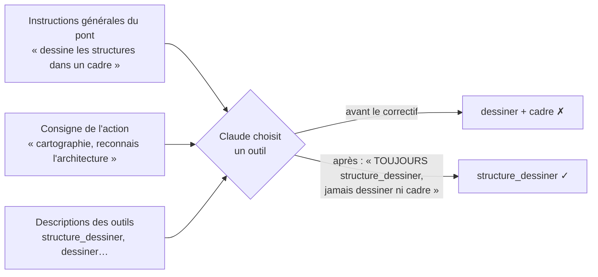

# Consigne pour un agent outillé — dire ce qui ne change pas, nommer l'outil et l'anti-outil

> **En 30 secondes** — Deux bugs du 07/10 n'étaient **pas dans le code** mais dans les **consignes** données à Claude. (1) On lui a demandé d'ajouter une « couche » à chaque élément : il a **réorganisé toute sa carte par couches**. (2) On lui a demandé de « reconnaître l'architecture » : il a **dessiné un schéma libre** avec le mauvais outil. Deux règles en sortent : dire **ce qui ne change pas**, et nommer **l'outil à utiliser ET celui à éviter**.



---

## 1. Vue Macro & Utilité (le « Pourquoi »)

> 📘 **Introduction (ajoutée)** — **C'est quoi, un agent outillé ?** Un LLM (*grand modèle de langage*) qui peut, en plus de répondre, **appeler des outils** (lire un fichier, dessiner sur la carte, mettre à jour un élément). **Et l'ingénierie de consigne (*prompt engineering*) ?** L'art d'écrire les instructions qu'il lit pour qu'il choisisse le **bon** outil, au **bon** moment, sans effet de bord. Pour un agent, la consigne n'est pas qu'un texte : c'est **l'ensemble** de ce qu'il lit — instructions générales du serveur MCP, cadre de la conversation, **descriptions de chaque outil**, message de l'utilisateur.

- **Problématique** : un LLM ne lit pas une consigne comme un compilateur. Il cherche l'interprétation **la plus cohérente** de tout ce qu'il a reçu. Si une nouvelle notion apparaît (« couche »), il la croit **centrale** et réorganise autour. Si deux textes l'orientent vers deux outils différents, il prend celui dont les mots ressemblent le plus à la demande (« architecture » + « structures dans un cadre » → `dessiner` un `cadre`).
- **Emplacement dans la carte globale** : trois endroits du code portent du texte pour Claude : `MCP_INSTRUCTIONS` (lu par toute session qui branche le pont), `BRAINSTORMER_FRAME` (cadre figé des conversations `claude -p`), `description` de chaque outil dans `shared/mcp/tools.ts`. Les **schémas Zod** des outils et `StructureService` restent la barrière dure.
- **Analogie (restauration)** : un soir de rush, tu dis à un extra « ajoute le numéro de table sur chaque bon ». Il **renumérote toute la salle** pour que ce soit « plus logique ». Il fallait dire : « ajoute le numéro, **ne change rien d'autre** ». Et si sa fiche de poste dit « range les couverts dans les bacs » alors que tu lui demandes « prépare la table 4 », précise « avec le **chariot de dressage**, **pas** les bacs ». *Où ça boite* : un extra demande quand il doute ; un agent en mode `-p` ne demande pas, il agit.

## 2. Le Pont Systémique (sous le capot)

Ce qui arrive **réellement** au modèle à chaque tour : une seule longue suite de *tokens* (morceaux de texte) qui concatène le cadre système, les instructions du serveur MCP, la **liste des outils avec leur description et leur schéma JSON**, l'historique, puis la demande. Le modèle prédit ensuite soit du texte, soit un **appel d'outil** (nom + arguments JSON). Il n'y a **pas** de hiérarchie formelle entre ces morceaux : « la consigne la plus précise gagne » n'est vrai que si **le texte le dit**.

Conséquences pratiques :
- La **description d'un outil** pèse autant qu'une instruction : c'est là qu'on écrit « la couche est un attribut… ne crée jamais d'élément par couche ».
- Le **choix du modèle** compte : le bug n°2 est apparu avec Haiku (plus petit, plus sensible aux mots-clés). Une consigne robuste doit tenir avec le plus petit modèle configurable.
- Le **code** reste le filet : même si Claude se trompe d'outil, il ne peut écrire que ce que les schémas acceptent, marqué « par Claude » et **annulable** (la récupération conseillée a été : annuler le lot dans l'Historique).

## 3. Analyse du Code & Logique

**Bloc 1 — Dire ce qui ne change pas** (description de `structure_dessiner`, après correctif)

```text
« architecture » (type parmi clean, hexagonale, mvvm, mvc, couches, aucune ; justification tirée du code)
et « couche » de chaque élément : clean = presentation, infrastructure, application, domaine ; …
La couche est un attribut : garde la hiérarchie par modules, les statuts et les chemins,
ne crée jamais d'élément par couche (l'app range elle-même les éléments par couche).
```
Trois gestes : **qualifier** la notion (« un attribut », pas une structure) ; **énumérer ce qui reste** (hiérarchie, statuts, chemins) ; dire **qui fait le reste** (« l'app range elle-même »), pour que l'IA n'essaie pas de le faire.

**Bloc 2 — Nommer l'outil ET l'anti-outil** (`MCP_INSTRUCTIONS`, après correctif)

```text
Cartographier un projet lié (modules, composants, architecture, couches) : TOUJOURS `structure_dessiner`,
jamais `dessiner` ni `cadre` : l'app en tire elle-même la vue Progression et la vue Architecture.
```
Le même motif existait déjà pour les plans (« TOUJOURS `plan_proposer` — jamais `dessiner` ») et les documents (« `document_ecrire`, jamais `dessiner` ») : chaque fois qu'un outil **générique** (`dessiner`) peut faire semblant de remplir un besoin **spécialisé**, la consigne doit fermer la porte explicitement.

**Bloc 3 — La consigne au moment d'agir** (D21, `conversation/frame.ts`)

```text
… tiens SA fiche. Quand tu y travailles (code, tests, commit), tiens-le à jour avec element_avancer
à chaque étape franchie (« avancement » en %, « reste » à faire) ; travail terminé (tests verts, commit) :
statut « livree », 100 %. Ses parents se remplissent seuls.
```
Un **déclencheur concret** (« à chaque étape franchie », « tests verts, commit ») plutôt qu'un vœu (« tiens la carte à jour ») ; et, encore, **ce que l'IA n'a pas à faire** (« ses parents se remplissent seuls »).

**Bonnes pratiques mises en évidence** : une consigne se **teste** comme du code — le test guidé T074 avec le vrai CLI a révélé les deux bugs que les tests unitaires ne pouvaient pas voir ; ce qui est **critique** reste codé (schémas, priorité de mentalyas, annulation), la consigne ne fait que guider (voir la question « barrière déterministe vs consigne » du MOC).

## 4. Synthèse & Prochaine Étape

**À retenir (3 puces max)**
- Une consigne qui **ajoute** une notion doit dire ce qu'elle **ne change pas** (et qui fait le reste).
- Quand deux consignes se recoupent, la plus précise nomme **l'outil à utiliser ET celui à ne pas utiliser**.
- Les descriptions d'outils **sont** de la consigne ; le code (schémas, annulation) reste le filet.

**Lien avec la suite** : la même discipline s'appliquera à la tâche `analyste` (spec 019 US2), dont la consigne et le schéma de sortie fermé sont prévus → [[Analyste en lecture seule — moindre privilège et propositions vérifiées]].

**Rappel actif**
> **Q :** Tu ajoutes un champ « priorité » aux étapes d'un plan. Qu'écris-tu dans la description de l'outil, en plus du sens du champ ?
> **R :** Que c'est un attribut : garder l'ordre, les liens et les étapes existantes ; ne pas regrouper ni recréer les étapes par priorité ; l'app trie elle-même si besoin.

> **Q :** Pourquoi « dessine les structures dans un cadre titré » a-t-il piégé la cartographie ?
> **R :** Il entrait en concurrence avec la consigne de cartographie (« architecture ») : les mots se ressemblaient, aucun texte ne disait laquelle primait ni d'éviter `dessiner`.

> **Q :** Claude s'est trompé d'outil malgré tout. Qu'est-ce qui limite les dégâts ?
> **R :** Les écritures sont validées par schéma, marquées « par Claude » et regroupées en lot annulable dans l'Historique.

**Pièges fréquents**
- ⚠️ **« Il comprendra »** — un LLM comble les silences par l'interprétation la plus cohérente, pas par la plus prudente.
- ⚠️ **Corriger le code quand le bug est dans la consigne** — relire d'abord ce que le modèle a reçu (instructions, description, cadre).
- ⚠️ **Valider avec le gros modèle seulement** — tester aussi avec le plus petit modèle configurable.

**Connexions**
- [[Injection de prompt — cadre figé et données balisées]] — l'autre face : empêcher une **donnée** de devenir consigne.
- [[Glossaire — MCP (Model Context Protocol)]] — d'où viennent les instructions du serveur et les descriptions d'outils.
- [[Avancement vivant — agrégation récursive, outil dédié et consigne au bon endroit]] — un outil dédié + une consigne au bon endroit.
- [[Vue Architecture — règle de dépendance, couches déduites et deux dispositions pures]] — la fonctionnalité dont la consigne a dû être corrigée.
