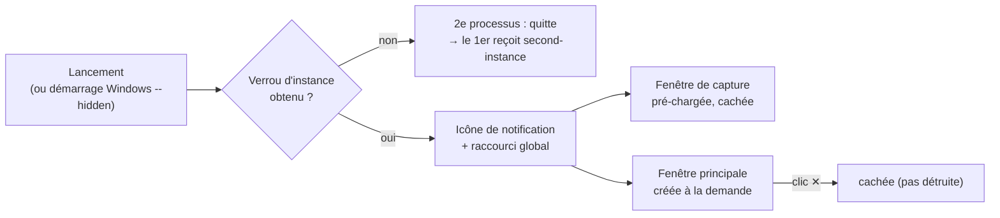

# Coquille de bureau — zone de notification, instance unique et fenêtres cachées

> **En 30 secondes** — Une app « à portée de main » ne se lance pas à chaque idée : elle **vit en permanence** dans la zone de notification (les petites icônes près de l'horloge). Fermer la fenêtre la **cache** au lieu de quitter ; relancer l'app **ramène** la fenêtre existante au lieu d'en ouvrir une deuxième ; la petite fenêtre de capture est **créée d'avance, cachée**, pour apparaître instantanément sous `Ctrl+Alt+Espace`.



---

## 1. Vue Macro & Utilité (le « Pourquoi »)

> 📘 **Introduction (ajoutée)** — **C'est quoi ?** Une **application résidente** reste chargée en mémoire en arrière-plan (comme Discord ou Steam) : son seul signe visible est une icône dans la **zone de notification** (*system tray*). **Comment ça marche ?** Le processus principal d'Electron continue de tourner même quand aucune fenêtre n'est affichée ; il écoute l'icône, le raccourci clavier global et les relances de l'app.

- **Problématique** : noter une idée doit prendre **moins de temps que de l'oublier**. Si chaque capture demandait de lancer l'app (2-3 s de démarrage, base à déchiffrer), l'idée serait perdue. Et deux copies de l'app ouvertes en même temps écriraient dans la **même base chiffrée** — risque de conflit.
- **Emplacement dans la carte globale** : couche **shell** (`src/main/shell/`) du processus main — entre le système d'exploitation (fenêtres, clavier, démarrage de session) et le reste de l'application ([[Architecture Electron — trois processus cloisonnés]]).
- **Analogie (restauration)** : un restaurant où la **cuisine ne ferme jamais** pendant le service. Fermer la salle (fenêtre ✕) = baisser les lumières, pas éteindre les fourneaux. Un deuxième client qui pousse la porte d'entrée (2e lancement) n'ouvre pas un second restaurant : le maître d'hôtel rallume la salle existante. Le **comptoir à emporter** (capture) est déjà dressé, caché derrière un rideau : on lève le rideau, c'est prêt. *Où ça boite* : un vrai restaurant consomme peu fermé ; ici, l'app résidente occupe de la RAM même cachée (d'où une seule fenêtre principale créée **à la demande**).

## 2. Le Pont Systémique (sous le capot)

- **Verrou d'instance unique** : `app.requestSingleInstanceLock()` crée un **objet nommé du système** (un verrou partagé entre processus, lié au dossier de données). Le 1er processus l'obtient ; le 2e ne l'obtient pas, **transmet ses arguments** au 1er (événement `second-instance`) puis quitte. Aucun second accès à la base SQLite.
- **Fenêtre cachée ≠ fenêtre détruite** : `window.hide()` garde le processus de rendu **en RAM** avec son DOM déjà construit ; `show()` n'a plus qu'à redessiner. Détruire puis recréer relancerait Chromium, React et le chargement de la page (centaines de ms).
- **Raccourci global** : `globalShortcut.register()` demande à Windows d'intercepter la combinaison **au niveau du système**, même quand une autre app a le focus. Si une autre application l'a déjà prise, Windows refuse → `false`.
- **Focus rendu** : `blur()` **puis** `hide()` : Windows redonne alors le focus clavier à l'application utilisée **avant** la capture (tu retrouves ton éditeur, pas le bureau vide).
- **Démarrage avec Windows** : `setLoginItemSettings({ openAtLogin, args: ['--hidden'] })` inscrit l'exe dans la liste de démarrage de la session ; l'argument `--hidden` dit « icône seulement, pas de fenêtre ». Uniquement pour l'app installée (en dev, on inscrirait `electron.exe`).

## 3. Analyse du Code & Logique

```ts
// src/main/index.ts — le tout premier geste du processus
if (app.requestSingleInstanceLock()) start()   // ① je suis le seul → je démarre
else app.quit()                                // ② une copie tourne déjà → je m'efface

app.on('second-instance', () => windows.showMain())    // ③ la copie m'a « sonné » → je montre ma fenêtre
app.on('window-all-closed', () => undefined)           // ④ plus de fenêtre ≠ quitter (on vit dans le tray)
app.on('before-quit', () => windows.setQuitting())     // ⑤ « Quitter » du menu : là, les fenêtres ferment vraiment
```

```ts
// src/main/shell/GlobalShortcut.ts — changer de raccourci sans jamais se retrouver sans raccourci
replace(accelerator: string): boolean {
  if (accelerator === this.current) return true
  if (!this.registry.register(accelerator, this.onPressed)) return false // ⑥ essayer le nouveau D'ABORD
  if (this.current !== undefined) this.registry.unregister(this.current)  // ⑦ puis seulement libérer l'ancien
  this.current = accelerator
  return true
}
```

- **Étape 1 — Instance unique** (①-③) : c'est la première ligne exécutée ; même le profil démo n'est réinitialisé qu'**après** l'obtention du verrou (sinon on effacerait une base ouverte par l'autre copie).
- **Étape 2 — Fermer = cacher** (④-⑤) : l'événement `close` est intercepté (`event.preventDefault()` + `hide()`) sauf si le drapeau `quitting` est levé.
- **Étape 3 — Ordre « essayer puis remplacer »** (⑥-⑦) : si le nouveau raccourci est pris, l'ancien **reste actif** et l'interface affiche `SHORTCUT_UNAVAILABLE`. Au démarrage, un échec produit une notification Windows : l'app reste utilisable par l'icône.
- **Étape 4 — Placement** (`placement.ts`) : fonction **pure** — centrée, au premier tiers de la hauteur de l'écran **où se trouve le curseur**, jamais hors de la zone de travail (barre des tâches exclue). Pure = testable sans Electron.
- **Étape 5 — Une API par fenêtre** : le même preload lit un argument `--gi-window=capture|main` et n'expose que `captureApi` **ou** `api` ; le main vérifie en plus que chaque canal vient de la bonne page.

**Bonnes pratiques mises en évidence** : l'OS est enveloppé dans de petites classes à interface minimale (`ShortcutRegistry`, fonctions pures de placement/cycle de vie) → testables avec des doubles ; les décisions (« quitter ou cacher ? ») sont des drapeaux explicites, pas des effets de bord.

## 4. Synthèse & Prochaine Étape

**À retenir (3 puces max)**
- Une app résidente : **un seul processus** (verrou), fenêtres **cachées** plutôt que détruites, vie dans la zone de notification.
- Pré-charger une fenêtre cachée échange un peu de RAM contre un affichage **instantané**.
- Changer une ressource partagée (raccourci) : **acquérir la nouvelle avant de libérer l'ancienne**.

**Lien avec la suite** : la fenêtre principale ouvre l'écran Idées → [[Carte des idées — simulation de forces et croisements de liens]].

**Rappel actif**
> **Q :** Que se passe-t-il, processus par processus, quand on double-clique l'app alors qu'elle tourne déjà ?
> **R :** Un 2e processus démarre, n'obtient pas le verrou, transmet ses arguments au 1er (`second-instance`) et quitte ; le 1er affiche sa fenêtre principale.

> **Q :** Pourquoi `blur()` avant `hide()` sur la capture ?
> **R :** Pour que Windows rende le focus à l'application précédente ; sinon l'utilisateur perd sa place.

> **Q :** Pourquoi enregistrer le nouveau raccourci avant de libérer l'ancien ?
> **R :** Si le nouveau est déjà pris, on garde l'ancien : l'utilisateur n'est jamais sans raccourci.

**Pièges fréquents**
- ⚠️ **Oublier `window-all-closed`** — par défaut, Electron quitte quand la dernière fenêtre ferme : l'app résidente disparaîtrait.
- ⚠️ **Désactiver le champ pendant l'envoi** — un champ `disabled` perd le focus ; le projet le met en **lecture seule** (JOURNAL, capture rapide).

**Connexions**
- [[Architecture Electron — trois processus cloisonnés]] — le main qui survit sans fenêtre.
- [[IPC typé — le guichet unique entre interface et moteur]] — canaux autorisés **par page** (principale / capture).
- [[Glossaire — Mise à jour optimiste]] — la capture crée l'idée sans attendre l'IA.

## Évolution du 07/10 — le verrou d'instance unique rattrape une conception
En concevant « Essayer une mise à jour » (spec 019), le plan prévoyait de lancer la version d'une branche sur le **profil démo**, à côté de l'app ouverte. L'analyse croisée a relu `src/main/index.ts` : `requestSingleInstanceLock()` refuserait le second processus (ou, sans verrou, deux processus ouvriraient **la même base**). Décision (research R11) : un **profil d'essai** distinct, dont le dossier (`app.setPath('userData', …)`) est fixé **avant** la prise du verrou. ⚠️ Probable, **à vérifier en T035** : que le verrou dépend bien du dossier de profil (deux profils = deux instances possibles). → [[Mise à jour réversible — worktree, branche, fusion no-ff et git revert]]
