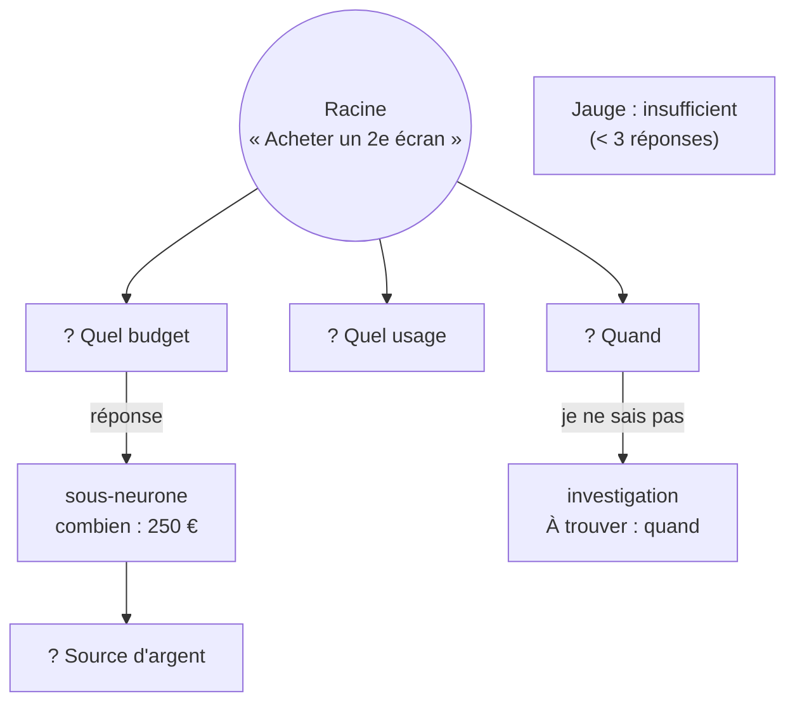

# Croissance d'un neurone — arbre, garde-fous et jauge

> **En 30 secondes** — Une idée (neurone **racine**) pousse comme un arbre : Claude propose des **extensions** (questions) ; chaque réponse devient un **sous-neurone** enregistré *avant* l'appel IA ; un **seul** appel `etendre` renvoie les nouvelles questions **et** une **jauge** (`insufficient` / `sufficient` / `complete`). Mais c'est le **code** qui garantit les règles : ≥ 3 questions au départ, pas de doublon, profondeur ≤ 6, jauge bloquée sous 3 réponses.



---

## 1. Vue Macro & Utilité (le « Pourquoi »)

> 📘 **Introduction (ajoutée)** — **C'est quoi ?** Un **arbre** est une structure de données où chaque nœud a **un parent** (sauf la racine) et zéro ou plusieurs enfants ; la **profondeur** d'un nœud est sa distance à la racine. **Comment ça marche ?** Ici, l'arbre est stocké dans **une seule table** `neurons` : chaque ligne porte `root_id`, `parent_id` et `depth` ; on reconstruit les chemins en mémoire (`pathTo`, `descendantsOf`).

- **Problématique** : un LLM est créatif mais pas fiable sur les règles : il peut proposer 2 questions au lieu de 3, reposer une question déjà écartée, creuser à l'infini (coût), ou déclarer « contexte complet » après une seule réponse. Il faut une IA qui **propose** et une application qui **garantit**.
- **Emplacement dans la carte globale** : le **cœur métier** du Brainstormer (spec 002) — domaine (`guards.ts`, `tree.ts`, `nature.ts`) + application (`GrowthService`, `GrowthContextBuilder`) + table `neurons` / `extensions` sur disque.
- **Analogie (Satisfactory)** : l'**arbre technologique**. Chaque recherche débloquée (réponse) ouvre de nouvelles recherches possibles (extensions). Le jeu impose des règles fixes (pas deux fois la même recherche, un palier maximum) quelle que soit la suggestion de l'IA-conseillère. La **jauge** est la barre « prêt à passer au palier suivant » : elle ne s'allume pas tant que 3 recherches n'ont pas été faites, même si la conseillère s'impatiente.

## 2. Le Pont Systémique (sous le capot)

- **Écrire d'abord, penser ensuite** : la réponse devient une ligne SQLite **dans une transaction**, puis l'événement `neuron:created` part vers l'écran (retour visuel immédiat, SC-004), et seulement **ensuite** l'appel réseau vers Claude (plusieurs secondes). Si l'IA plante, la réponse est **déjà sur disque** — aucune perte.
- **Idempotence par contrainte d'unicité** : la colonne `from_extension_id` est `UNIQUE`. Un double clic concurrent tente d'insérer deux sous-neurones pour la même question : **SQLite refuse le second** (le moteur de base, pas le code JS, arbitre). Le service traduit l'erreur en `ALREADY_ANSWERED`.
- **Contexte envoyé borné** : `GrowthContextBuilder` construit un texte ≤ 12 000 caractères (≈ 3 000 tokens) : nature + dimensions de référence, **chemin complet** jusqu'au neurone ciblé, titres des autres branches, questions déjà posées. Les identifiants internes (UUID) ne partent jamais : on envoie des **alias** `s0`, `s1`… (voir [[Éclosion atomique — transaction, version et historique]] pour leur retour).

## 3. Analyse du Code & Logique

Extrait de `src/main/domain/neurons/guards.ts` :

```ts
export const MIN_EXTENSIONS = 3       // E1 : au moins 3 questions au premier développement
export const MAX_AI_DEPTH = 6         // E3 : au-delà, plus de question IA sur ce chemin
export const GAUGE_FLOOR_ANSWERS = 3  // E4 : plancher de la jauge

/** Forme comparable d'une question : minuscules, sans accents ni ponctuation. */
export function normalizeQuestion(q: string): string {
  return q.normalize('NFD').replace(/\p{M}/gu, '').toLowerCase().replace(/[^\p{L}\p{N}]+/gu, ' ').trim()
}
/** E2 : retire les questions déjà posées, répondues ou écartées, et les doublons internes. */
export function filterNewExtensions<T extends { question: string }>(proposed: readonly T[], known: readonly string[]): T[] {
  const seen = new Set(known.map(normalizeQuestion))
  /* … garde seulement les clés jamais vues … */
}
/** E4 : jamais « suffisant » avant 3 réponses, quoi qu'en dise l'IA. */
export const applyGaugeFloor = (aiLevel: GaugeLevel, answered: number): GaugeLevel =>
  answered < GAUGE_FLOOR_ANSWERS ? 'insufficient' : aiLevel
```

- **Étape 1 — Normaliser pour comparer** : « Quel budget ? » et « quel BUDGET » deviennent `quel budget`. `normalize('NFD')` sépare « é » en « e » + accent, puis `\p{M}` retire les accents.
- **Étape 2 — Trois modes d'appel** : `first` (≥ 3 questions), `follow_up` (0 à 3 si la réponse ouvre des pistes), `assess_only` (profondeur max : aucune question, jauge seule). Au-delà, `more()` lève `DEPTH_LIMIT` **sans appel IA** (économie).
- **Étape 3 — Types de sous-neurones** : `answer`, `condition`, `opportunity`, `investigation` (« je ne sais pas » → « À trouver : … », règle « ne jamais inventer »), `user_branch` (branche ajoutée à la main).
- **Étape 4 — Nature** : Action (quand, combien, comment, source d'argent, lieu, dépendances) ou Réflexion (pourquoi, options, critères, contraintes, risques, décision attendue). Changer la nature réoriente les questions suivantes ; une question hors nature est **signalée** (`outsideNature`), jamais supprimée.
- **Étape 5 — Neurones fantômes** : l'appel peut aussi renvoyer 0 à 2 **suggestions** (dont au plus **une** vérification web par appel) ; acceptée → sous-neurone d'origine `ai` ; ignorée → retirée sans toucher à l'arbre.

**Bonnes pratiques mises en évidence** : « l'IA propose, l'application garantit » ; un seul appel pour deux besoins (extensions + jauge) = moitié moins de tokens.

## 4. Synthèse & Prochaine Étape

**À retenir (3 puces max)**
- La réponse est **écrite et annoncée avant** l'appel IA : rien n'est perdu si l'IA échoue.
- Les règles (≥ 3, pas de doublon, profondeur 6, plancher de jauge) sont du **code déterministe**, pas des souhaits dans le prompt.
- L'unicité en base arbitre les doubles clics.

**Lien avec la suite** : quand la jauge le permet, on **verrouille** et Claude synthétise → [[Synthèse vérifiée — contrôles déterministes et provenance]].

**Rappel actif**
> **Q :** Pourquoi enregistrer le sous-neurone avant l'appel à Claude ?
> **R :** Retour immédiat à l'écran, et la réponse de l'utilisateur est conservée même si l'IA est indisponible.

> **Q :** Qui empêche deux sous-neurones pour la même question lors d'un double clic ?
> **R :** La contrainte `UNIQUE` sur `from_extension_id` dans SQLite ; le service convertit l'erreur en `ALREADY_ANSWERED`.

> **Q :** L'IA déclare `complete` après 2 réponses. Que montre la jauge ?
> **R :** `insufficient` : le plancher de 3 réponses s'applique quoi qu'en dise l'IA.

**Pièges fréquents**
- ⚠️ **Écrire « propose au moins 3 questions » dans le prompt et s'arrêter là** — le LLM peut ne pas obéir ; il faut vérifier et redemander (1 nouvel essai, puis repli signalé `FEW_EXTENSIONS`).
- ⚠️ **Comparer des questions sans normaliser** — accents et ponctuation font rater les doublons.

**Connexions**
- [[Synthèse vérifiée — contrôles déterministes et provenance]] — l'étape suivante du cycle de vie.
- [[Glossaire — Idempotence]] — rejouer sans effet de bord.
- [[Passerelle IA hybride — un seul point d'accès à l'IA]] — l'appel `etendre` y passe.

## Évolution du 30/09 — pas d'idée suggérée avant trois réponses
Retour de test de mentalyas : « sans contexte, les idées proposées sont faibles ». Nouveau garde-fou dans `domain/neurons/guards.ts` (`MIN_ANSWERS_FOR_SUGGESTIONS = 3`, `suggestionsAllowed`) : au début, l'IA ne pose que des questions ; les suggestions n'arrivent qu'à partir de la 3ᵉ réponse. **Double verrou**, comme le plancher de la jauge (même seuil) : la consigne le demande à l'IA **et** l'application écarte toute suggestion reçue trop tôt. Exception : une idée déjà éclose garde ses suggestions dès le début d'un nouveau cycle (son document sert de contexte).

## Évolution du 05/10 — l'ancien moteur est retiré
> ⚠️ **Correction du 05/10** — Le moteur de croissance (questions générées, `GrowthService`, `guards.ts`, `tree.ts`) est **retiré** (spec 010 C2, ≈ 13 400 lignes). Une idée s'ouvre maintenant en **conversation Claude Code** ; Claude tient sa **fiche** (`fiche_ecrire`) et sa **maturité** (`maturite_evaluer`, qui réutilise la **jauge** décrite ici : la taille du neurone suit). Les anciennes tables restent en **archive** ; au premier démarrage, chaque ancienne idée a reçu une fiche assemblée sans IA (marqueur `migration.legacySheets`, lot d'Historique `convert` annulable). Suite : [[Piloter Claude Code — processus enfant, flux stream-json et session reprise]] et [[Plan d'attaque — étapes ordonnées, dépendances sans cycle et verrou]].
