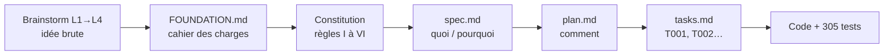

# Du brainstorm au code — spécifications et constitution

> **En 30 secondes** — Avant d'écrire une ligne de code, le projet a transformé une idée floue en documents de plus en plus précis : **brainstorm** (le rêve) → **FOUNDATION** (le cahier des charges) → **constitution** (les règles non négociables) → **specs par fonctionnalité** (quoi) → **plan** (comment) → **tâches** (qui fait quoi, dans quel ordre). Le code n'est que la dernière marche.



---

## 1. Vue Macro & Utilité (le « Pourquoi »)

> 📘 **Introduction (ajoutée)** — **C'est quoi ?** Le *développement piloté par la spécification* (SDD, *Spec-Driven Development* — développement guidé par des documents d'exigences écrits avant le code) consiste à écrire d'abord **ce que** le logiciel doit faire, puis **comment**, avant de coder. **Comment ça marche ?** Chaque document est la matière première du suivant ; un outil (ici **Spec Kit**, un ensemble de commandes `/speckit-*`) guide la production et vérifie la cohérence entre eux (`analysis-report.md`).

- **Problématique** : une idée comme « un Brainstormer à neurones » est floue. Si on code directement, on découvre les contradictions (« l'IA peut-elle écrire un montant ? ») au milieu du code, là où elles coûtent le plus cher à corriger.
- **Emplacement dans la carte globale** : c'est la phase **analyse**, tout en amont — avant matériel, code et base de données. Elle décide de tout le reste.
- **Analogie (restauration)** : une brigade de cuisine. Le **brainstorm** = le chef qui imagine la carte. La **FOUNDATION** = la carte validée avec le patron. La **constitution** = les règles d'hygiène HACCP (*Hazard Analysis Critical Control Point* — normes d'hygiène alimentaire), non négociables quel que soit le plat. La **spec** = la fiche technique d'un plat. Le **plan** = la mise en place. Les **tâches** = le bon de commande par poste. *Là où ça boite* : en cuisine on ne réécrit pas la carte en plein service ; ici, le pivot « Brainstormer » a réécrit les specs 002 et 003 en cours de journée (et c'est normal en logiciel).

## 2. Le Pont Systémique (sous le capot)

Rien ne s'exécute dans cette phase… mais elle **programme la machine à l'avance** :

| Décision écrite | Ce qu'elle provoque dans la machine |
|-----------------|--------------------------------------|
| Constitution I : « chaque payload IPC validé par Zod » | Chaque message du renderer passe par `safeParse` dans le processus principal (CPU) avant d'atteindre la base (disque) |
| Constitution IV : « données locales, SQLite chiffré » | Le fichier `.db` sur le disque est illisible sans la clé ; rien ne part sur le réseau sans anonymisation |
| Constitution V : « tests sans service externe » | Les 305 tests tournent sans réseau, avec un `FakeProvider` en mémoire vive |
| Spec 002 : « profondeur max 6 » | Une constante `MAX_AI_DEPTH = 6` coupe l'appel IA (et donc le coût réseau) |

Le **versionnage sémantique** de la constitution (1.0.0 → 1.1.0) suit la même logique que celui des logiciels : `MAJOR` = on retire une règle, `MINOR` = on en élargit une, `PATCH` = clarification.

## 3. Analyse du Code & Logique

Extrait réel de `.specify/memory/constitution.md` (en-tête « Sync Impact Report ») :

```text
- Version change: 1.0.0 → 1.1.0 (2026-09-28, validé par mentalyas)
- Modified principles: III (suggestions de valeurs par l'IA, sourcées et soumises à acceptation),
  IV (montants exacts par défaut, masquage en fourchettes devenu un réglage)
- Impact : spec 001 FR-006/SC-002, spec 002 (user story Suggestions), spec 003 (neurones fantômes)
```

- **Étape 1 — La règle avant le code** : pour envoyer les montants exacts à Claude, on n'a pas « juste changé le code » : on a **amendé la constitution** (motif + impact), fait valider, puis modifié les specs et enfin le code (`maskAmounts`).
- **Étape 2 — La traçabilité** : chaque tâche porte un identifiant (`T024`, `T053`…) repris dans le JOURNAL et les commits (`spec 002 US3 : T018-T024`). On peut remonter de n'importe quelle ligne de code à l'exigence qui l'a demandée.
- **Étape 3 — Le gate d'analyse** : `/speckit-analyze` compte les exigences couvertes par des tâches (« couverture 27/27 ») et classe les incohérences (critique / moyen / mineur) *avant* de coder.
- **Étape 4 — Les vocabulaires** : `US` = *User Story* (récit utilisateur : « en tant que…, je veux…, afin de… ») ; `FR` = *Functional Requirement* (exigence fonctionnelle numérotée) ; `SC` = *Success Criterion* (critère de réussite mesurable, ex. « 0 fuite sur 50 textes »).

**Bonnes pratiques mises en évidence** : une décision = un endroit ; les exceptions (Drizzle au lieu de Prisma) sont **écrites et motivées** dans le `CLAUDE.md` projet, pas cachées dans le code.

## 4. Synthèse & Prochaine Étape

**À retenir (3 puces max)**
- On descend du **pourquoi** (brainstorm) au **quoi** (spec) au **comment** (plan) au **faire** (tâches).
- La **constitution** est la loi du projet : on l'amende officiellement, on ne la contourne pas.
- Chaque ligne de code doit pouvoir être reliée à une exigence (traçabilité).

**Lien avec la suite** : la première exigence technique de la constitution est « Electron durci » → [[Architecture Electron — trois processus cloisonnés]].

**Rappel actif**
> **Q :** Pourquoi avoir modifié la constitution avant d'envoyer les montants exacts à Claude ?
> **R :** Parce que le principe IV imposait les fourchettes : changer le code sans amender la règle aurait créé une contradiction entre la loi du projet et son implémentation.

> **Q :** Quelle est la différence entre `spec.md` et `plan.md` ?
> **R :** La spec dit **quoi** et **pourquoi** (besoin, sans technologie) ; le plan dit **comment** (stack, fichiers, modèle de données).

> **Q :** À quoi sert l'`analysis-report.md` ?
> **R :** À vérifier, avant de coder, que chaque exigence est couverte par une tâche et qu'aucun document n'en contredit un autre.

**Pièges fréquents**
- ⚠️ **Confondre spec et plan** — si ta spec parle de React ou de SQLite, elle décrit déjà le *comment*.
- ⚠️ **Croire que les documents sont figés** — le pivot « Brainstormer » a réécrit deux specs le jour même ; l'important est de les remettre à jour *avant* le code.

**Connexions**
- [[Architecture Electron — trois processus cloisonnés]] — première exigence de sécurité mise en œuvre.
- [[Clean Architecture — domaine, application, infrastructure]] — le principe VI (simplicité) et V (tests) y prennent forme.


## Évolution du 30/09 — amendement 1.2.0 : une exception écrite avant le code
La spec 004 voulait que Claude **génère du code** (les widgets), ce que le principe III interdisait. Même démarche qu'en 1.1.0 : la tâche T001 de `specs/004-widgets/tasks.md` est l'**amendement** (`MINOR`, validé), avant toute ligne de code. L'exception est bornée par des `MUST` vérifiables : cadre système dédié, exécution **uniquement** dans le bac à sable `gi-widget://`, et revue obligatoire dès qu'un widget demandera une capacité (spec 005). Ce que ça donne en code → [[Bac à sable des widgets — iframe isolée, origine opaque et protocole gi-widget]].

## Évolution du 04→06/10 — la vision bascule, la méthode tient
- **Amendement L1c (04/10)** : le Brainstormer devient l'**interface visuelle de Claude Code** (pont MCP, moteur `claude -p`). Constitution **2.0.0** puis **3.0.0** (05/10 : plus d'API, de budget, d'anonymisation ; écritures de Claude directes, marquées et annulables), **4.0.0 proposée** (06/10, « Claude libre », permissions relayées).
- **Dix specs en trois jours** (007 à 016), chacune avec plan, tâches et **test guidé validé par mentalyas** avant de continuer.
- **Règles apprises** : une capacité ajoutée au pont MCP ne sert à rien tant que le cadre ne dit pas **quand** l'utiliser ; quand un modèle confond deux outils voisins, un **déclencheur explicite** (bouton) et un **refus motivé** valent mieux qu'une consigne de plus.
