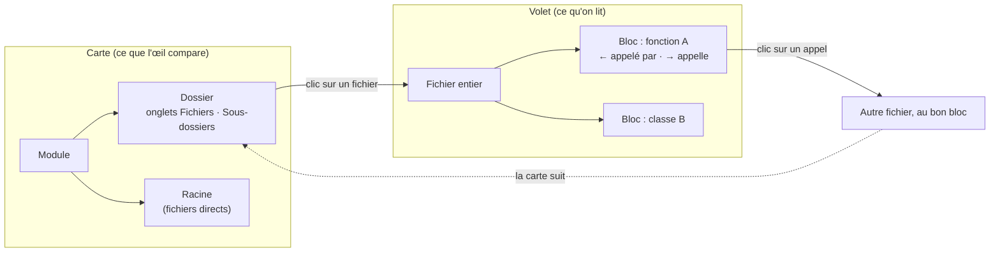
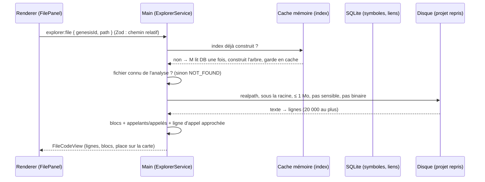

# Explorateur de code — du module au bloc, appelants et appelés

> **En 30 secondes** — Le code analysé devient un **arbre** (modules → dossiers → fichiers → fonctions). La **carte** ne montre que deux étages comparables à l'œil (modules, puis les dossiers du nœud ouvert) ; le **volet de droite** montre un **fichier entier**, chaque bloc (classe, fonction) précédé de « ← appelé par » et « → appelle ». Un clic sur un appel ouvre l'autre fichier **au bon bloc**, dans le même volet, et la carte se place sur son dossier. Tout est calculé et vérifié dans le main.



---

## 1. Vue Macro & Utilité (le « Pourquoi »)

- **Problématique** : sur un projet de 5 000 fichiers, une carte qui montre « tout » est illisible, et une carte qui descend jusqu'aux fonctions oblige à ouvrir des fenêtres pour lire le code. Mentalyas l'a dit après le test T027 : il veut **un seul écran**, la structure d'un côté, le code de l'autre, et savoir pour chaque fonction **qui l'appelle** et **ce qu'elle appelle**.
- **Emplacement dans la carte globale** : **analyse statique** (processus séparé, résultats en SQLite : symboles et liens) → **main** (`ExplorerService` : index en mémoire, agrégation, lecture sûre du fichier) → **IPC** (`explorer:view`, `explorer:file`, `explorer:locate`) → **renderer** (`ExplorerPage`, `ExplorerNodes`, `FilePanel`, `CodeLines`).
- **Analogie** (multiprise / électricité) : tu découvres le **tableau électrique** d'un bâtiment. Sur le tableau, tu vois les **disjoncteurs par étage** (modules), puis **par pièce** (dossiers) — pas chaque prise, ce serait illisible. Si un fil part de la cuisine vers une prise du garage, le tableau montre simplement « cuisine ↔ garage, 3 fils ». Pour une prise précise, tu ouvres le **plan de câblage de la pièce** (le volet) : chaque prise y est notée « alimentée par… » et « alimente… ». *Où ça boite* : un fil électrique a une position exacte ; ici, la ligne d'un appel n'est **qu'estimée** (Section 3, bloc 4).

## 2. Le Pont Systémique (sous le capot)



- **Mémoire** : l'index (`ExplorerIndex` : `Map` de nœuds, d'enfants et de « chaînes » d'ancêtres) est construit **une fois** par projet puis gardé dans un cache du main ; il est invalidé à chaque `reprise:changed` (nouvelle analyse, correction). Les vues suivantes ne relisent pas la base.
- **Disque** : le fichier est relu à chaque ouverture (jamais copié en base) ; il n'est **jamais exécuté ni interprété** — même la coloration syntaxique produit des nœuds React, pas du HTML injecté.
- **Ce que la base sait, et ne sait pas** : un lien `code_edges` dit « A appelle B, **n fois**, avec telle fiabilité » — pas **à quelle ligne**. Cette limite de modèle de données explique l'approximation du bloc 4.

## 3. Analyse du Code & Logique

**Bloc 1 — Un arbre à clés préfixées** (`domain/reprise/aggregate.ts`, `buildIndex`, fonction pure)

```ts
// m: module · d: dossier · f: fichier · s: symbole · r: « Racine » (virtuel)
add({ key: `m:${module.key}`, parentKey: ROOT_KEY, kind: 'module', … })
add({ key: `d:${walked}`,     parentKey: parent,   kind: 'folder', … })   // un par étage du chemin
add({ key: `f:${file.path}`,  parentKey: parent,   kind: 'file',   … })
add({ key: `s:${symbol.id}`,  parentKey: file ou `s:${symbol.parentId}`, … }) // méthode sous sa classe
```

Un seul espace de clés, lisible à l'œil, sans collision : `d:src/App` et `f:src/App` ne peuvent pas se confondre. Pour chaque symbole, l'index garde sa **chaîne** d'ancêtres (`m:… → d:… → f:… → s:…`).

**Bloc 2 — Remonter un lien sur l'ancêtre visible** (`aggregateView`)

```ts
const visibleIn = (symbolId) =>
  index.chains.get(symbolId)?.map((key) => alias.get(key) ?? key).find((key) => visibleKeys.has(key))
const from = visibleIn(edge.fromSymbolId), to = visibleIn(edge.toSymbolId)
if (from === to) continue                                   // appel interne au nœud : pas de flèche
merged.set(`${from}→${to}`, { count: a.count + b.count, provenance: weaker(a.provenance, b.provenance) })
```

Une flèche entre deux dossiers **additionne** les appels et prend la **fiabilité la plus faible** (un regroupement ne doit jamais paraître plus sûr que son maillon le moins sûr). L'`alias` envoie les fichiers posés directement dans le nœud ouvert vers le nœud **« Racine »** (`r:…`), un nœud **virtuel** qui n'existe pas dans l'arbre.

**Bloc 3 — Le volet : chaque bloc avec ses deux sens** (`ExplorerService.file`)

```ts
for (const symbol of own) {                       // blocs du fichier, triés par ligne de début
  for (const edge of loaded.edges) {
    if (edge.fromSymbolId === symbol.id) {
      if (edge.toSymbolId === null) external += edge.count       // appel hors du projet : compté
      else callees.push(linkTo(edge.toSymbolId, edge, range))     // « → appelle »
    } else if (edge.toSymbolId === symbol.id) {
      callers.push(linkTo(edge.fromSymbolId, edge, null))         // « ← appelé par »
    }
  }
}
```

Le même lien est lu **dans les deux sens** : sortant (ce que j'appelle) et entrant (qui m'appelle). Le code « de premier niveau » (hors fonction, ex. `Program.cs`) est porté par un symbole spécial `(fichier)`.

> ⚠️ **Probable** (lu, non exécuté) — pour chaque bloc, la boucle parcourt **tous** les liens du projet : coût ≈ blocs × liens. Sur un fichier ordinaire c'est instantané ; un index « liens par symbole » (deux `Map`, entrants et sortants) le rendrait proportionnel aux seuls liens du bloc. Le test de performance du service (5 000 fichiers) borne les mesures à 1 s.

**Bloc 4 — La ligne d'appel, approchée et assumée**

```ts
for (let line = range.start; line <= Math.min(range.end, lines.length); line++) {
  if (lines[line - 1]?.includes(other.name) === true) { at = line; break }   // 1re mention du nom appelé
}
```

`CodeLines` marque ces lignes d'un ◀. C'est une **heuristique** : un commentaire qui cite le nom, ou deux fonctions homonymes, peuvent tromper. La spec (D16) l'écrit noir sur blanc — dire la limite plutôt que la cacher.

**Bloc 5 — L'interface ne devine rien** (`explorer:locate`, `explorer:file`)

Les noms cités par le guide (codes en ligne du Markdown, 100 au plus, 300 caractères chacun) sont envoyés au main, qui les résout avec **le même découpage** (`parseSource`) que la vérification des sources du guide. Seuls ceux qui existent deviennent cliquables. De même, `explorer:file` n'ouvre qu'un fichier **connu de l'analyse**, puis le relit sous la racine réelle, 1 Mo au plus, jamais sensible ni binaire.

**Bonnes pratiques mises en évidence** : séparer **ce qu'on compare** (carte, peu d'éléments, ~150 nœuds au plus) de **ce qu'on lit** (volet) ; fonctions pures pour l'agrégation et la place d'un élément (`placeOf`), testables sans Electron ; une seule fonction de lecture des chemins partagée entre vérification et navigation (DRY + cohérence).

## 4. Synthèse & Prochaine Étape

**À retenir (3 puces max)**
- La carte montre deux étages (modules, dossiers) ; un lien entre éléments cachés **remonte** sur leur ancêtre visible, nombres additionnés, fiabilité la plus faible.
- Le volet lit un lien **dans les deux sens** : « ← appelé par » (entrant) et « → appelle » (sortant) ; la ligne d'un appel n'est qu'**estimée**.
- Ce qui est cliquable ou ouvrable est décidé par le **main**, contre l'analyse et sous la racine réelle.

**Lien avec la suite** : la spec 018 (« Juger ») colorera ces mêmes modules et dossiers selon un diagnostic ; l'agrégation « fiabilité la plus faible » en est la préfiguration. Pour la lecture sûre d'un fichier : [[Fichiers écrits par l'app — chemin choisi par le main, écriture atomique, corbeille]] (le même `realpath` + `relative()`, côté lecture).

**Rappel actif**
> **Q :** Un appel va de `src/Api/OrderController.cs#Place` à `src/Domain/Order.cs#Validate`. Mentalyas a ouvert le module `src`. Quelle flèche voit-il ?
> **R :** `d:src/Api → d:src/Domain` : chaque extrémité remonte sa chaîne d'ancêtres jusqu'au premier nœud visible ; les appels s'additionnent sur cette flèche.

> **Q :** Pourquoi la base ne permet-elle pas de connaître la ligne exacte d'un appel ?
> **R :** `code_edges` stocke le **nombre** d'appels entre deux symboles, pas leurs positions ; le volet cherche donc la première ligne du bloc qui contient le nom de l'appelé.

> **Q :** Le guide cite `` `helpers.php` ``, absent du projet. Peut-on cliquer dessus ?
> **R :** Non : `explorer:locate` ne renvoie que les sources résolues dans l'index ; un nom inventé reste du texte.

> **Q :** Qu'est-ce que le nœud « Racine », et pourquoi n'est-il pas dans l'arbre ?
> **R :** Un nœud **virtuel** (`r:` + clé du nœud ouvert) qui regroupe les fichiers posés directement dans un module ou un dossier ; il n'existe que dans la vue, grâce à l'`alias` qui y rattache leurs liens.

**Pièges fréquents**
- ⚠️ **Prendre une flèche agrégée pour un appel unique** — « ×12 » entre deux dossiers peut être douze fonctions différentes ; c'est le volet qui détaille.
- ⚠️ **Croire le marqueur ◀ exact** — c'est la première mention du nom, pas l'instruction d'appel garantie.
- ⚠️ **Laisser l'interface construire un chemin à lire** — c'est la porte de la traversée de chemin ; le main ne lit que ce que l'analyse connaît.

**Connexions**
- [[Glossaire — Graphe d'appels (appelants et appelés)]] — la structure de données sous le volet.
- [[Guide de reprise — contexte borné, sections fixes et sources vérifiées]] — les noms cités du guide mènent ici.
- [[Carte des idées — simulation de forces et croisements de liens]] — l'autre carte de l'app : ici la disposition est en **colonnes par catégorie** (orchestration → domaine → infrastructure → plomberie, `layout.ts`), pas par forces.
- [[Glossaire — Traversée de chemin et lien symbolique]] — pourquoi `realpath` avant de lire.

## Évolution du 09/10 — la même extraction, une autre carte (spec 023)
- La vue **Workflow** réutilise l'extraction **tree-sitter** de l'analyse statique pour dessiner l'**anatomie** d'un fichier cité par une tâche (`domain/workflow/anatomy.ts`) : ses blocs, ses imports, ses appels **internes** reconnus par le nom (ambigus si plusieurs blocs portent le même nom), et les blocs « peut-être inutilisés » — volontairement large pour éviter les fausses alertes. Bornes : 500 blocs, 200 imports, 2 000 appels.
- « Que fait ce fichier ? » : explication par l'IA, **écartant** tout morceau dont le nom n'est pas un bloc du fichier, et mise en cache par **empreinte du contenu**. → [[Vue Workflow — l'état lu dans les fichiers, parseur ligne à ligne et clés stables]]
