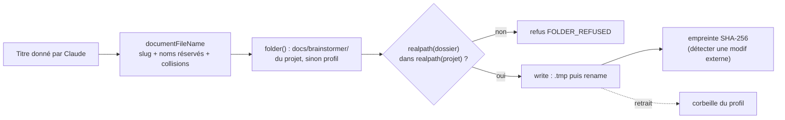

# Fichiers écrits par l'app — chemin choisi par le main, écriture atomique, corbeille

> **En 30 secondes** — Depuis le 05/10, l'app écrit de **vrais fichiers** : documents `.md` rédigés par Claude, dossier d'un nouveau projet, registre de ProjectMaster. Quatre réflexes reviennent partout : (1) **le main choisit le chemin**, jamais l'interface ni Claude ; (2) on vérifie que le chemin **reste dans son dossier**, même à travers un lien symbolique ; (3) on écrit **d'un coup** (fichier temporaire puis renommage) ou **sans écraser** ; (4) on ne **supprime** jamais : corbeille.



---

## 1. Vue Macro & Utilité (le « Pourquoi »)

- **Problématique** : jusqu'ici tout vivait dans la **base chiffrée**. Un document utile doit être un **vrai fichier** (lisible dans Obsidian, versionné par git, à côté du code du projet). Mais écrire sur le disque ouvre trois pièges : un **nom piégé** (`../../Windows/…`, `CON.md`), un **dossier détourné** (lien symbolique vers ailleurs), un **fichier à moitié écrit** si l'app plante au milieu. Et un fichier effacé par erreur ne revient pas.
- **Emplacement dans la carte globale** : domaine pur pour les **noms** (`domain/documents/fileName.ts`, `domain/finals/projectPath.ts`, `shared/projects/slug.ts`) ; infrastructure pour le **disque** (`DocumentFiles`, `ProjectFolder`, `HubRegistry`) ; application pour les **décisions** (`DocumentService`, `ProjectService`). L'Historique accepte désormais des **gestionnaires d'entités externes** : annuler un document le restaure **en base ET sur le disque**.
- **Analogie (restauration)** : la **réserve** d'un restaurant. Seul le **chef de réserve** (le main) décide de l'étagère (dossier) et de l'étiquette (nom) ; un fournisseur (Claude) dit seulement « voici des tomates ». On vérifie que l'étagère est **bien dans notre réserve** et pas une porte vers la cave du voisin (lien symbolique). On range un carton **entier** ou rien (écriture atomique). Ce qu'on retire va au **local à déchets triés** (corbeille), pas à la benne. *Où ça boite* : une réserve n'a pas de « Ctrl+Z » ; ici l'Historique sait remettre le carton.

## 2. Le Pont Systémique (sous le capot)

- **Système de fichiers** : écrire un fichier, c'est (a) allouer des blocs, (b) y copier les octets, (c) mettre à jour l'entrée du répertoire. Une coupure entre (b) et (c) laisse un fichier **tronqué**. Un **renommage** dans le même dossier ne déplace pas les octets : il change seulement l'entrée de répertoire, en une opération que le système fait d'un seul tenant — d'où « écrire à côté, puis renommer » (voir [[Glossaire — Écriture atomique (temporaire puis renommage)]]).
- **Résolution de chemin** : `join(dossier, nom)` fabrique une chaîne ; `realpathSync` demande au système **où mène réellement** ce chemin en suivant liens et jonctions. Comparer deux `realpath` est la seule façon sûre de savoir si on reste « dedans ».
- **Source de vérité** : pour un document, c'est **le fichier**. La base garde des versions et l'**empreinte** du dernier contenu connu ; à la relecture, une empreinte différente révèle une modification faite ailleurs (Obsidian, éditeur) → version « externe » enregistrée, pas d'écrasement silencieux.
- **Windows** : noms de périphériques réservés (`CON`, `NUL`, `COM1`…, même avec extension), casse ignorée (collisions comparées en minuscules), `:` interdit (flux alternatifs).

## 3. Analyse du Code & Logique

Extraits de `infrastructure/documents/DocumentFiles.ts`, `infrastructure/projects/ProjectFolder.ts` et `HubRegistry.ts` :

```ts
// ① Le nom vient d'un titre, jamais d'un chemin : slug a-z0-9-, borné, réservés évités, -2/-3 si pris
documentFileName('Plan : budget/été', taken)       // → 'plan-budget-ete.md'

// ② Rester dedans, même à travers un lien symbolique
const dir = join(ref.projectDir, 'docs', 'brainstormer')
if (!isInside(realpathSync(ref.projectDir), realpathSync(dir))) throw new AppError('FOLDER_REFUSED', …)

function isInside(parent: string, child: string): boolean {
  const path = relative(parent, child)               // chemin pour aller de parent à child
  return path !== '' && !path.startsWith('..') && !isAbsolute(path)
}

// ③ Écrire d'un coup
const temporary = join(dir, `.${fileName}.${randomUUID()}.tmp`)
writeFileSync(temporary, content, 'utf8')
renameSync(temporary, path)                          // tout ou rien

// ④ Créer sans jamais écraser (nouveau projet)
writeFileSync(path, file.content, { encoding: 'utf8', flag: 'wx' }) // échoue si le fichier existe

// ⑤ Registre partagé : jamais réécrit s'il est illisible
try { current = JSON.parse(readFileSync(this.path, 'utf8')) }
catch { throw new AppError('VALIDATION', 'Le registre ProjectMaster est illisible : rien n’a été écrit.') }
```

- **Étape 1 — Nommer** : `normalize('NFD')` sépare les accents, on les retire, tout le reste devient `-`. Résultat garanti sans `/`, `\`, `..` ni `:`. Le nom est encore **revérifié** par une regex au moment d'écrire (`^[a-z0-9][a-z0-9-]*\.md$`) : deux contrôles indépendants.
- **Étape 2 — Contenir** : `relative()` qui commence par `..` = on sort du dossier. Appliqué **après** `realpath`, il démasque un `docs/brainstormer` qui serait une jonction vers `C:\Windows`.
- **Étape 3 — Atomicité** : le `.tmp` porte un UUID (deux écritures simultanées ne se marchent pas dessus) et il est supprimé dans `finally` si le renommage échoue.
- **Étape 4 — `wx`** : « write exclusive » — le système refuse de créer un fichier qui existe déjà. Le dossier d'un nouveau projet doit aussi être **absent ou vide**.
- **Étape 5 — Fichier partagé avec un autre outil** : le registre de `/hub` est **vérifié avant** de créer le dossier (un doublon est refusé tôt), réécrit atomiquement, et le texte est **assaini** (le lanceur `pm.bat` le lit au `grep`/`sed` : un guillemet couperait la valeur).

**Bonnes pratiques mises en évidence** : taille bornée (500 Ko par document) ; retrait = renommage vers `documents/.corbeille/` horodaté (copie + suppression si autre lecteur) ; les chemins d'actions finales (spec 013) passent par `checkProjectPath` : relatif, sans `..`, hors `.git`, `node_modules`, `.claude`, fichiers de secrets (`.env`, `*.pem`…) et binaires.

## 4. Synthèse & Prochaine Étape

**À retenir (3 puces max)**
- Le **main** choisit dossier et nom ; l'IA ou l'interface ne fournissent qu'un **titre** ou un **chemin relatif contrôlé**.
- « Dedans » se vérifie sur les chemins **réels** (`realpath`) avec `relative()`, pas par comparaison de chaînes.
- Écrire = `.tmp` + `rename` (ou `wx` pour créer) ; retirer = **corbeille**.

**Lien avec la suite** : écrire est une chose, **lancer** un programme dans ce dossier en est une autre → [[Lancer un programme sans shell — chemin absolu, arguments séparés, listes blanches]].

**Rappel actif**
> **Q :** Pourquoi `startsWith(projectDir)` ne suffit-il pas pour savoir si un fichier est dans le projet ?
> **R :** `C:\projet-bis` commence par `C:\projet` ; et un lien symbolique peut mener ailleurs sous un nom innocent. Il faut `realpath` des deux puis `relative()`.

> **Q :** L'app plante pendant l'écriture d'un document. Qu'y a-t-il sur le disque ?
> **R :** L'ancien fichier intact, et peut-être un `.tmp` orphelin ; jamais un document à moitié écrit.

> **Q :** Que fait l'app si mentalyas modifie le `.md` dans Obsidian ?
> **R :** À la lecture, l'empreinte diffère de la dernière connue : une version « externe » est enregistrée (sans lot d'Historique), rien n'est écrasé. *(L'édition dans l'app et son conflit sont prévus en US3 de la spec 012, pas encore livrés au 06/10.)*

**Pièges fréquents**
- ⚠️ **Oublier Windows** — `con.md`, `aux.txt` sont des périphériques, pas des fichiers ; la casse ne distingue pas deux noms.
- ⚠️ **Réécrire un JSON partagé qu'on n'a pas su lire** — on effacerait le travail de l'autre outil ; mieux vaut refuser.

**Connexions**
- [[Glossaire — Empreinte SHA-256]] — détecter qu'un fichier a changé hors de l'app.
- [[Glossaire — Suppression douce (soft delete)]] — la corbeille est sa version « disque ».
- [[Annuler par lot — journal avant-après, conflit et lot inverse]] — gestionnaires d'entités externes (base + disque).
