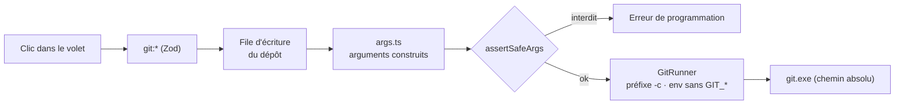

# Git piloté par l'app — préfixe sûr, arguments construits, configuration piégée et push gardé

> **En 30 secondes** — Le volet **Dépôt** fait commit, branches, publier, tirer et pousser **sur clic**. Chaque commande git passe par **un seul fichier** (`domain/git/args.ts`) qui construit les arguments, ajoute un **préfixe sûr** (`-c …` qui écrase la configuration du dépôt) et refuse en dernier recours toute option dangereuse (`--force`, `reset`, `add -A`…). Avant un push, l'app relit **toute la plage** de commits à envoyer pour y chercher des secrets, puis vérifie tes **droits GitHub**.



---

## 1. Vue Macro & Utilité (le « Pourquoi »)

> 📘 **Introduction (ajoutée)** — **C'est quoi, `-c clé=valeur` ?** Une option de git qui fixe un réglage **pour cette commande seulement**. Elle **prime** sur `.git/config` (le réglage du dépôt) et sur la configuration globale. **Pourquoi c'est vital ?** Parce que `.git/config` appartient au **dépôt** : quelqu'un qui te passe un dépôt peut y écrire `core.fsmonitor=programme.exe`, et un simple `git status` lancera ce programme.

- **Problématique** : jusqu'ici, l'app lançait git sur **ses** branches (`analyste/*`) ou pour cloner. La spec 021 ouvre git sur **n'importe quel projet lié**, y compris cloné d'un inconnu. Trois dangers : (1) une **option** qui détruit (`push --force`, `reset --hard`), (2) une **configuration** du dépôt qui exécute du code, (3) un **secret** (`.env`, clé privée) poussé sur GitHub.
- **Emplacement dans la carte globale** : `RepoPanel` / `PushPanel` (renderer) → IPC `git:*` → `GitService`, `SyncService`, `PublishService` (application) → `GitAccess` (dépôt prêt, confiance, configuration à risque) → `GitWriteQueue` → `GitRunner` → `git.exe`. Données : migration `0039_git.sql`.
- **Analogie (électricité)** : le **tableau électrique**. Chaque circuit (commande) passe par un **disjoncteur** (`assertSafeArgs`) qui coupe si l'intensité est anormale. Le **préfixe** est le **différentiel général** posé en amont : peu importe ce que la maison (le dépôt) a branché derrière ses prises, il coupe le courant vers les appareils dangereux (hooks, `fsmonitor`, pager). *Où elle boite* : un disjoncteur réagit à une mesure physique ; `assertSafeArgs` réagit à une **liste de mots** — il ne protège que contre ce qu'on a prévu.

## 2. Le Pont Systémique (sous le capot)

Quand tu cliques « Commit », voici ce que la machine fait :

1. **Processus** : le main appelle `spawn(git.exe, [...préfixe, 'commit', '-F', '-', '--cleanup=strip'], { shell: false })`. Le message n'est **jamais** un argument : il passe par **stdin** (le tuyau d'entrée standard du processus enfant). Un argument de ligne de commande est visible par tout programme qui liste les processus ; stdin ne l'est pas.
2. **Environnement** : `gitEnv()` recopie les variables du système **sauf** les `GIT_*` héritées (`GIT_DIR` pourrait rediriger vers un autre dépôt), puis ajoute `GIT_TERMINAL_PROMPT=0` (jamais d'invite qui bloquerait un processus sans fenêtre), `LC_ALL=C` (messages en anglais stable, donc lisibles par l'app) et, en lecture, `GIT_OPTIONAL_LOCKS=0`.
3. **Disque — le verrou d'index** : git écrit `.git/index.lock` pendant une écriture. Deux écritures simultanées → la seconde échoue. `GitWriteQueue` **enchaîne** les écritures de l'app par dépôt (une chaîne de promesses) ; si `index.lock` existe déjà (un autre programme), réponse `BUSY` — l'app ne **supprime jamais** ce verrou. Les lectures passent hors file, sans prendre le verrou.
4. **Réseau** (push) : `git push --porcelain origin refs/heads/x:refs/heads/x` — une branche vers une branche, sortie machine.

## 3. Analyse du Code & Logique

**Bloc 1 — Le préfixe sûr** (`gitPrefix`)
```ts
const BASE_PREFIX = ['-c','core.quotepath=off', '-c','color.ui=never', '-c','core.pager=cat',
  '-c','core.fsmonitor=false', '-c','core.editor=false',
  '-c','protocol.allow=never', '-c','protocol.https.allow=always', '-c','protocol.ssh.allow=always']
const hooksOff = !options.trusted || options.onPrBranch          // hooks coupés hors confiance, et sur pr/*
return [...BASE_PREFIX, ...(hooksOff ? ['-c', `core.hooksPath=${emptyHooksDir}`] : [])]
```
Les hooks d'un projet **de confiance** tournent (ce sont les tiens : lint, tests) — sauf sur une branche `pr/*`, où le code vient d'un autre.

**Bloc 2 — Le dernier garde-fou** (`assertSafeArgs`)
```ts
const FORBIDDEN_TOKENS   = new Set(['--force','--force-with-lease','--mirror','--all','--delete','--prune',
                                    '--tags','--no-verify','--amend','-A','-a','.'])
const FORBIDDEN_COMMANDS = new Set(['rebase','reset','clean','gc','filter-branch','update-ref','reflog'])
if (command === 'push' && (arg === '-f' || arg.startsWith('+') || arg.startsWith(':'))) throw …
```
Seuls les arguments **avant `--`** sont examinés : après `--`, ce sont des **chemins** (un fichier peut s'appeler `-A`). Une erreur ici = **bug de l'app**, jamais une saisie de mentalyas. Le `+` d'une refspec (`+main:main`) est un push forcé déguisé ; `:main` supprime la branche distante.

**Bloc 3 — La configuration du dépôt classée** (`riskyConfig.ts`)

| Classe | Exemples | Effet |
|--------|----------|-------|
| **Neutralisée** par le préfixe | `core.fsmonitor`, `core.hookspath`, `core.pager`, `diff.*.textconv` | simple mention dans le volet |
| **Bloquante** (aucun `-c` ne la coupe proprement) | `filter.*.clean`, `core.sshcommand`, `credential.helper`, `include.path`, `merge.*.driver` | dépôt non de confiance → **aucune autre commande git** |

Lue par `git config --local --list --name-only` : les **noms** seulement, sans suivre les `include`.

**Bloc 4 — Le push gardé** (`pushRules.ts`, `sensitive.ts`)
```ts
if (findings.some((f) => f.blocking)) return { blocked: 'SENSITIVE_IN_HISTORY' }   // .env, clé privée
if (!ownedByViewer && ['read','triage','none'].includes(permission)) return { blocked: 'NO_WRITE_ACCESS' }
if (isDefaultBranch && !ownedByViewer) return { blocked: 'THIRD_PARTY_DEFAULT_BRANCH' }
```
Les constats viennent de **chaque commit** de la plage (`outgoingNamesArgs`, puis `cat-file blob <commit>:<chemin>`), pas seulement du dernier état : un `.env` ajouté puis supprimé **reste dans l'historique** et partirait avec le push. Un préfixe de jeton est signalé (non bloquant, à accepter un par un) ; l'extrait affiché est **masqué** (`ghp_••••`).

**Bloc 5 — Agir sur l'état vu** : `push({ expectedHead, expectedRemote })`, `merge(expectedUpstreamHead)` — si le dépôt a bougé entre l'aperçu et le clic, l'action est refusée. → [[Glossaire — Concurrence optimiste (agir sur l'état vu)]]

**Bonnes pratiques mises en évidence** : un **point unique** qui construit toutes les commandes (testable en isolant `args.ts`, fonction pure) ; défense en profondeur (schémas `BranchName`/`Hash` → `safeRef` → `assertSafeArgs`) ; l'erreur réseau traduite **en mots**, jamais la sortie brute (elle peut contenir l'adresse avec identifiant).

## 4. Synthèse & Prochaine Étape

**À retenir (3 puces max)**
- Un dépôt est une **donnée non fiable** : `-c` en ligne de commande écrase sa configuration ; ce qui ne s'écrase pas proprement **bloque**.
- Les options destructrices ne sont pas « interdites par consigne » : elles sont **inconstructibles** (`args.ts`) et **refusées** en dernier recours (`assertSafeArgs`).
- Avant un push, on contrôle **toute la plage d'historique**, pas l'état final.

**Lien avec la suite** : quand tirer ne peut pas avancer en ligne droite, il faut fusionner — et parfois résoudre un conflit → [[Conflit de fusion — trois versions lues dans l'index, blocs à décider et aperçu validé]].

**Rappel actif**
> **Q :** Pourquoi le message de commit passe-t-il par stdin plutôt qu'en `-m "…"` ?
> **R :** Constitution I : pas de texte libre en argument. Stdin n'est ni interprété comme option ni visible dans la liste des processus.

> **Q :** Un dépôt cloné contient `filter.lfs.clean = programme`. Que fait l'app, et pourquoi pas un simple `-c` ?
> **R :** Clé **bloquante** : dans un dépôt non de confiance, aucune commande git n'est lancée. Un filtre `clean` tourne dès `git status` ; le neutraliser exigerait de connaître et redéfinir chaque filtre, ce qui changerait aussi le contenu lu.

> **Q :** Tu as commité `.env` puis l'as supprimé au commit suivant. Le push passe-t-il ?
> **R :** Non : le contrôle lit chaque commit de la plage ; le `.env` du premier est un constat **bloquant** (`SENSITIVE_IN_HISTORY`).

**Pièges fréquents**
- ⚠️ **Croire qu'un `git status` est sans effet** — `fsmonitor`, filtres et pager peuvent lancer un programme.
- ⚠️ **Vérifier seulement le dernier état avant un push** — l'historique entier part sur le serveur.
- ⚠️ **Supprimer `index.lock` « pour débloquer »** — un autre programme est peut-être en train d'écrire : corruption possible.

**Connexions**
- [[Lancer un programme sans shell — chemin absolu, arguments séparés, listes blanches]] — la base : pas de shell, programme par chemin absolu.
- [[Glossaire — Principe du moindre privilège]] — les hooks ne tournent que là où tu as donné ta confiance.
- [[Glossaire — Empreinte SHA-256]] — chaque constat a un identifiant stable (`findingId`) pour être accepté une fois.
