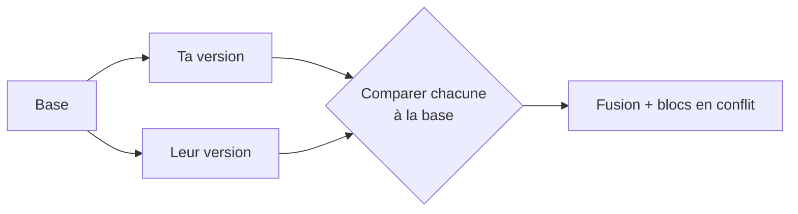

# Fusion à trois voies (base commune)

> **En 30 secondes** — Pour fusionner « ta version » et « la leur », comparer les deux entre elles ne suffit pas : on ne sait pas **qui** a changé quoi. On les compare chacune à leur **ancêtre commun** (la *base*). Ce qui n'a changé que d'un côté est pris d'office ; seul ce qui a changé **des deux côtés, différemment**, est un **conflit**.

## 1. C'est quoi, et pourquoi ça existe ?
- **Problématique** : ta version dit `prix = 12`, la leur dit `prix = 10`. Qui a raison ? Avec deux versions seulement, impossible à dire. Avec la base `prix = 10`, c'est clair : **toi** as changé, eux non → on garde `12`, sans rien demander.
- **Analogie (cuisine)** : la recette d'origine affichée au mur, et deux cuisiniers qui ont chacun annoté leur copie. Le chef compare chaque copie **à l'affiche** : les annotations d'un seul cuisinier sont reportées ; quand les deux ont réécrit la **même étape**, il tranche.

## 2. Comment ça marche (sous le capot)
1. Deux **diffs ligne à ligne** : base → tienne, base → leur (algorithme de plus longue sous-séquence commune : quelles lignes sont restées identiques).
2. On parcourt la base : une ligne intacte **des deux côtés** est **stable**.
3. Une région modifiée d'un seul côté → on prend ce côté. Modifiée des deux côtés de façon **identique** → on la prend une fois. Modifiée des deux côtés **différemment** → **conflit**.

| Base | Tienne | Leur | Résultat |
|------|--------|------|----------|
| A | A | A | A (stable) |
| A | B | A | B (toi seul) |
| A | A | C | C (eux seuls) |
| A | B | B | B (même changement) |
| A | B | C | **conflit** |

## 3. En pratique
Git trouve la base avec `git merge-base` (le dernier commit commun aux deux branches) et, en cas de conflit, la garde dans l'index sous le numéro `:1:` (`:2:` = la tienne, `:3:` = la leur). Le projet refait ce calcul dans `splitHunks` (`domain/git/splitHunks.ts`) pour n'afficher que les blocs à décider.

## Utilisé dans ce cours
- [[Conflit de fusion — trois versions lues dans l'index, blocs à décider et aperçu validé]] — l'algorithme, bloc par bloc, et la proposition de Claude.
- [[Mise à jour réversible — worktree, branche, fusion no-ff et git revert]] — la fusion `--no-ff` de l'Analyste, et `revert -m 1` qui désigne le **parent 1** (la base de `main`).

## Retenir et vérifier
- **À retenir** : sans base, on voit des **différences** ; avec la base, on voit des **changements** (et leur auteur).
> **Q :** Les deux côtés ont supprimé la même ligne. Conflit ? **R :** Non : même changement des deux côtés, il est appliqué une fois.

**Pièges** : ⚠️ une fusion **sans conflit** n'est pas forcément **correcte** : toi tu renommes une fonction, eux ajoutent un appel à l'ancien nom ailleurs — git fusionne sans broncher, le code ne compile plus. Les tests après fusion restent indispensables.
