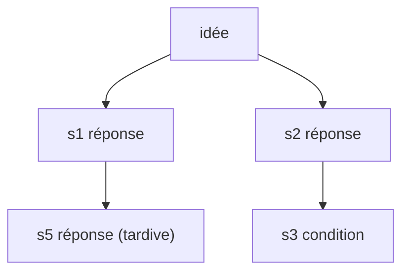

# Parcours en profondeur (DFS)

> **En 30 secondes** — Parcourir un arbre **en profondeur** (*DFS — Depth-First Search*), c'est descendre au bout d'une branche avant de passer à la suivante. En **ordre préfixe**, on écrit chaque nœud **avant** ses enfants : chaque enfant apparaît donc **juste sous son parent**. C'est l'ordre d'une table des matières.

## 1. C'est quoi, et pourquoi ça existe ?
- **Problématique** : un arbre stocké en base est une **liste plate** de lignes `(id, parent_id)`, dans l'ordre de création. Relue telle quelle, une réponse ajoutée tard à la première branche se retrouve **tout en bas**, loin de son parent : un lecteur (humain ou IA) la rattache à la mauvaise branche. Il faut **reconstruire l'arbre** puis le relire dans un ordre qui respecte la hiérarchie.
- **Analogie (restauration)** : faire l'inventaire d'un restaurant **rayon par rayon** : tu vides entièrement la chambre froide (étagère 1, bac 1, bac 2, étagère 2…) avant d'ouvrir la réserve sèche. L'autre stratégie — parcours **en largeur** (*BFS*) — serait de noter d'abord toutes les pièces, puis toutes les étagères de toutes les pièces, puis tous les bacs : complet, mais chaque bac est loin de son étagère.

## 2. Comment ça marche (sous le capot)
1. Une passe sur la liste plate range chaque nœud dans une table `parent → enfants` (`Map`), en **O(n)**.
2. Une fonction **récursive** `walk(nœud, profondeur)` écrit le nœud, puis s'appelle sur chaque enfant avec `profondeur + 1`.
3. Chaque appel empile un **cadre** sur la **pile d'appels** (zone de mémoire où le processeur garde variables locales et adresse de retour) ; il est dépilé quand la branche est finie. Profondeur de l'arbre = hauteur maximale de la pile. Un arbre (ou un objet) trop profond, ou qui **boucle sur lui-même**, fait déborder la pile (*stack overflow*) : d'où les **bornes de profondeur** et les ensembles `seen` (déjà visités).


Ordre de création : s1, s2, s3, s5. **Ordre DFS préfixe** : idée, s1, **s5**, s2, s3 — s5 est lu sous s1.

## 3. En pratique
```ts
// SynthesisContextBuilder.treeText — l'arbre envoyé à Claude au verrouillage
const walk = (node: GrowthNode, depth: number): void => {
  if (seen.has(node.id)) return                     // garde contre un cycle accidentel
  seen.add(node.id)
  lines.push(line(node, alias.get(node.id) ?? '?', depth))   // le nœud AVANT ses enfants (préfixe)
  for (const child of children.get(node.id) ?? []) walk(child, depth + 1)
}
```

## Utilisé dans ce cours
- [[Synthèse vérifiée — contrôles déterministes et provenance]] — l'arbre du verrouillage, écrit branche par branche (30/09).
- [[Cadre résultat — sortie bornée, vue figée et rafales regroupées]] — `checkResult` descend récursivement dans le résultat, borné à 8 niveaux.
- [[Widget branché — autorisation par empreinte et pont postMessage]] — `shapeOf` décrit la structure par la même descente récursive, bornée elle aussi.
- [[Glossaire — Tri topologique de Kahn]] — autre parcours de graphe (par niveaux de dépendance), pour détecter une boucle.

## Retenir et vérifier
- **À retenir** : DFS préfixe = parent puis ses enfants ; récursion = pile d'appels ; toujours borner la profondeur ou marquer les visités.
> **Q :** Pourquoi, après le passage au DFS, une borne de 40 000 caractères coupe-t-elle autre chose qu'avant ? **R :** Avant, la coupe tombait sur les nœuds **les plus récents** (ordre de création) ; maintenant elle tombe sur les **dernières branches** du parcours. La borne a été relevée (12 000 → 40 000) pour que ça n'arrive presque jamais.

**Pièges** : ⚠️ récursion sans borne sur une donnée venue de l'extérieur (un widget, une IA) — c'est une porte ouverte au débordement de pile ; ⚠️ confondre l'**ordre d'affichage** et l'**identité** : les alias `[sN]` restent ceux de l'ordre de création, sinon le contrôle de provenance casserait.

## Évolution du 05/10 — les trois couleurs
Sur un **graphe orienté**, le DFS détecte un cycle en marquant chaque nœud blanc (jamais vu), **gris** (sur le chemin en cours) ou **noir** (fini) : retomber sur un gris = boucle. Utilisé pour les dépendances entre étapes : [[Plan d'attaque — étapes ordonnées, dépendances sans cycle et verrou]].

## Évolution du 07/10 — numéroter comme un sommaire
Les numéros de progression de la carte de structure (1, 1.1, 1.1.1, 1.2, 2…) sont un DFS **préfixe** : on numérote un élément, puis on descend dans ses enfants **avant** de passer à son frère suivant. → [[Carte de structure ordonnée — ordre de progression, tri par dépendances et disposition alternée]]
