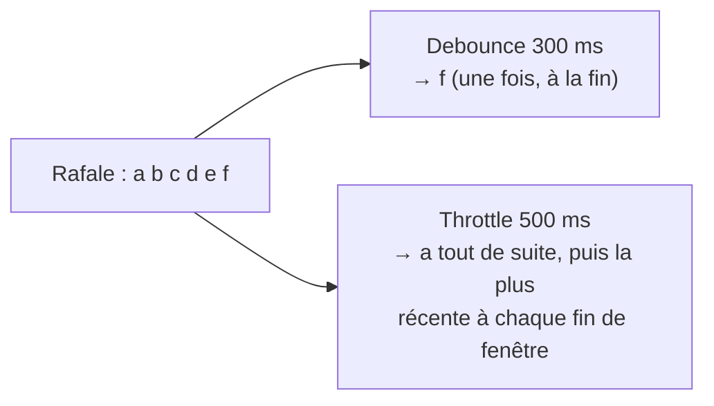

# Throttle et debounce (regrouper des événements)

> **En 30 secondes** — Deux techniques pour ne pas réagir à **chaque** événement d'une rafale. **Debounce** (anti-rebond) : on attend que la rafale **s'arrête**, puis on agit une fois. **Throttle** (limiteur de débit) : on agit **au plus une fois par intervalle**, même si la rafale ne s'arrête jamais.

## 1. C'est quoi, et pourquoi ça existe ?
- **Problématique** : certains événements arrivent par dizaines par seconde (frappe au clavier, fichier modifié, widget qui émet à chaque image d'animation). Réagir à chacun coûte cher (IPC, écriture disque, requête) et ne sert à rien : seule la valeur récente compte.
- **Analogie (Satisfactory)** : **debounce** = un convoyeur qui ne démarre que quand plus aucune pièce n'est arrivée depuis 300 ms (il attend la fin du lot) ; **throttle** = un **répartiteur à débit fixe** qui laisse passer une pièce toutes les 500 ms, quelle que soit la cadence d'entrée. Si l'usine ne s'arrête jamais, le premier ne démarre jamais ; le second débite régulièrement.

## 2. Comment ça marche (sous le capot)
Les deux reposent sur un **minuteur** (`setTimeout`) géré par la boucle d'événements JavaScript : le moteur range le rappel dans une file et l'exécute quand le délai est écoulé et que le fil principal est libre.
- **Debounce** : chaque nouvel événement **annule** le minuteur (`clearTimeout`) et en relance un ; seul le dernier survit.
- **Throttle** (version du projet) : le premier événement part **aussitôt** et ouvre une fenêtre ; pendant la fenêtre, on **remplace** la valeur en attente ; à la fin de la fenêtre, la dernière valeur part et une nouvelle fenêtre s'ouvre.



## 3. En pratique
```ts
// Debounce (CaptureApp.tsx) : brouillon enregistré 300 ms après la dernière frappe
clearTimeout(draftTimer.current)
draftTimer.current = setTimeout(() => void api.invoke('capture:saveDraft', { text }), DRAFT_DEBOUNCE_MS)

// Throttle (emitThrottle.ts) : résultat d'un widget, au plus un toutes les 500 ms, le dernier
push(value) {
  if (timer !== null) { pending = { value }; return }   // fenêtre ouverte : on garde la plus récente
  open(); run(value)                                    // sinon : part tout de suite
}
```

## Utilisé dans ce cours
- [[Cadre résultat — sortie bornée, vue figée et rafales regroupées]] — **throttle** 500 ms sur `gi.output`, côté interface, avant l'IPC.
- [[Coquille de bureau — zone de notification, instance unique et fenêtres cachées]] — **debounce** 300 ms du brouillon de capture rapide (`CaptureApp.tsx`).
- Ailleurs dans le code : **debounce** 250 ms de la recherche de la carte (`CanvasToolbar.tsx`), 1 s de la surveillance du dossier d'import de contexte (`InboxWatcher.ts`, un fichier copié déclenche plusieurs événements système).

## Retenir et vérifier
- **À retenir** : debounce = attendre le calme ; throttle = débit maximal ; choisir selon que la rafale **finit** ou non.
> **Q :** Pourquoi un debounce serait-il faux pour un widget « chronomètre » qui émet toutes les 100 ms ? **R :** La rafale ne s'arrête jamais : le minuteur serait relancé sans fin et **aucun** résultat ne serait jamais écrit.

**Pièges** : ⚠️ oublier d'annuler le minuteur au démontage du composant (le projet appelle `throttle.cancel()` dans le nettoyage de `useEffect`) — sinon un rappel s'exécute pour un widget qui n'est plus affiché.
