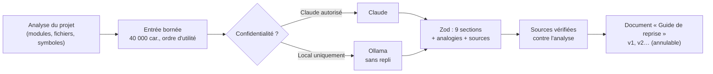
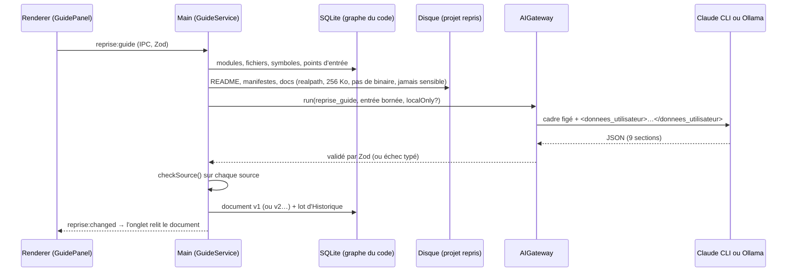

# Guide de reprise — contexte borné, sections fixes et sources vérifiées

> **En 30 secondes** — Quand mentalyas reprend le projet d'un autre, l'app demande à une IA un **guide en 9 sections** (en une phrase, comment le lancer, architecture… par où commencer). L'IA reçoit un **résumé borné** de l'analyse (40 000 caractères au plus), jamais un fichier sensible ; elle répond dans un **format fixé par l'app** ; puis le code **vérifie chaque source qu'elle cite** contre le projet réel et retire les inventions. Le guide devient un **document versionné** du genesis.



---

## 1. Vue Macro & Utilité (le « Pourquoi »)

> 📘 **Introduction (ajoutée)** — **C'est quoi ?** Un *guide de reprise* est la fiche qu'on aimerait recevoir en arrivant sur un projet existant : à quoi il sert, comment le lancer, où sont les portes d'entrée du code, ce qui est risqué. **Comment ça marche ici ?** L'analyse statique (spec 017 US3 : lecture du code par un analyseur syntaxique, sans l'exécuter) a déjà rempli la base avec les modules, les fichiers et les symboles (fonctions, classes). Le guide **résume** cette base et quelques fichiers texte (README, manifestes comme `package.json` ou `composer.json`, `docs/*.md`) pour une IA, qui rédige.

- **Problématique** : une IA qui « résume un projet » invente volontiers un fichier `src/services/AuthService.ts` qui n'existe pas. Le lecteur junior, lui, ne peut pas faire la différence. Et le projet peut appartenir à un employeur : il ne doit **jamais** partir vers un service en ligne si mentalyas l'a classé « Local uniquement ».
- **Emplacement dans la carte globale** : **données** (graphe du code en SQLite) → **processus main** (`GuideService`) → **passerelle IA** (`AIGateway`, tâche `reprise_guide`) → **contrôles déterministes** (`guideSources.ts`) → **documents** (spec 012, versions et Historique) → **interface** (onglet « Guide de reprise » de l'explorateur).
- **Analogie** (restauration) : un chef reprend un restaurant. Le gérant lui remet un **classeur à onglets imposés** (carte, fournisseurs, normes d'hygiène, pièges de la cuisine). Le rédacteur écrit dans chaque onglet, mais **chaque fournisseur cité est vérifié contre le registre des factures** : un nom introuvable est barré et signalé. Et si le restaurant est sous accord de confidentialité, le classeur est rédigé **en interne**, jamais par un consultant extérieur — même si l'interne est moins bon. *Où ça boite* : le registre ne prouve que l'**existence** d'un fournisseur, pas que ce qu'on en dit est vrai (voir Section 3, ⚠️).

## 2. Le Pont Systémique (sous le capot)



Trois mécanismes « machine » à retenir :

1. **La fenêtre de contexte n'est pas élastique.** Ollama, par défaut, garde une petite fenêtre (le nombre de tokens qu'il « voit » à la fois) et **tronque sans erreur** ce qui dépasse. Pour cette seule tâche, la passerelle demande `num_ctx: 32768` et un délai de 10 minutes (un modèle local sur carte graphique grand public rédige lentement 9 sections). → [[Glossaire — Fenêtre de contexte (IA)]]
2. **Lire un fichier d'un autre, c'est lire un terrain hostile.** `readProjectText` résout le chemin **réel** (`realpathSync`, qui suit les liens symboliques), vérifie avec `relative()` qu'il reste **sous** la racine réelle, refuse ce qui n'est pas un fichier ordinaire, dépasse 256 Ko ou contient un octet nul (`\u0000`, signe d'un fichier binaire). → [[Glossaire — Traversée de chemin et lien symbolique]]
3. **Le moteur est décidé avant tout appel réseau.** `localOnly` est calculé par la garde de confidentialité ; s'il est vrai et qu'Ollama ne répond pas, la passerelle échoue **tout de suite** (`AI_UNAVAILABLE`) : pas de repli vers Claude, pas de mise en file. Aucun octet du projet ne quitte la machine.

## 3. Analyse du Code & Logique

**Bloc 1 — Une entrée bornée, dans l'ordre d'utilité** (`RepriseGuideTask.ts`)

```ts
const LIMITS = { modules: 80, entryPoints: 40, readme: 12_000, config: 4_000, configs: 12_000 } as const
// 1) modules, 2) points d'entrée, 3) README, 4) configurations (budget partagé de 12 000 car.)
// 5) l'arborescence remplit la place qui reste, et on DIT combien de chemins ont été omis
let room = GUIDE_INPUT_LIMIT - top.length - title.length - 40
for (const path of input.files) {
  if (path.length + 1 > room) break          // plus de place : on s'arrête net
  tree.push(path); room -= path.length + 1
}
const omitted = input.files.length - tree.length   // « … 1 240 chemins omis »
```

On ne coupe pas « à la fin » au hasard : ce qui a le plus de valeur passe d'abord, et ce qui manque est **compté**, pour que l'IA sache qu'elle ne voit pas tout.

**Bloc 2 — Le format appartient à l'app, pas au modèle** (`shared/ai/schemas.ts`)

```ts
export const GUIDE_SECTION_IDS = ['une_phrase', 'a_quoi_ca_sert', 'lancer', /* … */ 'glossaire'] as const
export const GuideOut = z.object({
  sections: z.array(z.object({
    id: z.enum(GUIDE_SECTION_IDS),              // identifiant stable, pas un titre libre
    analogy: z.string().trim().min(1).max(600), // analogie OBLIGATOIRE (décision D6)
    markdown: z.string().max(8000),
    sources: z.array(z.string().trim().min(1).max(300)).max(20)
  })).length(GUIDE_SECTION_IDS.length)
    .refine((s) => new Set(s.map((x) => x.id)).size === GUIDE_SECTION_IDS.length) // chaque section une fois
  // …
})
```

Les **titres** affichés (« Comment le lancer ») viennent de `GUIDE_SECTION_TITLES`, côté app. L'interface et la vérification s'appuient sur les `id` : un modèle qui reformule un titre ne casse rien.

**Bloc 3 — Vérifier chaque source citée** (`domain/reprise/guideSources.ts`, fonction pure)

```ts
export function checkSource(raw: string, known: KnownSources): string | null {
  const source = parseSource(raw)               // retire `…`, ./, \, :42, #L10-L20
  if (source === null) return null
  if (known.modules.has(source.text)) return source.text              // clé de module
  if (source.symbol !== undefined)                                      // fichier#symbole
    return known.symbolsByFile.get(source.path)?.has(source.symbol) ? `${source.path}#${source.symbol}` : null
  if (known.files.has(source.path) || known.dirs.has(source.path)) return source.path
  // …ou un nom de symbole seul (sans « / »)
}
```

`GuideService` sépare les sources en **gardées** et **introuvables** ; les secondes sont retirées et affichées sous la section : « ⚠️ Introuvables dans le projet, retirées des sources ». Une section vide devient « Non trouvé dans le projet ».

**Bloc 4 — Un document relié par identifiant, versionné** (`GuideService.save`)

```ts
if (existing !== null && this.deps.documentAlive(existing)) {
  documents.write({ documentId: existing, content, mode: 'remplacer', author: 'claude' }) // v2, v3…
} else {
  const { document } = documents.create({ neuronId: genesisId, title: GUIDE_TITLE, content, author: 'claude' })
  reprise.setGuideDocument(genesisId, document.id)   // colonne code_projects.guide_document_id (migration 0029)
}
```

Pourquoi une colonne plutôt que « chercher le document intitulé *Guide de reprise* » ? Parce que mentalyas peut **renommer** le document : un lien par identifiant survit au renommage, une recherche par titre non.

**Bloc 5 — Le moteur imposé** (`AIGateway.run`)

```ts
const localOnly = request.localOnly === true
if (localOnly && !(await providers.ollama.isAvailable()).up) {
  return failure('AI_UNAVAILABLE', "L'IA locale est indisponible, et ce projet n'est jamais envoyé à Claude", true)
}
let engine: Engine = localOnly ? 'ollama' : engineFor(request.kind)
```

**Bonnes pratiques mises en évidence** : contrôle **déterministe** après l'IA (« l'IA propose, le code garantit ») ; minimisation (le cadre du guide ne contient ni profil ni exemples : il parle du projet, pas de l'utilisateur) ; journal du run avec des **nombres seulement** (sections, sources gardées / retirées, durée) ; « refuser plutôt que dégrader en silence » pour la confidentialité.

> ⚠️ **Probable** (code lu, non exécuté) — la vérification prouve qu'une source **existe**, pas qu'elle **dit** ce que le guide affirme. Une phrase fausse appuyée sur un vrai fichier passe le contrôle. C'est la même limite que la provenance de la synthèse : un contrôle d'existence, pas de vérité.

> 🔒 **Faille corrigée le 07/10 (FR-030)** — en lisant `DocumentFiles`, l'agent a vu que le genesis d'un projet repris est **lié à son dossier** : tout document (le guide, ou un `document_ecrire` de Claude) s'écrivait donc dans `<projet>/docs/brainstormer/`, c'est-à-dire **dans le projet de l'employeur**. Correction à la **composition** (`bootstrap.ts`) : pour un projet repris, `projectDir` renvoie `null`, tout reste dans le profil de l'app. → [[Fichiers écrits par l'app — chemin choisi par le main, écriture atomique, corbeille]]

## 4. Synthèse & Prochaine Étape

**À retenir (3 puces max)**
- L'entrée de l'IA est **bornée et ordonnée** (le plus utile d'abord, le reste compté) ; la fenêtre du modèle local est **réglée** pour ne pas tronquer en silence.
- L'app fixe le **format** (9 `id`, analogie obligatoire) et **vérifie** chaque source contre l'analyse : l'invention est retirée et montrée.
- « Local uniquement » = **Ollama ou rien** : pas de repli, pas de file, aucun octet vers Claude.

**Lien avec la suite** : les noms cités dans le guide deviennent des liens qui ouvrent l'explorateur sur l'élément → [[Explorateur de code — du module au bloc, appelants et appelés]].

**Rappel actif**
> **Q :** Pourquoi l'arborescence arrive-t-elle en **dernier** dans l'entrée, et pas en premier ?
> **R :** Elle est la plus longue et la moins dense en sens : elle remplit la place restante après les modules, points d'entrée, README et configurations ; les chemins omis sont comptés pour que l'IA le sache.

> **Q :** Le guide cite `src/Auth/Login.php#check` alors que le fichier existe mais pas la fonction `check`. Que se passe-t-il ?
> **R :** `checkSource` cherche le symbole **dans ce fichier** (`symbolsByFile`) : introuvable → `null` → source retirée et listée sous « Introuvables dans le projet ».

> **Q :** Projet « Local uniquement », Ollama arrêté, « Autoriser Claude en secours » coché. Qui rédige ?
> **R :** Personne : `localOnly` est testé **avant** le repli ; la passerelle rend `AI_UNAVAILABLE`, le message explique que ce projet ne part jamais vers Claude.

> **Q :** Pourquoi mentalyas peut-il renommer le guide sans casser la régénération ?
> **R :** Le projet garde `guide_document_id` ; régénérer écrit une nouvelle version **de ce document**, retrouvé par son identifiant.

**Pièges fréquents**
- ⚠️ **Croire qu'un JSON valide est un guide fiable** — Zod garantit la **forme** (9 sections, une fois chacune) ; seules les vérifications suivantes touchent au **fond** (sources).
- ⚠️ **Faire confiance au réglage par défaut d'un modèle local** — une entrée trop longue n'échoue pas : elle est coupée, et le modèle répond sur un texte amputé.
- ⚠️ **Écrire « dans le dossier du projet » par habitude** — pour un projet repris, ce dossier n'est pas à nous (FR-030).

**Connexions**
- [[Synthèse vérifiée — contrôles déterministes et provenance]] — même famille : l'IA cite, le code vérifie que la citation existe.
- [[Injection de prompt — cadre figé et données balisées]] — un README piégé reste une donnée balisée ; le guide a son propre cadre.
- [[Passerelle IA hybride — un seul point d'accès à l'IA]] — troisième tâche de la passerelle, avec délai et fenêtre propres.
- [[Glossaire — Fenêtre de contexte (IA)]] — pourquoi `num_ctx` doit être demandé.
