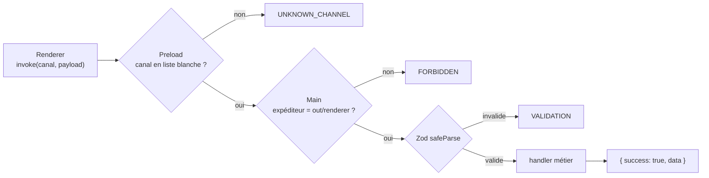

# IPC typé — le guichet unique entre interface et moteur

> **En 30 secondes** — L'interface ne peut que **demander** au processus principal, par un **canal nommé** (`neuron:create`, `fusion:confirm`…). Chaque demande franchit quatre contrôles : canal dans la liste blanche (preload), expéditeur de confiance, données validées par un schéma Zod, puis réponse toujours au même format `{ success, data } | { success: false, error }`. Ici, pas d'API HTTP : l'IPC **est** l'API.



---

## 1. Vue Macro & Utilité (le « Pourquoi »)

> 📘 **Introduction (ajoutée)** — **C'est quoi ?** L'IPC (*Inter-Process Communication* — communication entre processus) est le mécanisme par lequel deux processus séparés échangent des messages. **Comment ça marche ?** Dans Electron, `ipcRenderer.invoke(canal, données)` sérialise les données (copie structurée), les envoie au main, qui a enregistré un gestionnaire (`ipcMain.handle(canal, …)`) ; la valeur renvoyée revient comme une promesse. Voir aussi [[Glossaire — IPC (communication entre processus)]].

- **Problématique** : le main reçoit des messages d'un processus potentiellement compromis. Il doit supposer que **tout ce qui arrive est hostile** jusqu'à preuve du contraire — exactement comme un serveur web face à Internet.
- **Emplacement dans la carte globale** : la **frontière** entre l'interface (spec 003) et le moteur (specs 001-002). C'est ici que la règle « valider aux frontières du système » s'applique.
- **Analogie (restauration)** : le **passe-plat** entre salle et cuisine. Le serveur (renderer) ne rentre jamais en cuisine ; il dépose un **bon de commande** (canal + payload). Le chef de partie (main) vérifie que le plat existe à la carte (liste blanche), que le bon vient bien d'un serveur de la maison (expéditeur), que la commande est complète et lisible (Zod), puis renvoie toujours la même chose : l'assiette **ou** une fiche « impossible, raison : … » (IpcResult).

## 2. Le Pont Systémique (sous le capot)

- **Sérialisation** : l'objet JavaScript du renderer est converti en octets (algorithme de *structured clone*), transite par un tuyau géré par Chromium, puis est reconstruit dans le **tas mémoire du main**. Les fonctions, classes et prototypes ne passent pas : seules des données pures.
- **Asynchrone** : `invoke` renvoie une *Promise* ; l'interface reste fluide pendant que le main travaille (requête SQLite, appel IA de plusieurs secondes).
- **Événements poussés** : dans l'autre sens, le main « diffuse » (`webContents.send`) des événements eux aussi en liste blanche (`neuron:thinking`, `synthesis:stale`, `ai:budgetAlert`…). Le preload retire l'objet `event` d'Electron, qui exposerait `sender`.
- **Erreurs masquées** : une exception imprévue (chemin de fichier, SQL) n'est **jamais** renvoyée ni journalisée en détail : le renderer reçoit `INTERNAL`.

## 3. Analyse du Code & Logique

Extrait de `src/main/ipc/registry.ts` :

```ts
/** Associe un canal, son schéma d'entrée et son handler ; toute entrée invalide lève VALIDATION. */
export function defineRoute<I, O>({ channel, input, handler }: RouteDefinition<I, O>): IpcRoute {
  return {
    channel,
    run: async (payload) => {                     // ① payload: unknown — on ne fait confiance à rien
      const parsed = input.safeParse(payload)     // ② le schéma Zod vérifie forme et types
      if (!parsed.success) throw new AppError('VALIDATION', 'Données invalides')
      return handler(parsed.data)                 // ③ le handler reçoit un objet TYPÉ et sûr
    }
  }
}
// Dispatcher : toute issue devient un IpcResult
try { return { success: true, data: await route.run(payload) } }
catch (error) {
  if (error instanceof AppError) return { success: false, error: { code, message, ...details } } // ④ erreur métier
  logger?.error('ipc.unexpected', { channel })                                                   // ⑤ rien de sensible
  return { success: false, error: { code: 'INTERNAL', message: 'Erreur interne' } }
}
```

- **Étape 1 — `unknown` en entrée** : TypeScript n'a aucune garantie sur ce qui traverse un processus ; le type `unknown` oblige à valider avant usage (règle `strict`, pas de `any`).
- **Étape 2 — Encapsuler validation + handler** : chaque route devient `run(payload: unknown)`. C'est la parade à un problème de typage Zod 4 sur un tableau de routes hétérogènes (JOURNAL, règle 6).
- **Étape 3 — Union discriminée** : `IpcResult<T>` = `{ success: true; data: T } | { success: false; error }`. En testant `result.success`, TypeScript sait lequel des deux on tient.
- **Étape 4 — Contrôle de l'expéditeur** : `isTrustedSender` n'accepte que les fichiers du dossier `out/renderer/` (ou le serveur de dev). Durci lors de la revue sécurité (constat F4).
- **Étape 5 — Canal dupliqué = crash au démarrage** : mieux vaut planter tôt que router au hasard.

**Bonnes pratiques mises en évidence** : **format de réponse uniforme** (même esprit que `{ success, data, error }` des API REST du standard global) ; erreurs **codées** (`VALIDATION`, `STALE`, `DEPTH_LIMIT`) que l'interface peut traduire.

## 4. Synthèse & Prochaine Étape

**À retenir (3 puces max)**
- Tout payload IPC est `unknown` jusqu'à sa validation Zod dans le main.
- Liste blanche **des deux côtés** (preload et main) + vérification de l'expéditeur = défense en profondeur.
- Réponse toujours `IpcResult` ; les détails internes ne sortent jamais.

**Lien avec la suite** : derrière le handler, où va la logique ? → [[Clean Architecture — domaine, application, infrastructure]].

**Rappel actif**
> **Q :** Pourquoi valider dans le main si le preload filtre déjà les canaux ?
> **R :** Le preload ne vérifie que le **nom** du canal, pas le contenu ; et si le renderer est compromis, on ne peut pas se fier à une seule barrière.

> **Q :** Que reçoit l'interface si une requête SQL plante ?
> **R :** `{ success: false, error: { code: 'INTERNAL', message: 'Erreur interne' } }` — jamais le message SQL.

> **Q :** Quel est l'équivalent de l'IPC dans une application web Laravel ?
> **R :** Une route HTTP + un *Form Request* qui valide l'entrée + une réponse JSON uniforme.

**Pièges fréquents**
- ⚠️ **Typer le payload directement** (`(payload: CreateInput) =>`) — TypeScript te croit, mais rien n'a été vérifié à l'exécution.
- ⚠️ **Renvoyer `error.message` brut** — fuite de chemins, de SQL, voire de données.

**Connexions**
- [[Zod ↔ type guards et sortie structurée]] — ce que Zod automatise.
- [[Architecture Electron — trois processus cloisonnés]] — pourquoi il faut un guichet.
