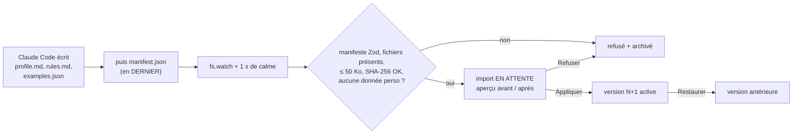

# Import de contexte — paquet vérifié, versionné, réversible

> **En 30 secondes** — « Former » l'agent ne veut pas dire ré-entraîner un modèle : on lui fournit un **profil**, des **règles** et des **exemples**, injectés dans chaque appel. Claude Code dépose ces fichiers dans un **dossier surveillé** ; l'app vérifie le **manifeste**, les **empreintes SHA-256**, la taille, et **refuse** toute donnée personnelle ; elle montre un **aperçu avant/après** ; rien n'est actif avant « Appliquer » ; chaque application crée une **version** restaurable.



---

## 1. Vue Macro & Utilité (le « Pourquoi »)

- **Problématique** : le profil et les règles partent **tels quels** chez Claude, sans anonymisation (c'est leur rôle : décrire ta façon de réfléchir). Un paquet corrompu, tronqué, trafiqué ou contenant un numéro de téléphone serait injecté dans *tous* les appels. Et un mauvais profil doit pouvoir être annulé en un clic. Constitution III : « aperçu validé, versionné, réversible ».
- **Emplacement dans la carte globale** : **frontière fichiers** (disque, `%APPDATA%/…/context-inbox`) → domaine (`bundle.ts`) → application (`ContextImportService`) → alimente l'assemblage du contexte de la passerelle.
- **Analogie (restauration)** : une **livraison avec bon de livraison**. Le livreur dépose les cartons puis, **en dernier**, le bon signé (manifeste). Le réceptionnaire attend que le livreur soit reparti (anti-rebond d'1 s), vérifie que chaque carton listé est là, que les **scellés** sont intacts (SHA-256), qu'aucun carton ne dépasse le poids (50 Ko), qu'aucun produit interdit n'y est (donnée personnelle). La marchandise reste **en quarantaine** (import en attente) jusqu'à la signature du chef (« Appliquer ») ; chaque stock validé est numéroté, on peut revenir au stock précédent.

## 2. Le Pont Systémique (sous le capot)

- **Surveillance du système de fichiers** : `fs.watch` demande à l'OS (Windows : `ReadDirectoryChangesW`) d'être prévenu des changements dans le dossier ; aucune boucle de scrutation qui consommerait du CPU.
- **Pourquoi le manifeste en dernier** : l'écriture de plusieurs fichiers n'est pas atomique ; en ne réagissant **qu'au** `manifest.json`, puis après 1 s sans nouvel événement (*debounce*), on évite de lire un paquet à moitié écrit.
- **SHA-256** (voir [[Glossaire — Empreinte SHA-256]]) : le contenu de chaque fichier est haché ; un seul octet différent change toute l'empreinte → détection de corruption ou de modification après coup.
- **Base de données** : tables `context_imports` (en attente / appliqué / refusé), `context_versions` (versions, dont une version 1 « vide » créée au premier lancement), `examples` (les exemples importés suivent leur version).

## 3. Analyse du Code & Logique

Extrait de `src/main/domain/context/bundle.ts` :

```ts
/** Vrai si le texte contient une donnée que l'anonymisation masquerait. */
export function containsPersonalData(text: string): boolean {
  return applyDeterministicRules(text) !== text          // ① on RÉUTILISE les règles d'anonymisation
}
// dans validateContextBundle :
for (const file of new Set(manifest.data.files)) {
  const content = read(file)
  if (content === null) return { ok: false, error: `Fichier annoncé absent : ${file}` }
  if (content.byteLength > MAX_CONTEXT_FILE_BYTES) return { ok: false, error: `${file} dépasse 50 Ko` }
  const digest = createHash('sha256').update(content).digest('hex')
  if (manifest.data.sha256[file] !== digest) return { ok: false, error: `Empreinte incorrecte : ${file}` } // ②
}
```

- **Étape 1 — Détecteur par différence** (①) : si passer le texte dans l'anonymiseur **le modifie**, c'est qu'il contenait un e-mail, un téléphone, un IBAN, un montant, une adresse… Élégant et **DRY** : une seule source de vérité pour « ce qui est personnel » (règle 13).
- **Étape 2 — Liste blanche de fichiers** : seuls `profile.md`, `rules.md`, `examples.json` sont reconnus (`z.enum`) ; tout autre fichier est ignoré puis archivé.
- **Étape 3 — Exemples contrôlés aussi** : la revue sécurité (F2) a ajouté le même contrôle sur `examples.json` (entrée, raison, sortie).
- **Étape 4 — Exemples appris** : les éclosions confirmées alimentent aussi `ExampleStore` (20 max par type) ; les **3 plus récents** du bon type sont injectés — et anonymisés avant Claude.

**Bonnes pratiques mises en évidence** : **valider aux frontières** (ici un dossier, pas une API) ; résultat `Result<…, string>` avec message explicite pour l'utilisateur ; humain dans la boucle avant activation.

> ⚠️ **Probable (lu, non exécuté)** — le premier profil réel (distillé du `CLAUDE.md` global, sans identité) a été déposé hors dépôt et attend la validation de mentalyas dans Réglages › Contexte IA (JOURNAL, 17:15).

## 4. Synthèse & Prochaine Étape

**À retenir (3 puces max)**
- « Former » l'agent = injecter profil, règles, exemples dans le contexte — pas de ré-entraînement.
- Paquet validé : manifeste, présence, taille, SHA-256, **aucune donnée personnelle** (détectée en réutilisant l'anonymiseur).
- Aperçu → Appliquer → version ; Restaurer à tout moment.

**Lien avec la suite** : retour au sommet du parcours — la passerelle qui consomme ce contexte → [[Passerelle IA hybride — un seul point d'accès à l'IA]] ; ou le pont technique [[Zod ↔ type guards et sortie structurée]].

**Rappel actif**
> **Q :** Pourquoi Claude Code écrit-il `manifest.json` en dernier ?
> **R :** Pour signaler que le paquet est complet : l'app ne réagit qu'au manifeste, puis attend 1 s de calme, et ne lit donc jamais un paquet à moitié écrit.

> **Q :** Comment détecte-t-on une donnée personnelle dans le profil sans nouvelle règle ?
> **R :** On passe le texte dans les règles d'anonymisation : s'il en ressort modifié, il contenait une donnée personnelle.

> **Q :** Pourquoi le profil doit-il être irréprochable alors que les idées sont anonymisées ?
> **R :** Parce que le profil est envoyé **non anonymisé** dans chaque appel Claude.

**Pièges fréquents**
- ⚠️ **Réagir au premier fichier créé** — on lirait un paquet incomplet.
- ⚠️ **Activer un import sans aperçu** — un profil mal distillé changerait silencieusement le ton de toutes les réponses.

**Connexions**
- [[Anonymisation en deux couches]] — la source des règles réutilisées.
- [[Injection de prompt — cadre figé et données balisées]] — où le profil est placé (après le cadre, comme donnée).
- [[Glossaire — Empreinte SHA-256]] — les scellés du paquet.
