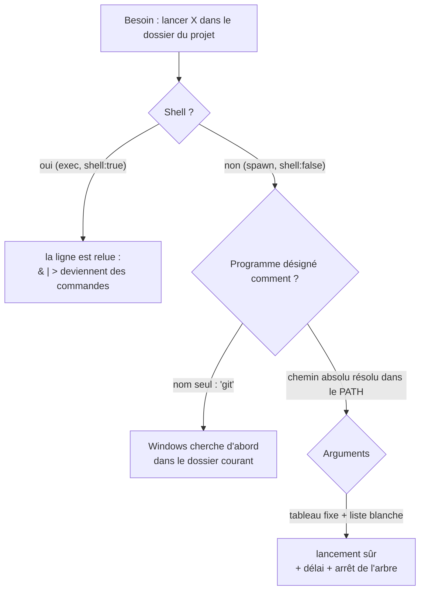

# Lancer un programme sans shell — chemin absolu, arguments séparés, listes blanches

> **En 30 secondes** — L'app lance maintenant des programmes : `claude`, `git`, `npm run test`, un éditeur. Trois règles les rendent sûrs : (1) **pas de shell** — le programme reçoit ses arguments un par un, aucun interpréteur ne les relit ; (2) le programme est désigné par son **chemin absolu**, jamais par son seul nom (sinon Windows cherche d'abord **dans le dossier courant**) ; (3) ce qui peut varier passe par une **liste blanche** (scripts approuvés au texte près, extensions ouvrables, caractères permis).



---

## 1. Vue Macro & Utilité (le « Pourquoi »)

> 📘 **Introduction (ajoutée)** — **C'est quoi, un shell ?** Un **interpréteur de commandes** (`cmd.exe`, PowerShell, bash) : il lit une **ligne de texte**, la découpe, interprète les caractères spéciaux (`&` = enchaîner, `|` = tuyau, `>` = rediriger, `%VAR%` = variable) puis lance les programmes. **Et l'injection de commande ?** Glisser ces caractères dans une donnée qui finit dans la ligne : `rapport.md & del /q *` devient **deux** commandes (OWASP A03 — Injection).

- **Problématique** : avec les actions finales (spec 013), Claude **exécute** un travail dans le dossier d'un projet : écrire des fichiers, lancer les tests. Avec la spec 016, l'app fait `git init` et un premier commit. Avec la visionneuse, elle ouvre un fichier dans l'éditeur. Chaque lancement est une **porte** : un nom de fichier, un nom de script ou un dépôt cloné pourraient faire exécuter autre chose que prévu.
- **Emplacement dans la carte globale** : uniquement dans l'**infrastructure** du main (`infrastructure/claude/`, `finals/CommandRunner.ts`, `editor/EditorLauncher.ts`, `projects/GitCli.ts`), appelée par des services qui ont déjà **décidé** quoi lancer. Ni l'interface ni Claude ne fournissent un programme ou une ligne de commande.
- **Analogie (multiprise)** : un shell, c'est une **multiprise inconnue** posée entre le mur et l'appareil : elle peut contenir un minuteur, un relais caché, une dérivation. Brancher **directement** l'appareil (spawn sans shell) supprime l'intermédiaire. Et désigner le programme par son chemin absolu, c'est brancher **cet** appareil-là, pas « le premier appareil appelé "git" qui traîne dans la pièce ». *Où ça boite* : un appareil branché en direct peut lui-même être dangereux — d'où les listes blanches sur **ce qu'on lui demande**.

## 2. Le Pont Systémique (sous le capot)

- **Création d'un processus sous Windows** : `CreateProcess` reçoit **un nom d'exécutable** et **une ligne d'arguments**. Avec `shell: true`, Node lance en fait `cmd.exe /d /s /c "<ligne>"` — c'est `cmd` qui interprète. Avec `shell: false`, Node appelle directement le programme et **cite** chaque argument : `&` reste un caractère dans un argument.
- **Ordre de recherche d'un exécutable par son nom** : le dossier **courant** est consulté **avant** le `PATH` (comportement historique de Windows). Or `cwd` = dossier du projet → un `git.exe` piégé dans un dépôt cloné serait lancé à la place du vrai. D'où `resolveGit()` : parcourir le `PATH`, garder **uniquement les dossiers absolus**, retourner le chemin complet.
- **Scripts batch** : `.cmd`, `.bat`, `.ps1` ne sont pas des programmes mais des **scripts interprétés** — les lancer réintroduit un interpréteur. D'où `npm` lancé comme `node.exe npm-cli.js run <script>` et un éditeur accepté seulement s'il est un `.exe` absolu existant.
- **Arbre de processus** : `npm run test` lance Node, qui lance des *workers*. Tuer le parent ne tue pas les enfants ; à l'expiration (5 min), `taskkill /PID … /T /F` arrête **tout l'arbre**.

## 3. Analyse du Code & Logique

Extraits de `infrastructure/projects/GitCli.ts`, `application/finals/CommandService.ts` et `domain/finals/editor.ts` :

```ts
// ① Le programme : chemin absolu, cherché seulement dans les dossiers ABSOLUS du PATH
export function resolveGit(path = process.env['PATH'] ?? ''): string | null {
  for (const dir of path.split(delimiter)) {
    const clean = dir.trim().replace(/^"|"$/g, '')
    if (clean === '' || !isAbsolute(clean)) continue       // '.' ou 'bin' : ignorés
    const candidate = join(clean, 'git.exe')
    if (existsSync(candidate) && statSync(candidate).isFile()) return candidate
  }
  return null
}

// ② Le lancement : sans shell, arguments en tableau, sans invite bloquante
spawn(program, [...args], { cwd, shell: false, windowsHide: true,
  env: { ...process.env, GIT_TERMINAL_PROMPT: '0', LC_ALL: 'C' } })

// ③ Un script npm n'est lancé que s'il est approuvé ET inchangé depuis
if (approval === undefined) return refuse(`« ${script} » n’est pas approuvé …`)
if (approval.scriptText !== text) return refuse(`le texte de « ${script} » a changé depuis son approbation …`)

// ④ Ouvrir avec l'application de Windows : seulement des extensions qui ne s'exécutent pas
export function isSafeToOpen(path: string): boolean {
  return SAFE_TO_OPEN.has(extname(path).toLowerCase())   // .md .ts .json… jamais .js .vbs .cmd .lnk
}
```

- **Étape 1 — Résoudre** : `claude` via `where.exe` (premier `.exe`), `git` via le PATH absolu, l'éditeur à ses **emplacements d'installation connus** (aucune recherche dans le PATH) ou choisi au dialogue natif.
- **Étape 2 — Lancer sans interprète** : `shell: false` partout ; le chemin d'un fichier est **un argument à lui seul** (`['-g', 'fichier:12']` pour VS Code), jamais concaténé dans une ligne.
- **Étape 3 — Approuver au texte près** : l'approbation d'un script garde son **texte** ; si `package.json` change (`"test": "vitest && curl …"`), il faut réapprouver. Même idée que l'empreinte d'un widget : on consent à **un contenu**, pas à un nom.
- **Étape 4 — Liste blanche plutôt que liste noire** : `shell.openPath('x.js')` ferait exécuter le fichier par Windows Script Host. On énumère ce qui est **sûr** à ouvrir ; tout le reste est refusé. Même logique pour les noms de script (`^[A-Za-z0-9:_.-]{1,40}$`) ; et la spec 013 (D5, « Lancer les tests », pas encore codé au 06/10) prévoit de limiter les chemins de test passés à npm à `^[A-Za-z0-9_./@-]{1,200}$`, car **npm, lui, transmet les arguments de ses scripts à un shell**.
- **Étape 5 — Borner** : délai maximal, sortie gardée en **fin** de tampon (20 000 caractères rendus), codes couleur ANSI retirés ; `CI=1`, `NO_COLOR=1` pour une sortie stable.

**Bonnes pratiques mises en évidence** : chaque garde vit à **l'endroit le plus bas** (l'infrastructure), donc aucun service ne peut l'oublier ; échec sans dialogue (`GIT_TERMINAL_PROMPT=0` : pas d'invite d'identifiants qui bloquerait l'app).

> ⚠️ **Probable — à vérifier** (lu, non exécuté) : `resolveNpm()` (`infrastructure/finals/CommandRunner.ts`) parcourt le `PATH` **sans** écarter les dossiers relatifs, contrairement à `resolveGit()`. Si le `PATH` contenait une entrée relative (rare), `node.exe` pourrait être résolu relativement au dossier de l'app puis lancé avec `cwd` = projet. Même classe de risque que celle corrigée pour git le 06/10 ; le filtre `isAbsolute` serait la correction naturelle.

## 4. Synthèse & Prochaine Étape

**À retenir (3 puces max)**
- **Jamais de shell** : `spawn(cheminAbsolu, [args…], { shell: false })`.
- Un programme se désigne par son **chemin absolu** ; sous Windows, un nom seul cherche d'abord dans le dossier courant.
- Ce qui varie passe par une **liste blanche** ; un consentement porte sur un **texte**, pas un nom.

**Lien avec la suite** : ces lanceurs servent l'**action finale** — Claude exécute un travail, l'app en garde le livrable (fichiers, différences, tests) ; le sujet reste ouvert avec la spec 014 Phase 2 (modes de permission).

**Rappel actif**
> **Q :** Pourquoi `spawn('git', …, { cwd: projet })` est-il dangereux sous Windows, et pas `spawn('C:\\…\\git.exe', …)` ?
> **R :** Le nom seul est d'abord cherché dans le dossier courant, c'est-à-dire le projet, qui peut contenir un `git.exe` piégé ; le chemin absolu désigne un fichier précis.

> **Q :** `npm run test` est approuvé. Claude modifie `package.json` pour que `test` lance aussi une autre commande. Que se passe-t-il ?
> **R :** Le texte du script ne correspond plus à celui approuvé : refus, mentalyas doit le relire et le réapprouver.

> **Q :** Pourquoi lancer `node npm-cli.js` plutôt que `npm.cmd` ?
> **R :** `npm.cmd` est un script batch : il faudrait `cmd.exe` pour l'interpréter, donc un shell. `node.exe` est un vrai programme.

**Pièges fréquents**
- ⚠️ **« J'échappe les guillemets moi-même »** — chaque shell a ses règles (`^` pour cmd, backtick pour PowerShell) ; la seule échappée fiable est de ne pas avoir de shell.
- ⚠️ **Liste noire d'extensions** — on oublie toujours une extension exécutable (`.hta`, `.scr`, `.lnk`…).

**Connexions**
- [[Permissions relayées — l'humain dans la boucle d'un agent]] — règles de commande au texte exact, même philosophie.
- [[Widget branché — autorisation par empreinte et pont postMessage]] — consentir à un contenu précis.
- [[Glossaire — Traversée de chemin et lien symbolique]] — les chemins passés en argument sont contrôlés avant.

## Évolution du 07/10 — npm écrit dans la constitution, et des commandes git jamais lancées
- **Constitution 4.2.0 puis 4.2.1** : `npm` rejoint la liste des programmes que l'app peut lancer, **limité** aux scripts `typecheck`, `lint`, `test` et à `prettier --check`, dans un worktree `analyste/*`. La 4.2.1 **clarifie** que `node` + `npm-cli.js` (chacun par chemin absolu) n'est pas un « interpréteur intermédiaire » au sens du principe I, qui vise les **shells** — exactement le mécanisme décrit plus haut pour `npm.cmd`.
- **Spec 019 (conçue, pas codée)** : en plus de la liste blanche, une **liste de commandes git jamais lancées** (`push`, `reset`, `rebase`, `--force`, `checkout` dans le dépôt principal), vérifiée par un test qui inspecte **toutes** les commandes d'un parcours ; noms de branche **générés par l'app** (slug `[a-z0-9-]`), jamais fournis par Claude. → [[Mise à jour réversible — worktree, branche, fusion no-ff et git revert]]
