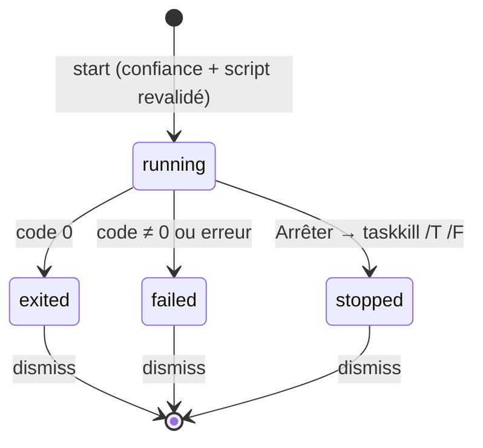

# Lancer un projet — processus de longue durée, sortie par lots bornée et arbre de processus

> **En 30 secondes** — Le bouton **▶** d'un projet lié lance un script de son `package.json` (`dev` par défaut). Le projet doit être **de confiance** ; le nom du script est **revérifié** dans le `package.json` au moment du clic ; l'app lance `node npm-cli.js run <script>` **sans shell**. La sortie s'affiche dans un panneau, par petits paquets, et seules les **2 000 dernières lignes** sont gardées. « Arrêter » (ou fermer l'app) tue **tout l'arbre** de processus. « Ouvrir dans le navigateur » n'accepte qu'une adresse **locale annoncée par ce lancement**.



---

## 1. Vue Macro & Utilité (le « Pourquoi »)

> 📘 **Introduction (ajoutée)** — **Processus de longue durée ?** Jusqu'ici, l'app lançait des programmes **courts** (git, tsc) : on attend la fin, on lit le résultat. Un serveur de dev (`vite`, `electron-vite dev`) **ne se termine pas** : il tourne jusqu'à ce qu'on l'arrête et écrit au fil de l'eau. Il faut donc **suivre** un processus vivant, pas attendre son résultat.

- **Problématique** : mentalyas travaille sur un projet dans l'app, puis doit ouvrir un terminal pour taper `npm run dev`. On veut un clic. Mais lancer un script, c'est **exécuter du code du projet** : il faut une décision explicite (la confiance), et ne jamais lancer autre chose que ce qui est écrit dans le `package.json`.
- **Emplacement dans la carte globale** : `RunButton` / `RunPanel` + `runStore` (renderer) → IPC `run:start|stop|openUrl…` (et événements `run:output`, `run:changed`) → `RunService` (application) → `node` + `npm-cli.js` (résolus par `NpmCli`, déjà utilisé par l'Analyste) → processus enfant.
- **Analogie (Satisfactory)** : poser une **machine** qui tourne en continu. Sa sortie part sur un **convoyeur** ; on ne pose pas chaque pièce une par une sur le tableau de bord, on les **groupe par caisses** (lots de 80 ms) ; le stockage en bout de ligne a une **capacité fixe** (2 000 lignes) : quand il est plein, les plus vieilles pièces tombent. Et l'interrupteur coupe la machine **et tout ce qu'elle a branché derrière**.

## 2. Le Pont Systémique (sous le capot)

- **Arbre de processus** : `node npm-cli.js run dev` crée un processus `node` (npm), qui **lui-même** lance la commande du script (`vite`, `electron-vite`…) dans un shell — npm le fait toujours pour un script ; c'est **précisément** pourquoi la confiance est exigée. Ce petit-enfant lance parfois d'autres processus (Electron…). Tuer seulement le premier `node` laisserait les autres **orphelins**, port 5173 occupé. → [[Glossaire — Arbre de processus (enfants, taskkill T)]]
- **Flux standard** : `stdio: ['ignore', 'pipe', 'pipe']` — pas d'entrée (aucune invite ne peut bloquer), sortie et erreurs dans deux **tuyaux** lus par le main. Chaque `data` arrive en `Buffer` (octets) de taille arbitraire, parfois au milieu d'une ligne.
- **Mémoire** : `run.lines` est un tableau **borné** ; au-delà de 2 000 lignes, `slice(-2000)` garde la fin. Sans borne, un serveur bavard rempli des heures ferait grossir la RAM du main sans limite.
- **IPC** : un événement par `data` saturerait le canal vers le renderer (des centaines par seconde au démarrage de Vite). Un **minuteur de 80 ms** accumule (`pending`) puis envoie un seul paquet.

## 3. Analyse du Code & Logique

**Bloc 1 — Trois vérifications avant de lancer** (`RunService.start`)
```ts
if (!this.deps.isTrusted(projectKey(dir))) throw new AppError('NOT_TRUSTED', …)       // ① décision de mentalyas
const scripts = this.readScripts(dir)                                                   // ② package.json RELU maintenant
if (!scripts.some((entry) => entry.name === script)) throw new AppError('UNKNOWN_SCRIPT', …)
if (already !== undefined) throw new AppError('ALREADY_RUNNING', …)                     // ③ pas deux fois le même
```
Le nom vient du renderer : il est **comparé** à la liste relue, jamais utilisé tel quel. Les noms admis suivent `^[A-Za-z0-9:._-]{1,100}$` (`scriptsOf`).

**Bloc 2 — Le lancement** 
```ts
spawn(npm.node, [npm.npmCli, 'run', script], { cwd: dir, shell: false, windowsHide: true,
  env: { ...process.env, FORCE_COLOR: '0', NO_UPDATE_NOTIFIER: '1' }, stdio: ['ignore', 'pipe', 'pipe'] })
```
`FORCE_COLOR: '0'` limite les codes couleur ANSI dans la sortie (le panneau n'est pas un terminal). Le dossier est passé par `realpath` et **refusé** s'il contient (ou est contenu dans) le dossier de données de l'app.

**Bloc 3 — Lots et borne** (`append` / `flush`)
```ts
run.pending += text
if (run.timer !== null) return                                   // un minuteur est déjà armé
run.timer = setTimeout(() => this.flush(run), RUN_LIMITS.flushMs) // 80 ms
// flush : découpe en lignes (split /(?<=\n)/ garde le \n), ajoute, garde les 2 000 dernières, émet UN événement
```
C'est un **throttle** : au plus un envoi toutes les 80 ms, rien n'est perdu (tout ce qui arrive entre-temps part dans le paquet suivant).

**Bloc 4 — Ouvrir une adresse : seulement celle annoncée** (`openUrl`, `shared/run/urls.ts`)
```ts
if (!localUrls(run.lines.join('') + run.pending).includes(url)) throw new AppError('VALIDATION', …)
// LOCAL_URL : http(s)://localhost | 127.0.0.1 | 0.0.0.0 | [::1], suivi d'un port et d'un chemin ;
// (?![\w-]|\.[\w-]) refuse « localhost.exemple.org » ; codes ANSI retirés ; 0.0.0.0 → localhost
```
Le renderer ne peut pas faire ouvrir **n'importe quelle** adresse par `shell.openExternal` : seulement une adresse **locale** que **ce** processus a écrite.

**Bonnes pratiques mises en évidence** : revalider au **moment de l'action** (pas au moment de l'affichage) ; borner toute accumulation ; regrouper les événements fréquents ; arrêter **l'arbre**, et tout arrêter à la fermeture (`stopAll`).

## 4. Synthèse & Prochaine Étape

**À retenir (3 puces max)**
- Lancer un script = exécuter le code du projet : **confiance** + nom **revalidé** dans le `package.json` relu.
- Un processus de longue durée se **suit** : sortie par lots, mémoire bornée, états explicites.
- Arrêter = tuer **tout l'arbre** (`taskkill /T /F` sous Windows), sinon des orphelins gardent le port.

**Lien avec la suite** : ce que l'on lance ou dessine peut aussi vivre dans un widget, avec ses propres réglages → [[Réglages déclarés par un widget — le widget décrit, l'app dessine et ramène chaque valeur]].

**Rappel actif**
> **Q :** Pourquoi relire le `package.json` au clic, alors que la liste des scripts est déjà affichée ?
> **R :** Le fichier a pu changer depuis (Claude, git pull) : on ne lance que ce qui existe **maintenant**, et le nom reçu de l'interface n'est jamais une commande.

> **Q :** Le serveur Vite affiche `Local: http://localhost:5173/`. Le renderer demande d'ouvrir `http://localhost.evil.org/`. Que se passe-t-il ?
> **R :** Refusé : l'expression exige que l'hôte s'arrête après `localhost` (pas de `.` suivi d'un nom), et l'adresse n'a pas été annoncée par ce lancement.

> **Q :** Que se passerait-il avec un simple `child.kill()` sous Windows ?
> **R :** Seul le `node` de npm meurt ; Vite (petit-enfant) continue, orphelin, et garde le port : le prochain lancement échoue « port déjà utilisé ».

**Pièges fréquents**
- ⚠️ **Envoyer chaque morceau de sortie à l'interface** — saturation de l'IPC et de React ; regrouper.
- ⚠️ **Garder toute la sortie** — fuite mémoire lente sur un serveur qui tourne des heures.
- ⚠️ **« Sans shell » partout ?** — l'app lance npm sans shell, mais **npm** exécute la commande du script dans un shell : la protection, ici, c'est la **confiance**.

**Connexions**
- [[Glossaire — Throttle et debounce (regrouper des événements)]] — le minuteur de 80 ms.
- [[Glossaire — Principe du moindre privilège]] — pas de confiance, pas de lancement.
- [[Piloter Claude Code — processus enfant, flux stream-json et session reprise]] — autre processus enfant suivi au fil de l'eau, mais dont la sortie est du JSON par ligne.
