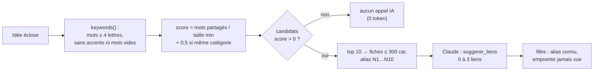

# Liens entre idées — graphe local de mots-clés

> **En 30 secondes** — Quand une idée éclot, on veut la relier aux idées proches. Envoyer **toutes** les idées à Claude coûterait cher. Alors le code fait d'abord un **tri local gratuit** : mots-clés partagés + même catégorie → au plus **10** candidats, envoyés sous forme de **fiches courtes** (alias `N1`…`N10`). Claude propose 0 à 3 liens justifiés ; **aucun appel** si rien n'est proche. Une **empreinte** empêche de reproposer un lien déjà refusé.



---

## 1. Vue Macro & Utilité (le « Pourquoi »)

- **Problématique** : avec 200 idées écloses, comparer « tout avec tout » par IA = des dizaines de milliers de tokens à chaque éclosion. La plupart des paires n'ont **rien** en commun ; payer Claude pour le constater est du gaspillage. Il faut une **présélection** bon marché, puis l'intelligence coûteuse seulement sur les cas prometteurs.
- **Emplacement dans la carte globale** : domaine (`links.ts`, pur) + application (`LinkService`, en arrière-plan après `confirm`) + table `neuron_links` ; historique `change_log` de type `link`.
- **Analogie (logistique)** : dans une centrale d'achat, on n'envoie pas les 10 000 références du catalogue à l'**acheteur expert** (cher) pour trouver des produits complémentaires. Un **magasinier** (le code) filtre d'abord par rayon et mots de l'étiquette, et ne transmet qu'une **short-list de 10 fiches produit**. Si la short-list est vide, on ne dérange pas l'expert. *Origine* : l'idée vient de mentalyas, inspirée de **Graphify** (graphe de connaissances utilisé par le hub) — mais Graphify n'est pas embarqué (Python + extraction elle-même payante) : seul son principe est repris en TypeScript pur.

## 2. Le Pont Systémique (sous le capot)

- **Tout en RAM, tout sur CPU** : `keywords()` normalise (NFD, retrait des accents), découpe sur tout ce qui n'est pas lettre/chiffre, garde les mots ≥ 4 lettres hors liste de mots vides, et range le résultat dans un `Set` (recherche en temps constant). Le score compte l'intersection de deux ensembles.
- **Normalisation par la plus petite fiche** : `partagés / min(|A|, |B|)` — une fiche très longue ne gagne pas juste parce qu'elle contient beaucoup de mots.
- **Coût réseau borné** : fiche cible ≤ 600 caractères, candidats ≤ 300 (≈ 80 tokens chacun) → au pire ~1 000 tokens d'entrée par éclosion.
- **Empreinte SHA-256** (voir [[Glossaire — Empreinte SHA-256]]) : `sha256(idA|idB|libellé normalisé)` avec paire **ordonnée** (A < B) — le lien A→B et B→A ont la même empreinte. Stockée, elle permet en une comparaison de savoir si ce lien a déjà été proposé, accepté ou refusé.
- **Recherche plein texte** (même famille d'idée, côté liste des idées) : une table virtuelle **FTS5** tenue à jour par déclencheurs SQL permet de chercher « ecran » et trouver « écran » (voir [[Glossaire — FTS5 (recherche plein texte)]]).

## 3. Analyse du Code & Logique

Extrait de `src/main/domain/neurons/links.ts` :

```ts
export const MAX_CANDIDATES = 10
export const CANDIDATE_CHARS = 300

function proximity(a: ReadonlySet<string>, b: ReadonlySet<string>, sameCategory: boolean): number {
  let shared = 0
  for (const word of a) if (b.has(word)) shared++                     // ① intersection
  const overlap = shared === 0 ? 0 : shared / Math.min(a.size, b.size) // ② normalisation
  return overlap + (sameCategory ? 0.5 : 0)                           // ③ bonus catégorie
}
export function rankCandidates(target: Fiche, others: readonly Fiche[]): RankedCandidate[] {
  const targetWords = keywords(target.text)
  return others.filter((f) => f.id !== target.id)
    .map((fiche) => ({ fiche, score: proximity(targetWords, keywords(fiche.text), /* même catégorie */) }))
    .filter((e) => e.score > 0)                                       // ④ rien de proche → liste vide → aucun appel
    .sort((a, b) => b.score - a.score).slice(0, MAX_CANDIDATES)
    .map((e, i) => ({ ...e, alias: `N${i + 1}` }))                     // ⑤ jamais d'UUID envoyé
}
```

- **Étape 1 — Graphe implicite** : chaque idée est un nœud, un mot-clé partagé est une arête ; le score est le « poids » de l'arête.
- **Étape 2 — Alias** : Claude reçoit `N1…N10` ; un alias inconnu dans sa réponse est retiré (même logique que `sN`).
- **Étape 3 — Décisions humaines** : accepter / refuser (exemple appris), création manuelle (origine `user`, doublon refusé), renommage, suppression.
- **Étape 4 — FTS sûr** : la saisie de recherche n'est **jamais** passée brute à `MATCH` ; `toFtsQuery` extrait les mots et les cite (`"mot"*`) pour neutraliser les opérateurs FTS (`OR`, `NEAR`, `*`…) — règle 15.

**Bonnes pratiques mises en évidence** : **pré-filtrage déterministe avant l'IA** (règle 22) ; traitement en **arrière-plan** avec événement `links:suggested` pour ne pas retarder la confirmation.

## 4. Synthèse & Prochaine Étape

**À retenir (3 puces max)**
- Présélection locale gratuite (mots-clés + catégorie) → ≤ 10 fiches courtes → Claude ; rien de proche = aucun appel.
- Alias `N1…N10` à l'aller, filtrage des alias inconnus au retour.
- Empreinte SHA-256 de la paire ordonnée + libellé : un lien refusé n'est jamais reproposé.

**Lien avec la suite** : le contexte qui personnalise toutes ces suggestions (profil, exemples appris) → [[Import de contexte — paquet vérifié, versionné, réversible]].

**Rappel actif**
> **Q :** Pourquoi diviser par la taille de la plus petite fiche ?
> **R :** Pour qu'une fiche très longue ne soit pas avantagée simplement parce qu'elle contient beaucoup de mots.

> **Q :** Pourquoi une paire **ordonnée** dans l'empreinte ?
> **R :** Pour que le lien A–B et B–A soient le même lien : une seule empreinte, jamais proposé deux fois.

> **Q :** Que coûte l'éclosion d'une idée sans voisine ?
> **R :** Zéro token pour les liens : la liste de candidats est vide, aucun appel n'est fait.

**Pièges fréquents**
- ⚠️ **Passer la saisie utilisateur brute à `MATCH`** — injection d'opérateurs FTS, voire erreur de syntaxe.
- ⚠️ **Croire que les mots-clés « comprennent » le sens** — « voiture » et « automobile » ne partagent aucun mot ; la présélection est volontairement simple, Claude fait la finesse.

**Connexions**
- [[Budget IA — convertir des tokens en euros]] — pourquoi économiser les tokens.
- [[Glossaire — Empreinte SHA-256]] — la fonction d'empreinte.
- [[Glossaire — FTS5 (recherche plein texte)]] — l'autre recherche locale du projet.

## Évolution du 29/09 — liens dessinés, discrets, et « graines » décidées
- **Affichage** : les liens acceptés sont dessinés sur la carte (trait fin et pâle) ; leur **libellé n'apparaît qu'au survol** du lien ou d'une de ses idées, ou au **focus clavier** (petit magasin Zustand `hoverStore.ts`) — *progressive disclosure* : l'essentiel par défaut, le détail à la demande. Les liens **suggérés** restent visibles, en pointillés, avec ✓ / ✗. Disposition et anti-croisements → [[Carte des idées — simulation de forces et croisements de liens]].
- **Décision de mentalyas (à implémenter, étapes G2/G3)** : un lien intéressant doit faire **germer une nouvelle idée** entre les deux idées reliées — l'IA propose une graine (titre + pourquoi), acceptée elle devient une idée « née de A × B » placée entre ses parents. Rien ne se crée sans acceptation (même principe « l'IA propose, l'humain décide »).
- **Annulation** : accepter/refuser un lien écrit un lot `link` dans l'historique, donc annulable → [[Annuler par lot — journal avant-après, conflit et lot inverse]].

## Évolution du 05/10 — liens libres
> ⚠️ **Correction du 05/10** — La présélection de liens et les graines (`links.ts`, `LinkService`, `SeedService`) sont **retirées** (spec 010 C2). Un lien entre deux idées est désormais un **lien libre** (`canvas:createLink`, libellé visible, annulable), tiré à la main ou posé par Claude via l'outil MCP `relier`. Les anciens liens acceptés ont été convertis en liens libres au premier démarrage. Les notions de cette note (mots-clés, empreintes) restent utiles comme technique d'économie de jetons.
