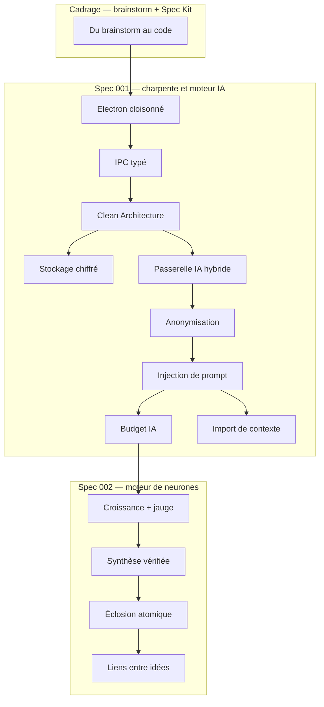

# Gestionnaire idées — Map of Content

> **En résumé** : en une journée, le projet est passé d'une idée (« noter vite mes idées ») à un **Brainstormer** : une app de bureau Electron où chaque idée est un **neurone** qui pousse grâce aux questions d'une IA hybride (Ollama local + Claude), puis **éclot** en plan d'action ou en synthèse. L'idée qui relie tout : **l'IA propose, le code garantit, l'humain décide** — chaque couche (processus, IPC, base, passerelle IA, contrôles) ajoute une barrière vérifiable.
>
> ⚠️ **Note de fiabilité** : il n'y a pas de cours de professeur pour ce projet — tout le parcours est tiré de **l'implémentation** (`src/`, `tests/`), du **cadrage** (`docs/FOUNDATION.md`, `docs/brainstorm/`, `.specify/memory/constitution.md`, `specs/001-003`) et du `docs/JOURNAL.md`. Le code a été **lu, pas exécuté** : les comportements décrits sont ⚠️ *Probables* au sens du protocole, appuyés sur les 305 tests et le journal. Validations réelles encore ouvertes : T031 et T038 (recherche web avec la vraie clé).
>
> Réseau visuel → [[Gestionnaire idées — Réseau.canvas]]

---

## Zéro Electron / IA ? Commence ici
- [[Du brainstorm au code — spécifications et constitution]] — comment une idée devient des exigences puis du code.
- [[Glossaire — LLM (grand modèle de langage)]] — ce qu'est réellement « l'IA » ici.
- [[Glossaire — IPC (communication entre processus)]] — pourquoi deux processus doivent s'écrire.

## Glossaire — notions transversales
- [[Glossaire — IPC (communication entre processus)]] — messages entre mémoires isolées
- [[Glossaire — CSP (Content Security Policy)]] — liste blanche des scripts
- [[Glossaire — LLM (grand modèle de langage)]] — prédire le prochain token
- [[Glossaire — Token (IA)]] — unité de texte et de facturation
- [[Glossaire — Transaction ACID]] — tout ou rien en base
- [[Glossaire — Idempotence]] — rejouer sans doubler
- [[Glossaire — Empreinte SHA-256]] — scellé d'intégrité
- [[Glossaire — Tri topologique de Kahn]] — détecter une boucle
- [[Glossaire — Expression régulière]] — motifs de texte déterministes
- [[Glossaire — FTS5 (recherche plein texte)]] — index inversé SQLite

## Concepts fondamentaux
*À maîtriser en premier — la charpente*
- [[Du brainstorm au code — spécifications et constitution]] — des exigences avant le code
- [[Architecture Electron — trois processus cloisonnés]] — main, preload, renderer
- [[IPC typé — le guichet unique entre interface et moteur]] — valider à la frontière
- [[Clean Architecture — domaine, application, infrastructure]] — ports, adaptateurs, injection

## Concepts intermédiaires
*Nécessitent les fondamentaux — données et moteur IA (spec 001)*
- [[Stockage local chiffré — SQLite, SQLCipher et DPAPI]] — base illisible sans ta session
- [[Passerelle IA hybride — un seul point d'accès à l'IA]] — routage, file, validation
- [[Anonymisation en deux couches]] — regex + IA locale qui liste
- [[Injection de prompt — cadre figé et données balisées]] — données ≠ consignes
- [[Budget IA — convertir des tokens en euros]] — coût réel et plafond

## Concepts avancés
*Le moteur de neurones (spec 002) et l'import de contexte*
- [[Croissance d'un neurone — arbre, garde-fous et jauge]] — l'IA propose, le code garantit
- [[Synthèse vérifiée — contrôles déterministes et provenance]] — P1–P6, Kahn, anti-hallucination
- [[Éclosion atomique — transaction, version et historique]] — tout ou rien, `STALE`, historique
- [[Liens entre idées — graphe local de mots-clés]] — présélection gratuite avant Claude
- [[Import de contexte — paquet vérifié, versionné, réversible]] — former l'agent sans ré-entraîner

## Ponts outil ↔ mécanisme
- [[Drizzle ORM ↔ SQL paramétré et migrations]] — ce que l'ORM fait à ta place (et pourquoi pas Prisma)
- [[Zod ↔ type guards et sortie structurée]] — un schéma pour l'IPC, pour guider l'IA et pour la vérifier

## Ordre d'apprentissage recommandé
0. [[Du brainstorm au code — spécifications et constitution]] — le pourquoi de toutes les règles qui suivent
1. [[Architecture Electron — trois processus cloisonnés]] — la charpente physique (processus, mémoire)
2. [[IPC typé — le guichet unique entre interface et moteur]] — la seule porte d'entrée
3. [[Clean Architecture — domaine, application, infrastructure]] — où range-t-on la logique
4. [[Stockage local chiffré — SQLite, SQLCipher et DPAPI]] — puis le pont [[Drizzle ORM ↔ SQL paramétré et migrations]]
5. [[Passerelle IA hybride — un seul point d'accès à l'IA]] — puis le pont [[Zod ↔ type guards et sortie structurée]]
6. [[Anonymisation en deux couches]] — la première garde avant Internet
7. [[Injection de prompt — cadre figé et données balisées]] — la deuxième garde
8. [[Budget IA — convertir des tokens en euros]] — la garde financière
9. [[Croissance d'un neurone — arbre, garde-fous et jauge]] — le cœur métier
10. [[Synthèse vérifiée — contrôles déterministes et provenance]] — contrôler l'IA
11. [[Éclosion atomique — transaction, version et historique]] — écrire sans risque
12. [[Liens entre idées — graphe local de mots-clés]] — relier en économisant
13. [[Import de contexte — paquet vérifié, versionné, réversible]] — personnaliser l'agent

> 🔁 **Répétition espacée** : notes 9 à 11 denses → **revoir dans 2 jours**, en refaisant les « Rappel actif » sans regarder les réponses.

## Questions de révision globale
> **Q :** Suis une réponse de l'utilisateur, de son clic jusqu'au disque puis jusqu'à Claude : quelles barrières traverse-t-elle ?
> **R :** Preload (canal en liste blanche) → main (expéditeur de confiance, Zod) → `GrowthService` (transaction SQLite chiffrée, `UNIQUE` anti-doublon, événement immédiat) → `AIGateway` (routage, budget, anonymisation, cadre figé + données balisées, sémaphore) → réponse validée par Zod → garde-fous déterministes (doublons, profondeur, plancher de jauge).

> **Q :** Donne trois endroits où « l'IA propose, le code garantit ».
> **R :** Au moins 3 extensions et plancher de jauge (`guards.ts`) ; contrôles P1–P6 du plan (`planChecks.ts`, `provenance.ts`) ; alias inconnus et empreintes de liens filtrés (`links.ts`).

> **Q :** Pourquoi les montants sont-ils en **entiers** partout (centimes, millicentimes) ?
> **R :** Les flottants binaires ne représentent pas exactement les décimales ; les entiers évitent toute dérive dans les sommes (budget) et les comparaisons (provenance).

> **Q :** Quelle est la différence entre une barrière *déterministe* et une consigne dans le prompt ?
> **R :** Le code applique toujours la barrière et se teste ; le LLM peut ignorer une consigne. Les règles critiques sont donc codées, le prompt ne fait que guider.

## Ressources complémentaires
- Cadrage : `docs/FOUNDATION.md` (§0 amendements Brainstormer prioritaires), `docs/brainstorm/L1-…L4c-*.md`, `.specify/memory/constitution.md` (v1.1.0)
- Specs : `specs/001-moteur-ia-hybride/`, `specs/002-structuration-ia/`, `specs/003-interface-mvp1/` (spec, plan, research, data-model, contracts, tasks, analysis-report)
- Sécurité : `docs/SECURITY-REVIEW-001.md` (constats F1–F5)
- Journal : `docs/JOURNAL.md` — table « Règles apprises » (23 règles citées dans les notes par leur numéro)
- Code clé : `src/main/index.ts`, `src/main/bootstrap.ts`, `src/main/ipc/registry.ts`, `src/main/application/ai/AIGateway.ts`, `src/main/domain/neurons/*.ts`, `src/main/application/neurons/*.ts`
- Graphe : `graphify-out/GRAPH_REPORT.md` (1 214 nœuds, 83 communautés ; nœuds centraux : `GrowthRepository`, `ContextRepository`, `NeuronService`, `AIGateway`)
- 💡 Glisse ces notes dans NotebookLM / Gemini si tu veux un *study guide* ou un quiz audio.
