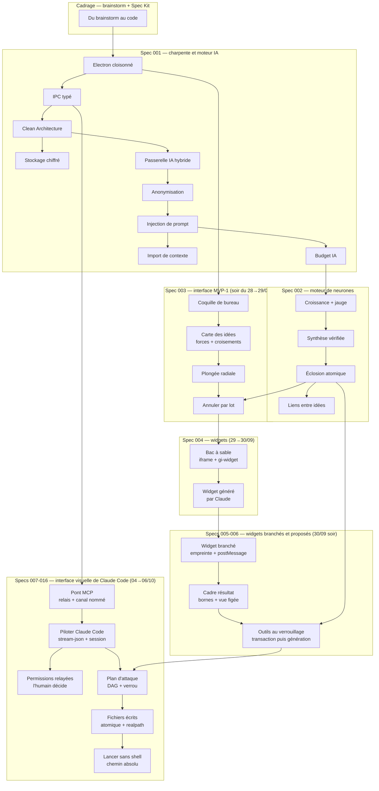

# Gestionnaire idées — Map of Content

> **En résumé** : en une journée, le projet est passé d'une idée (« noter vite mes idées ») à un **Brainstormer** : une app de bureau Electron où chaque idée est un **neurone** qui pousse grâce aux questions d'une IA hybride (Ollama local + Claude), puis **éclot** en plan d'action ou en synthèse. L'idée qui relie tout : **l'IA propose, le code garantit, l'humain décide** — chaque couche (processus, IPC, base, passerelle IA, contrôles) ajoute une barrière vérifiable.
>
> ⚠️ **Note de fiabilité** : il n'y a pas de cours de professeur pour ce projet — tout le parcours est tiré de **l'implémentation** (`src/`, `tests/`), du **cadrage** (`docs/FOUNDATION.md`, `docs/brainstorm/`, `.specify/memory/constitution.md`, `specs/001-003`) et du `docs/JOURNAL.md`. Le code a été **lu, pas exécuté** : les comportements décrits sont ⚠️ *Probables* au sens du protocole, appuyés sur les 305 tests et le journal. Validations réelles encore ouvertes : T031 et T038 (recherche web avec la vraie clé).
>
> Réseau visuel → [[Gestionnaire idées — Réseau.canvas]]

> 🆕 **Session du 04→06/10 (specs 007 à 016)** : virage de la vision — le Brainstormer devient **l'interface visuelle de Claude Code**. Claude lit et dessine la carte par un **pont MCP**, chaque idée est une **conversation `claude -p`**, l'API Anthropic disparaît, l'ancien moteur de neurones est **retiré** (≈ 13 400 lignes). Puis : plan d'attaque, documents Markdown, actions finales qui écrivent dans un vrai projet, permissions relayées en cartes, genesis → projet avec git. Nouvelles notes : 6 concepts, 5 glossaires ; blocs « Évolution » ajoutés dans 21 notes existantes. ⚠️ **Huit d’entre eux sont des corrections** : passerelle, anonymisation, budget, croissance, synthèse, liens, plongée, outils au verrouillage — ces modules **n'existent plus dans le code** (tables gardées en archive). Les notes restent des cours valables sur leurs techniques.

> 🆕 **Session du 28→29/09 (spec 003)** : l'app devient **visible et utilisable** — icône de notification, capture rapide au raccourci, carte des idées sans croisements, plongée en couronne, aperçu éditable, éclosion animée, historique avec « Annuler ». Nouvelles notes : 4 concepts, 1 pont, 2 glossaires ; blocs « Évolution du 29/09 » ajoutés dans 4 notes existantes (Electron, Éclosion, Liens, Zod).

> 🆕 **Session du 29→30/09 (cycle 2, économies, spec 004)** : Claude **fabrique des outils** (mini-widgets) directement sur la carte, et ce code s'exécute dans un enclos dont il ne peut pas sortir. Nouvelles notes : 2 concepts, 2 glossaires ; blocs « Évolution du 30/09 » ajoutés dans 10 notes existantes (Electron, CSP, Injection, Passerelle, Budget, Annuler, Éclosion, Carte, Plongée, Brainstorm au code). ⚠️ Deux de ces blocs sont des **corrections** : les zones incubateur/réseau de la note 16 et l'écran de plongée de la note 17 n'existent plus dans le code.

> 🆕 **Après-midi et soir du 30/09 (T070–T072, specs 005 et 006)** : un widget peut **lire** une idée (après ta revue, scellée par une empreinte), **publier** un résultat dans un cadre dédié, et Claude peut **proposer** des outils au verrouillage, créés avec l'éclosion puis générés en arrière-plan. Nouvelles notes : 3 concepts, 3 glossaires ; blocs « Évolution du 30/09 » ajoutés dans 7 notes existantes (Zod, Éclosion, Synthèse, Bac à sable, Widget généré, Croissance, Carte) et une ligne dans 2 glossaires (SHA-256, Origine). ⚠️ Test manuel T016 de la spec 006 lot 2 encore à faire.

---

## Zéro Electron / IA ? Commence ici
- [[Du brainstorm au code — spécifications et constitution]] — comment une idée devient des exigences puis du code.
- [[Glossaire — LLM (grand modèle de langage)]] — ce qu'est réellement « l'IA » ici.
- [[Glossaire — IPC (communication entre processus)]] — pourquoi deux processus doivent s'écrire.

## Glossaire — notions transversales
- [[Glossaire — IPC (communication entre processus)]] — messages entre mémoires isolées
- [[Glossaire — CSP (Content Security Policy)]] — liste blanche des scripts
- [[Glossaire — LLM (grand modèle de langage)]] — prédire le prochain token
- [[Glossaire — Token (IA)]] — unité de texte et de facturation
- [[Glossaire — Transaction ACID]] — tout ou rien en base
- [[Glossaire — Idempotence]] — rejouer sans doubler
- [[Glossaire — Empreinte SHA-256]] — scellé d'intégrité
- [[Glossaire — Tri topologique de Kahn]] — détecter une boucle
- [[Glossaire — Expression régulière]] — motifs de texte déterministes
- [[Glossaire — FTS5 (recherche plein texte)]] — index inversé SQLite
- [[Glossaire — Générateur pseudo-aléatoire à graine (PRNG)]] — du hasard reproductible *(29/09)*
- [[Glossaire — Mise à jour optimiste]] — afficher avant la confirmation *(29/09)*
- [[Glossaire — Origine web et origine opaque]] — qui peut lire quoi dans un navigateur *(30/09)*
- [[Glossaire — Suppression douce (soft delete)]] — marquer au lieu d'effacer *(30/09)*
- [[Glossaire — Donnée dérivée (calculer plutôt que stocker)]] — une seule source de vérité *(30/09 soir)*
- [[Glossaire — Parcours en profondeur (DFS)]] — parent puis ses enfants, et la pile d'appels *(30/09 soir)*
- [[Glossaire — Throttle et debounce (regrouper des événements)]] — débit maximal ou attente du calme *(30/09 soir)*
- [[Glossaire — MCP (Model Context Protocol)]] — la prise standard des outils d'un agent IA *(06/10)*
- [[Glossaire — Canal nommé et flux standard]] — stdin/stdout, tuyau nommé, JSON par ligne *(06/10)*
- [[Glossaire — Écriture atomique (temporaire puis renommage)]] — ancien ou nouveau, jamais à moitié *(06/10)*
- [[Glossaire — Traversée de chemin et lien symbolique]] — rester dans son dossier, vérifié sur le chemin réel *(06/10)*
- [[Glossaire — Clé stable et upsert]] — recevoir deux fois la même chose sans doublon *(06/10)*

## Concepts fondamentaux
*À maîtriser en premier — la charpente*
- [[Du brainstorm au code — spécifications et constitution]] — des exigences avant le code
- [[Architecture Electron — trois processus cloisonnés]] — main, preload, renderer
- [[IPC typé — le guichet unique entre interface et moteur]] — valider à la frontière
- [[Clean Architecture — domaine, application, infrastructure]] — ports, adaptateurs, injection

## Concepts intermédiaires
*Nécessitent les fondamentaux — données et moteur IA (spec 001)*
- [[Stockage local chiffré — SQLite, SQLCipher et DPAPI]] — base illisible sans ta session
- [[Passerelle IA hybride — un seul point d'accès à l'IA]] — routage, file, validation
- [[Anonymisation en deux couches]] — regex + IA locale qui liste
- [[Injection de prompt — cadre figé et données balisées]] — données ≠ consignes
- [[Budget IA — convertir des tokens en euros]] — coût réel et plafond

## Concepts avancés
*Le moteur de neurones (spec 002) et l'import de contexte*
- [[Croissance d'un neurone — arbre, garde-fous et jauge]] — l'IA propose, le code garantit
- [[Synthèse vérifiée — contrôles déterministes et provenance]] — P1–P6, Kahn, anti-hallucination
- [[Éclosion atomique — transaction, version et historique]] — tout ou rien, `STALE`, historique
- [[Liens entre idées — graphe local de mots-clés]] — présélection gratuite avant Claude
- [[Import de contexte — paquet vérifié, versionné, réversible]] — former l'agent sans ré-entraîner

## Interface (spec 003 — session du 28→29/09)
*Ce que l'utilisateur voit et touche — s'appuie sur la charpente et le moteur*
- [[Coquille de bureau — zone de notification, instance unique et fenêtres cachées]] — *intermédiaire* — l'app résidente, toujours prête
- [[Carte des idées — simulation de forces et croisements de liens]] — *avancé* — physique d3-force + géométrie anti-croisements
- [[Plongée radiale — couronne sur un arc et affichage optimiste]] — *intermédiaire* — un niveau à la fois, trigonométrie simple
- [[Annuler par lot — journal avant-après, conflit et lot inverse]] — *avancé* — undo/redo transactionnel avec détection de conflit

## Widgets (spec 004 — session du 29→30/09)
*Du code écrit par une IA, exécuté sans lui faire confiance*
- [[Bac à sable des widgets — iframe isolée, origine opaque et protocole gi-widget]] — *avancé* — cinq barrières indépendantes du modèle
- [[Widget généré par Claude — effacement de types, versions par pointeur et échec sans dégât]] — *intermédiaire* — de la demande à la version N+1, et retour

## Widgets branchés et proposés (specs 005-006 — soir du 30/09)
*Ouvrir des portes étroites dans l'enclos, et faire naître les outils au bon moment*
- [[Widget branché — autorisation par empreinte et pont postMessage]] — *avancé* — ce qui entre : revue, empreinte, `event.source`, forme sans valeur pour Claude
- [[Cadre résultat — sortie bornée, vue figée et rafales regroupées]] — *avancé* — ce qui sort : bornes dans le main, `textContent`, throttle
- [[Outils proposés au verrouillage — créer dans la transaction, générer hors transaction]] — *avancé* — rapide et annulable dedans, lent et faillible après

## Interface visuelle de Claude Code (specs 007-016 — 04→06/10)
*Donner des mains à un agent extérieur, et garder la décision*
- [[Pont MCP — relais stdio, canal nommé et secret partagé]] — *avancé* — un deuxième guichet vers le main, sans port réseau
- [[Piloter Claude Code — processus enfant, flux stream-json et session reprise]] — *avancé* — le CLI comme moteur, sans hériter de ses réglages
- [[Permissions relayées — l'humain dans la boucle d'un agent]] — *avancé* — attendre un humain sans bloquer, refuser par défaut
- [[Plan d'attaque — étapes ordonnées, dépendances sans cycle et verrou]] — *avancé* — DAG, DFS trois couleurs, garde D6, disposition pure
- [[Fichiers écrits par l'app — chemin choisi par le main, écriture atomique, corbeille]] — *intermédiaire* — documents, dossier de projet, registre
- [[Lancer un programme sans shell — chemin absolu, arguments séparés, listes blanches]] — *avancé* — git, npm, éditeur, sans injection

## Ponts outil ↔ mécanisme
- [[Drizzle ORM ↔ SQL paramétré et migrations]] — ce que l'ORM fait à ta place (et pourquoi pas Prisma)
- [[Zod ↔ type guards et sortie structurée]] — un schéma pour l'IPC, pour guider l'IA et pour la vérifier (+ sortie tolérante, 29/09)
- [[TanStack Query et Zustand ↔ cache de données et état d'interface]] — cache invalidé par événements vs état d'écran *(29/09)*

## Ordre d'apprentissage recommandé
0. [[Du brainstorm au code — spécifications et constitution]] — le pourquoi de toutes les règles qui suivent
1. [[Architecture Electron — trois processus cloisonnés]] — la charpente physique (processus, mémoire)
2. [[IPC typé — le guichet unique entre interface et moteur]] — la seule porte d'entrée
3. [[Clean Architecture — domaine, application, infrastructure]] — où range-t-on la logique
4. [[Stockage local chiffré — SQLite, SQLCipher et DPAPI]] — puis le pont [[Drizzle ORM ↔ SQL paramétré et migrations]]
5. [[Passerelle IA hybride — un seul point d'accès à l'IA]] — puis le pont [[Zod ↔ type guards et sortie structurée]]
6. [[Anonymisation en deux couches]] — la première garde avant Internet
7. [[Injection de prompt — cadre figé et données balisées]] — la deuxième garde
8. [[Budget IA — convertir des tokens en euros]] — la garde financière
9. [[Croissance d'un neurone — arbre, garde-fous et jauge]] — le cœur métier
10. [[Synthèse vérifiée — contrôles déterministes et provenance]] — contrôler l'IA
11. [[Éclosion atomique — transaction, version et historique]] — écrire sans risque
12. [[Liens entre idées — graphe local de mots-clés]] — relier en économisant
13. [[Import de contexte — paquet vérifié, versionné, réversible]] — personnaliser l'agent
14. [[Coquille de bureau — zone de notification, instance unique et fenêtres cachées]] — l'app prend corps sur le bureau
15. [[TanStack Query et Zustand ↔ cache de données et état d'interface]] — comment l'interface garde et rafraîchit ses données
16. [[Carte des idées — simulation de forces et croisements de liens]] — avec [[Glossaire — Générateur pseudo-aléatoire à graine (PRNG)]]
17. [[Plongée radiale — couronne sur un arc et affichage optimiste]] — avec [[Glossaire — Mise à jour optimiste]]
18. [[Annuler par lot — journal avant-après, conflit et lot inverse]] — relire d'abord le bloc « Évolution du 29/09 » de la note 11
19. [[Bac à sable des widgets — iframe isolée, origine opaque et protocole gi-widget]] — avec [[Glossaire — Origine web et origine opaque]] ; relire avant le bloc « Évolution du 30/09 » de [[Glossaire — CSP (Content Security Policy)]]
20. [[Widget généré par Claude — effacement de types, versions par pointeur et échec sans dégât]] — avec [[Glossaire — Suppression douce (soft delete)]]
21. [[Widget branché — autorisation par empreinte et pont postMessage]] — relire avant [[Glossaire — Empreinte SHA-256]] ; avec [[Glossaire — Donnée dérivée (calculer plutôt que stocker)]]
22. [[Cadre résultat — sortie bornée, vue figée et rafales regroupées]] — avec [[Glossaire — Throttle et debounce (regrouper des événements)]] et [[Glossaire — Parcours en profondeur (DFS)]]
23. [[Outils proposés au verrouillage — créer dans la transaction, générer hors transaction]] — relire avant le bloc « Évolution du 30/09 (soir) » de [[Zod ↔ type guards et sortie structurée]]
24. [[Pont MCP — relais stdio, canal nommé et secret partagé]] — avec [[Glossaire — MCP (Model Context Protocol)]] et [[Glossaire — Canal nommé et flux standard]] ; relire avant [[IPC typé — le guichet unique entre interface et moteur]]
25. [[Piloter Claude Code — processus enfant, flux stream-json et session reprise]] — puis les blocs « Évolution du 05/10 » de la Passerelle, de l'Anonymisation et du Budget (ce qui a disparu, et pourquoi)
26. [[Permissions relayées — l'humain dans la boucle d'un agent]] — puis le bloc « Évolution du 06/10 » de [[Injection de prompt — cadre figé et données balisées]]
27. [[Plan d'attaque — étapes ordonnées, dépendances sans cycle et verrou]] — avec [[Glossaire — Parcours en profondeur (DFS)]] (bloc des trois couleurs) et [[Glossaire — Clé stable et upsert]]
28. [[Fichiers écrits par l'app — chemin choisi par le main, écriture atomique, corbeille]] — avec [[Glossaire — Écriture atomique (temporaire puis renommage)]] et [[Glossaire — Traversée de chemin et lien symbolique]]
29. [[Lancer un programme sans shell — chemin absolu, arguments séparés, listes blanches]] — la synthèse sécurité de la session

> 🔁 **Répétition espacée** : notes 9 à 11 denses → **revoir dans 2 jours**, en refaisant les « Rappel actif » sans regarder les réponses. Notes 16 et 18 (algorithmes) → **revoir dans 2 jours** aussi : refais à la main le calcul d'orientation sur 4 points, et déroule une annulation avec conflit. Note 19 → **revoir dans 2 jours** : récite les cinq barrières et ce que chacune coupe, sans regarder le tableau. Notes 21 à 23 → **revoir dans 2 jours** : dessine de mémoire le trajet d'une donnée idée → widget → cadre résultat en nommant, à chaque frontière, **qui décide** ; puis explique pourquoi l'appel à Claude est **hors** de la transaction d'éclosion. Notes 24 à 29 → **revoir dans 2 jours** : dessine de mémoire les quatre processus (Claude Code, relais, main, renderer) et le trajet d'une demande de permission, avec les trois délais ; puis déroule à la main le DFS gris/noir sur A→B→C→A ; enfin, cite les trois règles pour lancer un programme.

## Questions de révision globale
> **Q :** Suis une réponse de l'utilisateur, de son clic jusqu'au disque puis jusqu'à Claude : quelles barrières traverse-t-elle ?
> **R :** Preload (canal en liste blanche) → main (expéditeur de confiance, Zod) → `GrowthService` (transaction SQLite chiffrée, `UNIQUE` anti-doublon, événement immédiat) → `AIGateway` (routage, budget, anonymisation, cadre figé + données balisées, sémaphore) → réponse validée par Zod → garde-fous déterministes (doublons, profondeur, plancher de jauge).

> **Q :** Donne trois endroits où « l'IA propose, le code garantit ».
> **R :** Au moins 3 extensions et plancher de jauge (`guards.ts`) ; contrôles P1–P6 du plan (`planChecks.ts`, `provenance.ts`) ; alias inconnus et empreintes de liens filtrés (`links.ts`).

> **Q :** Pourquoi les montants sont-ils en **entiers** partout (centimes, millicentimes) ?
> **R :** Les flottants binaires ne représentent pas exactement les décimales ; les entiers évitent toute dérive dans les sommes (budget) et les comparaisons (provenance).

> **Q :** Quelle est la différence entre une barrière *déterministe* et une consigne dans le prompt ?
> **R :** Le code applique toujours la barrière et se teste ; le LLM peut ignorer une consigne. Les règles critiques sont donc codées, le prompt ne fait que guider.

> **Q :** Tu confirmes une éclosion, puis tu cliques « Annuler » dans la notification : que se passe-t-il de l'écran jusqu'au disque, et retour ?
> **R :** `history:undo` (canal de la fenêtre principale, Zod) → `HistoryService` : transaction, contrôle état actuel = « après » du lot, restauration des « avant » en ordre inverse, lot inverse écrit → retour OK → l'interface invalide `canvas`, `dive`, `synthesis`, `history`, `pending` → TanStack Query relit ce qui est affiché ; l'idée revient dans l'incubateur.

> **Q :** Claude génère un widget qui contient `fetch('https://…')` et `parent.document`. Suis ce code de la réponse de Claude jusqu'à l'échec de ces deux lignes.
> **R :** Réponse validée par Zod (`WidgetOut`) → types effacés (`stripTypeScriptTypes`) → version N+1 + pointeur dans une transaction → l'iframe demande `gi-widget://widget/<bloc>/<version>` → le main sert le document avec la CSP en en-tête et en `<meta>` → `fetch` : refusé par `default-src 'none'` (et, à défaut, annulé par le filtre `webRequest`) ; `parent.document` : `SecurityError`, le cadre a une origine opaque (`sandbox` sans `allow-same-origin`).

> **Q :** Donne trois endroits du projet où l'on **marque** au lieu d'effacer, et ce que ça permet.
> **R :** `canvas_blocks.deleted_at` (note ou widget supprimé → annulable) ; `neurons.absorbed_in` (sous-neurones rangés à l'éclosion → synthèse suivante toujours sourcée) ; versions de widget jamais modifiées + `current_version_id` (retour à une version précédente).

> **Q :** Tu branches une idée sur un widget, tu l'autorises, puis Claude le fait évoluer. Le widget émet ensuite `{ html: "<script>…" }`. Suis la donnée dans les deux sens.
> **R :** Entrée : la nouvelle version a une autre empreinte → `widgetIo:inputs` renvoie `[]`, bandeau « À revoir » jusqu'à ta nouvelle autorisation. Sortie : `gi.output` → `postMessage` (reconnu par `event.source`) → throttle 500 ms → `widgetIo:emit` → `checkResult` (JSON, 200 Ko, 8 niveaux) → `widget_results` → cadre résultat, qui l'affiche par `textContent` : le script reste du texte.

> **Q :** Donne trois « doubles verrous » (consigne + code) ajoutés le 30/09.
> **R :** Pas d'idée suggérée avant 3 réponses (`suggestionsAllowed`) ; pas d'outil déjà branché reproposé (`keepNewTools`) ; champ `tools` obligatoire dans le contrat mais tolérant au parseur (`.catch([])`).

> **Q :** Claude, dans le chat d'une étape, veut corriger un fichier du projet lié. Suis la demande jusqu'au disque.
> **R :** `tool_use` Edit → Claude Code appelle `permission_demander` (pont MCP : relais → canal nommé, secret vérifié) → `PermissionService` : règle « Toujours » du projet ? sinon promesse en attente + carte dans le chat → mentalyas autorise → `allow` → Claude Code écrit → `tool_result` dans le flux → le fil affiche « fait ». Sans réponse en 30 min ou chat fermé : `deny`.

> **Q :** Donne trois endroits où l'app consent à un **contenu précis** plutôt qu'à un nom.
> **R :** Empreinte d'un widget (code + entrées) ; script npm approuvé **avec son texte** ; règle de commande « Toujours » au **texte exact**.

> **Q :** Qu'ont en commun `--setting-sources ""`, `resolveGit()` et `realpath` ?
> **R :** Tous trois empêchent un **dossier de projet non fiable** d'agir à notre place : hooks cachés, `git.exe` piégé dans le dossier courant, lien symbolique vers ailleurs.

## Ressources complémentaires
- Cadrage : `docs/FOUNDATION.md` (§0 amendements Brainstormer prioritaires), `docs/brainstorm/L1-…L4c-*.md`, `.specify/memory/constitution.md` (v1.1.0)
- Specs : `specs/001-moteur-ia-hybride/`, `specs/002-structuration-ia/`, `specs/003-interface-mvp1/` (spec, plan, research, data-model, contracts, tasks, analysis-report)
- Sécurité : `docs/SECURITY-REVIEW-001.md` (constats F1–F5)
- Journal : `docs/JOURNAL.md` — table « Règles apprises » (23 règles citées dans les notes par leur numéro)
- Code clé : `src/main/index.ts`, `src/main/bootstrap.ts`, `src/main/ipc/registry.ts`, `src/main/application/ai/AIGateway.ts`, `src/main/domain/neurons/*.ts`, `src/main/application/neurons/*.ts`
- Graphe : `graphify-out/GRAPH_REPORT.md` (1 214 nœuds, 83 communautés ; nœuds centraux : `GrowthRepository`, `ContextRepository`, `NeuronService`, `AIGateway`)
- *Mise à jour du 29/09* — Graphe : 2 071 nœuds, 140 communautés ; nouveaux nœuds centraux côté interface : `useUiStore` (19 liens), communautés « Croisements de liens », « Plongée — scène & fantômes », « Canaux IPC par fenêtre ». Code clé spec 003 : `src/main/shell/*.ts`, `src/renderer/src/canvas/{forceLayout,crossings}.ts`, `src/renderer/src/dive/{radialLayout,useDive}.ts`, `src/main/application/history/HistoryService.ts`, `src/main/infrastructure/db/repositories/HistoryRepository.ts`, `src/renderer/src/app/{uiStore,useMainEvents,useUndo}.ts`, `src/shared/ai/neurons.ts` (tolérance). Décisions : `specs/003-interface-mvp1/research.md` (R1–R8). 500 tests en fin de session (lus, non exécutés ici).
- *Mise à jour du 30/09* — Graphe : 2 558 nœuds, 177 communautés ; nouvelles communautés « Spec 004 — Boîte à outils de la carte et mini-widgets », « WidgetRepository », « WidgetNode.tsx », hyper-arête « Bac à sable des widgets : isolation en couches gi-widget:// ». Cadrage : `specs/004-widgets/` (spec, plan § Isolation, tasks, quickstart § 4 « Évasion du bac à sable »), `.specify/memory/constitution.md` (v1.2.0), `docs/brainstorm/L4c-widgets.md`. Code clé spec 004 : `src/main/application/widgets/{WidgetDocument,transpile,widgetUrl,WidgetService}.ts`, `src/main/shell/{widgetProtocol,hardening}.ts`, `src/main/infrastructure/ai/WidgetFrame.ts`, `src/main/infrastructure/db/repositories/{WidgetRepository,BlockRepository}.ts`, `src/main/infrastructure/db/migrations/0009…0011` (+ `down/`), `src/renderer/src/canvas/{ToolMenu.tsx,useBlockActions.ts,nodes/WidgetNode.tsx,nodes/LabelNode.tsx}`, `src/shared/ai/widgets.ts`. Tests : `tests/unit/widgets/{widget-document,widget-escape}.test.ts`, `tests/integration/widgets/widgets.test.ts`. 634 tests en fin de session selon le journal (lus, non exécutés ici).
- *Mise à jour du 30/09 (soir)* — Graphe : 3 082 nœuds, 191 communautés ; nouvelles communautés « WidgetIoService », « WidgetIoRepository » (24 liens), « Spec 005 — Widgets branchés », « Spec 006 — Widgets proposés au verrouillage », « tool-hatching.test.ts » ; hyper-arêtes « Pont d'entrées d'un widget » et « Outils à l'éclosion ». Cadrage : `specs/005-widgets-entrees-sorties/` (plan § Pont, § Revue et empreinte, § Signature de structure, § Cadre résultat), `specs/006-widgets-au-verrouillage/` (plan, décisions R1–R8). Code clé : `src/main/application/widgets/{WidgetIoService,InputAssembler,ToolGeneration,toolSurroundings,GenericResultView}.ts`, `src/main/domain/widgets/{shape,resultLimits,placeTools,toolProposals}.ts`, `src/shared/widgets/genericResultView.ts`, `src/renderer/src/widgets/{useWidgetBridge,emitThrottle}.ts`, `src/main/application/neurons/{SynthesisApplier,SynthesisContextBuilder}.ts`, `src/main/domain/neurons/nextStep.ts`, `src/shared/ai/neurons.ts`, migrations `0012…0016` (+ `down/`). 788 tests en fin de session selon le journal (lus, non exécutés ici).
- *Mise à jour du 06/10* — Graphe : 3 907 nœuds, 244 communautés ; nouvelles communautés « Outils MCP de la carte », « Permissions et flux du CLI », « Processus Claude Code », « Plan d'attaque », « Disposition du plan », « Commandes approuvées (spec 013) », « Actions finales et livrables », « Genesis → projet (spec 016) », « Conversion de l'ancien moteur ». Cadrage : `docs/brainstorm/L1c-pont-claude-code.md`, `L2-`/`L3-` (pont MCP, moteur CLI, terminal, neurone conversationnel, carte de structure), `specs/007-…` à `specs/016-…`, `.specify/memory/constitution.md` (3.0.0, 4.0.0 proposée). Code clé : `src/mcp-relay/relay.ts`, `src/main/infrastructure/mcp/{PipeServer,token,endpoint,lineSplitter}.ts`, `src/shared/mcp/{protocol,tools}.ts`, `src/main/infrastructure/claude/{CliConversation,claudePath}.ts`, `src/main/domain/conversation/{streamEvents,permissions}.ts`, `src/main/application/conversation/{ConversationService,PermissionService,LegacyConversion}.ts`, `src/main/infrastructure/ai/ClaudeCliProvider.ts`, `src/main/domain/plan/{dependencies,lock}.ts`, `src/renderer/src/canvas/planLayout.ts`, `src/main/infrastructure/documents/DocumentFiles.ts`, `src/main/domain/documents/fileName.ts`, `src/main/domain/finals/{projectPath,commands,editor}.ts`, `src/main/infrastructure/{finals/CommandRunner,editor/EditorLauncher,projects/GitCli,projects/ProjectFolder,projects/HubRegistry}.ts`, migrations `0017…0027` (+ `down/`). 994 tests en fin de session selon le journal (lus, non exécutés ici).
- 💡 Glisse ces notes dans NotebookLM / Gemini si tu veux un *study guide* ou un quiz audio.
