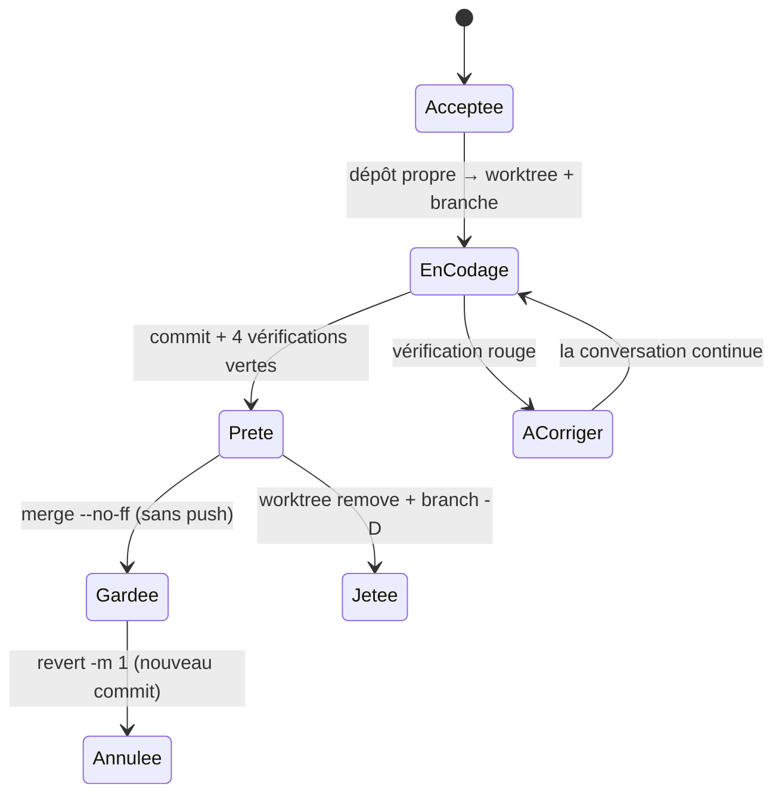

# Mise à jour réversible — worktree, branche, fusion no-ff et git revert

> **En 30 secondes** — mentalyas accepte une proposition. L'app crée une **deuxième copie de travail** du dépôt (un *worktree*) sur une branche `analyste/<id>-<titre>` : Claude y code, l'app commite et lance les vérifications, mentalyas **essaie** sur un profil d'essai, puis **garde** (fusion dans `main` avec un commit de fusion, jamais de push) ou **jette** (branche et copie supprimées). Plus tard, « Annuler » **révoque** la mise à jour par un nouveau commit (`git revert -m 1`) : rien n'est jamais réécrit.
>
> ⚠️ **Statut** : conçu le 07/10 (tâches T030–T038), **pas encore codé**. Les commandes viennent de L3-analyste-appliquer §2 et sont **⚠️ Probables**.



---

## 1. Vue Macro & Utilité (le « Pourquoi »)

> 📘 **Introduction (ajoutée)** — **C'est quoi, un worktree ?** Normalement, un dépôt git a **un** dossier de travail : changer de branche (`checkout`) **réécrit les fichiers** de ce dossier. `git worktree add` crée un **second dossier** relié au **même** dépôt (même historique, mêmes objets), avec sa propre branche. Deux branches sont « ouvertes » en même temps, dans deux dossiers.

- **Problématique** : l'app tourne en `npm run dev` **depuis son propre dépôt**. Si Claude codait sur une branche du dossier principal, le `checkout` changerait le code **sous l'app ouverte** (rechargement, état perdu, version à moitié écrite). Et mentalyas veut une sauvegarde : « revenir à la version d'avant si la mise à jour ne me plaît pas ».
- **Emplacement dans la carte globale** : `UpdateService` (main) orchestre `GitCli.runGit` (git par chemin absolu, `shell: false`), `NpmCli` (`node` + `npm-cli.js`, scripts fermés), une **conversation Claude Code** (neurone de mise à jour caché, `cwd` = worktree, mode « Accepter les modifications » : écritures libres dans le worktree, **commandes demandées**). Table `analyst_updates`.
- **Analogie (cuisine)** : le chef teste une nouvelle recette sur un **poste à part**, avec une copie des ingrédients, pendant que le service continue. Si le plat d'essai plaît, il entre à la carte (fusion) ; sinon on nettoie le poste (jeter). Et si la nouvelle recette déçoit des semaines plus tard, on **ne brûle pas** les anciennes fiches : on imprime une fiche « retour à l'ancienne recette » (revert). *Côté Satisfactory* : une **ligne de production parallèle** branchée sur le même stock, qu'on raccorde ou démonte.

## 2. Le Pont Systémique (sous le capot)

- **Ce que partage un worktree** : le dossier `.git` du dépôt principal contient les **objets** (commits, fichiers compressés) ; le worktree n'a qu'un petit fichier `.git` qui pointe vers lui. Créer un worktree copie seulement les **fichiers de travail** de la branche — pas l'historique. Emplacement choisi : `<repo>/.analyste/worktrees/<id8>`, ignoré par git, TypeScript, Vitest, ESLint, Prettier et graphify.
- **`node_modules` par jonction** : réinstaller les dépendances dans chaque worktree prendrait des minutes et des centaines de Mo. Une **jonction Windows** (`fs.symlink(target, path, 'junction')`) fait apparaître `<wt>/node_modules` comme un dossier qui **est** celui du dépôt principal — sans droits administrateur. Risque : une écriture dans ce `node_modules` modifierait celui de l'app ouverte → le hook d'avant-écriture **refuse** toute écriture sous `node_modules` (constat U1 de l'analyse). Détail → [[Glossaire — Traversée de chemin et lien symbolique]].
- **Vérifications par l'app, pas par Claude** : « Garder » exige typecheck, lint, format, tests **verts**, lancés par le main (constitution 4.2.1 : `npm` = programme Node, lancé par `node` + `npm-cli.js` par chemins absolus, sans shell). Un résultat **déclaré** par Claude ne vaudrait rien ; un code de sortie mesuré par l'app, si.
- **Rechargement à chaud** : fusionner dans `<repo>` modifie `src/` → electron-vite **recharge** l'app. L'état est donc écrit **avant** (`keeping`), et au redémarrage l'app **réconcilie** avec `git log` (le commit de fusion est là → `kept`, sinon → `ready`).

## 3. Analyse du Code & Logique

**Bloc 1 — Les commandes, toutes générées par l'app** (L3 §2)

```text
Pré-contrôle  git -C <repo> status --porcelain        → vide (sinon REPO_DIRTY, rien n'est créé)
              git -C <repo> symbolic-ref --short HEAD → main
Créer         git -C <repo> worktree add -b analyste/<id8>-<slug> <wt> <base_sha>
Commit        git -C <wt> commit -m <msg> --trailer "Analyste-Proposal: <id>"
Garder        git -C <repo> merge --no-ff --no-edit -m "feat(…): <titre> (analyste <id8>)" <branche>
              (conflit → git merge --abort) · puis worktree remove · branch -d
Jeter         git -C <repo> worktree remove --force <wt> · branch -D <branche>
Annuler       git -C <repo> revert -m 1 --no-edit <merge_sha>   (conflit → git revert --abort)
JAMAIS        push · reset · rebase · --force · checkout dans <repo>
```
Le nom de branche est `analyste/` + 8 caractères d'identifiant + un **slug** filtré `[a-z0-9-]` (≤ 30) : un titre hostile (`--force`, `..`, espaces) ne peut pas devenir une option ni sortir du dossier. Un nom ou un chemin proposé par Claude est **ignoré**.

**Bloc 2 — Pourquoi `--no-ff`**

Si `main` n'a pas bougé, git ferait par défaut une **avance rapide** (*fast-forward*) : il déplace juste l'étiquette `main` sur le dernier commit de la branche — **aucun commit de fusion**. La mise à jour se fondrait dans l'historique, impossible à désigner d'un coup. `--no-ff` force un **commit de fusion** : un seul point qui représente « toute la mise à jour », identifiable et annulable.

```text
avant :  main ── A ── B                    après --no-ff :  main ── A ── B ──────── M   ← commit de fusion
                       \                                               \          /
          analyste/x    C ── D                                          C ──── D
```

**Bloc 3 — `git revert -m 1` : défaire une fusion sans réécrire**

`revert` crée un **nouveau commit** qui applique l'inverse d'un commit. Pour un commit de fusion, git doit savoir **par rapport à quel parent** calculer l'inverse : `M` a deux parents, `B` (parent 1 : `main`) et `D` (parent 2 : la branche). `-m 1` dit « garde la lignée de `main`, défais ce que la branche a apporté ». Résultat : le code revient à l'état de `B`, l'historique contient **M et sa révocation** (SC-006 : `git diff <base_sha>` vide). C'est l'équivalent git du **lot inverse** de l'Historique de l'app ([[Annuler par lot — journal avant-après, conflit et lot inverse]]) : on n'efface pas le passé, on ajoute sa correction.

**Bloc 4 — Git n'est pas transactionnel : compensations**

Une base SQLite fait « tout ou rien » ; une séquence de commandes git, non. Chaque échec a donc son **retour arrière explicite** : échec après `worktree add` → `worktree remove --force` + `branch -D` ; conflit de fusion → `merge --abort` ; conflit de revert → `revert --abort`. Et chaque étape **relit l'état git réel** avant d'agir (branche présente ? fusion déjà faite ?) : un « Garder » rejoué après rechargement ne fusionne pas deux fois (idempotence).

**Bloc 5 — « Essayer » sans casser l'app ouverte**

L'analyse croisée (`/speckit-analyze`, constat I1) a trouvé en **lisant le code** que `src/main/index.ts` prend un **verrou d'instance unique** (`app.requestSingleInstanceLock()`) : lancer la version de la branche sur le même profil serait refusé, ou partagerait la même base. D'où un **profil d'essai** distinct (copie du profil démo, recréée à chaque essai), dont le dossier est fixé **avant** la prise du verrou — ⚠️ à vérifier en T035 que le verrou dépend bien du dossier de profil.

**Bonnes pratiques mises en évidence** : aucune commande destructrice dans le code (un test inspecte **toutes** les commandes lancées : 0 `push`, 0 `reset`) ; trailer au lieu de co-auteur (traçabilité sans attribution) ; une seule mise à jour en codage à la fois.

## 4. Synthèse & Prochaine Étape

**À retenir (3 puces max)**
- **Worktree** = deuxième dossier de travail du même dépôt : on code sur une branche sans toucher l'app qui tourne.
- **`merge --no-ff`** crée un commit de fusion = « la mise à jour » en un point ; **`revert -m 1`** l'annule par un nouveau commit, sans réécrire l'historique.
- Git n'est pas transactionnel : chaque étape a sa **compensation** (`--abort`, `remove --force`) et relit l'état réel avant d'agir.

**Lien avec la suite** : le rythme automatique (US6) pourra **proposer** seul, jamais appliquer ; et la constitution qui autorise ces commits sur `analyste/*` est expliquée dans [[Du brainstorm au code — spécifications et constitution]] (bloc « Évolution du 07/10 »).

**Rappel actif**
> **Q :** Pourquoi ne pas simplement faire `git checkout analyste/x` dans le dépôt principal ?
> **R :** `checkout` réécrit les fichiers du dossier d'où l'app tourne : elle se rechargerait sur du code à moitié écrit. Le worktree laisse ce dossier intact.

> **Q :** Que se passe-t-il sans `--no-ff` si `main` n'a pas bougé ?
> **R :** Une avance rapide : pas de commit de fusion, les commits de la branche se mêlent à `main`, plus de point unique à révoquer.

> **Q :** Dans `git revert -m 1 <M>`, que désigne `1` ?
> **R :** Le premier parent du commit de fusion (la lignée de `main`) : on garde ce côté et on défait l'apport de la branche.

**Pièges fréquents**
- ⚠️ **`revert` ≠ `reset`** — `reset` déplace la branche et **efface** l'historique (interdit ici) ; `revert` **ajoute** un commit inverse.
- ⚠️ **Re-fusionner une branche révoquée** — git considère ses commits comme déjà fusionnés : il faut révoquer la révocation, pas re-fusionner.
- ⚠️ **Oublier la jonction** — `worktree remove` sur un dossier qui contient une jonction : la retirer d'abord, sinon on risque d'atteindre le `node_modules` partagé.

**Connexions**
- [[Lancer un programme sans shell — chemin absolu, arguments séparés, listes blanches]] — `runGit`, `npm-cli.js`, arguments en tableau.
- [[Coquille de bureau — zone de notification, instance unique et fenêtres cachées]] — le verrou d'instance unique qui impose le profil d'essai.
- [[Permissions relayées — l'humain dans la boucle d'un agent]] — les commandes de Claude restent demandées pendant le codage.
- [[Glossaire — Écriture atomique (temporaire puis renommage)]] — même souci du « jamais à moitié », ici sans transaction disponible.
