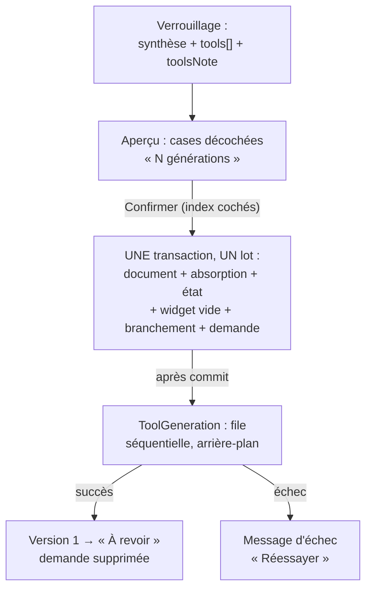
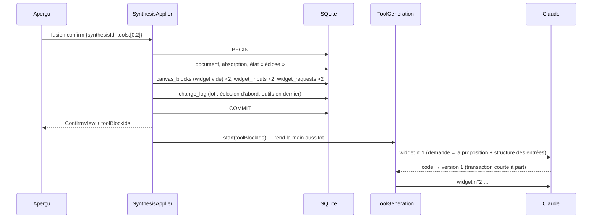

# Outils proposés au verrouillage — créer dans la transaction, générer hors transaction

> **En 30 secondes** — Au verrouillage, Claude propose 0 à 3 **outils** (mini-widgets) dans la synthèse. Tu coches ceux que tu veux, puis « Confirmer ». L'éclosion crée alors, **dans sa propre transaction**, un widget **vide** par outil, déjà placé et branché sur l'idée, plus une **demande** écrite en base. **Après** la transaction, Claude génère les outils un par un en arrière-plan. Un échec ne défait jamais l'éclosion : le widget affiche « Réessayer ». Annuler l'éclosion retire aussi les outils.



---

## 1. Vue Macro & Utilité (le « Pourquoi »)

- **Problématique** : deux opérations de natures opposées doivent se suivre. L'**éclosion** est locale, rapide (millisecondes), et doit être **tout ou rien** et annulable d'un bloc. La **génération** d'un outil est distante, lente (dizaines de secondes), payante et **peut échouer** (refus, format invalide, réseau). Les mettre dans la même transaction serait une faute : on bloquerait la base pendant un appel réseau, et un échec de Claude annulerait une éclosion parfaitement valide.
- **Emplacement dans la carte globale** : couche **application** du main — `SynthesisApplier.confirm` (transaction), `ToolGeneration` (file), `WidgetService.prompt` (génération existante, spec 004) — avec deux fonctions pures du **domaine** : `placeTools` (géométrie) et `toolProposals` (filtrage).
- **Analogie (restauration)** : en salle, le serveur **valide la commande** : elle est notée sur le bon, la table est dressée avec une assiette vide par plat, le tout d'un seul geste (transaction). Le bon part en **cuisine**, qui prépare les plats **un par un** (file séquentielle). Un plat raté ? On ne débarrasse pas la table : l'assiette reste, avec « on relance ». Le client annule toute la commande ? Assiettes et bons disparaissent ensemble. *Là où ça boite* : un vrai cuisinier sait que la commande est annulée ; ici la cuisine le découvre **à la fin** (le widget n'existe plus) et jette la réponse.

## 2. Le Pont Systémique (sous le capot)

**Pourquoi un appel réseau n'a rien à faire dans une transaction SQLite.** Une transaction d'écriture SQLite prend un **verrou** sur le fichier de base : tant qu'elle est ouverte, aucune autre écriture ne passe. Et `better-sqlite3` est **synchrone** : une transaction ne peut pas contenir d'`await`. Mélanger les deux imposerait soit de figer le main pendant 30 s, soit de couper la transaction en morceaux — perdant l'atomicité (voir [[Glossaire — Transaction ACID]]).



**La demande durable.** `widget_requests` (migration `0016`) garde titre, description et « produit un résultat ? » **tant que le widget n'a aucune version**. C'est ce qui rend « Réessayer » possible **après un redémarrage** : la file en mémoire est perdue à la fermeture, la demande en base, non. Clé étrangère `ON DELETE CASCADE` vers le bloc : la demande meurt avec son widget.

## 3. Analyse du Code & Logique

Extraits de `SynthesisApplier.ts`, `ToolGeneration.ts` et `domain/widgets/placeTools.ts` :

```ts
// ① Dans la transaction de l'éclosion : un widget vide par outil coché
const { idea, obstacles } = writers.surroundings(rootId)            // la carte telle qu'enregistrée
const places = placeTools(idea, chosen.length, size, obstacles)    // fonction pure, déterministe
chosen.flatMap((tool, i) => {
  const block = writers.blocks.insert({ kind: 'widget', ...places[i], ...size, text: null })
  writers.requests.insert({ blockId: block.id, rootId, title: tool.title, /* … */ })
  const input = writers.inputs.insertInput({ blockId: block.id, sourceKind: 'idea', sourceId: rootId, parts: tool.parts })
  return [/* entrées de journal canvas_block et widget_input, before: null */]
})
// …journalisées EN DERNIER : l'Historique résume un lot par sa première entrée (« Éclosion de … »)

// ② Hors transaction : une file, un seul appel à la fois
start(blockIds) {
  this.queue.push(...fresh)
  if (this.running === null) this.drained = this.drain()           // pas d'await : l'appelant continue
}
private async drain() {
  for (let next = this.queue.shift(); next !== undefined; next = this.queue.shift()) {
    this.running = next
    try { await this.generate(next) } catch { /* widget retiré : on passe au suivant */ }
    finally { this.running = null }
  }
}

// ③ Placement : premier emplacement libre, anneau après anneau autour de l'idée
for (let ring = 0; ring < RINGS && spot === undefined; ring++)
  for (const direction of DIRECTIONS)                               // gauche d'abord : l'étape part en bas à droite
    if (!taken.some((box) => overlaps(candidate, box))) { spot = candidate; break }
```

- **Étape 1 — Cocher n'est pas autoriser** : le widget naît **branché** sur l'idée avec les parties annoncées par Claude, mais sans code ; quand le code arrive, son empreinte n'est dans aucune autorisation → « À revoir ». La revue de [[Widget branché — autorisation par empreinte et pont postMessage]] reste la **seule** porte vers les données.
- **Étape 2 — Séquentiel, volontairement** : un appel à la fois évite de dépenser trois générations en parallèle d'un coup, garde l'indicateur « Claude prépare cet outil… » lisible, et respecte le sémaphore de la passerelle. `retry` refuse si le widget est déjà en cours ou en file.
- **Étape 3 — L'échec reste local** : `generate` réutilise `WidgetService.prompt` (validation Zod, effacement de types, version par pointeur). Si le widget a disparu entre-temps (éclosion annulée), `prompt` le détecte **avant** d'écrire et la réponse est jetée. La demande n'est supprimée qu'**après** une première version réussie.
- **Étape 4 — Placement par fonction pure** : `placeTools` teste 8 directions puis élargit (12 anneaux), vérifie le recouvrement de deux rectangles par leurs **centres** (`|xa − xb| × 2 < largeurA + largeurB + 2 × marge`, idem en y), et empile en dessous si tout est pris. Sans aléa ni DOM : testable en intégration, même entrée → même sortie.
- **Étape 5 — Double verrou anti-doublon** : la consigne rappelle à Claude les outils déjà branchés, **et** `keepNewTools` écarte en plus tout titre déjà présent ou répété (comparé sans casse ni espaces multiples). Même motif que le seuil des idées suggérées : la consigne guide, le code garantit.

**Bonnes pratiques mises en évidence** : **transaction courte, travail lent après le commit** ; **intention persistée** (la demande) plutôt que confiée à la mémoire vive ; logique géométrique et de filtrage **dans le domaine**, sans dépendance ; « Confirmer » envoie des **index** dans la proposition stockée, pas des objets — le main relit la proposition et refuse un index inconnu ou répété.

> ⚠️ **Test manuel T016 du lot 2 encore à faire** (journal, 22:10) : placement, génération en arrière-plan et « Réessayer » sont décrits d'après le code et les tests d'intégration (785 puis 788 tests), pas encore d'après l'app réelle.
>
> ⚠️ **Probable** — La file de `ToolGeneration` vit en mémoire : si l'app se ferme pendant une génération, rien ne reprend seul au démarrage ; le widget montre « Réessayer » (demande toujours en base). C'est le comportement annoncé par le journal, déduit ici de la lecture.

## 4. Synthèse & Prochaine Étape

**À retenir (3 puces max)**
- **Rapide, local et annulable** dans la transaction ; **lent, distant et faillible** après le commit — jamais l'inverse.
- Ce qui doit survivre à un redémarrage (la demande) va **en base** ; la file en mémoire n'est qu'un ordonnanceur.
- Proposer ≠ cocher ≠ autoriser : trois décisions humaines distinctes, aucune ne vaut la suivante.

**Lien avec la suite** : le format de sortie qui transporte `tools` a posé un problème réel — Claude omettait le champ facultatif. Voir le bloc « Évolution du 30/09 (soir) » de [[Zod ↔ type guards et sortie structurée]].

**Rappel actif**
> **Q :** Pourquoi ne pas appeler Claude à l'intérieur de `repository.transaction(...)` ?
> **R :** La transaction est synchrone (pas d'`await`) et verrouille l'écriture ; un appel de 30 s figerait la base, et son échec annulerait une éclosion valide.

> **Q :** Tu confirmes avec deux outils cochés, puis tu annules l'éclosion pendant que Claude génère le premier. Que se passe-t-il ?
> **R :** L'annulation du lot retire document, widgets, branchements (même lot). La génération en cours se termine, `prompt` constate que le widget n'existe plus et jette la réponse ; la file passe au suivant, lui aussi introuvable.

> **Q :** Pourquoi les entrées « outil » sont-elles écrites en dernier dans le lot ?
> **R :** L'Historique résume un lot par sa première entrée : il doit afficher « Éclosion de … », pas « widget créé ».

**Pièges fréquents**
- ⚠️ **Tout mettre dans une seule transaction « pour être sûr »** — on obtient l'inverse : verrou long et atomicité liée à un service externe.
- ⚠️ **Garder la demande seulement en mémoire** — un redémarrage l'efface, « Réessayer » n'a plus rien à relancer.
- ⚠️ **Lancer toutes les générations en parallèle** — coût en rafale, indicateurs illisibles, contention sur la passerelle.

**Connexions**
- [[Éclosion atomique — transaction, version et historique]] — la transaction qui accueille maintenant les outils.
- [[Annuler par lot — journal avant-après, conflit et lot inverse]] — une seule annulation pour éclosion + outils.
- [[Carte des idées — simulation de forces et croisements de liens]] — autre géométrie de la carte ; ici, pas de simulation : un balayage déterministe.
- [[Budget IA — convertir des tokens en euros]] — proposer coûte quelques dizaines de tokens ; chaque case cochée, une génération (~3 à 6 centimes selon le plan).
