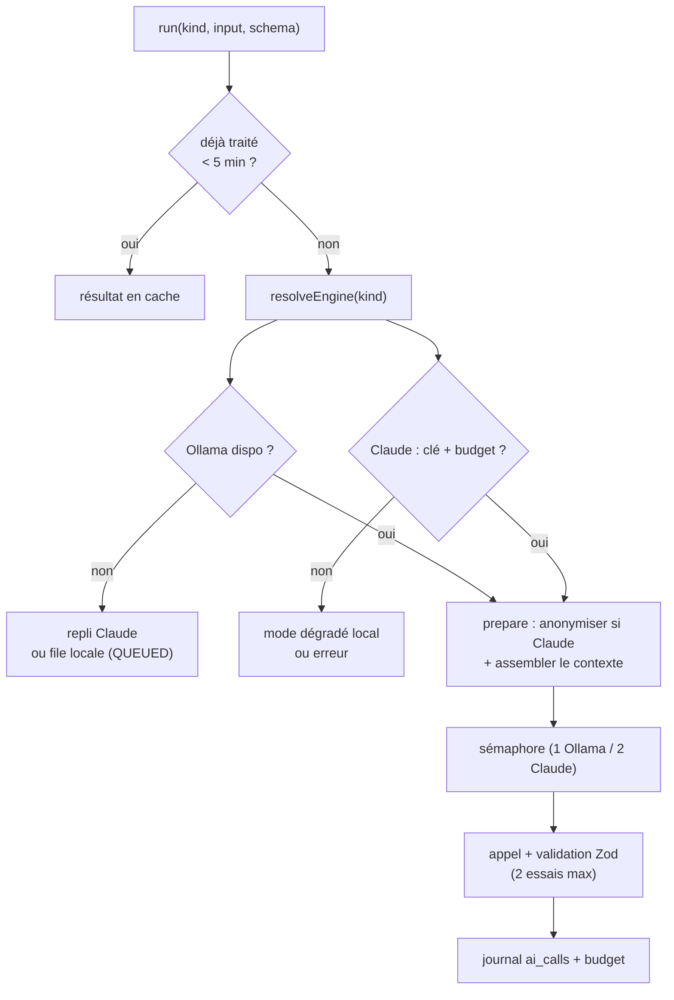

# Passerelle IA hybride — un seul point d'accès à l'IA

> **En 30 secondes** — Aucun service n'appelle Ollama ou Claude directement : tout passe par **`AIGateway.run()`**. Elle choisit le moteur (tâche simple → IA locale gratuite ; raisonnement → Claude), anonymise avant Claude, vérifie le budget, limite le nombre d'appels simultanés, valide la réponse par schéma (1 nouvel essai), journalise, et met en **file persistante** ce qui ne peut pas être traité tout de suite.



---

## 1. Vue Macro & Utilité (le « Pourquoi »)

> 📘 **Introduction (ajoutée)** — **C'est quoi ?** Une *passerelle* (*gateway*) est un point d'entrée unique devant un ou plusieurs services externes : elle applique au même endroit toutes les règles transverses (sécurité, coût, journal, reprise). **Comment ça marche ?** Les appelants décrivent **ce qu'ils veulent** (type de tâche + entrée + schéma de sortie) ; la passerelle décide **comment** l'obtenir. Voir [[Glossaire — LLM (grand modèle de langage)]].

- **Problématique** : un **LLM** local (Ollama, `qwen3.5:9b`) est gratuit, privé, mais limité ; Claude est puissant mais payant et distant. Il faut router chaque tâche vers le bon moteur, **sans** que dix services réimplémentent dix fois anonymisation, budget et reprise — sinon l'un d'eux finira par oublier d'anonymiser.
- **Emplacement dans la carte globale** : couche **application**, entre les services métier (croissance, fusion, liens) et le réseau (localhost:11434 ou API Anthropic).
- **Analogie (Satisfactory)** : la passerelle est le **répartiteur principal** (*splitter* programmable) de l'usine. Chaque colis (demande) porte une étiquette (`TaskKind`). Les colis simples partent vers l'**atelier local** (Ollama, une seule machine → une seule demande à la fois) ; les complexes vers la **gare de fret** (Claude, 2 wagons en parallèle, péage à chaque passage = budget). Si l'atelier est en panne, les colis s'empilent dans un **conteneur tampon** (file persistante) et repartent automatiquement quand il redémarre (sonde toutes les 30 s). Un **contrôle qualité** en sortie renvoie la pièce défectueuse une fois (nouvel essai).

## 2. Le Pont Systémique (sous le capot)

- **Réseau** : Ollama est un serveur HTTP sur **127.0.0.1** (boucle locale — les paquets ne quittent jamais la carte réseau). Le code **refuse** toute autre adresse (`LOOPBACK_HOSTS`). Claude, lui, passe par HTTPS vers Internet via le SDK officiel.
- **GPU / VRAM** : le premier appel local a pris **37 s** (chargement du modèle en mémoire vidéo), les suivants **0,7 s** (JOURNAL). D'où la concurrence **1** pour Ollama : deux requêtes simultanées se disputeraient les 8 Go de VRAM.
- **Sémaphore** : un compteur en RAM + une file de promesses en attente ; au-delà de la limite, l'appel `await` jusqu'à libération. Tout se passe dans l'unique fil d'exécution de Node (boucle d'événements), sans verrou système.
- **File persistante** : la table `pending_requests` sur disque survit à un redémarrage. Tri par `rowid` (ordre d'insertion physique), pas par horodatage : deux insertions dans la même milliseconde donnaient un ordre aléatoire (bug corrigé, règle 7).
- **Idempotence** : une `Map` en RAM garde 5 minutes les résultats par `requestId` — un double clic ne paie pas deux fois (voir [[Glossaire — Idempotence]]).

## 3. Analyse du Code & Logique

Extraits de `AIGateway.ts` et `domain/ai/routing.ts` :

```ts
// ① Table de routage par défaut (domaine) : données déclaratives, pas de if/else dispersés
export const DEFAULT_ROUTING: RoutingTable = {
  categoriser: 'ollama', anonymiser: 'ollama', etendre: 'claude', synthetiser: 'claude', /* … */
}
// ② Tâche "strictement locale" PAR CONSTRUCTION, quelle que soit la configuration
const LOCAL_ONLY_KINDS = new Set<TaskKind>(['anonymiser'])
export const resolveEngine = (kind, routing) => isLocalOnly(kind) ? 'ollama' : routing[kind]

// ③ Dans run() : Ollama absent → repli Claude si permis, sinon file persistante
if (engine === 'ollama' && !(await providers.ollama.isAvailable()).up) {
  if (config.allowClaudeFallback && !isLocalOnly(request.kind)) engine = 'claude'
  else { await localQueue.enqueue({...}); return failure('QUEUED', '…traitée à son retour', true) }
}
// ④ Validation + 1 nouvel essai avec consigne de correction
for (let attempt = 0; attempt < 2; attempt += 1) {
  response = await provider.complete({ system, user: attempt === 0 ? user : `${user}\n\n${RETRY_HINT}`, schema, … })
  await this.log(…)                                  // ⑤ journaliser AVANT le budget
  if (engine === 'claude') await this.deps.budget.record()
  if (response.parsed !== null) return { ok: true, value: { data: response.parsed, engine, degraded, … } }
}
```

- **Étape 1 — Routage déclaratif** : changer le moteur d'une tâche = modifier une ligne de configuration (Réglages IA), pas le code métier.
- **Étape 2 — « Strictement local par construction »** : anonymiser consiste à lire le texte **brut** ; l'envoyer à Claude annulerait tout. Même si l'utilisateur configure mal le routage, `resolveEngine` force Ollama (règle 8).
- **Étape 3 — Codes d'échec distincts** : `QUEUED`, `AI_UNAVAILABLE`, `BUDGET_EXCEEDED`, `AI_REFUSAL`, `AUTH_FAILED`, `ANONYMIZATION_FAILED`. L'interface peut dire *pourquoi*, pas juste « erreur ».
- **Étape 4 — Mode dégradé** : avec `allowDegraded`, si Claude est indisponible ou bloqué, Ollama prend le relais ; le résultat est marqué `degraded: true` (affiché comme tel).
- **Étape 5 — Le type `Result<T, E>`** : `{ ok: true, value } | { ok: false, error }` — les échecs attendus ne sont pas des exceptions (standard global : « pas d'exceptions pour le flux de contrôle normal »).

**Bonnes pratiques mises en évidence** : **un seul point d'accès** (constitution III) ; recherche web isolée dans `research()` car incompatible avec la sortie structurée (règle 20).

## 4. Synthèse & Prochaine Étape

**À retenir (3 puces max)**
- Tout appel IA passe par `AIGateway` : routage, anonymisation, budget, concurrence, validation, journal.
- Ollama indisponible → repli Claude (si permis) ou **file persistante** rejouée automatiquement.
- Les échecs sont des **valeurs typées** (`Result`), pas des exceptions.

**Lien avec la suite** : première garde de la passerelle avant Claude → [[Anonymisation en deux couches]].

**Rappel actif**
> **Q :** Pourquoi la concurrence d'Ollama est-elle limitée à 1 ?
> **R :** Un seul modèle chargé en VRAM (8 Go) : deux requêtes parallèles se ralentiraient ou échoueraient.

> **Q :** Que se passe-t-il si l'utilisateur route `anonymiser` vers Claude dans les réglages ?
> **R :** Rien : `resolveEngine` force `ollama` pour les tâches de `LOCAL_ONLY_KINDS`, quelle que soit la table.

> **Q :** Pourquoi journaliser l'appel avant d'appeler `budget.record()` ?
> **R :** Pour que le total du mois lu par le budget inclue déjà cet appel (alerte au bon moment).

**Pièges fréquents**
- ⚠️ **Appeler le SDK Anthropic « juste une fois » dans un service** — on contourne anonymisation, budget et journal d'un coup.
- ⚠️ **Trier une file par horodatage** — non déterministe à la milliseconde près ; utiliser `rowid`.

**Connexions**
- [[Anonymisation en deux couches]] — `prepare()` l'appelle avant tout envoi à Claude.
- [[Budget IA — convertir des tokens en euros]] — `budget.check()` avant, `budget.record()` après.
- [[Zod ↔ type guards et sortie structurée]] — la validation de la réponse.
- [[Injection de prompt — cadre figé et données balisées]] — l'assemblage du contexte envoyé.


## Évolution du 30/09 — routage révisé, moteur annoncé, texte « tel quel »
- **Routage par défaut révisé** (mesure des coûts du 29/09, T069) : `etendre`, `germer` et `suggerer_liens` passent sur **Ollama** ; Claude garde `synthetiser`, `reviser`, `suggerer`, `rechercher` et `widget`. L'extrait `DEFAULT_ROUTING` plus haut (« `etendre: 'claude'` ») date d'avant cette révision. Le repli vers Claude si Ollama est arrêté n'a lieu que si « Autoriser Claude en secours » est coché (JOURNAL).
- **`CLAUDE_ONLY_KINDS`** : pendant de `LOCAL_ONLY_KINDS` — la tâche `widget` va toujours chez Claude, quelle que soit la configuration (l'IA locale ne génère pas de code).
- **`onEngine(engine, model)`** : rappel appelé **au moment où l'appel part réellement** (à l'intérieur du sémaphore, repli compris). L'interface affiche donc le moteur qui travaille vraiment (« Ollama · … » ou « Claude … »), pas celui que le routage prévoyait ; une demande encore en file n'annonce rien.
- **`verbatim`** : texte ajouté à la demande **après** l'anonymisation, sans la traverser. Utilisé pour renvoyer à Claude le code actuel d'un widget → [[Widget généré par Claude — effacement de types, versions par pointeur et échec sans dégât]].

## Évolution du 05/10 — plus d'API Anthropic
> ⚠️ **Correction du 05/10** — Le routage configurable, la recherche web, le budget et l'anonymisation décrits ci-dessus ont été **retirés** (spec 010, constitution 3.0.0). `ClaudeProvider` (SDK Anthropic) est remplacé par `ClaudeCliProvider` : Claude passe par le CLI de mentalyas (`claude -p --json-schema`, abonnement, aucune clé). La passerelle ne garde que **deux tâches** : `categoriser` (Ollama, local) et `widget` (Claude Code). Le principe de la note reste vrai : **un seul point d'accès**, et toute réponse revalidée par Zod. Le chat des neurones, lui, ne passe pas par la passerelle : voir [[Piloter Claude Code — processus enfant, flux stream-json et session reprise]].

## Évolution du 07/10 — une troisième tâche, et un moteur imposé par la confidentialité
- **`reprise_guide`** rejoint `categoriser` et `widget` (spec 017 US4) : Claude par défaut, effort moyen, 16 000 tokens de sortie. Son **cadre système** est propre (`RepriseGuideFrame.ts`), comme celui des widgets : le cadre du brainstorm refuse les longs textes rédigés.
- **`localOnly`** : pour un projet repris « Local uniquement », la passerelle **impose Ollama**, sans repli vers Claude **ni** mise en file, et teste cette règle **avant** le repli habituel ; Ollama arrêté → `AI_UNAVAILABLE` immédiat. La règle « `LOCAL_ONLY_KINDS` » de l'ancienne passerelle revient sous une autre forme : non plus par **type de tâche**, mais par **donnée** (le projet).
- **Délai et fenêtre par tâche** (`timeoutFor`, `contextTokensFor` dans `domain/ai/routing.ts`) : 10 min et `num_ctx: 32768` pour le guide, sinon les valeurs du moteur (2 min Ollama, 4 min Claude). → [[Glossaire — Fenêtre de contexte (IA)]]
- Détail : [[Guide de reprise — contexte borné, sections fixes et sources vérifiées]].
