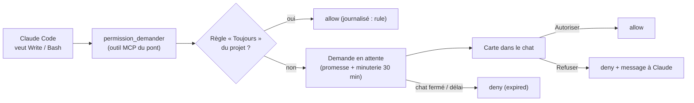
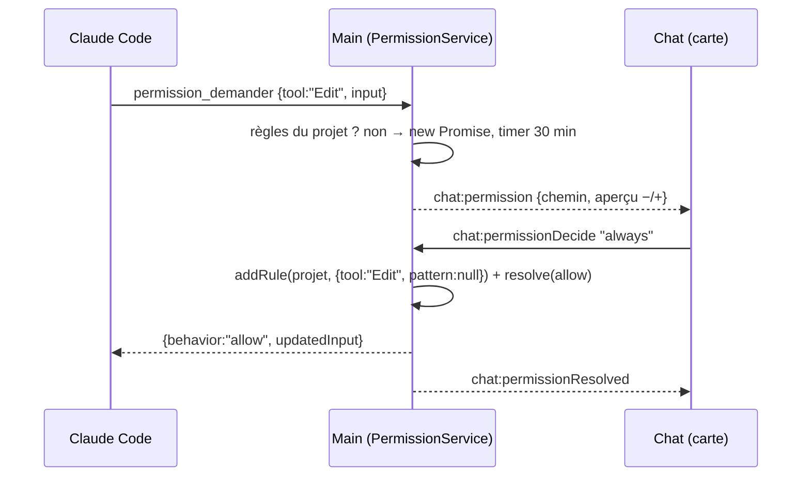

# Permissions relayées — l'humain dans la boucle d'un agent

> **En 30 secondes** — Quand Claude veut écrire un fichier ou lancer une commande, Claude Code demande la permission. Dans le terminal, c'est une question à l'écran ; dans l'app, il n'y a pas d'écran pour le CLI. Le CLI appelle donc un **outil de permission** du pont (`permission_demander`) ; le main **met la demande en attente** et affiche une **carte** dans le chat (Autoriser / Toujours pour ce projet / Refuser). Sans réponse (chat fermé, délai), la réponse est **non** — jamais l'app ne répond à la place de mentalyas.



---

## 1. Vue Macro & Utilité (le « Pourquoi »)

> 📘 **Introduction (ajoutée)** — **C'est quoi, « l'humain dans la boucle » (human-in-the-loop) ?** Un système automatisé qui s'arrête aux décisions à risque pour demander à une personne, puis reprend avec sa réponse. **Comment un programme « attend » sans se bloquer ?** En JavaScript, on crée une **promesse** (`Promise`) dont on garde la fonction `resolve` de côté : le code qui l'attend est suspendu, le reste de l'app continue ; appeler `resolve` plus tard le réveille.

- **Problématique** : spec 013 réservait l'écriture de Claude à l'**exécution d'une action finale**. Résultat au test : après l'exécution, « corrige ça » dans le chat était impossible, et le fil affichait « fichier modifié » pour une écriture **refusée**. mentalyas veut dans l'app la liberté du terminal — mais un agent qui écrit et lance des commandes, c'est exactement ce qu'un attaquant (ou une erreur du modèle) voudrait. Il faut **la liberté avec un frein à main**.
- **Emplacement dans la carte globale** : le CLI (infrastructure externe) → le relais → `PermissionService` (application) → événement IPC → `PermissionCard` (renderer) → réponse par IPC → `resolve` de la promesse → réponse MCP au CLI. La décision traverse **quatre processus** et revient.
- **Analogie (restauration)** : en cuisine, un commis (Claude) peut tout préparer, mais pour **sortir une bouteille de la cave** il lui faut un **bon signé par le chef** (mentalyas). Il pose le bon sur le passe et **attend** sans bloquer la brigade. Certaines sorties courantes sont **pré-signées** pour la soirée (« Toujours pour ce projet »). Si le chef quitte la cuisine, les bons en attente sont **annulés**, pas signés d'office. *Où ça boite* : un commis peut insister ; ici, le refus renvoie à Claude un message explicite « ne la relance pas sans qu'il te le demande ».

## 2. Le Pont Systémique (sous le capot)

- **Côté CLI** : `--permission-prompt-tool mcp__brainstormer__permission_demander` dit à Claude Code : « au lieu d'afficher une question, appelle cet outil et obéis à sa réponse » (`{ behavior: 'allow', updatedInput }` ou `{ behavior: 'deny', message }`).
- **Trois délais emboîtés** — sinon un maillon abandonnerait avant les autres : l'app attend mentalyas **30 min** ; le relais attend le main **31 min** ; Claude Code attend un outil MCP **32 min** (`MCP_TOOL_TIMEOUT` passé dans l'environnement du processus).
- **Mémoire du main** : une `Map<requestId, { resolve, timer, request }>`. Rien sur disque pendant l'attente ; seules les **règles** et le **journal** des décisions sont en base (`PermissionRepository`), jamais le contenu de la demande.
- **Fil fidèle** : le flux du CLI contient `tool_use` (appel), `tool_result` (résultat, `is_error`) et `permission_denied`. Le chat affiche donc « en cours », « fait », « refusé » ou « échoué » d'après **ce qui s'est réellement passé**, et non d'après l'intention.



## 3. Analyse du Code & Logique

Extraits de `application/conversation/PermissionService.ts` et `domain/conversation/permissions.ts` :

```ts
request(neuronId, tool, input): Promise<PermissionAnswer> {
  const rules = this.deps.repository.rules(this.deps.projectKeyOf(neuronId))
  if (rules.some((rule) => ruleMatches(rule, tool, input)))      // ① pré-signé
    return Promise.resolve({ behavior: 'allow', updatedInput: input })
  return new Promise((resolve) => {                               // ② mise en attente
    const timer = setTimeout(() => this.expire(request.id), PERMISSION_TIMEOUT_MS)
    this.pending.set(request.id, { request, input, resolve, timer })
    this.deps.emit({ type: 'chat:permission', payload: request })
  })
}

cancel(neuronId) {                                                // ③ refus par défaut
  for (const entry of [...this.pending.values()])
    if (entry.request.neuronId === neuronId) this.settle(entry, 'expired', { behavior: 'deny', message: EXPIRED })
}

export function ruleMatches(rule, tool, input): boolean {        // ④ portée d'une règle
  if (rule.tool !== tool) return false
  if (!isCommand(tool)) return rule.pattern === null              // écriture : tout l'outil sur ce projet
  const command = commandOf(input)
  return command !== '' && rule.pattern === command               // commande : texte EXACT seulement
}
```

- **Étape 1 — Règle d'abord** : une règle « Toujours » couvre un **outil d'écriture** pour tout le projet, mais une **commande** seulement au caractère près. `npm test` approuvé n'autorise pas `npm test && curl …`.
- **Étape 2 — La promesse mise de côté** : `resolve` est rangé dans la `Map` ; c'est le clic de mentalyas (`decide`) qui l'appellera. Pendant ce temps, Claude Code attend, l'app reste fluide.
- **Étape 3 — Fail-safe (sûr en cas de panne)** : chat fermé, conversation arrêtée, processus terminé, app fermée, délai dépassé → `deny`. Le défaut est le refus.
- **Étape 4 — La clé du projet** : chemin réel du dossier, séparateurs unifiés, en minuscules (Windows ignore la casse) — deux écritures du même dossier donnent la même clé, donc les mêmes règles. Les règles vivent dans la base de l'app, **jamais dans le dépôt** (un dépôt ne peut pas s'auto-autoriser).
- **Étape 5 — Ce que voit mentalyas** : écriture → chemin + aperçu `−/+` ; commande → texte exact + dossier ; rendu en texte brut (`<pre>`), jamais interprété.

**Bonnes pratiques mises en évidence** : principe du **moindre privilège** (lecture et carte autorisées d'office, le reste demandé) ; refus **expliqué** à l'agent ; une demande à la fois, dans l'ordre d'arrivée, « N autres en attente ».

> ⚠️ **Probable / à suivre** : les modes « Accepter les modifications » et « Libre » (`bypassPermissions`) sont prévus en spec 014 Phase 2 (T009, non livrée au 06/10) ; le code accepte déjà le mode en argument.

## 4. Synthèse & Prochaine Étape

**À retenir (3 puces max)**
- Attendre un humain = **garder `resolve` de côté** avec une minuterie ; le défaut à l'expiration est **non**.
- Une règle de commande se compare **au texte exact** ; une règle d'écriture couvre l'outil sur le projet.
- Les délais en chaîne doivent **croître vers l'extérieur** (30 → 31 → 32 min).

**Lien avec la suite** : quand l'app écrit elle-même sur le disque, elle applique les mêmes réflexes → [[Fichiers écrits par l'app — chemin choisi par le main, écriture atomique, corbeille]].

**Rappel actif**
> **Q :** Pourquoi l'app ne répond-elle jamais « allow » quand le chat est fermé, même pour une écriture anodine ?
> **R :** Personne n'a vu la demande : répondre oui reviendrait à décider à la place de mentalyas (constitution I). Le refus est réversible (Claude redemandera), une écriture non voulue l'est moins.

> **Q :** Que se passerait-il si le relais attendait 30 min et l'app aussi ?
> **R :** Course entre deux minuteries : le relais pourrait abandonner juste avant que la réponse arrive, et Claude Code verrait une erreur au lieu de la décision.

> **Q :** Pourquoi une règle « Toujours » pour `Bash` ne couvre-t-elle pas toutes les commandes ?
> **R :** Une commande est arbitrairement puissante ; seule la commande exacte relue par mentalyas est pré-signée.

**Pièges fréquents**
- ⚠️ **Afficher l'intention comme un fait** — « fichier modifié » au moment du `tool_use` ; il faut attendre le `tool_result` (ou `permission_denied`).
- ⚠️ **Oublier de nettoyer** — une demande dont le processus est mort doit être soldée, sinon sa promesse et sa minuterie restent en mémoire.

**Connexions**
- [[Widget branché — autorisation par empreinte et pont postMessage]] — autre forme de consentement : l'empreinte du code revu.
- [[Lancer un programme sans shell — chemin absolu, arguments séparés, listes blanches]] — les scripts approuvés au texte près suivent la même logique.
