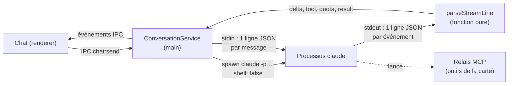
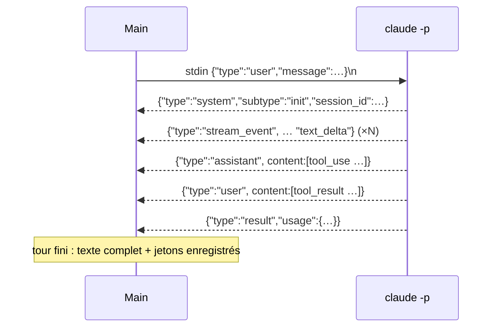

# Piloter Claude Code — processus enfant, flux stream-json et session reprise

> **En 30 secondes** — Double-clic sur une idée : le main lance le programme `claude` (le CLI de mentalyas, sur son abonnement) comme **processus enfant**. Les messages de mentalyas entrent par l'**entrée standard**, les réponses sortent sur la **sortie standard**, une ligne JSON par événement (`stream-json`). Un identifiant de **session** permet de reprendre la conversation plus tard. Tout ce qui pourrait exécuter du code caché (hooks, réglages d'un projet lié) est **coupé** par les arguments.



---

## 1. Vue Macro & Utilité (le « Pourquoi »)

> 📘 **Introduction (ajoutée)** — **C'est quoi, un processus enfant ?** Un programme lancé par un autre (le *parent*), qui reçoit de lui trois tuyaux : entrée (`stdin`), sortie (`stdout`), erreurs (`stderr`). En Node, `spawn(programme, [arguments], options)` le crée. **Et `stream-json` ?** Un format où chaque ligne de texte est un objet JSON complet : on peut traiter les événements **au fil de l'eau**, sans attendre la fin de la réponse (voir [[Glossaire — Canal nommé et flux standard]]).

- **Problématique** : jusqu'au 04/10, l'app appelait l'**API** Anthropic (clé, facturation au token, budget en euros, anonymisation). Or mentalyas a un **abonnement** Claude Code et l'utilise déjà partout. Spec 008 puis 010 : chaque neurone devient une **vraie conversation Claude Code**, et la seule tâche IA restante (générer un widget) passe aussi par `claude -p`. Plus de clé, plus de budget, mais un nouveau risque : on lance **un programme capable d'agir** sur la machine.
- **Emplacement dans la carte globale** : couche **infrastructure** (`infrastructure/claude/`, `ClaudeCliProvider`) pilotée par la couche **application** (`ConversationService`). Le domaine (`streamEvents.ts`) ne fait que **traduire** des lignes en événements, sans effet de bord — donc testable avec de vraies lignes copiées du CLI.
- **Analogie (Satisfactory)** : `claude` est une **machine de production** posée à côté de l'usine. Le main la branche sur **deux convoyeurs** : un tapis d'entrée (stdin) où il dépose les commandes une par une, un tapis de sortie (stdout) où sortent les pièces une par une (une ligne JSON = une pièce). Un **trieur** (`parseStreamLine`) en bout de tapis envoie chaque pièce au bon stock (texte, outil, quota, fin de tour) et jette ce qu'il ne connaît pas. *Où ça boite* : une machine Satisfactory ne se souvient de rien ; celle-ci garde une **mémoire de session** sur disque, retrouvée par son numéro.

## 2. Le Pont Systémique (sous le capot)

- **Lancement** : `spawn(cheminAbsoluDeClaude, args, { shell: false, cwd, windowsHide: true })`. Le chemin de `claude.exe` est trouvé une fois par `where.exe` (jamais construit depuis une donnée de l'interface). **Sans shell** : aucun interpréteur ne relit les arguments, donc aucun caractère (`&`, `|`, `"`) ne peut devenir une commande (voir [[Lancer un programme sans shell — chemin absolu, arguments séparés, listes blanches]]).
- **Mémoire** : un processus par conversation ouverte (au plus 3), arrêté après 10 min d'inactivité. La sortie arrive par **morceaux** : un tampon garde la ligne incomplète jusqu'au prochain `\n` ; `stderr` n'est gardé qu'en fin de tampon (4 000 caractères) et **jamais journalisé**.
- **Disque** : le CLI range ses sessions **par dossier de travail**. Premier échange : `--session-id <uuid>` ; ensuite `--resume <uuid>`. Changer le dossier lié d'un neurone ouvre donc une nouvelle session (la fiche, elle, reste dans la base de l'app).
- **Quota** : les événements `rate_limit_event` donnent les fenêtres de l'abonnement (5 h, 7 jours) — d'où la jauge permanente de l'en-tête (06/10), sans aucun appel d'API.



## 3. Analyse du Code & Logique

Extraits de `ConversationService.conversationArgs` et `domain/conversation/streamEvents.ts` :

```ts
return [
  '-p', '--input-format', 'stream-json', '--output-format', 'stream-json',
  ...(input.resume ? ['--resume', input.sessionId] : ['--session-id', input.sessionId]),
  '--model', settings.model,
  '--setting-sources', '',          // ① aucun réglage chargé : ni utilisateur, ni projet lié
  '--strict-mcp-config',            // ② seuls les serveurs MCP fournis ici
  '--mcp-config', JSON.stringify(mcpConfig), // relais + GI_NEURON_ID dans son environnement
  '--tools', CHAT_BUILTIN_TOOLS,
  '--allowedTools', CHAT_ALLOWED_TOOLS,       // lecture et carte autorisées d'office
  '--permission-prompt-tool', PERMISSION_PROMPT_TOOL, // ③ le reste est demandé à mentalyas
  '--append-system-prompt', input.frame
]

export function parseStreamLine(line: string): StreamEvent[] {
  let value: unknown
  try { value = JSON.parse(line) } catch { return [] }   // ④ ligne illisible : ignorée
  if (!isObject(value)) return []
  switch (value['type']) { /* system, stream_event, assistant, user, result… */ }
}
```

- **Étape 1 — `--setting-sources ""`** (correctif de sécurité du 04/10) : avec `project`, un hook `SessionStart` caché dans le `.claude/settings.json` d'un dossier lié **s'exécutait** à l'ouverture du chat (vérifié sur un faux projet). Désormais aucune source : le `CLAUDE.md` du projet n'est plus chargé d'office, Claude le **lit** comme une donnée.
- **Étape 2 — Configuration MCP stricte** : le CLI ne charge que le relais de l'app, avec l'identifiant du neurone dans son environnement ; le main s'en sert pour refuser une écriture hors de l'arbre de cette conversation.
- **Étape 3 — Permissions** : rien n'est accepté ni refusé en silence ; voir [[Permissions relayées — l'humain dans la boucle d'un agent]].
- **Étape 4 — Traducteur pur et tolérant** : chaque type de ligne connu devient un événement typé (union discriminée `kind`) ; l'inconnu (hooks, réflexion…) donne `[]`. Le CLI peut ajouter des champs sans casser l'app.
- **Étape 5 — Variante « une question, une réponse »** (`ClaudeCliProvider`, génération de widget) : `claude -p --output-format json --json-schema <schéma>` où le schéma est **produit par Zod** (`z.toJSONSchema`) ; sans outil, sans MCP, dans un dossier vide ; données par stdin, consignes en argument tant qu'elles font moins de 20 000 caractères (limite de ligne de commande Windows ≈ 32 000). La réponse est revalidée par **le même** schéma Zod.

**Bonnes pratiques mises en évidence** : arguments **tous fixes** (aucun ne vient du texte de mentalyas, qui passe par stdin) ; un `spawn` injectable (`SpawnConversation`) pour tester sans lancer le vrai CLI ; une seule fin annoncée même si `error` et `close` se suivent.

## 4. Synthèse & Prochaine Étape

**À retenir (3 puces max)**
- Données par **stdin**, consignes par **arguments fixes**, réponses en **JSON par ligne** traduites par une fonction pure.
- Lancer un agent, c'est hériter de **tout ce qu'il charge** : couper les sources de réglages, n'autoriser que des outils choisis.
- Une session = un identifiant + un dossier : `--session-id` la crée, `--resume` la retrouve.

**Lien avec la suite** : Claude veut écrire un fichier ou lancer une commande — qui décide ? → [[Permissions relayées — l'humain dans la boucle d'un agent]].

**Rappel actif**
> **Q :** Pourquoi le texte de mentalyas n'est-il jamais un argument de `spawn` ?
> **R :** Les arguments sont visibles par les autres processus et limités en taille ; surtout, garder des arguments fixes rend impossible qu'une saisie change le comportement du CLI (une option glissée dans le texte).

> **Q :** Un dépôt cloné contient `.claude/settings.json` avec un hook. Que se passait-il avant le 04/10 16:15, et maintenant ?
> **R :** Avant (`--setting-sources project`) : le hook s'exécutait à l'ouverture du chat. Maintenant (`""`) : rien n'est chargé ; Claude lit le `CLAUDE.md` par l'outil Read, comme une donnée.

> **Q :** Pourquoi `parseStreamLine` renvoie-t-il un **tableau** d'événements ?
> **R :** Une ligne `assistant` peut contenir plusieurs appels d'outils ; et une ligne ignorée renvoie simplement `[]`, sans cas spécial.

**Pièges fréquents**
- ⚠️ **`--bare` pour « alléger »** — il force la clé API et sort de l'abonnement (constaté au cadrage L1c).
- ⚠️ **Lire stdout comme un bloc** — la réponse arrive en morceaux ; sans tampon de ligne, `JSON.parse` échoue au milieu d'un objet.

**Connexions**
- [[Passerelle IA hybride — un seul point d'accès à l'IA]] — l'ancien chemin (API), dont il ne reste que deux tâches.
- [[Injection de prompt — cadre figé et données balisées]] — le cadre devient `--append-system-prompt`, figé par session.
- [[Glossaire — Canal nommé et flux standard]] — stdin/stdout et JSON par ligne.
