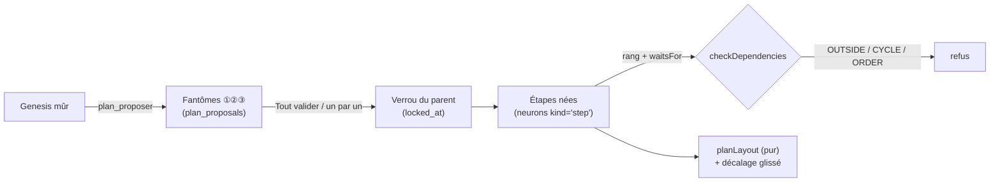
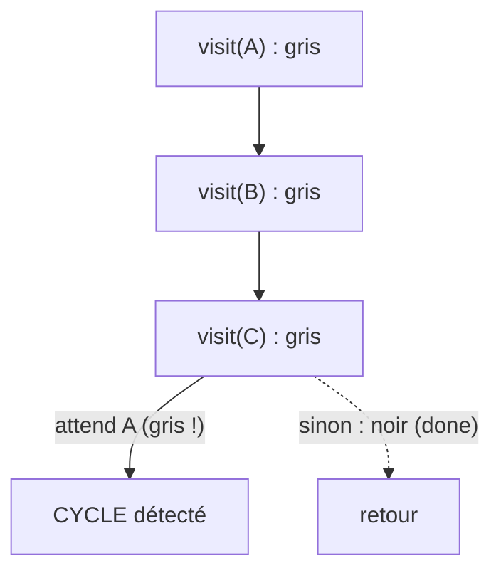

# Plan d'attaque — étapes ordonnées, dépendances sans cycle et verrou

> **En 30 secondes** — Sur une idée mûre, Claude propose une **couche** d'étapes (outil `plan_proposer`). Elles apparaissent en **fantômes** pointillés ; mentalyas valide tout, ou une par une. Valider **verrouille** le parent (son contexte se fige) puis fait naître les étapes, en **un lot annulable**. Chaque étape a un **rang** (①②③) et peut **attendre** des sœurs — sans boucle et toujours après ce qu'elle attend. La carte place l'arbre de gauche à droite par une **fonction pure**.



---

## 1. Vue Macro & Utilité (le « Pourquoi »)

> 📘 **Introduction (ajoutée)** — **C'est quoi, une dépendance sans cycle ?** « B attend A » forme un **graphe orienté** (des flèches entre étapes). Un **cycle** (A attend B qui attend A) rend le plan impossible à exécuter : personne ne peut commencer. Un graphe orienté **sans cycle** (DAG, *Directed Acyclic Graph*) a toujours au moins un ordre valide.

- **Problématique** : l'ancien moteur faisait « éclore » une idée en plan **d'un bloc**. Le nouveau modèle (Claude Code dans le chat) découpe **couche par couche**, et l'humain décide à chaque couche. Deux risques : un **ordre absurde** (dépendance circulaire, étape 1 qui attend l'étape 3) et un **parent modifié après coup** — ses enfants ont été pensés sur un contexte qui n'existe plus.
- **Emplacement dans la carte globale** : domaine pur (`domain/plan/dependencies.ts`, `lock.ts`), service (`PlanService`), outils MCP (`PlanTools`), Historique (lot `plan`), et côté interface une disposition pure (`renderer/src/canvas/planLayout.ts`). Une étape **est un neurone** (`kind = 'step'`) : elle hérite gratuitement de la conversation, de la fiche et de l'Historique — comme l'élément de la carte de structure (`kind = 'element'`, spec 009).
- **Analogie (cuisine)** : le plan d'attaque est le **déroulé d'un service**. Les postes (étapes) sont numérotés ; la sauce **attend** le fond ; on ne peut pas écrire « le fond attend la sauce ». Une fois les commis lancés sur une recette, la **recette est plastifiée** (verrou) : la changer obligerait à tout jeter. Pour la modifier, il faut d'abord **retirer les plats en cours** (annuler la naissance des sous-étapes). *Où ça boite* : en cuisine on improvise ; ici la règle est codée et non négociable.

## 2. Le Pont Systémique (sous le capot)

- **Base de données** : `neurons` gagne `kind`, `rank`, `step_status`, `locked_at`, `lock_proposed_at` ; tables `step_dependencies` (paires étape → étape attendue), `plan_proposals` + `plan_proposal_items` (les fantômes, **hors** des données de mentalyas tant qu'il n'a pas validé). Migration `0022_plan_attaque` avec son `down`.
- **Transaction** : valider une couche = **un** lot d'Historique : verrou du parent + naissance des étapes + dépendances. Tout réussit ou rien (voir [[Glossaire — Transaction ACID]]).
- **Garde D6 dans l'annulation** : annuler un lot qui **déverrouillerait** un nœud est refusé tant qu'il reste des sous-nœuds **nés hors de ce lot** ; ceux nés dans le même lot repartent avec lui.
- **Mémoire de l'interface** : aucune coordonnée d'étape n'est stockée, seulement un **décalage** relatif quand mentalyas glisse une carte. La place de base est recalculée à chaque rendu à partir de l'arbre.



## 3. Analyse du Code & Logique

Extraits de `src/main/domain/plan/dependencies.ts` et `lock.ts` :

```ts
export function checkDependencies(steps): DependencyProblem | null {
  const byId = new Map(steps.map((s) => [s.id, s] as const))
  if (steps.some((s) => s.waitsFor.some((id) => !byId.has(id)))) return 'OUTSIDE' // ① sœurs seulement
  if (hasCycle(steps, byId)) return 'CYCLE'                                          // ② pas de boucle
  const ordered = steps.every((s) => s.waitsFor.every((id) => (byId.get(id)?.rank ?? 0) < s.rank))
  return ordered ? null : 'ORDER'                                                    // ③ après ce qu'on attend
}

function hasCycle(steps, byId): boolean {
  const state = new Map<string, 'visiting' | 'done'>()   // absent = blanc, visiting = gris, done = noir
  const visit = (id: string): boolean => {
    const current = state.get(id)
    if (current === 'visiting') return true               // on retombe sur le chemin en cours : boucle
    if (current === 'done') return false                  // déjà exploré sans boucle
    state.set(id, 'visiting')
    const cyclic = (byId.get(id)?.waitsFor ?? []).some(visit)
    state.set(id, 'done')
    return cyclic
  }
  return steps.some((s) => visit(s.id))
}

export function assertUnlocked(neuron: { readonly lockedAt: string | null }): void {
  if (neuron.lockedAt !== null) throw new AppError('LOCKED', LOCKED_MESSAGE) // ④ garde unique
}
```

- **Étape 1 — Hors fratrie** : une étape n'attend que ses **sœurs** (même parent). Cela garde le graphe petit et lisible.
- **Étape 2 — Cycle par DFS à trois couleurs** : un nœud « gris » est sur le chemin en cours ; retomber dessus = boucle. Un nœud « noir » est fini, on ne le revisite pas : chaque étape est visitée **une fois** (coût linéaire). Même idée que le tri de Kahn de l'ancien moteur, autre technique (voir [[Glossaire — Tri topologique de Kahn]]).
- **Étape 3 — Cohérence rang/dépendances** : `moveRank` déplace une étape puis **renumérote 1..n** ; si le nouvel ordre place une étape avant ce qu'elle attend, le déplacement est refusé (`null`).
- **Étape 4 — Une seule garde pour toutes les écritures** : fiche, titre, description, maturité — chaque chemin (IPC, MCP, Claude, mentalyas) appelle `assertUnlocked`. Un seul endroit à tester, aucun chemin oublié.
- **Étape 5 — Disposition pure** (`planLayout`) : colonnes par profondeur, enfants rangés par rang, **parent centré sur ses enfants**, documents en **annexes** empilés sous leur nœud ; le décalage glissé s'ajoute et entraîne toute la branche. Mêmes entrées → même dessin : la carte ne « saute » pas.

**Bonnes pratiques mises en évidence** : **proposer ≠ écrire** (les fantômes vivent dans des tables à part) ; règles métier dans des fonctions pures testées ; quand Claude confondait `dessiner` et `plan_proposer`, deux garde-fous concrets (bouton qui nomme l'outil, refus motivé dans `dessiner`) ont mieux marché qu'une consigne de plus (JOURNAL 05/10).

## 4. Synthèse & Prochaine Étape

**À retenir (3 puces max)**
- Dépendances valides = **entre sœurs**, **sans cycle** (DFS gris/noir), **dans l'ordre des rangs**.
- On **fige** le parent avant de faire naître ses enfants ; l'annulation respecte ce verrou (D6).
- La disposition est **calculée**, seul le geste de l'humain (décalage) est **stocké**.

**Lien avec la suite** : un nœud du plan peut recevoir un **document** Markdown écrit par Claude → [[Fichiers écrits par l'app — chemin choisi par le main, écriture atomique, corbeille]].

**Rappel actif**
> **Q :** Pourquoi un nœud « gris » rencontré signifie-t-il un cycle, mais pas un nœud « noir » ?
> **R :** Gris = sur le chemin qu'on est en train de descendre : y revenir ferme une boucle. Noir = exploration terminée ailleurs, sans boucle ; y arriver par un autre chemin est un simple partage (losange), pas un cycle.

> **Q :** mentalyas veut annuler la validation d'une couche après avoir validé la couche suivante. Que répond l'app ?
> **R :** Refus (`UNDO_CONFLICT`) : le parent serait déverrouillé alors que des sous-étapes nées dans un autre lot s'appuient sur son contexte. Il faut d'abord annuler leur naissance.

> **Q :** Pourquoi ne pas stocker x/y de chaque étape ?
> **R :** Le placement dépend de l'arbre (ajouts, replis, rangs) ; stocker la position absolue la rendrait fausse au moindre changement. On stocke la **donnée dérivable** une seule fois : le décalage choisi par l'humain.

**Pièges fréquents**
- ⚠️ **Confondre `visiting` et `done`** — tout marquer « vu » d'un seul état fait voir des cycles dans de simples losanges.
- ⚠️ **Mettre la garde dans un seul handler** — un autre chemin d'écriture (outil MCP) la contournerait ; d'où `assertUnlocked` partagée.

**Connexions**
- [[Glossaire — Parcours en profondeur (DFS)]] — la version « trois couleurs » pour les graphes orientés.
- [[Glossaire — Donnée dérivée (calculer plutôt que stocker)]] — place de base calculée, décalage stocké.
- [[Glossaire — Clé stable et upsert]] — la carte de structure, voisine, recartographie un projet sans doublon.
