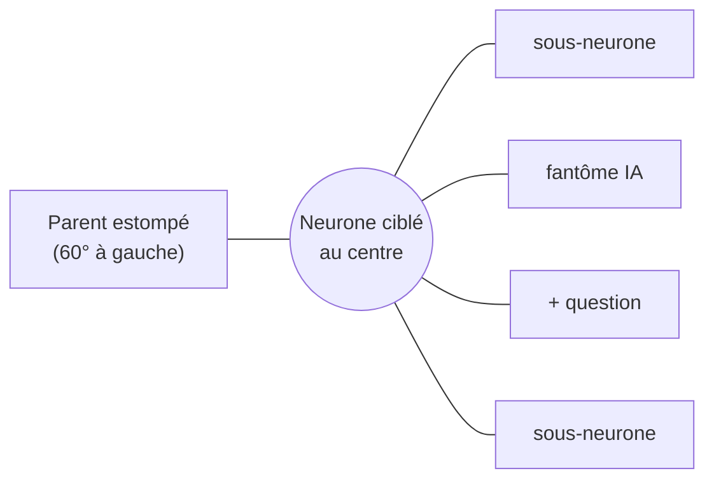

# Plongée radiale — couronne sur un arc et affichage optimiste

> **En 30 secondes** — Quand tu plonges dans une idée, elle se place **au centre** ; ses sous-neurones, les suggestions de l'IA (fantômes) et les « + » (questions) se rangent **en couronne** sur un arc de 300°, les 60° de gauche étant réservés au **parent** (pour remonter). Pas de physique ici : **trois lignes de trigonométrie** suffisent. Et quand tu réponds, ta branche apparaît **tout de suite**, avant la confirmation du moteur.



---

## 1. Vue Macro & Utilité (le « Pourquoi »)

- **Problématique** : un arbre de questions/réponses peut avoir 6 niveaux. L'afficher en entier = illisible. On montre donc **un seul niveau à la fois** (le neurone ciblé et ses enfants directs) et on **plonge** d'un niveau à l'autre, comme un zoom sémantique. Le fil d'Ariane (*breadcrumb* : « Idée › Budget › Location ») dit où l'on est.
- **Emplacement dans la carte globale** : **interface** (`src/renderer/src/dive/`). La vue est **calculée côté interface** depuis l'arbre renvoyé par `neuron:getTree` — le moteur (spec 002) n'a pas eu à changer ([[Clean Architecture — domaine, application, infrastructure]] : la présentation dérive des données).
- **Analogie (multiprise)** : une **multiprise ronde** : le boîtier au centre (l'idée), les prises en couronne autour (les branches), et un côté réservé au **câble d'alimentation** qui remonte vers le mur (le parent). Plus il y a de prises, plus la couronne doit être grande pour qu'elles ne se touchent pas. *Où ça boite* : une vraie multiprise a un nombre fixe de prises ; ici le rayon grandit avec le nombre de branches.

## 2. Le Pont Systémique (sous le capot)

- **Coordonnées polaires → cartésiennes** : un point sur un cercle se décrit par un **angle θ** et un **rayon r** ; l'écran veut du `(x, y)`. Conversion : `x = r·cos θ`, `y = r·sin θ`. Le CPU calcule `cos`/`sin` en quelques nanosecondes — aucune bibliothèque, aucune simulation.
- **Rayon adaptatif** : n éléments sur un arc de 300° → pas angulaire `step = 300°/n`. Deux voisins séparés par un angle `step` sont à une distance (corde) de `2·r·sin(step/2)`. On veut cette corde ≥ 112 px, donc `r = 112 / (2·sin(step/2))`, avec un minimum de 216 px.
- **Affichage optimiste** : quand tu **réponds à une question** (réponse rapide, texte libre ou « Je ne sais pas » → « À trouver : … »), l'interface ajoute **immédiatement** un sous-neurone provisoire (`pending`) ; l'IPC `growth:answer` part vers le main, qui écrit en base (transaction) puis émet `neuron:created`. À réception, l'interface **invalide** son cache (relit l'arbre réel) et retire le provisoire. Les autres actions (« Ajouter ma branche », modifier, supprimer) attendent simplement la réponse du main, qui renvoie l'arbre à jour. Voir [[Glossaire — Mise à jour optimiste]].
- **« L'IA réfléchit… »** : piloté par deux événements du main (`neuron:thinking` / `neuron:thought`) filtrés sur **cette** idée (`rootIdOf(payload) === rootId`) — un neurone qui pousse ailleurs n'allume pas l'indicateur.

## 3. Analyse du Code & Logique

```ts
// src/renderer/src/dive/radialLayout.ts
const ARC = (300 * Math.PI) / 180                        // ① 300° en radians ; 60° libres à gauche

export function radialLayout(count: number, hasParent: boolean): RadialLayout {
  const step = count === 0 ? ARC : ARC / count            // ② angle entre deux voisins
  const radius = Math.max(MIN_RADIUS,
    count <= 1 ? 0 : ITEM_SPACING / (2 * Math.sin(step / 2)))   // ③ corde ≥ 112 px
  const items = Array.from({ length: count }, (_, index) => {
    const angle = count === 1 ? 0 : -ARC / 2 + step * (index + 0.5) // ④ centré sur la droite (angle 0)
    return { x: round(radius * Math.cos(angle)), y: round(radius * Math.sin(angle)) }
  })
  return { radius, items, parent: hasParent ? { x: -round(radius), y: 0 } : null } // ⑤ parent à gauche
}
```

- **Étape 1 — Arc** (①) : l'angle 0 pointe à droite ; l'arc va de −150° à +150° ; il reste 60° à gauche (180°) pour le parent.
- **Étape 2 — Répartition** (② ④) : `index + 0.5` place chaque élément **au milieu** de sa part d'arc (pas collé au bord).
- **Étape 3 — Rayon** (③) : la formule de la corde garantit l'espacement quelle que soit la quantité.
- **Étape 4 — Scène HTML, pas React Flow** : la plongée est du HTML positionné, animé par **Motion** (pousse 250 ms, plongée 400 ms) — c'est ce qui a permis l'animation de **fusion** (les sous-neurones glissent vers le centre en 700 ms) sans lutter contre la toile.
- **Étape 5 — Mise en page 62/38** : scène à gauche, panneau de questions à droite (nombre d'or, standard du workspace).

**Bonnes pratiques mises en évidence** : fonction de géométrie **pure** (`tests/unit/ui/radial.test.ts` vérifie les espacements) ; l'interface **affiche vite** mais la vérité reste celle du main (le provisoire est remplacé par l'arbre relu) ; animations réduites (fondus ≤ 150 ms) si Windows ou le réglage le demande.

## 4. Synthèse & Prochaine Étape

**À retenir (3 puces max)**
- Un niveau à la fois : centre + couronne + parent ; le fil d'Ariane garde le contexte.
- Polaire → cartésien (`r·cos θ`, `r·sin θ`) ; le rayon grandit pour garder la corde ≥ 112 px.
- Optimiste : on montre tout de suite, puis on **remplace** par la donnée confirmée par le main.

**Lien avec la suite** : quand la jauge est pleine, on verrouille et l'aperçu éditable s'ouvre → [[Éclosion atomique — transaction, version et historique]], puis on peut revenir en arrière → [[Annuler par lot — journal avant-après, conflit et lot inverse]].

**Rappel actif**
> **Q :** Pourquoi `index + 0.5` et pas `index` dans le calcul de l'angle ?
> **R :** Pour centrer chaque élément dans sa part d'arc ; avec `index`, le premier serait collé à l'extrémité de l'arc, près du parent.

> **Q :** Que devient le sous-neurone provisoire si le main renvoie une erreur ?
> **R :** Il est retiré (`setPending([])` dans `finally`), l'arbre réel est relu et un message d'erreur s'affiche.

> **Q :** Pourquoi la plongée n'utilise-t-elle pas d3-force ?
> **R :** Un seul niveau, une structure en étoile : une formule directe est exacte, instantanée et déterministe.

**Pièges fréquents**
- ⚠️ **Degrés vs radians** — `Math.cos` attend des radians : 300° = 300·π/180.
- ⚠️ **Optimiste sans retour arrière** — si l'erreur n'efface pas le provisoire, l'écran ment.

**Connexions**
- [[Croissance d'un neurone — arbre, garde-fous et jauge]] — l'arbre que la plongée affiche.
- [[Glossaire — Mise à jour optimiste]] — le principe « afficher avant confirmation ».
- [[TanStack Query et Zustand ↔ cache de données et état d'interface]] — où vit l'arbre en mémoire côté interface.


## Évolution du 30/09 — la plongée n'est plus un écran
> ⚠️ **Correction du 30/09** — L'écran de plongée décrit ci-dessus a été **retiré** le 29/09 (FR-013 révisée) : `dive/DiveView.tsx`, `DiveStage.tsx` et `radialLayout.ts` sont supprimés. Une idée s'ouvre maintenant **sur la carte** : volet latéral à droite (`dive/OpenIdea.tsx`, `IdeaPanel.tsx`) et arbre déployé autour de l'idée (`canvas/ideaTreeLayout.ts`, puis vrais nœuds React Flow dans `treeGraph.ts`). La **trigonométrie** de cette note reste la bonne base (un anneau par niveau, secteurs proportionnels au nombre de feuilles), et l'affichage optimiste est inchangé ; seuls les fichiers cités ne sont plus à jour.

Règle apprise en chemin (JOURNAL 29/09 16:00) : un état d'interface dérivé d'une liste rafraîchie en arrière-plan (« la première question ») ne doit pas piloter une action destructive (vider la saisie) — retenir la sélection **explicitement**.
