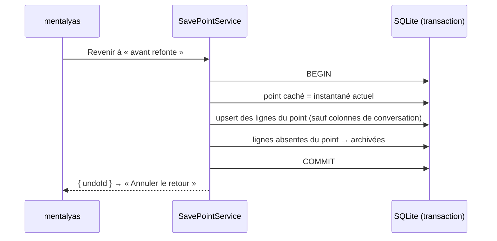

# Points de sauvegarde — instantané compressé, point caché avant retour et colonnes épargnées

> **En 30 secondes** — Depuis la spec 024, l'app s'ouvre sur un **Project Manager** : chaque projet a **son** canevas. Sur ce canevas, « Point de sauvegarde » photographie **toutes ses lignes** (idées, blocs, liens, position de la vue), en JSON compressé. « Revenir » pose d'abord un **point caché** « avant retour à … » (pour annuler le retour), puis remet le canevas dans l'état photographié **en une transaction**. Les conversations avec Claude et les fichiers du projet ne sont **jamais** touchés.



---

## 1. Vue Macro & Utilité (le « Pourquoi »)

- **Problématique** : l'**Historique** (« Annuler par lot ») défait **une action** à la fois. Après une heure de réorganisation avec Claude, on veut revenir **d'un coup** à « comme c'était ce matin ». Il faut un état **nommé et complet** — et ce retour doit lui-même être annulable, sinon on a peur de cliquer.
- **Emplacement dans la carte globale** : `SavePoints.tsx` (renderer) → IPC `savepoints:*` (`create`, `restore`, `undoRestore`…) → `SavePointService` (application) → `snapshot.ts` (domaine, encodage pur) → `SavePointRepository` (Drizzle) → table `save_points` (colonne `snapshot` en BLOB). Autour : `BrainstormService` (un brainstorm = un projet = un canevas), `ProjectVault` (`.brainstormer/brainstorm.json` dans le dossier du projet : **métadonnées seulement**, ignoré par git).
- **Analogie (jeu vidéo)** : la **sauvegarde manuelle** avant le boss. Charger une sauvegarde ne supprime pas ta partie actuelle : un bon jeu crée d'abord une **sauvegarde automatique** « avant chargement » — c'est le point caché. *Où elle boite* : dans un jeu, tout revient (inventaire, dialogues) ; ici les **conversations** gardent leur vie propre (voir Bloc 3).

## 2. Le Pont Systémique (sous le capot)

- **Mémoire → texte** : `JSON.stringify` transforme les lignes (objets du tas) en une chaîne UTF-8. Un canevas de quelques centaines de nœuds pèse vite plusieurs Mo de JSON, très **répétitif** (mêmes noms de colonnes à chaque ligne).
- **CPU — compression** : `gzipSync` (algorithme DEFLATE) remplace les répétitions par des renvois en arrière → souvent 5 à 10 fois plus petit. Coût : quelques millisecondes de calcul, synchrone (le canevas est borné).
- **Disque** : le résultat va dans une colonne BLOB de la base **chiffrée** (SQLCipher) — l'instantané est protégé comme le reste.
- **Relecture** : `gunzipSync(packed, { maxOutputLength: 100 Mo })` — sans cette borne, un BLOB abîmé ou forgé de quelques Ko pourrait se décompresser en gigaoctets et saturer la RAM. Puis **Zod** revalide la forme. → [[Glossaire — Bombe de décompression (zip bomb)]]

## 3. Analyse du Code & Logique

**Bloc 1 — Encoder, borner, relire** (`domain/brainstorms/snapshot.ts`)
```ts
export const SNAPSHOT_LIMITS = { compressed: 20 * 1024 * 1024, raw: 100 * 1024 * 1024 }
const packed = gzipSync(Buffer.from(JSON.stringify(snapshot), 'utf8'))
if (packed.length > SNAPSHOT_LIMITS.compressed) throw new AppError('TOO_LARGE', …)
// relecture
json = JSON.parse(gunzipSync(packed, { maxOutputLength: SNAPSHOT_LIMITS.raw }).toString('utf8'))
const parsed = SnapshotSchema.safeParse(json)        // version: 1, neurons/blocks/links avec un id, view
```
`version: z.literal(1)` : le format est **versionné** ; un futur format 2 saura reconnaître un ancien point.

**Bloc 2 — Le point caché avant retour** (`SavePointService.restore`)
```ts
return repository.transaction(() => {
  const undo = this.pose(point.brainstormId, `avant retour à « ${point.name} »`, true)   // hidden = true
  const viewState = this.apply(point)
  for (const old of repository.list(point.brainstormId, true).slice(SAVE_POINT_LIMITS.hidden)) repository.remove(old.id)
  return { undoId: undo.id, viewState }
})
```
Tout est **dans la même transaction** : si `apply` échoue, le point caché n'existe pas non plus (tout ou rien). On garde les **5** derniers points cachés, **50** points visibles au plus.

**Bloc 3 — Remplacer sans écraser la vie des conversations** (`SavePointRepository.replace`)
```ts
.onConflictDoUpdate({ target: neurons.id, set: without(row, ['id', ...CONVERSATION_COLUMNS]) })
// CONVERSATION_COLUMNS = sessionId, sessionStarted, chatModel, chatPermissionMode, chatExtraDirsJson, …, projectDir
```
Un **upsert** (insérer, ou mettre à jour si l'id existe) remet chaque ligne dans son état photographié **sauf** les colonnes de conversation : revenir à un point ne doit pas te ramener à une session Claude d'il y a trois heures.

**Bloc 4 — Retirer = archiver** (`idsToRetire`) : ce qui existe maintenant mais pas dans le point passe en `state: 'archived'` — jamais `DELETE`. Combiné au point caché, aucun clic ne détruit rien.

**Bonnes pratiques mises en évidence** : format sérialisé **versionné** et **revalidé** ; bornes en entrée **et** en sortie de compression ; l'action risquée crée elle-même son filet (point caché) dans la même transaction ; périmètre explicite de ce qui est restauré (liste de colonnes épargnées).

## 4. Synthèse & Prochaine Étape

**À retenir (3 puces max)**
- Un instantané = lignes + vue, en JSON **gzip**, relu avec **borne de décompression** et **Zod**.
- Revenir pose d'abord un **point caché** : le retour est annulable, dans la même transaction.
- On restaure le **canevas**, pas les conversations ni les fichiers ; ce qui disparaît est **archivé**.

**Lien avec la suite** : un projet chargé peut aussi être **lancé** depuis l'app → [[Lancer un projet — processus de longue durée, sortie par lots bornée et arbre de processus]].

**Rappel actif**
> **Q :** Pourquoi le point caché est-il créé **dans** la transaction du retour, et pas juste avant ?
> **R :** Si le retour échoue, la transaction annule tout : pas de point caché orphelin, et le canevas reste intact. Les deux réussissent ou échouent ensemble.

> **Q :** Que protège `maxOutputLength` que la borne de 20 Mo compressés ne protège pas ?
> **R :** La taille **après** décompression : quelques Ko compressés peuvent donner des Go. La borne en entrée ne dit rien du résultat.

> **Q :** Tu reviens à un point de 9 h ; à 10 h tu avais créé une idée « Budget » et discuté avec Claude dessus. Que deviennent l'idée et la discussion ?
> **R :** L'idée n'est pas dans le point → **archivée** (récupérable). La session Claude d'une idée restaurée n'est pas réécrite (colonnes épargnées).

**Pièges fréquents**
- ⚠️ **Décompresser sans borne** — porte ouverte à la saturation mémoire.
- ⚠️ **« Restaurer » = tout effacer puis réinsérer** — on perd ce qui n'était pas dans le point ; ici on archive.
- ⚠️ **Un format sans numéro de version** — impossible de relire proprement les anciens points après une évolution.

**Connexions**
- [[Annuler par lot — journal avant-après, conflit et lot inverse]] — annuler **une action** vs revenir à **un état**.
- [[Glossaire — Suppression douce (soft delete)]] — archiver au lieu d'effacer.
- [[Drizzle ORM ↔ SQL paramétré et migrations]] — `onConflictDoUpdate` = `INSERT … ON CONFLICT DO UPDATE` paramétré.
- [[Fichiers écrits par l'app — chemin choisi par le main, écriture atomique, corbeille]] — le vault `.brainstormer/` suit les mêmes règles (lu par Zod, borné, jamais réécrit s'il est abîmé).
