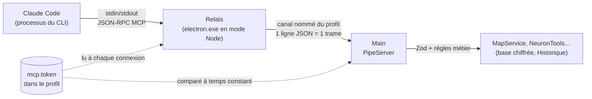
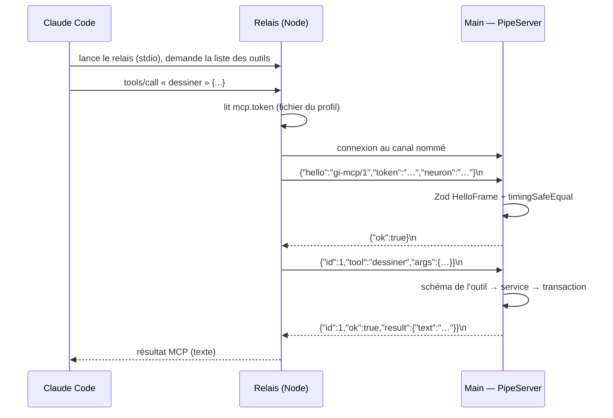

# Pont MCP — relais stdio, canal nommé et secret partagé

> **En 30 secondes** — Claude Code (le CLI) sait appeler des « outils » décrits par le protocole **MCP**. Pour qu'il lise et dessine la carte, l'app lui fournit un **relais** : un petit programme que Claude Code lance lui-même et auquel il parle par ses flux standard. Le relais ne touche à rien : il transmet chaque appel au **main** par un **canal nommé** (un tuyau local, sans réseau), après s'être présenté avec un **secret**. Le main revalide tout, comme pour l'interface.



---

## 1. Vue Macro & Utilité (le « Pourquoi »)

> 📘 **Introduction (ajoutée)** — **C'est quoi, un serveur MCP ?** Un programme qui annonce à un agent IA une liste d'outils (nom, description, schéma d'entrée) et exécute ceux que l'agent appelle. Claude Code le lance comme **processus enfant** et lui parle en JSON sur ses flux standard (voir [[Glossaire — MCP (Model Context Protocol)]]). **Et un canal nommé ?** Un tuyau de communication local que le système d'exploitation identifie par un nom (`\\.\pipe\…` sous Windows) : deux processus de la même machine s'y branchent, rien ne passe par la carte réseau (voir [[Glossaire — Canal nommé et flux standard]]).

- **Problématique** : le 04/10, constat de mentalyas — les neurones et les widgets marchent, mais il travaille **dans Claude Code**. Plutôt que de refaire un agent dans l'app, on donne à Claude Code **des mains sur la carte**. Il faut donc qu'un processus **qui n'appartient pas à l'app** puisse écrire dans sa base chiffrée… sans en faire une porte ouverte à n'importe quel programme de la machine.
- **Emplacement dans la carte globale** : c'est un **deuxième guichet** à côté de l'IPC. L'IPC relie l'interface au main (même application) ; le pont relie un **agent extérieur** au main. Les deux arrivent aux **mêmes services** (`MapService`, Historique), donc aux mêmes règles.
- **Analogie (multiprise)** : le main est le **tableau électrique** de la maison. L'interface y est câblée en dur (IPC). Claude Code est un appareil **du voisin** : on lui tend une **rallonge** (le relais) qui se branche sur une **prise à clé** (le canal nommé). Sans la clé (le secret), la prise ne délivre rien ; et le disjoncteur (validation Zod + règles métier) reste celui de la maison, pas celui de la rallonge. *Où ça boite* : une vraie rallonge transporte du courant dans un seul sens ; ici le relais transporte des **questions et des réponses**.

## 2. Le Pont Systémique (sous le capot)

Trois processus, deux tuyaux :



- **Mémoire et processus** : le relais est `electron.exe` lancé avec `ELECTRON_RUN_AS_NODE=1` — le même binaire que l'app, mais **sans fenêtre ni Chromium** : un simple Node. Il n'ouvre **jamais** la base ; il ne détient qu'une connexion et une table `id → promesse en attente`.
- **Le canal** : nom dérivé d'une empreinte SHA-256 du chemin du profil (`gestionnaire-idees-mcp-<8 hex>`). Le profil réel et le profil démo ont donc deux canaux distincts, et `C:/…` ou `C:\…` donnent le même nom (chemin normalisé avant hachage).
- **Le secret** : 32 octets aléatoires en hexadécimal dans `mcp.token`, fichier du profil (droits de l'utilisateur). Le relais le **relit à chaque connexion** : une rotation dans Réglages ne casse pas un relais légitime. Le secret n'est **jamais** écrit dans la configuration de Claude Code.
- **App fermée** : la connexion échoue → chaque outil répond « Le Brainstormer n'est pas lancé ». La session MCP de Claude Code **survit** et se reconnecte à l'appel suivant (connexion paresseuse).

## 3. Analyse du Code & Logique

Extraits de `src/main/infrastructure/mcp/PipeServer.ts`, `token.ts` et `lineSplitter.ts` :

```ts
// ① Découper un flux d'octets en messages : une trame = une ligne, bornée à 1 Mo
push(chunk) {
  this.buffer += chunk
  const parts = this.buffer.split('\n')
  this.buffer = parts.pop() ?? ''            // le morceau incomplet attend la suite
  // … overflow si une ligne dépasse MAX_FRAME_BYTES → la connexion sera fermée
}

// ② Poignée de main : rien n'est exécuté avant le secret
if (!authenticated) {
  const hello = HelloFrame.safeParse(frame)  // z.strictObject : aucun champ en trop
  clearTimeout(timer)                        // 2 s pour se présenter, sinon coupé
  if (!hello.success || !this.options.matchesToken(hello.data.token)) {
    socket.end(JSON.stringify({ ok: false, code: 'SECRET_REFUSE' }) + '\n')
    return
  }
  authenticated = true
  caller = { neuronId: hello.data.neuron ?? null } // quelle conversation a lancé ce relais
}

// ③ Comparer un secret sans fuite de temps
matches(candidate) {
  const expected = Buffer.from(this.current, 'utf8')
  const given = Buffer.from(candidate, 'utf8')
  return expected.length === given.length && timingSafeEqual(expected, given)
}

// ④ Chaque appel : outil connu ? entrée conforme à SON schéma ? puis service
const parsed = MCP_TOOLS[tool].input.safeParse(args)
if (!parsed.success) return fail('ENTREE_INVALIDE', describeIssues(parsed.error))
```

- **Étape 1 — Le découpage en lignes** : un flux TCP ou de canal n'a pas de « messages », seulement des octets qui arrivent par paquets arbitraires. Le `LineSplitter` reconstitue les messages au saut de ligne et **coupe** toute ligne géante (anti-saturation mémoire).
- **Étape 2 — La poignée de main** : tant que le secret n'est pas présenté, la seule trame acceptée est `hello`. Trame malformée, en trop ou trop lente → connexion détruite. Au plus 8 clients simultanés.
- **Étape 3 — Temps constant** : `===` sur deux chaînes s'arrête au premier caractère différent ; en mesurant la durée, un attaquant devinerait le secret caractère par caractère. `timingSafeEqual` compare **tous** les octets, quel que soit le résultat.
- **Étape 4 — Le relais n'est pas de confiance** : il a déjà validé l'entrée côté SDK MCP, mais le main **revalide** avec le même schéma Zod. Erreur métier attendue → code MCP lisible (`toMcpError`) ; erreur inconnue → « Erreur interne », sans détail.
- **Étape 5 — Traçabilité** : chaque écriture de Claude devient une opération d'Historique `mcp_write` marquée « par Claude », annulable d'un clic (toast « Annuler »).

**Bonnes pratiques mises en évidence** : aucun port réseau ouvert (rien à exposer au pare-feu) ; protocole versionné (`gi-mcp/1`) ; même schéma partagé (`src/shared/mcp/`) par les deux processus ; l'identité de l'appelant (`neuron`) sert plus tard à **refuser** qu'une conversation écrive dans un autre arbre (spec 008).

> ⚠️ **Probable** (lu, non exécuté) : les droits du fichier `mcp.token` reposent sur les ACL (listes de contrôle d'accès) du dossier `%APPDATA%` de l'utilisateur ; l'option `mode: 0o600` n'a pas d'effet réel sous Windows.

## 4. Synthèse & Prochaine Étape

**À retenir (3 puces max)**
- Le relais est un **traducteur** (MCP ↔ canal) sans pouvoir : toute décision est dans le main.
- Le secret se présente **d'abord**, se compare **à temps constant**, se relit **à chaque connexion**.
- Un flux n'a pas de messages : on les **délimite** (une ligne JSON) et on les **borne** (1 Mo).

**Lien avec la suite** : le pont existe ; reste à faire parler Claude Code **depuis** l'app → [[Piloter Claude Code — processus enfant, flux stream-json et session reprise]].

**Rappel actif**
> **Q :** Pourquoi un canal nommé plutôt qu'un petit serveur HTTP sur `localhost` ?
> **R :** Aucun port ouvert (n'importe quel programme, voire une page web, peut viser `localhost`), pas de pare-feu à régler, nom propre au profil ; et un message clair quand l'app est fermée.

> **Q :** Que se passe-t-il si mentalyas régénère le secret pendant qu'une session Claude Code tourne ?
> **R :** Le main déconnecte tous les relais ; au prochain appel, le relais relit `mcp.token` (nouveau secret) et se représente : la session continue sans relancer Claude Code.

> **Q :** Le relais valide déjà l'entrée avec le SDK MCP. Pourquoi revalider dans le main ?
> **R :** Parce que n'importe quel programme qui connaîtrait le secret pourrait écrire sur le canal sans passer par le relais : la frontière de confiance est le main, pas le relais.

**Pièges fréquents**
- ⚠️ **Croire qu'un `data` = un message** — un paquet peut contenir une demi-ligne ou trois lignes : il faut un tampon.
- ⚠️ **Mettre le secret dans la config de Claude Code** — il finirait dans un fichier partagé ou sauvegardé ; ici, seul le chemin du profil est transmis.

**Connexions**
- [[IPC typé — le guichet unique entre interface et moteur]] — même principe « valider à la frontière », autre client.
- [[Annuler par lot — journal avant-après, conflit et lot inverse]] — les écritures de Claude y deviennent annulables.
- [[Glossaire — Empreinte SHA-256]] — sert ici à nommer le canal, pas à sceller.
