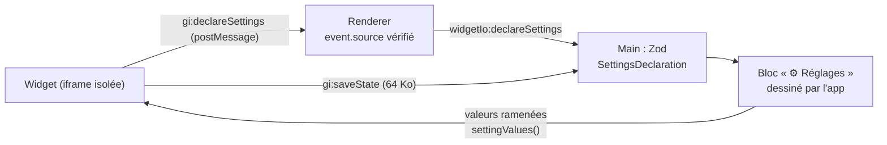

# Réglages déclarés par un widget — le widget décrit, l'app dessine et ramène chaque valeur

> **En 30 secondes** — Un widget relié à un nœud propose **🖼 Wireframe**, **🔀 Parcours**, **🛠 Adapter** : Claude y dessine des écrans d'app jouables. Deux nouveautés pour le code du widget, toujours enfermé dans son iframe : il peut **enregistrer son état** (`gi.saveState`, 64 Ko max) et le retrouver à la réouverture ; et il peut **déclarer** des réglages (`gi.settings([...])`). Le widget ne dessine **pas** le panneau : c'est **l'app** qui le dessine, à côté de lui, et qui lui renvoie des valeurs **toujours conformes** à la déclaration.



---

## 1. Vue Macro & Utilité (le « Pourquoi »)

- **Problématique** : un wireframe a besoin d'un « mini CMS » (textes, états vide / chargement / erreur, mobile ou bureau, couleurs). Première version (D3) : Claude dessinait ce panneau **dans** le widget — chaque génération le changeait, il volait de la place à l'écran, et rien ne garantissait les valeurs. D7 inverse les rôles : le widget **décrit** ce qu'il accepte, l'app **dessine** et **contrôle**.
- **Emplacement dans la carte globale** : code du widget (`gi.*` injecté dans l'iframe) → `postMessage` → `useWidgetBridge` (renderer, filtre `event.source`) → IPC `widgetIo:declareSettings | saveState | savedState` → `WidgetIoService` (main) → tables `widget_states`, `widget_settings` ; bloc `settings` sur le canevas (`SettingsNode`, `SettingsForm`).
- **Analogie (électricité)** : le client (le widget) dit à l'électricien : « je voudrais un variateur de 0 à 100 et un interrupteur pour la terrasse ». L'électricien (l'app) pose **son propre tableau normalisé** et câble les commandes. Le client ne touche jamais aux fils ; et un variateur réglé à 140 n'existe pas : il **bute à 100**. *Où elle boite* : un vrai variateur bute mécaniquement ; ici la butée est une **fonction** (`valueOf`) appliquée à chaque échange.

## 2. Le Pont Systémique (sous le capot)

- **Frontière de mémoire** : l'iframe du widget vit dans un **contexte JavaScript isolé** (origine opaque) : elle ne peut pas lire la mémoire de l'app. Le seul passage est `postMessage`, qui **copie** la donnée (algorithme de clonage structuré) — pas de référence partagée, pas de fonction transmise.
- **Vérifications en chaîne** : renderer (le message vient-il bien de **ce** cadre ? `event.source === frame.contentWindow`) → main (Zod sur la déclaration ; `checkState` sur l'état : JSON, 64 Ko, profondeur bornée) → base (une ligne par widget, `ON DELETE CASCADE` : supprimer le widget supprime son état).
- **Rafales** : un widget qui enregistre son état à chaque frappe passerait par l'IPC et SQLite des dizaines de fois par seconde ; `stateThrottle` regroupe, et **vide** (`flush`) l'état en attente à la fermeture du widget pour ne rien perdre.
- **Version** : la déclaration est refusée si elle vient d'une version du widget **qui n'est plus affichée** (`widget.versionId !== input.versionId`) — un ancien cadre encore en vie ne peut pas réécrire le panneau.

## 3. Analyse du Code & Logique

**Bloc 1 — Un catalogue fermé de 6 types** (`shared/widgets/settings.ts`)
```ts
export const SettingField = z.discriminatedUnion('type', [
  z.object({ ...Base, type: z.literal('text'),   default: z.string().max(2000).default('') }).strict(),
  z.object({ ...Base, type: z.literal('select'), options: z.array(LABEL).min(1).max(20), default: LABEL.optional() }).strict(),
  z.object({ ...Base, type: z.literal('color'),  default: z.string().regex(/^#[0-9a-f]{6}$/i).default('#2563eb') }).strict(),
  z.object({ ...Base, type: z.literal('range'),  min: z.number().finite(), max: z.number().finite(), … }).strict()
    .refine((f) => f.min < f.max), /* textarea, toggle */ ])
// déclaration : 1 à 40 champs, clés uniques (/^[A-Za-z][A-Za-z0-9_-]{0,39}$/)
```
`.strict()` refuse toute propriété inconnue (pas de `onChange: "code"` glissé). Le champ `type` choisit la forme exacte. → [[Glossaire — Union discriminée et catalogue fermé]]

**Bloc 2 — Ramener chaque valeur à sa déclaration** (`valueOf`)
```ts
case 'select': return typeof value === 'string' && field.options.includes(value) ? value : defaultOf(field)
case 'color':  return typeof value === 'string' && HEX.test(value) ? value.toLowerCase() : defaultOf(field)
case 'range':  return Number.isFinite(value) ? Math.min(field.max, Math.max(field.min, value)) : defaultOf(field)
```
On ne **refuse** pas une valeur bizarre : on la **ramène** (clamp, valeur par défaut). `settingValues` renvoie **une valeur par champ déclaré, et rien d'autre** — une clé inconnue disparaît.

**Bloc 3 — Le panneau naît avec la déclaration, dans une transaction** (`declareSettings`)
```ts
return repository.transaction(() => {
  repository.saveSettings(blockId, JSON.stringify(fields), JSON.stringify(values))
  const existing = blocks.settingsBlockOf(blockId)
  if (existing !== undefined) return { …, created: false }          // déjà là : retrouvé, pas dupliqué
  const created = blocks.insert({ kind: 'settings', x: source.x + …, sourceBlockId: blockId })
})
```
Une nouvelle déclaration (Claude a fait évoluer le widget) **reprend** les anciennes valeurs, ramenées à la nouvelle forme.

**Bloc 4 — Consignes figées** (D2) : les boutons Wireframe / Parcours / Adapter envoient une **consigne écrite dans le code** (cadre `WidgetFrame`), jamais un texte venu de l'interface ; le champ libre sert ensuite à retoucher.

**Bonnes pratiques mises en évidence** : **inversion de contrôle** (le code non fiable déclare, le code de confiance exécute) ; validation par schéma **fermé** ; normaliser plutôt que planter ; lier toute écriture à la **version** affichée.

## 4. Synthèse & Prochaine Étape

**À retenir (3 puces max)**
- Le widget **déclare**, l'app **dessine** : aucune interface de réglage n'est écrite par le code non fiable.
- Chaque valeur est **ramenée** à sa déclaration (type, options, bornes) à chaque échange.
- L'état d'un widget est une **donnée bornée** (64 Ko), revalidée dans le main, regroupée en rafales et vidée à la fermeture.

**Lien avec la suite** : comment vérifier qu'un tel parcours marche **dans l'app réelle**, de l'iframe au disque ? → [[Tests de bout en bout — Playwright pilote Electron sur un profil fictif]].

**Rappel actif**
> **Q :** Le widget déclare un curseur `min: 0, max: 10` puis envoie la valeur `"999"` (texte). Que reçoit-il en retour ?
> **R :** `0` : la valeur n'est pas un nombre fini → valeur par défaut (absente) → `min`.

> **Q :** Pourquoi refuser une déclaration dont le `versionId` n'est pas celui affiché ?
> **R :** Un ancien cadre (version précédente encore chargée) ne doit pas écraser le panneau de la version que mentalyas voit.

> **Q :** Quelle différence entre l'**état** d'un widget et ses **réglages** ?
> **R :** L'état est libre (JSON borné, propre au widget, ex. écran courant) ; les réglages sont **déclarés et typés**, affichés et modifiés par l'app.

**Pièges fréquents**
- ⚠️ **Laisser le code non fiable dessiner son propre panneau** — plus rien ne garantit les valeurs ni l'ergonomie.
- ⚠️ **Rejeter toute valeur hors bornes** — un ancien état devient inutilisable après une évolution ; ramener est plus robuste.
- ⚠️ **Enregistrer à chaque frappe sans regroupement** — rafales d'IPC et d'écritures SQLite.

**Connexions**
- [[Glossaire — Union discriminée et catalogue fermé]] — la forme de `SettingField`.
- [[Glossaire — Throttle et debounce (regrouper des événements)]] — `stateThrottle` et son `flush`.
- [[Zod ↔ type guards et sortie structurée]] — `.strict()`, `.refine()`, `.default()`.
