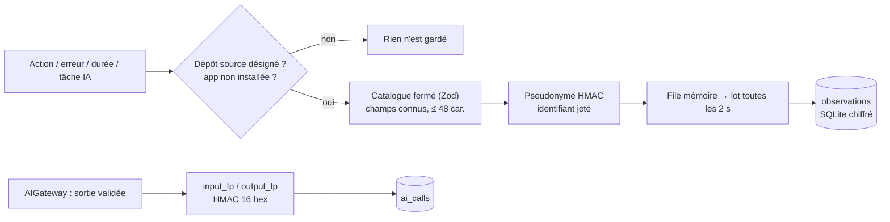

# Sonde sans contenu — télémétrie minimisée, empreintes HMAC et pseudonymes

> **En 30 secondes** — Pour que Claude puisse améliorer l'app en la regardant tourner, il faut une **sonde** qui note *ce qui se passe* (écran ouvert, action, erreur, durée, tâche d'IA) **sans jamais garder ce que mentalyas écrit**. Trois outils : un **catalogue fermé** (tout champ inconnu est jeté), des **empreintes HMAC** (repérer « même travail refait » sans lire le texte) et des **pseudonymes** (suivre « le même neurone ouvert 6 fois » sans pointer la donnée).
>
> ⚠️ **Statut** : conçu et planifié le 07/10 (spec 019, tâches T004–T016), **pas encore codé**. Tout ce qui suit décrit la conception ; les extraits de code sont **⚠️ Probables** (tirés des documents L3 et research).



---

## 1. Vue Macro & Utilité (le « Pourquoi »)

> 📘 **Introduction (ajoutée)** — **C'est quoi, la télémétrie ?** Des **mesures automatiques** qu'une application envoie ou garde sur son propre fonctionnement (plantages, temps de réponse, fonctions utilisées). **Et la minimisation des données ?** Un principe du RGPD (*Règlement général sur la protection des données*, loi européenne) : ne collecter **que** ce qui sert le but, rien de plus. Ici, le but est « trouver bugs, lenteurs, frictions, tâches d'IA répétitives » — le **contenu** des idées n'y sert à rien, donc il n'est jamais collecté.

- **Problématique** : l'app sait des choses que personne ne regarde (erreurs du main, tâches d'IA rejetées, allers-retours entre écrans). Mais une sonde naïve (« enregistre tout ») garderait les idées, les messages de chat, les noms de fichiers… et la constitution (principe I) interdit tout contenu d'idée ou donnée personnelle dans les journaux.
- **Emplacement dans la carte globale** : **renderer** (file locale, erreurs globales, navigation) → **IPC** `analyste:events` (lots ≤ 100) → **main** (`ProbeService`, mesure `ipc.call` posée **une seule fois** dans le dispatcher du registre IPC, second puits du journal `teeSink`) → **SQLite chiffré** (`observations`). Seulement en **développement**, depuis le dépôt désigné (`app.isPackaged` ⇒ service absent).
- **Analogie (boîte noire)** : la boîte noire d'un avion enregistre altitude, vitesse et alarmes — **pas** les conversations des passagers. *Côté restauration* : le cahier de service note « table 4, plat renvoyé, 12 min d'attente », jamais ce que les clients se sont dit. *Où ça boite* : une vraie boîte noire enregistre aussi le cockpit ; ici, même les messages d'erreur sont exclus, car ils peuvent contenir un texte saisi.

## 2. Le Pont Systémique (sous le capot)

**Le chemin d'un événement** : le renderer pousse dans un tableau en mémoire → toutes les 2 s (ou 100 événements) un seul message IPC → le main valide **chaque** événement par Zod (union discriminée sur `event`) → file mémoire bornée (2 000 ; au-delà, les actions identiques consécutives fusionnent en `count += 1` ; au-delà de 5 000, abandon **compté**) → **une** transaction SQLite toutes les 2 s avec des `INSERT` préparés.

Pourquoi des **lots** ? `better-sqlite3` est **synchrone** : chaque écriture bloque le fil du main le temps de l'accès disque. Mille petites transactions = mille synchronisations disque ; une transaction de mille lignes = une seule. Objectif mesurable (SC-008) : une rafale de 10 000 événements ne bloque pas l'interface plus de 100 ms.

**Empreinte HMAC d'une tâche d'IA** : après validation de la sortie, l'`AIGateway` calcule
`HMAC-SHA256(clé, kind ‖ version de la consigne ‖ JSON canonique de l'entrée)` tronqué à 16 hexadécimaux. La **clé** (32 octets aléatoires) est chiffrée par `safeStorage` (DPAPI, liée à la session Windows) : elle ne quitte jamais la machine et n'est jamais en clair dans la base.

> **Pourquoi pas un simple SHA-256 ?** Parce que l'entrée d'une tâche peut être **courte** (« acheter du pain »). Un attaquant qui lit la base peut hacher un **dictionnaire** de phrases courantes et comparer : `sha256("acheter du pain")` est le même partout dans le monde. Avec un HMAC, il lui faut **la clé** pour calculer la moindre empreinte → le dictionnaire ne sert à rien. Détail → [[Glossaire — HMAC (empreinte à clé)]].

## 3. Analyse du Code & Logique

**Bloc 1 — Le catalogue fermé** (`shared/analyste/events.ts`, ⚠️ prévu T005)

```ts
// Union discriminée : chaque nom d'événement a SON schéma, aucun champ libre
z.discriminatedUnion('event', [
  z.object({ event: z.literal('neuron.create'), subjectKind: SubjectKind, subjectRef: Ref, via: Via }).strict(),
  z.object({ event: z.literal('error.renderer'), code: Short, module: Short,
             frames: z.array(RelFrame).max(5) }).strict(),   // jamais `message`
  // …
])
```
Liste **blanche** : on énumère ce qui est permis ; tout le reste (champ inconnu, texte long, chemin absolu dans une pile d'appels) est retiré. Une liste noire (« interdire les champs `text`, `title`… ») oublierait toujours un cas.

**Bloc 2 — Une erreur sans son message**

On garde le **type** (`TypeError`), le **module** et au plus 5 cadres de pile `chemin-relatif:ligne` situés **dans le dépôt**. Le message (`Cannot read 'x' of "Acheter du pain"`) peut contenir un texte saisi : il n'est **jamais** gardé.

**Bloc 3 — Pseudonymes** (⚠️ prévu T007, T010)

`subject_ref = HMAC-SHA256(clé, "ref:" + id)` tronqué à 12 hex. Le **main** calcule le pseudonyme (lui seul a la clé) puis **jette** l'identifiant réel. L'Analyste peut dire « le même objet ouvert 6 fois en 2 minutes » sans pouvoir retrouver lequel.

**Bloc 4 — JSON canonique avant l'empreinte**

`{"b":1,"a":2}` et `{"a":2,"b":1}` sont la même donnée mais pas la même suite d'octets. On **trie les clés récursivement** et on retire les espaces de bord avant de hacher, sinon deux travaux identiques auraient deux empreintes. Le **modèle** n'entre pas dans l'empreinte : même travail, autre modèle = même entrée.

**Bloc 5 — La sonde ne doit rien changer à ce qu'elle observe**

Toute erreur de la sonde est **avalée et comptée** (jamais remontée à l'app) ; conservation bornée (30 jours, 50 000 événements, purge par âge puis volume) ; vue « Observations » + export local pour que mentalyas **voie** que rien de personnel n'est gardé. Test prévu (SC-001) : parcourir le profil démo, puis chercher **chacun** de ses textes dans tout ce que la sonde a gardé → 0 résultat.

**Bonnes pratiques mises en évidence** : minimisation **par construction** (le schéma ne peut pas contenir de contenu) plutôt que par filtrage après coup ; mesure posée à **un seul** endroit (dispatcher IPC) au lieu de toucher chaque fonctionnalité ; désactivation dans l'app installée (rien collecté chez quelqu'un d'autre).

## 4. Synthèse & Prochaine Étape

**À retenir (3 puces max)**
- Télémétrie **sans contenu** : catalogue fermé en liste blanche, jamais de message d'erreur ni de texte saisi.
- **HMAC** à clé locale pour les empreintes et les pseudonymes : un hash simple d'un texte court se retrouve par dictionnaire.
- Écriture **par lots** bornés, erreurs avalées : observer ne doit ni ralentir ni casser l'app.

**Lien avec la suite** : ces observations, résumées en agrégats citables, deviennent le dossier de l'Analyste → [[Analyste en lecture seule — moindre privilège et propositions vérifiées]].

**Rappel actif**
> **Q :** Pourquoi le message d'une erreur n'est-il jamais gardé, alors que c'est l'information la plus utile pour déboguer ?
> **R :** Il peut contenir un texte saisi par l'utilisateur ; on garde le type, le module et les lignes de code du dépôt, ce qui suffit souvent à localiser le bug.

> **Q :** Un attaquant vole la base. Il voit `input_fp = 3fa9…` pour la tâche `categorize`. Peut-il savoir si l'entrée était « acheter du pain » ?
> **R :** Non sans la clé HMAC, chiffrée par DPAPI et jamais dans la base. Avec un SHA-256 simple, il lui suffirait de hacher « acheter du pain » et de comparer.

> **Q :** Pourquoi écrire toutes les 2 s en une transaction plutôt qu'à chaque événement ?
> **R :** SQLite est synchrone dans le main : une transaction par lot = une seule synchronisation disque, le fil reste libre pour l'interface.

**Pièges fréquents**
- ⚠️ **Croire qu'une empreinte est anonyme** — une empreinte sans clé d'un texte court est réversible par dictionnaire ; c'est une **pseudonymisation**, pas une anonymisation ([[Glossaire — Pseudonymisation et minimisation des données]]).
- ⚠️ **Filtrer par liste noire** — on oublie toujours un champ ; le catalogue fermé n'accepte que l'énuméré.
- ⚠️ **Oublier la non-canonicalisation** — même donnée, ordre de clés différent → deux empreintes → répétition invisible.

**Connexions**
- [[Glossaire — HMAC (empreinte à clé)]] — le mécanisme des empreintes et pseudonymes.
- [[Anonymisation en deux couches]] — l'ancienne approche (retirer le sensible d'un texte envoyé) ; ici, aucun texte ne part.
- [[Stockage local chiffré — SQLite, SQLCipher et DPAPI]] — DPAPI protège aussi la clé HMAC.
- [[Glossaire — Throttle et debounce (regrouper des événements)]] — les lots de 2 s sont un regroupement de même famille.
