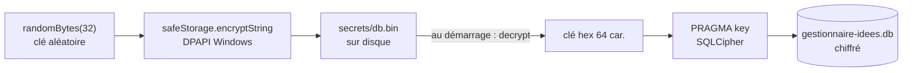

# Stockage local chiffré — SQLite, SQLCipher et DPAPI

> **En 30 secondes** — Toutes les idées vivent dans **un seul fichier** SQLite sous `%APPDATA%`, **chiffré** (SQLCipher) : ouvert dans un éditeur, c'est du bruit. La clé (32 octets aléatoires) est elle-même chiffrée par **Windows** (DPAPI, via `safeStorage` d'Electron), liée à ta session. Pas de mot de passe à retenir, pas de clé dans le code.



---

## 1. Vue Macro & Utilité (le « Pourquoi »)

> 📘 **Introduction (ajoutée)** — **C'est quoi ?** **SQLite** est une base de données SQL complète contenue dans un seul fichier, sans serveur. **SQLCipher** est une variante qui chiffre chaque page de ce fichier (AES-256). **DPAPI** (*Data Protection API*, service de chiffrement intégré à Windows) chiffre une donnée avec une clé dérivée de ta session Windows ; Electron l'expose sous le nom `safeStorage`. **Comment ça marche ?** On chiffre la base avec une clé ; on chiffre cette clé avec Windows ; seul ton compte Windows peut remonter la chaîne.

- **Problématique** : l'app stocke idées personnelles, montants, et bientôt un accès à Outlook. Un vol de portable ou une sauvegarde copiée ne doit rien révéler. Mais demander un mot de passe à chaque lancement tuerait la « capture en 2 secondes ».
- **Emplacement dans la carte globale** : couche **donnée** (disque), tout en bas de l'infrastructure. Constitution IV : « local d'abord ».
- **Analogie (restauration)** : la base est la **chambre froide fermée à clé**. La clé de la chambre froide est rangée dans le **coffre du restaurant** (DPAPI), dont seul le gérant (ta session Windows) connaît la combinaison. Un cambrioleur qui emporte la chambre froide entière (le fichier `.db`) n'a qu'un bloc de glace illisible. *Là où ça boite* : si quelqu'un utilise ta session Windows ouverte, il ouvre le coffre comme toi — DPAPI protège contre le vol du disque, pas contre l'accès à ton compte.

## 2. Le Pont Systémique (sous le capot)

- **Disque** : SQLite découpe le fichier en **pages** (blocs de quelques Ko). SQLCipher chiffre chaque page avant l'écriture et la déchiffre à la lecture, en RAM. Le fichier sur disque n'est jamais en clair.
- **WAL** (*Write-Ahead Logging* — journal d'écriture anticipée) : `journal_mode = WAL` écrit d'abord les modifications dans un fichier journal séparé, puis les reporte ; lectures et écritures ne se bloquent pas, et un crash en pleine écriture laisse la base cohérente.
- **Clés étrangères** : SQLite ne les vérifie **pas** par défaut ; `PRAGMA foreign_keys = ON` l'active à chaque ouverture.
- **Lecture de contrôle** : `SELECT count(*) FROM sqlite_master` force le déchiffrement de la première page ; mauvaise clé → erreur **immédiate** au démarrage plutôt que plus tard, au milieu d'une action.
- **Fichiers secrets** : écrits avec `mode: 0o600` (lecture/écriture propriétaire seulement) — utile surtout hors Windows.

## 3. Analyse du Code & Logique

Extrait de `src/main/infrastructure/db/client.ts` :

```ts
const HEX_KEY = /^[0-9a-f]{64}$/

export function openDatabase({ file, key, migrationsFolder }: OpenDatabaseOptions): DatabaseHandle {
  // ① La clé est interpolée dans un PRAGMA (non paramétrable) : format hexadécimal strict obligatoire.
  if (!HEX_KEY.test(key)) throw new Error('Clé de base de données invalide')
  const sqlite = new Database(file)            // 'better-sqlite3' = alias npm de la variante chiffrée
  try {
    sqlite.pragma("cipher='sqlcipher'")
    sqlite.pragma(`key="x'${key}'"`)           // ② clé brute en hexadécimal
    sqlite.prepare('SELECT count(*) FROM sqlite_master').get() // ③ échoue tout de suite si mauvaise clé
    sqlite.pragma('journal_mode = WAL')
    sqlite.pragma('foreign_keys = ON')
    const db = drizzle(sqlite, { schema })
    migrate(db, { migrationsFolder })          // ④ migrations appliquées à chaque démarrage
    return { db, close: () => sqlite.close() }
  } catch (error) { sqlite.close(); throw error } // ⑤ jamais de connexion à moitié ouverte
}
```

- **Étape 1 — Le PRAGMA non paramétrable** : les requêtes normales utilisent des paramètres liés (`?`), mais une instruction `PRAGMA key` n'en accepte pas. On compense par une **liste blanche de format** : 64 caractères `0-9a-f`, aucun guillemet possible → aucune injection SQL possible.
- **Étape 2 — La clé ne sort jamais** : `SecretStore.getOrCreateRandomKey('db')` la crée au premier lancement (`randomBytes(32)`, générateur cryptographique de l'OS), la chiffre par DPAPI et ne la garde qu'en mémoire le temps d'ouvrir la base.
- **Étape 3 — Refus plutôt que repli** : si `safeStorage.isEncryptionAvailable()` est faux, `SecretStore.set` lève `ENCRYPTION_UNAVAILABLE` au lieu d'écrire en clair.
- **Étape 4 — Noms de secrets contraints** : `/^[a-z][a-z0-9-]{0,31}$/` empêche un nom comme `../../x` de sortir du dossier (*path traversal*).
- **Étape 5 — L'alias npm** : Drizzle importe `better-sqlite3` ; `package.json` fait pointer ce nom vers `better-sqlite3-multiple-ciphers` (JOURNAL, règle 5).

**Bonnes pratiques mises en évidence** : montants stockés en **centimes entiers** (`amount_cents INTEGER`) — jamais de nombre à virgule flottante pour de l'argent ; *fail fast* (échouer tôt et bruyamment).

## 4. Synthèse & Prochaine Étape

**À retenir (3 puces max)**
- Base = fichier SQLite chiffré par SQLCipher ; clé aléatoire chiffrée par DPAPI (liée à la session Windows).
- Là où on ne peut pas paramétrer (PRAGMA), on valide un **format strict**.
- Si le chiffrement est indisponible, on **refuse** — jamais de repli en clair.

**Lien avec la suite** : comment le schéma de cette base évolue sans rien casser → [[Drizzle ORM ↔ SQL paramétré et migrations]].

**Rappel actif**
> **Q :** Pourquoi une lecture `SELECT count(*) FROM sqlite_master` juste après la clé ?
> **R :** Pour forcer le déchiffrement immédiat : une mauvaise clé échoue au démarrage, pas au premier clic de l'utilisateur.

> **Q :** Contre quoi DPAPI protège-t-il, et contre quoi pas ?
> **R :** Contre le vol ou la copie du disque ; pas contre quelqu'un qui utilise ta session Windows déjà ouverte.

> **Q :** Pourquoi `amount_cents` en entier ?
> **R :** Les flottants ne représentent pas exactement 0,10 ; en centimes entiers, 1 247,50 € = 124 750, sans erreur d'arrondi.

**Pièges fréquents**
- ⚠️ **Mettre la clé dans `.env`** — elle finirait tôt ou tard dans le dépôt (public ici).
- ⚠️ **Oublier `foreign_keys = ON`** — SQLite accepterait silencieusement des sous-neurones orphelins.

**Connexions**
- [[Drizzle ORM ↔ SQL paramétré et migrations]] — la couche d'accès posée sur cette base.
- [[Glossaire — Transaction ACID]] — ce que SQLite garantit lors d'une éclosion.
- [[Architecture Electron — trois processus cloisonnés]] — seul le main ouvre la base.
