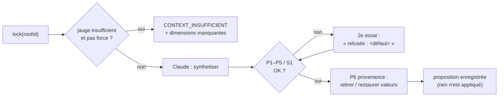

# Synthèse vérifiée — contrôles déterministes et provenance

> **En 30 secondes** — Au **verrouillage**, Claude transforme l'arbre en **plan d'action** (idée Action) ou en **synthèse de réflexion** (idée Réflexion). Avant de montrer quoi que ce soit, le code vérifie : références valides, 2 à 4 branches par condition, profondeur ≤ 5, **aucune boucle** (tri de Kahn), sources existantes. Puis la **provenance** (P6) : tout montant ou date que l'utilisateur n'a jamais écrit est **retiré** et remplacé par « à trouver ». En cas d'échec, **un** nouvel essai en disant à l'IA *ce qui clochait*.



---

## 1. Vue Macro & Utilité (le « Pourquoi »)

- **Problématique** : une *hallucination* (le LLM affirme avec aplomb une information inventée) dans un plan d'action, c'est une date d'échéance ou un prix que tu n'as jamais donnés, présentés comme les tiens. La constitution III l'interdit : l'agent peut **demander**, créer une **investigation**, ou **proposer** une valeur clairement signalée — jamais l'écrire dans tes données.
- **Emplacement dans la carte globale** : domaine pur (`planChecks.ts`, `provenance.ts`, `extractValues.ts`) orchestré par `FusionService` (application). C'est le passage **brouillon IA → proposition présentable**.
- **Analogie (restauration)** : la **réception de marchandise**. Le fournisseur (Claude) livre ; le chef de réception (le code) contrôle **avant** de ranger en chambre froide : quantités conformes au bon (références), pas de carton qui s'emboîte dans lui-même (boucle), étiquettes de traçabilité (sources). Un produit sans étiquette d'origine (montant jamais écrit par l'utilisateur) est mis de côté avec la mention « à identifier ». Livraison refusée ? On rappelle le fournisseur **en précisant le défaut** — sinon il relivre la même chose (règle 17).

## 2. Le Pont Systémique (sous le capot)

- **Graphe en mémoire** : le plan renvoyé est un JSON (nœuds + dépendances) parsé en objets dans le tas mémoire ; les contrôles construisent des `Map` (accès en temps constant par `ref`) et comptent les arêtes entrantes.
- **Tri de Kahn** (voir [[Glossaire — Tri topologique de Kahn]]) : on retire successivement les nœuds sans prédécesseur ; si on n'arrive pas à tous les retirer, il reste une **boucle** (« A attend B qui attend A » — plan inexécutable). Coût proportionnel au nombre de nœuds + arêtes.
- **Extraction de valeurs** : `extractValues` passe des expressions régulières sur **tous les textes écrits par l'utilisateur** (réponses, suggestions acceptées) pour en tirer montants (en centimes) et dates (ISO, `12/03`, « 12 mars »). C'est l'ensemble de référence de P6.
- **Montant masqué → restauré** : si l'option « Masquer les montants » était active, Claude n'a vu que « 100-500 € » ; il ne peut donc pas renvoyer 250 €. Il **cite ses sources** (`sourceRefs: ['s3']`) ; si la source citée contient **une seule** valeur en euros, le code la remet **exacte, localement** (règle 16).

## 3. Analyse du Code & Logique

Extrait de `src/main/domain/neurons/provenance.ts` :

```ts
export function applyProvenance(plan: ActionPlanOut, sources: ReadonlyMap<string, string>): ProvenanceResult {
  const all = extractValues([...sources.values()])          // ① tout ce que l'utilisateur a écrit
  const nodes = plan.nodes.map((node) => {
    const next = { ...node }                                 // ② copie : jamais de mutation du plan reçu
    if (node.amountCents !== undefined && !all.amountsCents.has(node.amountCents)) {
      const cited = extractValues(node.sourceRefs.flatMap((ref) => sources.get(ref) ?? []))
      const [only, ...others] = [...cited.euroAmountsCents]
      if (only !== undefined && others.length === 0) { next.amountCents = only; restored++ } // ③ restauration
      else { delete next.amountCents; next.investigation = true; gaps.push(`Montant à trouver : ${node.title}`) } // ④
    }
    if (node.dueDate !== undefined && !isUserDate(node.dueDate, all)) {
      delete next.dueDate; next.investigation = true; next.toSchedule = true      // ⑤ date inventée → à planifier
    }
    return next
  })
}
```

- **Étape 1 — P1 références** : `ref` uniques, parents et dépendances existants, pas d'auto-dépendance ni de doublon.
- **Étape 2 — P2 / P3** : chaque `condition` a 2 à 4 branches **libellées** ; profondeur du plan ≤ 5 (≠ profondeur de croissance 6).
- **Étape 3 — P4 boucles** : `isAcyclic` (Kahn) sur la hiérarchie **et** sur les dépendances.
- **Étape 4 — P5 / S1 sources** : chaque `sourceRefs` doit désigner un alias `sN` existant ; une synthèse Réflexion doit avoir au moins un point clé.
- **Étape 5 — P6 provenance** (ci-dessus) : retirer ou restaurer ; le nœud concerné **devient** une investigation plutôt que d'ajouter un nœud (qui aurait pu casser P2 ou P3).

**Bonnes pratiques mises en évidence** : **fonctions pures** testées une par une (`plan-checks.test.ts`, `provenance.test.ts`, nommées `should_reject_condition_with_one_or_five_branches`…) ; verrouillage **forcé** autorisé avec avertissement (`forced: true`) — l'humain décide.

## 4. Synthèse & Prochaine Étape

**À retenir (3 puces max)**
- L'IA propose un plan ; le code le **contrôle** (P1–P5 / S1) avant de le montrer.
- Une valeur que l'utilisateur n'a jamais écrite devient « à trouver » (P6) ; un montant masqué peut être **restauré** via ses sources citées.
- Nouvel essai unique en **signalant le défaut** à l'IA.

**Lien avec la suite** : la proposition est affichée, l'utilisateur confirme → [[Éclosion atomique — transaction, version et historique]].

**Rappel actif**
> **Q :** Comment le tri de Kahn détecte-t-il une boucle ?
> **R :** Il retire les nœuds sans prédécesseur un par un ; s'il en reste à la fin, ils sont pris dans un cycle.

> **Q :** Claude propose un achat à 199 € ; l'utilisateur n'a jamais écrit ce montant. Que devient le nœud ?
> **R :** Le montant est retiré, le nœud passe en investigation et « Montant à trouver : … » est ajouté aux manques (sauf si sa source citée contient une seule valeur exacte, alors restaurée).

> **Q :** Pourquoi renvoyer le défaut constaté lors du nouvel essai ?
> **R :** Sans explication, le modèle a toutes les chances de reproduire la même erreur.

**Pièges fréquents**
- ⚠️ **Faire confiance au schéma seul** — un JSON valide peut contenir un plan en boucle ou des références inventées.
- ⚠️ **Muter l'objet reçu** — on travaille sur une copie (`{ ...node }`) pour garder l'original intact.

**Connexions**
- [[Glossaire — Tri topologique de Kahn]] — l'algorithme de détection de boucle.
- [[Anonymisation en deux couches]] — d'où viennent les montants masqués en fourchettes.
- [[Zod ↔ type guards et sortie structurée]] — la première barrière avant ces contrôles.

## Évolution du 30/09 — l'arbre lu branche par branche, et des outils proposés
- **Arbre envoyé au verrouillage** (T072, `SynthesisContextBuilder.treeText`) : tous les nœuds partaient déjà, mais **dans l'ordre de création**, indentés par leur seule profondeur — un enfant créé tard apparaissait loin de son parent, rattaché à la mauvaise branche à la lecture. Il est maintenant écrit en **parcours en profondeur** (chaque nœud sous son parent, avec la question à laquelle chaque réponse répond) → [[Glossaire — Parcours en profondeur (DFS)]]. Les alias `[sN]` restent ceux de l'**ordre de création** : le contrôle de provenance P6 n'est pas touché.
- **Borne 12 000 → 40 000 caractères** (≈ 10 000 tokens) : au-delà de 12 000, c'étaient les réponses les plus récentes qui étaient coupées. Coût d'entrée jusqu'à ×3 sur une grosse idée, à re-mesurer (`scripts/ai-usage.cjs`).
- **Outils proposés** (spec 006) : la sortie de synthèse porte `tools` (0 à 3) et `toolsNote`. Nouveau contrôle déterministe dans l'esprit de cette note : `keepNewTools` écarte les outils déjà branchés et les doublons de titre, **en plus** de la consigne qui les rappelle à Claude (double verrou). `settleTools` vide les propositions d'une synthèse faite par l'IA locale.

## Évolution du 05/10 — moteur retiré, l'idée continue
> ⚠️ **Correction du 05/10** — `planChecks.ts`, `provenance.ts` et la synthèse sont **retirés** avec l'ancien moteur (spec 010 C2). Le principe « **l'IA propose, le code garantit** » survit dans le plan d'attaque : Claude propose une couche d'étapes (fantômes), le code vérifie dépendances et ordre, mentalyas valide. Le tri de Kahn cède la place à un **DFS à trois couleurs** pour détecter les cycles : [[Plan d'attaque — étapes ordonnées, dépendances sans cycle et verrou]].
