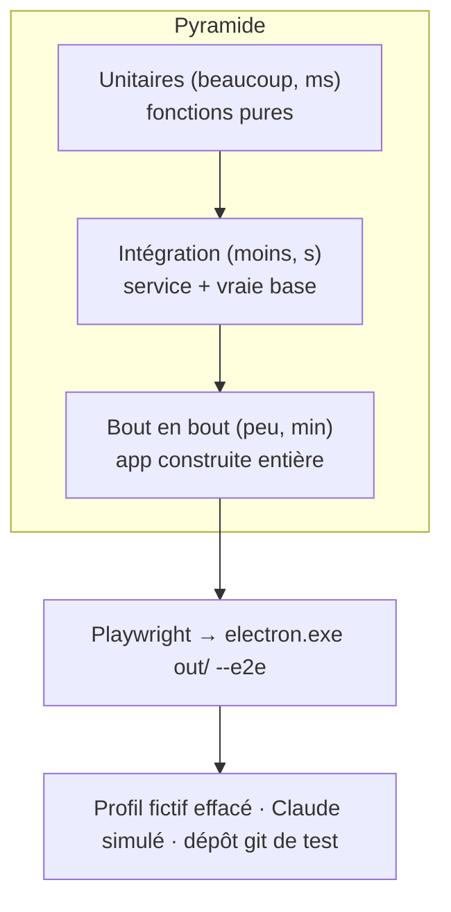

# Tests de bout en bout — Playwright pilote Electron sur un profil fictif

> **En 30 secondes** — Les tests unitaires vérifient une fonction ; les tests d'intégration, un service avec une vraie base. Il manquait la preuve que **le parcours entier** marche dans **l'app construite** : clic → IPC → main → git ou SQLite → retour à l'écran. `npm run e2e` construit l'app, puis **Playwright** la lance sur un **profil fictif** (jamais le tien), clique par **rôles accessibles**, vérifie, et prend des captures. Aucune touche n'est envoyée au système : Playwright parle à la fenêtre par son canal de débogage.



---

## 1. Vue Macro & Utilité (le « Pourquoi »)

> 📘 **Introduction (ajoutée)** — **Playwright ?** Une bibliothèque qui **pilote** un navigateur (ou Electron, qui en contient un) depuis un script : ouvrir, cliquer, lire, attendre, capturer. Elle passe par le **protocole de débogage** de Chromium (le même que les outils de développement), pas par le clavier ni la souris du système.

- **Problématique** : deux raisons concrètes. (1) **Le code livré n'est pas le code testé** : le bundler transforme le main et le preload ; un bug n'apparaît parfois **qu'après build** (déjà vécu le 08/10). (2) **Ne pas tester sur le poste de mentalyas** : simuler des touches sur son bureau peut frapper dans un jeu en plein écran ou une autre fenêtre (règle de méthode n°3). Le test e2e fait les clics **dans** l'app, sur un profil jetable.
- **Emplacement dans la carte globale** : `tests/e2e/*.e2e.ts` (Vitest, config dédiée : un fichier à la fois, délais longs) → `support/app.ts` (`freshProfile`, `launchApp`) → Electron sur `out/` avec `--e2e` → l'app choisit le profil `gestionnaire-idees-e2e` et lit des variables `GI_E2E_*` **seulement** avec ce drapeau et **seulement** non empaquetée (`!app.isPackaged`).
- **Analogie (restauration)** : le **service à blanc** avant l'ouverture. La vraie cuisine, la vraie carte, les vrais gestes — mais des **clients fictifs** et une salle vide. On vérifie que la commande va de la salle à la cuisine et revient au bon numéro de table. On ne fait pas le test pendant le vrai service, au milieu des clients.

## 2. Le Pont Systémique (sous le capot)

1. **Build** : `electron-vite build` produit `out/main`, `out/preload`, `out/renderer` — exactement ce qui serait livré.
2. **Processus** : Playwright lance `electron.exe <projet> --e2e` comme **processus enfant**, avec un port de débogage. Il récupère les fenêtres et choisit la **principale** (`index.html`, pas `capture.html`).
3. **Disque** : `freshProfile()` efface puis recrée le dossier du profil e2e (et le dossier du projet de démo, **hors** du profil car l'app refuse git dans son propre dossier de données). Chaque test part d'un état **connu**.
4. **IA** : avec `GI_E2E_CLAUDE_REPLY`, `e2eClaudeRun` **ne lance aucun processus** : la réponse structurée est lue dans un fichier du test, et la **demande** qui aurait été envoyée est écrite à côté (`.request.txt`) pour être vérifiée. Déterministe, gratuit, sans réseau.
5. **Fin** : `app.close()` toujours, même en cas d'échec au lancement — une instance orpheline garderait le **verrou** du profil (instance unique) et ferait échouer le test suivant.

## 3. Analyse du Code & Logique

**Bloc 1 — Lancer sur un profil jetable** (`tests/e2e/support/app.ts`)
```ts
export function freshProfile(prepare?: () => void): void {
  rmSync(PROFILE, { recursive: true, force: true })        // gestionnaire-idees-e2e, jamais le profil réel
  rmSync(DEMO_PROJECT, { recursive: true, force: true })
  mkdirSync(PROFILE, { recursive: true }); prepare?.()     // ex. construire un dépôt git de scénario
}
const app = await electron.launch({ executablePath: ELECTRON, args: [ROOT, '--e2e'],
  env: { ...process.env, GI_E2E_PROJECT: DEMO_PROJECT, ...env } })
```

**Bloc 2 — Le drapeau qui n'existe pas en production** (`src/main/index.ts`)
```ts
const e2eProfile = !app.isPackaged && process.argv.includes('--e2e')
```
Une porte de test dans une app livrée serait une **faille** (un raccourci qui lit des fichiers arbitraires). La condition `!app.isPackaged` la ferme dans l'exécutable distribué.

**Bloc 3 — Cliquer comme un humain, par le rôle** (`git-local.e2e.ts`)
```ts
await panel.getByRole('checkbox', { name: 'Préparer a.txt' }).click()
await panel.getByRole('checkbox', { name: 'Retirer a.txt', checked: true }).waitFor()   // attendre le retour de git
expect(await panel.getByRole('checkbox', { name: 'Préparer .env' }).isDisabled()).toBe(true)
```
On cherche les éléments par **rôle + nom accessible** (ce que lit un lecteur d'écran), pas par classe CSS : si le test ne trouve pas le bouton, un utilisateur de lecteur d'écran non plus. Et on **attend un état** (`waitFor`), jamais un délai fixe.

**Bloc 4 — Ce que couvrent les 8 fichiers** : dépôt local (commit de 2 fichiers sur 3, `.env` verrouillé, **hook non lancé** hors confiance), synchronisation, conflits, frise d'historique, Project Manager, lancer un projet, fichiers de tâches Workflow, wireframe avec **état retrouvé après redémarrage**.

**Bonnes pratiques mises en évidence** : isolement total (profil, projet, IA) ; une porte de test **inexistante** en production ; sélecteurs accessibles ; nommage `should_<comportement>_when_<condition>` ; peu de tests e2e, ciblés sur les **parcours** que les autres niveaux ne voient pas.

## 4. Synthèse & Prochaine Étape

**À retenir (3 puces max)**
- Le test e2e prouve le **parcours entier** dans l'app **construite** — ce que ni l'unitaire ni l'intégration ne voient.
- Tout est **fictif et jetable** : profil effacé, projet temporaire, Claude simulé par fichier ; aucune touche système.
- Sélecteurs par **rôle accessible** et attentes sur un **état**, jamais sur un délai.

**Lien avec la suite** : relire [[Git piloté par l'app — préfixe sûr, arguments construits, configuration piégée et push gardé]] avec `git-local.e2e.ts` à côté : chaque garde-fou y a son test.

**Rappel actif**
> **Q :** Pourquoi le dossier du projet de démo est-il créé **hors** du profil e2e ?
> **R :** L'app refuse de lancer git dans son propre dossier de données (spec 021) : un projet rangé dans le profil serait refusé.

> **Q :** Que vérifie le fichier `.request.txt` écrit par le Claude simulé ?
> **R :** Ce que l'app **aurait envoyé** à Claude (consigne figée, contexte du nœud) : on teste aussi la sortie vers l'IA, pas seulement l'affichage de sa réponse.

> **Q :** Pourquoi `!app.isPackaged` dans la condition du drapeau `--e2e` ?
> **R :** Dans l'app distribuée, `--e2e` ne doit rien changer : sinon n'importe qui pourrait lancer l'app sur un autre profil et lui faire lire des réponses « Claude » depuis un fichier.

**Pièges fréquents**
- ⚠️ **Tester sur son vrai profil** — données réelles modifiées, résultats non reproductibles.
- ⚠️ **`sleep(2000)` pour « laisser le temps »** — lent et instable ; attendre l'élément ou l'état.
- ⚠️ **Tout tester en e2e** — lent et fragile ; la logique se teste en unitaire, l'e2e garde les parcours.

**Connexions**
- [[Glossaire — Bundler et shim (le code livré n'est pas le code testé)]] — la raison n°1 d'un test sur l'app construite.
- [[Glossaire — Information sans la couleur seule (accessibilité)]] — l'accessibilité sert aussi les tests.
- [[Coquille de bureau — zone de notification, instance unique et fenêtres cachées]] — l'instance unique explique pourquoi on ferme toujours l'app.
