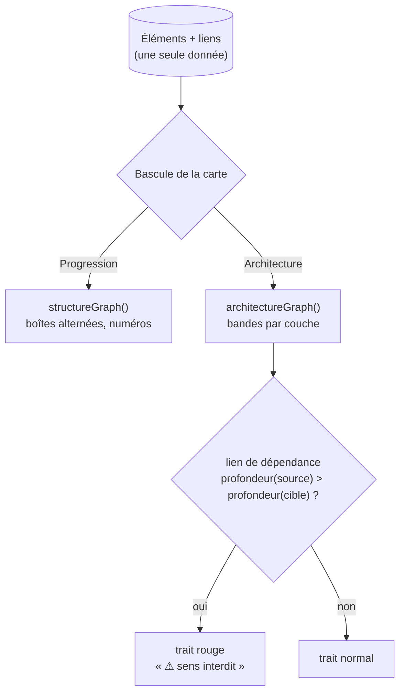

# Vue Architecture — règle de dépendance, couches déduites et deux dispositions pures

> **En 30 secondes** — Une carte de structure se lit maintenant de **deux façons** : **Progression** (par où attaquer, D17) et **Architecture** (dans quelle **couche** vit chaque élément). La vue Architecture range les **mêmes nœuds** en bandes, de l'extérieur vers le cœur, et trace **en rouge** « ⚠ sens interdit » toute dépendance qui sort du cœur. Toutes les architectures connues se ramènent à **une seule règle** : une couche plus profonde ne dépend jamais d'une couche moins profonde.



---

## 1. Vue Macro & Utilité (le « Pourquoi »)

> 📘 **Introduction (ajoutée)** — **C'est quoi, une architecture en couches ?** Une façon de ranger le code d'un programme en **étages** qui ont chacun un rôle (afficher, orchestrer, décider, stocker). **Et la règle de dépendance ?** Le principe central de la Clean Architecture (Robert C. Martin) : *le code source ne dépend que vers l'intérieur*. Le cœur métier (domaine) ne connaît ni l'écran ni la base ; c'est l'extérieur qui le connaît. MVC, MVVM (*Modèle–Vue–VueModèle*), l'hexagonale et l'architecture en couches classique disent la même chose avec d'autres noms.

- **Problématique** : mentalyas reprend des projets écrits par d'autres (spec 017). La carte montre **ce qui existe** et **l'ordre** ; elle ne montre pas **si le projet respecte son architecture**. Un `Order.cs` du domaine qui appelle directement `SqlConnection` est un défaut invisible dans une arborescence de dossiers. Il fallait le voir **sans casser** la vue Progression déjà validée.
- **Emplacement dans la carte globale** : catalogue **pur** partagé (`src/shared/structure/architecture.ts`, lu par le main **et** par l'interface) → stockage (`neurons.layer`, `layer_source`, `architecture`… migration 0031) → `StructureService` (écriture par Claude via `structure_dessiner`, corrections de mentalyas) → renderer (`architectureGraph` dans `canvas/structureGraph.ts`, bandes `LayerBandNode`, barre `StructureBarNode`, puce de couche du nœud).
- **Analogie (électricité)** : dans une installation, le courant va du **tableau** vers les **prises**, jamais l'inverse. Les couches sont les étages de l'installation ; un lien « sens interdit », c'est une prise qui alimenterait le tableau. *Côté restauration* : le même personnel peut se lire sur le **plan de salle** (qui est où) ou dans l'**ordre du service** (qui passe quand) — deux lectures, une seule brigade. *Où ça boite* : en électricité, un retour de courant est physiquement impossible à câbler proprement ; en code, il compile très bien — c'est justement pour ça qu'il faut le **dessiner**.

## 2. Le Pont Systémique (sous le capot)

| Étape | Où | Ce qui se passe |
|-------|----|-----------------|
| Claude cartographie | MCP → main | `structure_dessiner` reçoit `architecture: { type, justification }` et une `couche` par élément ; validé par Zod, écrit dans **une** transaction SQLite avec son lot d'Historique |
| Lecture | main → IPC | `ElementRepository` renvoie la couche **affichée** : celle de mentalyas, sinon celle de Claude si elle existe dans l'architecture choisie, sinon **déduite** des dossiers (`inferLayer`), étiquetée « déduite » |
| Affichage | renderer | `buildGraph` choisit **une** des deux fonctions pures selon la bascule de **cette** carte (état d'interface, pas en base) ; React Flow ne fait que dessiner des coordonnées |

Point clé : **rien n'est recalculé côté disque** quand on bascule. Les deux vues sont deux **fonctions pures** sur les mêmes tableaux en mémoire vive ; la bascule ne fait qu'appeler l'une ou l'autre.

## 3. Analyse du Code & Logique

**Bloc 1 — Toutes les architectures = des couches avec une profondeur** (`shared/structure/architecture.ts`)

```ts
clean: { layers: [
  layer('presentation',  'Présentation',   1, ['ui', 'renderer', 'views', 'pages', …]),
  layer('infrastructure','Infrastructure', 1, ['infra', 'db', 'repositories', 'adapters', …]),
  layer('application',   'Application',    2, ['application', 'usecases', 'services']),
  layer('domaine',       'Domaine',        3, ['domain', 'entities', 'core'])   // 3 = le cœur
]}
```
Présentation et Infrastructure ont **la même profondeur** (1) : ce sont deux portes extérieures, aucune ne doit dépendre de l'autre « vers l'intérieur ». Le 3ᵉ argument (`folders`) sert à **deviner** une couche.

**Bloc 2 — Une seule règle pour cinq architectures**

```ts
export const DEPENDENCY_RELATIONS = new Set(['depend_de', 'appelle', 'lit_ecrit', 'implemente'])
export function isViolation(kind, fromLayer, toLayer): boolean {
  const from = layerOf(kind, fromLayer); const to = layerOf(kind, toLayer)
  return from !== null && to !== null && from.depth > to.depth   // ① du cœur vers l'extérieur
}
```
- ① Seules les relations qui **sont** des dépendances comptent (`teste` et `bloque` n'en sont pas) — ainsi que les **appels mesurés** par l'analyse statique.
- Une couche **inconnue** ou « Non classés » ne produit **jamais** de violation : on ne crie pas au loup sans preuve.
- ⚠️ *Probable* : `implemente` compté comme dépendance colle au code (l'adaptateur dépend du port) ; le sens réel dépend du sens dans lequel Claude trace le lien.

**Bloc 3 — Couche déduite par vote des dossiers** (`inferLayer`)

Pour chaque chemin d'un élément, on garde le dossier **le plus profond** qui nomme une couche (`src/main/domain/x.ts` → domaine). La couche la plus votée l'emporte ; **égalité ou aucun indice → `null`** (« Non classés »). Encore une fois : mieux vaut ne pas classer que mal classer.

**Bloc 4 — Priorité utilisateur > IA, et annulable** (`StructureService`)

```ts
// Architecture effective : celle de mentalyas prime, sinon celle du lot, sinon celle déjà enregistrée.
const effective = existing?.source === 'user' ? existing.kind : (input.architecture?.type ?? existing?.kind ?? null)
const keepUser = before?.layerSource === 'user'           // couche corrigée par mentalyas : intouchable par Claude
layer: keepUser ? before.layer : (element.layer ?? before?.layer ?? null)
```
Chaque valeur porte sa **source** (`'claude' | 'user'`). Quand Claude recartographie, il met à jour ce qui est à lui et **laisse** ce que mentalyas a corrigé — et il en est **informé** dans la réponse de l'outil (« L'architecture choisie par mentalyas … est gardée »). Les corrections de mentalyas forment un nouveau type de lot d'Historique, `structure`, donc **annulables** comme le reste.

**Bloc 5 — Deux dispositions pures côte à côte** (`architectureGraph`)

Les éléments visibles sont groupés par couche, triés **dans l'ordre de progression** (numéros de D17 réutilisés), posés en rangées de 4 colonnes dans chaque bande ; les bandes s'empilent de haut en bas, plus « Non classés ». Pas de traits de hiérarchie ici : seulement les liens et les appels mesurés, marqués `violation`.

**Bonnes pratiques mises en évidence** : ne **jamais faire porter deux sens aux mêmes positions** (journal, D20) ; un catalogue **déclaratif** (données) plutôt que cinq fonctions de vérification ; la provenance (`source`) stockée avec la valeur pour arbitrer IA ↔ humain.

> 🐞 **Erreurs corrigées pendant la session** : (1) les couches de Claude étaient vérifiées contre **son** architecture même quand mentalyas en avait choisi une autre → on vérifie contre l'architecture **effective** ; (2) les corrections de mentalyas étaient des lots « modification manuelle » non annulables → type de lot `structure`. Et un piège de consigne (Claude a réorganisé sa carte **par couches**) → [[Consigne pour un agent outillé — dire ce qui ne change pas, nommer l'outil et l'anti-outil]].

## 4. Synthèse & Prochaine Étape

**À retenir (3 puces max)**
- Toute architecture connue = des **couches avec une profondeur** ; violation = dépendance d'une couche **plus profonde** vers une **moins profonde**.
- Ce que mentalyas corrige porte la source `user` et **prime** sur Claude ; tout reste annulable.
- Deux lectures d'une même donnée = **deux fonctions pures** choisies à l'affichage, jamais deux sens pour les mêmes positions.

**Lien avec la suite** : la carte ne dit pas seulement *où* et *dans quel ordre*, elle dit aussi *où on en est* → [[Avancement vivant — agrégation récursive, outil dédié et consigne au bon endroit]].

**Rappel actif**
> **Q :** Architecture Clean. `Application/OrderService` appelle `Infrastructure/SqlRepo`. Violation ?
> **R :** Oui : application (profondeur 2) → infrastructure (1), du cœur vers l'extérieur. La bonne forme : l'application dépend d'un **port** (interface) que l'infrastructure implémente.

> **Q :** Claude classe un élément en « application », mentalyas le corrige en « domaine », puis Claude recartographie. Que vaut la couche ?
> **R :** « domaine » : `layerSource = 'user'` → `keepUser`, la valeur de Claude est ignorée. Mentalyas peut annuler sa correction dans l'Historique.

> **Q :** Pourquoi ne pas stocker les positions de la vue Architecture en base ?
> **R :** Elles se **calculent** (fonction pure) à partir des couches et de l'ordre ; les stocker créerait une deuxième vérité à garder synchrone ([[Glossaire — Donnée dérivée (calculer plutôt que stocker)]]).

**Pièges fréquents**
- ⚠️ **Croire que « même profondeur » = « même couche »** — Présentation et Infrastructure sont toutes deux à 1 : un lien entre elles n'est pas une violation de la règle, mais reste un couplage à surveiller.
- ⚠️ **Deviner à tout prix** — une égalité de votes donne « Non classés », pas un choix arbitraire.
- ⚠️ **Écraser le choix humain à chaque passage de l'IA** — sans la colonne `source`, la prochaine cartographie efface la correction.

**Connexions**
- [[Clean Architecture — domaine, application, infrastructure]] — la règle de dépendance, appliquée ici aux projets des autres.
- [[Carte de structure ordonnée — ordre de progression, tri par dépendances et disposition alternée]] — l'autre disposition pure, dont les numéros servent au tri dans les bandes.
- [[Glossaire — Information sans la couleur seule (accessibilité)]] — le rouge de la violation est doublé d'un libellé.
- [[Annuler par lot — journal avant-après, conflit et lot inverse]] — nouveaux types d'entités historisées (`element_layer`, `structure_architecture`).
