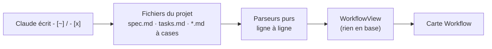

# Vue Workflow — l'état lu dans les fichiers, parseur ligne à ligne et clés stables

> **En 30 secondes** — La carte Workflow montre **où en est le projet** : specs, user stories, tâches à faire / en cours / faites. Elle ne demande **rien à Claude** et ne stocke **rien** : à chaque ouverture, l'app **relit les fichiers** du projet (`specs/*/tasks.md`, `docs/USER-STORIES.md`…) et les transforme en arbre. Même fichier → même carte. Claude fait avancer la carte **en écrivant les fichiers** (`- [~]` quand il commence, `- [x]` quand il finit).



---

## 1. Vue Macro & Utilité (le « Pourquoi »)

- **Problématique** (D20, mot de mentalyas) : « elle doit reprendre les tâches du projet […] car j'ai des **variations entre les différentes générations** ». Une carte **générée** par une IA change à chaque génération ; une carte **lue** dans les fichiers est **déterministe**. La source de vérité est le fichier que tout le monde (toi, Claude, git) partage.
- **Emplacement dans la carte globale** : bascule « **Workflow** | Progression | Architecture » d'une carte de structure → IPC `workflow:read` → `WorkflowService` (application, lecture seule sous le dossier du projet) → `parseSpec`, `parseTasks`, `parseTaskFile`, `specStatus` (domaine, purs) → `workflowTree.ts` / `WorkflowCard.tsx` (renderer).
- **Analogie (restauration)** : le **passe-plat avec les bons** accrochés. Personne ne tient un second registre « de ce qui est en cours » : on regarde les bons — à faire (accroché), en cours (tamponné « en préparation »), fait (barré). Le tableau de la salle (la carte) n'est qu'un **affichage du rail de bons**. *Où elle boite* : en cuisine, le bon disparaît une fois servi ; ici la tâche faite reste, repliée dans « ✓ Faites (N) ».

## 2. Le Pont Systémique (sous le capot)

- **Disque** : `readProjectText` lit chaque fichier **sous la racine réelle** (`realpath`), en refusant ce qui est trop gros, binaire, sensible ou hors du dossier → la vue est marquée `partial` au lieu d'échouer. Seuls la racine et `docs/` (sans sous-dossiers) sont fouillés pour les fichiers à cases ; `CLAUDE.md`, `JOURNAL.md`, `CHANGELOG.md`, `FOUNDATION.md` sont exclus (des cases, mais pas des tâches).
- **CPU** : un parseur **ligne à ligne** = une seule boucle sur le texte, mémoire proportionnelle au nombre de tâches (bornées : 1 000 par fichier, 50 fichiers). Aucune expression régulière « globale » sur tout le fichier : chaque ligne est testée par 3 motifs courts.
- **Base de données** : **rien** pour l'arbre (donnée dérivée). Seuls des réglages d'affichage (branches repliées) et — depuis D19/D25 — la **vue de naissance** d'une étape (`neurons.structure_view`, migration 0044) et d'un bloc (`canvas_blocks.structure_view`, 0045) sont stockés.
- **IA à la demande** : « Que fait ce fichier ? » appelle la tâche `file_summary` ; la réponse est **enregistrée avec l'empreinte SHA-256 du contenu** : tant que le fichier ne change pas, elle revient sans rappeler l'IA, même après redémarrage.

## 3. Analyse du Code & Logique

**Bloc 1 — Une machine à états de 3 lignes** (`parseTaskFile.ts`)
```ts
const CHECKBOX = /^\s*[-*+]\s\[( |x|X|~)\]\s+(.+)$/       // - [ ] · - [~] · - [x]
const HEADING  = /^(#{1,6})\s+(.+?)\s*#*\s*$/
const FENCE    = /^\s*(```|~~~)/
if (FENCE.test(line)) { fenced = !fenced; continue }      // dans un bloc de code : rien n'est une tâche
```
État courant : `title` (premier `#`), `lot` (`##`), `group` (`###` et plus), `fenced`. Une case s'ajoute au **dernier titre vu**. Un `- [ ]` montré **en exemple** dans un bloc de code n'est pas une tâche : c'est tout l'intérêt du drapeau `fenced`.

**Bloc 2 — Trois états, un statut calculé** (`taskState`, `specStatus`)
```ts
if (mark === 'x' || mark === 'X') return 'done'
return mark === '~' ? 'doing' : 'todo'
// statut : le marqueur **Status** de la spec prime ; sinon aucune faite ni en cours → planned ; toutes → delivered ; sinon active
```

**Bloc 3 — Des clés stables, pas des rangs** (`Keys`, `fnv`)
```ts
const base = `${prefix}${fnv(text)}`                       // empreinte FNV-1a du TEXTE de la tâche
return rank === 1 ? base : `${base}.${rank}`               // deux tâches au même texte : suffixe
```
Si la clé était « tâche n°7 », insérer une tâche au-dessus décalerait toutes les clés : l'état replié, le branchement sur un widget (D24) pointeraient sur la **mauvaise** tâche. Avec l'empreinte du texte, une tâche garde sa clé tant que son texte ne change pas. FNV-1a est un hachage **rapide, non cryptographique** : ici on veut une étiquette courte, pas une protection.

**Bloc 4 — L'anatomie sans compilateur** (`anatomy.ts`) : à partir de l'extraction **tree-sitter** (analyseur syntaxique qui découpe le code en arbre, sans l'exécuter ni le typer), les appels internes sont reconnus **par le nom** ; plusieurs blocs du même nom → lien vers chacun, marqué *ambigu* ; « peut-être inutilisé » est volontairement **large** pour éviter les fausses alertes.

**Bloc 5 — Une vue, un canevas** (D19, D22, D25) : une étape ou un bloc **naît dans la vue affichée** et n'apparaît que là. Le Workflow, lui, est **en lecture seule** : `plan_proposer` y est refusé avec la consigne « écris dans le fichier de tâches ».

**Bonnes pratiques mises en évidence** : la carte est une **projection** des fichiers (une seule source) ; parseurs purs et bornés ; dégradation honnête (`partial`) plutôt qu'erreur ; identité par **contenu**, cache par **empreinte**.

## 4. Synthèse & Prochaine Étape

**À retenir (3 puces max)**
- Lire plutôt que générer : **même fichier, même carte** ; Claude fait avancer la carte en écrivant les fichiers.
- Un parseur ligne à ligne = une petite machine à états (titre, lot, groupe, bloc de code).
- Une clé dérivée du **texte** survit aux insertions ; une clé dérivée du **rang**, non.

**Lien avec la suite** : un projet chargé depuis l'accueil a son canevas, que l'on peut photographier et restaurer → [[Points de sauvegarde — instantané compressé, point caché avant retour et colonnes épargnées]].

**Rappel actif**
> **Q :** Un `tasks.md` contient, dans un bloc ```` ```md ````, l'exemple `- [ ] T001 …`. Combien de tâches compte la carte pour ce bloc ?
> **R :** Zéro : le drapeau `fenced` ignore toute case entre deux clôtures de code.

> **Q :** Pourquoi ne pas stocker l'arbre Workflow en base pour l'afficher plus vite ?
> **R :** Ce serait une **copie** des fichiers, qui divergerait dès que Claude ou toi modifiez un `tasks.md` hors de l'app. On recalcule à la lecture (donnée dérivée), c'est rapide et borné.

> **Q :** L'explication d'un fichier revient instantanément après redémarrage. Quand sera-t-elle redemandée à l'IA ?
> **R :** Quand l'empreinte du contenu change (le fichier a été modifié) : l'ancienne explication ne correspond plus au code.

**Pièges fréquents**
- ⚠️ **Identifier un élément de liste par sa position** — toute insertion casse les références.
- ⚠️ **Prendre toute case Markdown pour une tâche** — règles (`CLAUDE.md`), journal, exemples en bloc de code.
- ⚠️ **Croire que tree-sitter « comprend » le code** — il en connaît la **forme**, pas les types : liens par le nom, donc parfois ambigus.

**Connexions**
- [[Glossaire — Donnée dérivée (calculer plutôt que stocker)]] — la carte entière en est une.
- [[Glossaire — Clé stable et upsert]] — même idée, ici appliquée à l'affichage.
- [[Glossaire — Empreinte SHA-256]] — cache de l'explication.
- [[Avancement vivant — agrégation récursive, outil dédié et consigne au bon endroit]] — autre façon de suivre l'avancement (déclaré par Claude) dans la vue Progression.
