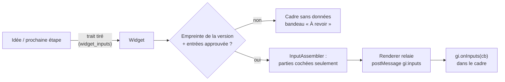
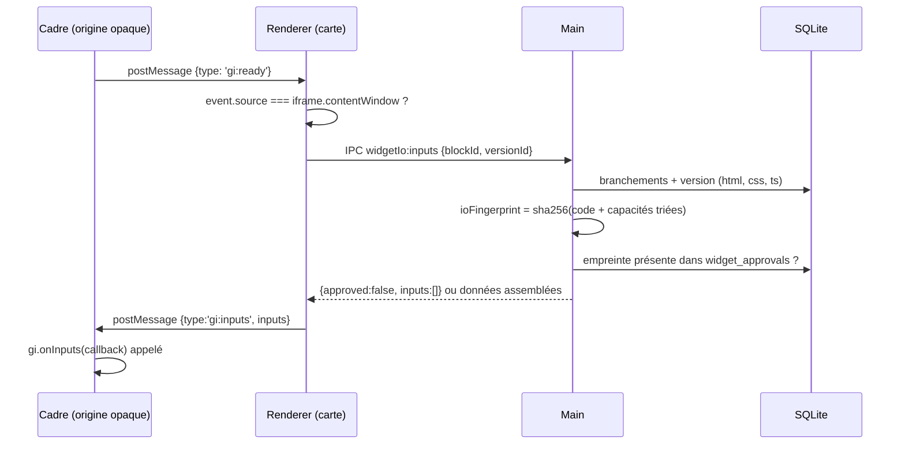

# Widget branché — autorisation par empreinte et pont postMessage

> **En 30 secondes** — Tu tires un trait d'une idée vers un widget : c'est un **branchement d'entrée**. Le widget ne reçoit **rien** tant que tu n'as pas relu son code et ce qu'il lira, puis cliqué « Autoriser ». L'autorisation est une **empreinte SHA-256** du code **et** de la liste exacte de ce qu'il lit : change une virgule du code ou coche une partie de plus, l'empreinte change, la revue revient. Les données passent par `postMessage`, mais **c'est le main qui décide** ce qui est remis — l'interface et le cadre ne font que relayer.



---

## 1. Vue Macro & Utilité (le « Pourquoi »)

> 📘 **Introduction (ajoutée)** — **C'est quoi, `postMessage` ?** La seule façon standard pour deux fenêtres d'origines différentes (ici la carte et le cadre isolé) de s'échanger des données : l'une appelle `autreFenetre.postMessage(objet, cible)`, l'autre reçoit un événement `message`. L'objet est **copié** (algorithme de *clonage structuré*), jamais partagé : aucune des deux ne touche la mémoire de l'autre. **Et une « capacité » ?** Un droit précis et nommé (« lire cette idée ») donné à du code, par opposition à un accès global.

- **Problématique** : jusqu'à la spec 004, un widget était un **îlot** : il calculait, mais sans rien savoir de tes idées. Pour qu'un « tableau de budget » lise le plan d'une idée, il faut lui **ouvrir une porte**. Or ce code a été écrit par Claude (donc potentiellement fautif ou piégé) : une porte ouverte « en général » serait une fuite. Il faut une porte **étroite, nommée, revue par un humain, et qui se referme toute seule si le code change**.
- **Emplacement dans la carte globale** : trois zones — la **carte** (renderer : trait, revue `WidgetReview`, relais `useWidgetBridge`), le **main** (`WidgetIoService`, `InputAssembler`, table `widget_approvals`), et le **cadre** (prélude `gi`). La décision est au milieu, dans le main, comme toute écriture ou lecture sensible depuis la spec 001.
- **Analogie (multiprise)** : le widget est un **appareil** branché sur une prise. Le trait est le **câble** ; les parties cochées (identité, texte d'origine, réponses, arbre, document) sont les **broches** du câble. L'autorisation est un **disjoncteur plombé** par l'électricien (toi) *pour cet appareil précis et ce câble précis* : remplace l'appareil (nouvelle version du code) ou ajoute une broche, le plomb saute, le courant est coupé jusqu'à nouvelle inspection. *Là où ça boite* : un vrai plomb se voit ; ici il est invisible — c'est le bandeau « À revoir » qui le rend visible.

## 2. Le Pont Systémique (sous le capot)

Trois processus, deux frontières, **une seule décision** :



- **Pourquoi `'*'` comme cible ?** `postMessage(message, cible)` exige normalement l'origine du destinataire (« n'envoie que si la fenêtre est bien `https://x` »). Une origine opaque s'écrit `"null"` et ne se nomme pas : on vise donc **la fenêtre elle-même** (`iframe.contentWindow`), avec `'*'`. C'est sans danger ici parce que la référence de fenêtre vient de **notre** élément `<iframe>` (voir [[Glossaire — Origine web et origine opaque]]).
- **Pourquoi `event.source` à la réception ?** Toute fenêtre peut poster un message à la carte. Comparer `event.origin` ne servirait à rien (tous les cadres isolés valent `"null"`). On compare donc **l'identité de l'objet fenêtre** : `event.source === frame.current.contentWindow` — seul CE cadre est écouté par CE widget.
- **Côté disque** : `widget_inputs` (un branchement = une ligne, `parts_json`, `deleted_at` pour un débranchement annulable) et `widget_approvals` (clé primaire `(block_id, fingerprint)`). Approuver = **insérer une empreinte** ; il n'y a rien à « révoquer » : une nouvelle version produit une autre empreinte, absente de la table.

## 3. Analyse du Code & Logique

Extraits de `src/main/application/widgets/WidgetIoService.ts` et `src/renderer/src/widgets/useWidgetBridge.ts` :

```ts
// ① Ce que couvre une autorisation : le code ET la liste exacte de ce qu'il lit
export function ioFingerprint(version, inputs): string {
  const capabilities = inputs
    .map((i) => `${i.sourceKind}:${i.sourceId}:${[...i.parts].sort().join(',')}`)
    .sort()                                        // ordre de branchement sans effet sur l'empreinte
  return createHash('sha256')
    .update(JSON.stringify([version.html, version.css, version.ts, capabilities]))
    .digest('hex')
}

// ② La porte : rien sans empreinte approuvée
inputs({ blockId, versionId }) {
  const rows = repository.inputs(blockId)
  if (rows.length === 0) return { approved: true, inputs: [] }          // widget non branché : comportement 004
  if (!repository.isApproved(blockId, ioFingerprint(version, rows))) {
    return { approved: false, inputs: [] }                              // réponse VIDE, pas une erreur
  }
  return { approved: true, inputs: this.assemble(rows) }                // parties cochées seulement
}

// ③ Le relais côté carte : reconnaître LE cadre par sa fenêtre
const onMessage = (event: MessageEvent) => {
  if (event.source !== frame.current?.contentWindow) return             // autre cadre, autre fenêtre : ignoré
  if (message.type === 'gi:ready') { ready.current = true; send() }
}
```

- **Étape 1 — L'empreinte lie trois choses** : le code (`html`, `css`, `ts` — **pas** `js`, qui en est dérivé), les **sources** (quelle idée, quelle étape) et les **parties**. Les listes sont **triées** avant hachage : deux fois les mêmes droits dans un autre ordre = même empreinte (voir [[Glossaire — Empreinte SHA-256]]).
- **Étape 2 — Refuser par une réponse vide** : un widget non autorisé reçoit `[]`, s'affiche quand même (on peut le relire, le tester à vide) avec « À revoir ». Pas d'exception : le cas est **normal**, pas exceptionnel (règle C# du CLAUDE.md global appliquée en TypeScript).
- **Étape 3 — `InputAssembler` est une fonction pure** : `assembleIdea(facts, parts)` n'ajoute une clé à l'objet **que si** sa partie est cochée ; seul l'`id` est toujours là (il distingue deux idées branchées). Une idée archivée ne transmet plus rien ; une étape disparue du document non plus (elle est lue dans le document, voir [[Glossaire — Donnée dérivée (calculer plutôt que stocker)]]).
- **Étape 4 — Le prélude `gi` n'est pas une barrière** : `window.gi` est `Object.freeze` et défini `writable: false, configurable: false` pour que le code du widget ne le **casse** pas par accident. Mais un code hostile pourrait appeler `window.parent.postMessage` directement : c'est pour ça que la barrière est dans le main (commentaire de `WidgetDocument.ts` et plan § Pont).
- **Étape 5 — Claude voit la forme, jamais le fond** : quand on fait évoluer un widget branché, `shapeOf(données)` produit par exemple `{ id: string, title: string, answers: [{ answer: string, question: string }] × 7 }` — noms de champs, types, tailles de listes, **aucune valeur**. Récursion bornée à 8 niveaux et 40 clés par objet (`domain/widgets/shape.ts`).

**Bonnes pratiques mises en évidence** : **autorisation liée au contenu** plutôt qu'à un identifiant (ce qu'on approuve, c'est *ce code-là*) ; **refus par défaut** ; **décision centralisée dans le processus de confiance**, relais bêtes partout ailleurs ; **minimisation des données** (parties décochables, forme au lieu des valeurs pour l'IA).

> ⚠️ **Probable (lu, non exécuté)** — Le plan annonce que les **noms de champs** partent chez Claude « malgré tout par l'anonymiseur » ; le code lu joint la forme dans le texte de la demande (`WidgetService.prompt`), qui passe par la passerelle et donc par l'anonymiseur comme toute demande — non vérifié en exécution.
>
> ⚠️ **Nuance** — L'empreinte hache `html`, `css`, `ts` mais pas le **titre** de la version : renommer un widget ne redemanderait pas la revue. Sans effet sur la sécurité (le titre n'est pas exécuté), à garder en tête.

## 4. Synthèse & Prochaine Étape

**À retenir (3 puces max)**
- L'autorisation est une **empreinte du code + des droits** : tout changement la rend caduque sans action de révocation.
- `postMessage` vers un cadre opaque : on vise **la fenêtre** (`'*'`), on reconnaît l'expéditeur par **`event.source`**, jamais par l'origine.
- Le main décide, le renderer et le prélude relaient ; Claude reçoit la **structure**, jamais les valeurs.

**Lien avec la suite** : le widget sait lire ; il doit maintenant **publier** un résultat sans pouvoir inonder ni piéger l'app → [[Cadre résultat — sortie bornée, vue figée et rafales regroupées]].

**Rappel actif**
> **Q :** Claude modifie le widget (version 3 → 4) sans toucher aux branchements. Que reçoit la v4 ?
> **R :** Rien : son `ts` diffère, donc son empreinte aussi, absente de `widget_approvals`. Bandeau « À revoir » jusqu'à la nouvelle autorisation.

> **Q :** Pourquoi comparer `event.source` et pas `event.origin` ?
> **R :** Tous les cadres isolés ont l'origine opaque `"null"` : l'origine ne distingue pas deux widgets. L'objet fenêtre, lui, est unique.

> **Q :** Pourquoi trier les capacités avant de hacher ?
> **R :** Pour que la même liste de droits, branchée dans un autre ordre, donne la même empreinte — sinon une simple réorganisation redemanderait la revue.

> **Q :** Qu'est-ce que `shapeOf` enverrait pour `{ total: 1500, lignes: [{ libelle: "Loyer" }] }` ?
> **R :** `{ lignes: [{ libelle: string }] × 1, total: number }` — clés triées, types, taille ; ni 1500 ni « Loyer ».

**Pièges fréquents**
- ⚠️ **Mettre la barrière dans le prélude** — il tourne dans le cadre, donc à portée du code non fiable. Il aide, il ne protège pas.
- ⚠️ **Approuver « le widget » plutôt que « cette version avec ces droits »** — un changement de code ultérieur hériterait d'une confiance jamais donnée.
- ⚠️ **Répondre par une erreur quand ce n'est pas autorisé** — c'est un état normal ; une réponse vide + un bandeau est plus simple et ne casse pas l'affichage.

**Connexions**
- [[Bac à sable des widgets — iframe isolée, origine opaque et protocole gi-widget]] — l'enclos reste intact : `postMessage` n'est pas une connexion réseau, la CSP `default-src 'none'` ne change pas.
- [[Glossaire — Empreinte SHA-256]] — troisième usage dans le projet : sceller une autorisation.
- [[IPC typé — le guichet unique entre interface et moteur]] — `widgetIo:inputs` est un canal validé par Zod comme les autres.
- [[Glossaire — Suppression douce (soft delete)]] — un débranchement est un `deleted_at`, annulable depuis l'Historique.
