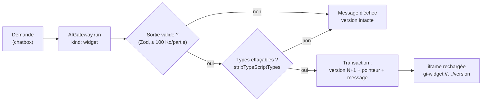
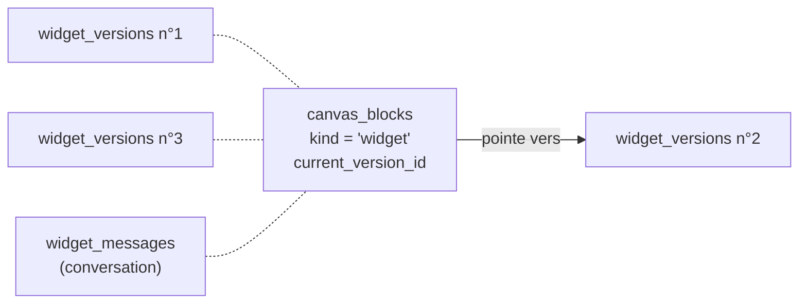

# Widget généré par Claude — effacement de types, versions par pointeur et échec sans dégât

> **En 30 secondes** — Tu écris « un compte à rebours de 5 minutes » dans la mini chatbox d'un widget. Claude renvoie **trois textes** (HTML, CSS, TypeScript). Le main **retire les types** du TypeScript pour obtenir du JavaScript (sans compilateur, sans dépendance), enregistre le tout comme **version N+1**, puis déplace un **pointeur** vers elle. Revenir à la v1 = redéplacer le pointeur. Si une étape échoue, rien n'est écrit : l'ancienne version reste affichée.



---

## 1. Vue Macro & Utilité (le « Pourquoi »)

- **Problématique** : trois problèmes d'un coup. (1) Un navigateur n'exécute **pas** TypeScript. (2) Une demande d'évolution (« ajoute une barre de progression ») peut **casser** un widget qui marchait : il faut pouvoir revenir en arrière. (3) Une réponse d'IA peut être invalide : l'utilisateur ne doit jamais se retrouver avec un widget à moitié remplacé.
- **Emplacement dans la carte globale** : couche **application** du main (`src/main/application/widgets/WidgetService.ts`), entre la passerelle IA (en amont) et la base (en aval). Le résultat est ensuite servi au bac à sable.
- **Analogie (cuisine)** : un **classeur de fiches recette numérotées**. Chaque essai est une nouvelle fiche, jamais raturée (fiche 1, fiche 2…). Un **marque-page** dit laquelle on cuisine ce soir. La fiche 3 est ratée ? On remet le marque-page sur la 2 — la 3 reste dans le classeur. Et une fiche illisible n'entre **jamais** dans le classeur. *Là où ça boite* : dans un vrai classeur on peut arracher une fiche ; ici aucune version n'est supprimée tant que le widget existe.

## 2. Le Pont Systémique (sous le capot)

**Effacer les types, ce n'est pas compiler.** TypeScript = JavaScript + des annotations (`: number`, `interface`…) qui n'existent **qu'avant** l'exécution. Node fournit `stripTypeScriptTypes` (module `node:module`) : il parcourt le texte et **retire** ces annotations. Aucune vérification de types, aucun fichier lu sur disque : une transformation de chaîne en chaîne, dans la mémoire du processus main.

| | Compilateur `tsc` | Effacement de types |
|---|---|---|
| Vérifie que `total: number` reçoit bien un nombre | oui | **non** |
| Dépendance à embarquer | le paquet `typescript` | aucune (intégré à Node) |
| Constructions sans équivalent JavaScript (`enum`, `namespace`) | converties | refusées en mode `strip`, **converties en mode `transform`** (choisi ici) |

**Version par pointeur.** En base (migration `0011_widgets.sql`) :



Chaque ligne de `widget_versions` garde `html`, `css`, `ts` **et** `js` (le résultat de l'effacement, pour ne pas le refaire à chaque affichage). `canvas_blocks.current_version_id` est une simple colonne texte : restaurer = **une** mise à jour d'une cellule, quelle que soit la taille du code. Les versions et les messages sont liés au bloc par une clé étrangère `ON DELETE CASCADE`.

**Côté écran** : l'iframe a pour `key` React `version-thème-relance`. Changer de version change la clé → React **détruit** l'ancien cadre et en crée un neuf, qui redemande son document au main. Pas de « patch » de code en place.

## 3. Analyse du Code & Logique

Extraits de `src/main/application/widgets/transpile.ts` et `WidgetService.ts` :

```ts
export function transpileWidget(ts: string): Result<string, string> {
  try {
    return { ok: true, value: stripTypeScriptTypes(ts, { mode: 'transform' }) }   // ① types retirés, enum convertis
  } catch (error) {                                                                // ② erreur → valeur, pas exception
    const detail = error instanceof Error ? error.message.split('\n')[0] : undefined
    return { ok: false, error: `Le code TypeScript du widget est invalide${detail === undefined ? '' : ` : ${detail}`}` }
  }
}

async prompt(input) {
  repository.insertMessage({ blockId, role: 'user', text: input.text })           // ③ la demande est gardée, même si ça échoue
  emit({ type: 'widget:thinking', blockId })
  try {
    const result = await gateway.run({
      kind: 'widget', input: request, schema: WidgetOut,                           // ④ Claude seul, sortie validée par Zod
      ...(current === undefined ? {} : { verbatim: currentCode(current) }),        // ⑤ code actuel joint tel quel
      onEngine: (engine, model) => emit({ type: 'widget:thinking', blockId, engine, model })
    })
    if (!result.ok) return this.fail(blockId, result.error.message)               // ⑥ échec = un message, rien d'autre
    const js = transpileWidget(result.value.data.ts)
    if (!js.ok) return this.fail(blockId, `${js.error}. La version précédente reste affichée : redemande.`)
    repository.transaction(() => {                                                 // ⑦ tout ou rien
      const version = repository.insertVersion({ /* html, css, ts, js, summary, model */ })
      repository.setCurrent(blockId, version.id)
      repository.insertMessage({ blockId, role: 'assistant', text: out.summary, versionId: version.id })
    })
    return this.get(blockId)
  } finally {
    emit({ type: 'widget:thought', blockId })                                      // ⑧ l'indicateur s'éteint TOUJOURS
  }
}
```

- **Étape 1 — Valider avant d'écrire** (④⑥) : `WidgetOut` borne chaque partie à 100 000 caractères et exige titre + résumé. La tâche `widget` est routée **Claude uniquement** (`CLAUDE_ONLY_KINDS` dans `routing.ts`) : pas de repli local, l'IA locale ne génère pas de code. Modèle réglable (`widgetModel`, défaut `claude-sonnet-5-5`).
- **Étape 2 — Deux entrées, deux traitements** (⑤) : la **demande** passe par l'anonymiseur comme tout texte utilisateur ; le **code actuel** part en `verbatim` (non anonymisé). Raison donnée par le plan : ce code est une sortie de Claude, non modifiable à la main en v1, et l'anonymiseur le casserait (un montant `1500` deviendrait une fourchette). Seules les **3 dernières demandes** sont rappelées : le code porte le reste.
- **Étape 3 — L'erreur est une valeur** (②) : `transpileWidget` renvoie `{ ok: false, error }` au lieu de lever une exception — le flux normal ne passe pas par `try/catch` côté appelant, et le message s'affiche tel quel dans la chatbox (`failed: true`).
- **Étape 4 — Une transaction pour trois écritures** (⑦) : version, pointeur, message de l'assistant. Sans elle, une panne entre les deux premières laisserait une version orpheline jamais affichée (voir [[Glossaire — Transaction ACID]]).
- **Étape 5 — `restore`** : vérifie que le widget et la version existent **et vont ensemble** (`version(blockId, versionId)`), puis `setCurrent`. Rien n'est supprimé.

**Bonnes pratiques mises en évidence** : données **immuables + pointeur** plutôt que modification en place ; `finally` pour ne jamais laisser l'interface figée ; numéro de version calculé côté base (`max(number) + 1`), pas côté interface.

> ⚠️ **À confirmer** — Trois écarts lus entre documents et code, sans gravité apparente : (a) le cadre système (`WidgetFrame.ts`) demande encore à Claude d'éviter `enum` et `namespace`, alors que le mode `transform` les accepte désormais (le journal l'explique : « moins de générations perdues ») ; (b) `plan.md` annonce `max_tokens` 32 000 et le fichier `domain/widgets/transpile.ts`, le code a 20 000 (borne d'un appel non diffusé en flux) et `application/widgets/transpile.ts` ; (c) la vue renvoyée à l'interface ne contient pas `js` — seul le protocole `gi-widget://` le lit.
>
> ⚠️ **Probable** — `insertMessage` de la demande (③) a lieu **hors** transaction et avant l'appel : si l'app se ferme pendant la génération, la conversation garde une demande sans réponse. Comportement déduit de la lecture, non observé.

## 4. Synthèse & Prochaine Étape

**À retenir (3 puces max)**
- Effacer les types ≠ compiler : rapide et sans dépendance, mais **aucune** vérification — c'est le bac à sable qui encaisse les erreurs d'exécution.
- Versions **jamais modifiées** + un pointeur : restaurer coûte une cellule, et rien ne se perd.
- Valider → transformer → écrire dans **une** transaction : un échec laisse l'existant intact et s'explique à l'utilisateur.

**Lien avec la suite** : un widget supprimé revient « avec ses versions » grâce à la [[Glossaire — Suppression douce (soft delete)]] et au journal de [[Annuler par lot — journal avant-après, conflit et lot inverse]]. Étape suivante annoncée (spec 005) : donner des **capacités** au widget (lire des idées) par un pont `postMessage`, avec revue du code obligatoire.

**Rappel actif**
> **Q :** Pourquoi stocker `js` en plus de `ts` ?
> **R :** `ts` est ce que Claude relit et ce que l'onglet Code montre ; `js` est ce que le navigateur exécute. Le garder évite de refaire l'effacement à chaque affichage et garantit qu'on exécute exactement ce qui a été validé.

> **Q :** Que voit l'utilisateur si Claude renvoie un TypeScript invalide ?
> **R :** Un message d'échec dans la chatbox ; la version affichée ne change pas, aucune version n'est créée.

> **Q :** En quoi « restaurer la v1 » diffère-t-il d'« annuler » au sens de l'Historique ?
> **R :** Restaurer déplace un pointeur (aucune ligne de `change_log`) ; l'annulation par lot rejoue un journal avant/après. Deux mécanismes différents pour deux besoins.

> **Q :** Pourquoi le code actuel n'est-il pas anonymisé ?
> **R :** Il vient de Claude (issu de demandes déjà anonymisées), et remplacer des nombres ou des mots dans du code le rendrait faux.

**Pièges fréquents**
- ⚠️ **Croire que « ça transpile » veut dire « c'est correct »** — un `const total: number = "abc"` passe sans erreur.
- ⚠️ **Écraser la version courante** — on perdrait le retour arrière ; toujours ajouter, puis déplacer le pointeur.
- ⚠️ **Oublier le `finally`** — un indicateur « l'IA réfléchit » bloqué fige la chatbox (déjà rencontré le 29/09 sur les questions).

**Connexions**
- [[Passerelle IA hybride — un seul point d'accès à l'IA]] — `verbatim`, `onEngine` et les tâches « Claude seul ».
- [[Zod ↔ type guards et sortie structurée]] — `WidgetOut` valide la sortie.
- [[Injection de prompt — cadre figé et données balisées]] — le cadre dédié `WIDGET_FRAME`.
- [[Drizzle ORM ↔ SQL paramétré et migrations]] — migration `0011` et son `down`.

## Évolution du 30/09 (soir) — ce que Claude sait en plus, et qui peut demander
- **Structure des entrées jointe** : si le widget est branché, `WidgetService.prompt` ajoute à la demande « Entrées branchées sur ce widget, lues par gi.inputs (structure seulement) » — la sortie de `shapeOf`, **sans aucune valeur** → [[Widget branché — autorisation par empreinte et pont postMessage]]. Le cadre système passe en v2 (`gi.onInputs`) puis v3 (`gi.output`).
- **Un nouveau demandeur** : la génération n'est plus lancée seulement depuis la chatbox ; `ToolGeneration` l'appelle pour les outils cochés à l'éclosion, avec la proposition comme texte de demande (`toolRequestText`) → [[Outils proposés au verrouillage — créer dans la transaction, générer hors transaction]].
- **Widget disparu pendant la génération** : nouveau contrôle **avant** la transaction d'écriture (`repository.widget(blockId) === undefined` → réponse ignorée). Même logique « valider → transformer → écrire », avec une question de plus : *la cible existe-t-elle encore ?*
