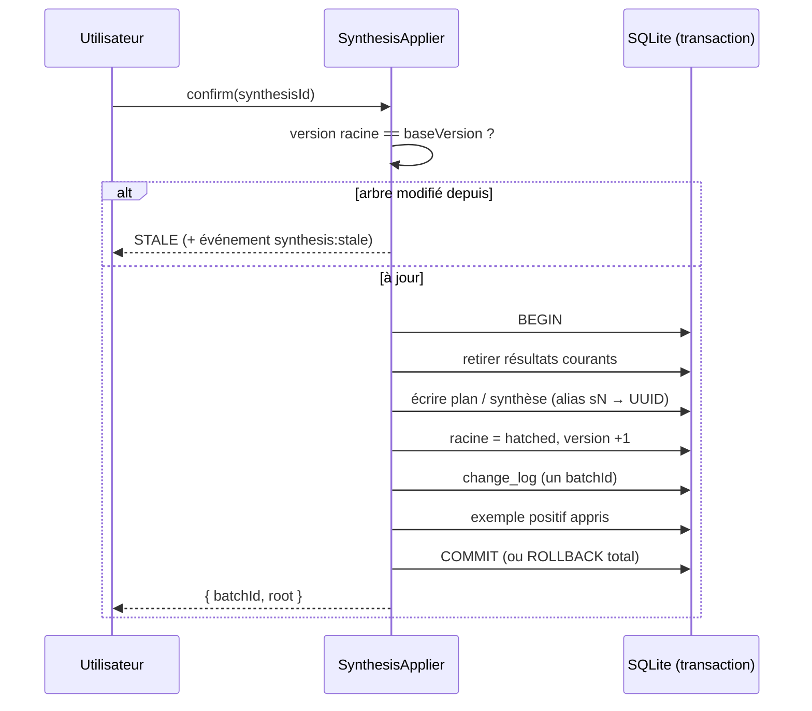

# Éclosion atomique — transaction, version et historique

> **En 30 secondes** — Quand tu **confirmes** une synthèse, l'idée **éclot** : plan (ou synthèse) écrit, racine passée à `hatched`, version +1, proposition marquée `confirmed`, historique enregistré par **lot**, exemple positif appris. Tout ça dans **une seule transaction** : si une seule étape échoue, **rien** n'a changé (`APPLY_FAILED`). Et si l'arbre a bougé depuis la proposition, elle est déclarée **périmée** (`STALE`).



---

## 1. Vue Macro & Utilité (le « Pourquoi »)

- **Problématique** : l'éclosion touche 5 tables d'un coup. Une panne au milieu (disque plein, bug) laisserait une idée « éclose » sans plan, ou un plan sans idée éclose — incohérent. Constitution II : « application atomique, historisée et annulable ». Et entre la proposition et la confirmation, l'utilisateur a pu ajouter une réponse : confirmer un plan fondé sur l'**ancien** arbre serait trompeur.
- **Emplacement dans la carte globale** : couche **application** (`SynthesisApplier`) s'appuyant sur une garantie **matérielle/logicielle de la base** (transaction SQLite, voir [[Glossaire — Transaction ACID]]).
- **Analogie (restauration)** : l'**envoi d'une table**. Tous les plats d'une table de six partent **ensemble** ou pas du tout — on ne sert pas trois entrées en laissant trois clients regarder. Et si le client a changé sa commande pendant la préparation (version modifiée), le ticket en cuisine est **périmé** : on ne sert pas l'ancienne commande. Chaque envoi est noté sur le **cahier de service** avec un numéro de bon (`batchId`) pour pouvoir tout reprendre d'un bloc.

## 2. Le Pont Systémique (sous le capot)

- **Transaction SQLite** : `db.transaction(() => …)` ouvre `BEGIN`, exécute toutes les écritures dans le journal WAL, puis `COMMIT`. Si une exception est levée, SQLite fait `ROLLBACK` : les pages modifiées sont abandonnées, le fichier sur disque est inchangé. Tout est **synchrone** avec better-sqlite3 : aucun autre code JavaScript ne peut s'intercaler pendant la transaction.
- **Concurrence optimiste** : pas de verrou posé pendant que l'utilisateur lit la proposition. On note `base_version` à la création ; à la confirmation, on compare avec la version actuelle de la racine. Différente ? → `STALE`. C'est le même principe que les champs `version` / `rowversion` d'EF Core.
- **Vérifié par panne injectée** : les tests provoquent une erreur à **chaque étape** de l'éclosion et vérifient qu'aucune table n'a changé (+ test de mutation — JOURNAL).
- **Alias → identifiants** : Claude a travaillé avec `s0`, `s1`… qui ne valent que pour **cette** version de l'arbre. Au moment d'écrire, `idOf` convertit chaque alias en UUID réel ; plus tard, un nouveau nœud décalerait les alias (règle 18).

## 3. Analyse du Code & Logique

Extrait de `src/main/application/neurons/SynthesisApplier.ts` :

```ts
confirm(synthesisId: string): ConfirmView {
  const row = this.current(synthesisId)           // ① existe, 'proposed', et version inchangée — sinon STALE
  const idOf = new Map([...aliasesOf(nodes)].map(([id, alias]) => [alias, id])) // ② sN → UUID
  const batchId = randomUUID()
  try {
    repository.transaction(() => {                  // ③ TOUT ou RIEN
      repository.retireCurrentResults(row.rootId)
      const changes = row.type === 'action_plan'
        ? this.writePlan(row, ActionPlanOut.parse(payload))          // ④ revalidé par Zod depuis la base
        : this.writeReflection(row, ReflectionSummaryOut.parse(payload), idOf)
      repository.setRootState(row.rootId, 'hatched')
      repository.decide(row.id, 'confirmed', batchId)
      repository.log(batchId, [...changes, /* avant/après racine et synthèse */])  // ⑤ historique par lot
      this.deps.examples.record({ polarity: 'positive', taskKind: 'synthetiser', … }) // ⑥ apprentissage
    })
  } catch (error) {
    if (error instanceof AppError) throw error
    throw new AppError('APPLY_FAILED', 'L’éclosion a échoué : rien n’a été modifié')
  }
}
```

- **Étape 1 — `current()`** : contrôle d'état **avant** d'ouvrir la transaction (existe ? proposée ? à jour ?).
- **Étape 2 — Statuts du plan** : une étape est `blocked` si elle attend une dépendance ou si son parent est une condition non tranchée ; sinon `ready`.
- **Étape 3 — Historique append-only** : `change_log` n'est jamais modifié, seulement complété ; chaque entrée garde `before` / `after` en JSON — c'est ce qui permettra l'**annulation par lot** dans la spec 003.
- **Étape 4 — Réouverture** : `reopen()` repasse l'idée en `developing` ; les résultats précédents restent consultables mais ne sont plus « en cours ».

**Bonnes pratiques mises en évidence** : une seule proposition en cours par idée (double verrouillage = même proposition, **sans** nouvel appel payant) ; rien n'est écrit avant la confirmation humaine.

## 4. Synthèse & Prochaine Étape

**À retenir (3 puces max)**
- L'éclosion est **une** transaction : tout réussit ou rien ne change.
- `base_version` détecte une proposition périmée sans verrouiller l'interface (concurrence optimiste).
- Historique par lot (`batchId`) avec avant/après → annulable.

**Lien avec la suite** : juste après l'éclosion, en arrière-plan, on cherche les idées voisines → [[Liens entre idées — graphe local de mots-clés]].

**Rappel actif**
> **Q :** Que se passe-t-il si l'écriture de l'historique échoue après l'écriture du plan ?
> **R :** Toute la transaction est annulée (ROLLBACK) : ni plan, ni changement d'état ; l'utilisateur reçoit `APPLY_FAILED`.

> **Q :** Pourquoi convertir les alias `sN` en UUID au moment d'enregistrer ?
> **R :** Les alias dépendent de l'ordre des nœuds dans une version donnée ; un ajout ultérieur les décalerait et les sources pointeraient au mauvais endroit.

> **Q :** Quelle différence entre verrou pessimiste et concurrence optimiste ?
> **R :** Pessimiste : on bloque la ressource pendant qu'on la lit ; optimiste : on ne bloque rien et on vérifie la version au moment d'écrire.

**Pièges fréquents**
- ⚠️ **Enchaîner des écritures sans transaction** — une panne au milieu laisse la base à moitié modifiée.
- ⚠️ **Stocker les alias de l'IA comme références durables** — ils ne sont valables que pour un instantané.

**Connexions**
- [[Glossaire — Transaction ACID]] — la garantie de base de données sous-jacente.
- [[Drizzle ORM ↔ SQL paramétré et migrations]] — comment les tables `change_log`, `plan_nodes`… sont créées.
- [[Liens entre idées — graphe local de mots-clés]] — lancé après la confirmation, sans la bloquer.

## Évolution du 29/09 — aperçu éditable et annulation réelle
- **Aperçu corrigeable avant confirmation** (`domain/neurons/synthesisPatch.ts`) : chaque élément du plan (titre, montant, date) ou de la synthèse se corrige ; le document corrigé est **revalidé côté main** (Zod + contrôles P1–P5). **P6 (provenance) ne s'applique pas** à une valeur que l'utilisateur vient d'écrire lui-même — la provenance sert à empêcher l'IA d'inventer, pas à contredire l'humain. Rien n'est écrit dans les tables de résultat avant « Confirmer ».
- **Annulation** : l'étape 3 ci-dessus annonçait l'annulation par lot « dans la spec 003 » — elle existe maintenant : bouton « Annuler » (10 s) dans la notification d'éclosion et page Historique. Annuler une éclosion remet l'idée en développement avec sa version d'avant ; l'aperçu redevient **confirmable tel quel**, sans nouvel appel à l'IA → [[Annuler par lot — journal avant-après, conflit et lot inverse]].
- **Lecture et réouverture** d'une idée éclose (panneau `HatchedPanel`) : la réouverture n'est pas encore annulable (JOURNAL).


## Évolution du 30/09 — cycle 2 : absorber, approfondir
- **Absorption** (T064, migration `0009_neuron_absorbed`) : à l'éclosion, les sous-neurones du cycle reçoivent `absorbed_in` = la synthèse confirmée. Ils **quittent la carte et les questions** mais restent en base — la synthèse suivante relit **tout** l'historique (`nodesWithHistory`), donc chaque point reste sourcé. Même idée que la [[Glossaire — Suppression douce (soft delete)]] : on marque, on n'efface pas.
- **« Rouvrir » devient « Approfondir »** : l'idée repart en développement **sans perdre son document** ; les questions laissées ouvertes par la synthèse deviennent les questions du nouveau cycle **sans appel à l'IA** (JOURNAL 29/09 22:20).
- **Migration avec rattrapage de données** : `0009` ne fait pas qu'ajouter une colonne, elle exécute un `UPDATE` pour ranger les sous-neurones des idées déjà écloses. Son `down` retire la colonne mais **ne rejoue pas** le rattrapage des questions closes (c'est écrit dans le fichier) : un retour arrière de schéma n'est pas toujours un retour arrière de données.
- **Fiche éditoriale** (migration `0010`) : champs facultatifs `overview`, `headline`, `nextStep` avec `.catch(undefined)` — un champ mal formé n'invalide jamais la synthèse (voir [[Zod ↔ type guards et sortie structurée]]).
